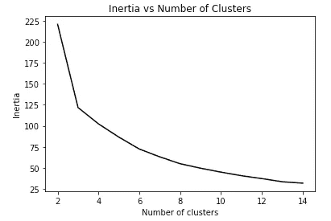

# 聚类算法和主题建模终极指南

> 原文：<https://towardsdatascience.com/wthe-ultimate-guide-to-clustering-algorithms-and-topic-modeling-4f7757c115?source=collection_archive---------14----------------------->


戴维·巴洛在 [Unsplash](https://unsplash.com/s/photos/unsupervised-machine-learning?utm_source=unsplash&utm_medium=referral&utm_content=creditCopyText) 上拍摄的照片

## 第 1 部分:K 均值初学者指南

聚类是最常用的**无监督机器学习**算法之一。您可以将聚类视为将未组织的数据点放入不同的类别，以便您可以了解更多关于数据结构的信息。聚类在从没有标签的数据中提取信息方面有多种应用。例如，公司根据客户的特征(如购买行为)对客户进行分类，以便更好地开展市场活动，制定定价策略以获取更多利润，等等。聚类算法也广泛用于自然语言处理(NLP)中，以从非结构化文本数据中提取信息，主题建模就是一个例子。

本系列文章旨在为读者提供两种常见但非常不同的聚类算法 **K 均值**和**潜在狄利克雷分配(LDA)**及其在主题建模中的应用:

> 第 1 部分:K-Means 初学者指南(本文)
> 
> [第 2 部分:LDA 初学者指南](/the-ultimate-guide-to-clustering-algorithms-and-topic-modeling-3a65129df324)
> 
> 第 3 部分:使用 K-Means 和 LDA 进行主题建模(即将推出)

在本文中，我将介绍应用 K-Means 算法的细节。

## 什么是 K-Means

K-Means 是最简单的聚类算法之一，用于检测无组织数据点中的常见模式。该算法通过基于相似性识别接近的数据点，将所有数据点分类为 K 个聚类。K-Means 简单地将相似性定义为在特征空间中测量的欧几里德距离。为了便于说明，使用下面的代码，我生成了三个二维的正态分布的点簇:

```
import numpy as np
import matplotlib.pyplot as plt#generate random data samples from known clusters
x = np.random.normal(0, 0.5, (100, 2)) + np.array([0, 1.2])
y = np.random.normal(0, 0.5, (100, 2)) + np.array([-0.7, -0.7])
z = np.random.normal(0, 0.5, (100, 2)) + np.array([0.7, -0.7])plt.scatter(*x.T)
plt.scatter(*y.T)
plt.scatter(*z.T)
plt.title(‘Data Example with Only Two Features’)
plt.xlabel(‘Feature 1’)
plt.ylabel(‘Feature 2’);
```

下图显示了*手动生成的*三组数据。由于样本数据只有两个特征，我们可以清楚地看到二维图形中哪些点彼此接近。在实际应用中，当特征空间增加到二维以上时，同样的直觉成立。


作者图片

为了应用 K-Means，研究人员首先需要确定聚类的数量。然后，该算法将把每个样本分配到离聚类中心的距离最小的聚类中。代码很简单:

```
from sklearn.cluster import KMeansdata = np.vstack((x,y,z))
km = KMeans(n_clusters=3)
km.fit(data)
```

在这里，由于我们生成了数据，我们知道有三个集群。当你对数据知之甚少的时候，在实际应用中呢？本文将在介绍 K-Means 算法的数学细节后讨论这个问题的答案。

## **K-Means 背后的数学**

K-Means 算法预先确定聚类数 K，然后分配一个聚类集合 C = {C1，C2，…Ck}，使:


其中𝜇𝑘是群集 Ck 的点的中心:


该算法的工作原理如下:

1.  指定 K 个簇的数量。

2.用随机值初始化每个聚类的中心点𝜇𝑘 (k ∈ K)。

3.计算每个数据点到每个聚类中心点的平方欧几里德距离。


数据点和聚类中心之间的欧几里德距离

4.将 X_j 分配给欧氏距离平方最小的最近聚类 k:


5.通过取分配给聚类 k 的样本点的平均值来更新𝜇𝑘

6.重复步骤 3 至 5，直到收敛。

请注意，迭代步骤降低了目标函数，并且只有有限数量的点的可能分区，因此该算法保证收敛。然而，收敛的解决方案可能不是全局最优的。默认情况下，`K-Means`使用不同的质心种子运行聚类算法十次，并取得度量中的最佳结果。

## **K 均值指标**

如何确定像 K-means 这样的聚类模型的拟合优度？这个问题的答案对于在迭代步骤中找到最适合的模型是很重要的，并且在帮助研究人员决定聚类的数量方面起着重要的作用。聚类算法最常用的度量是**惯性**和**轮廓**。

**惯性**

惯性测量从每个数据点到其最终聚类中心的距离。对于每个集群，惯性由每个数据点 X_j ∈ Ck 和中心𝜇𝑘:之间的均方距离给出


对所有聚类的惯性求和后，总惯性用于比较不同 K 均值模型的性能:


由惯性的定义可知，我们需要选择 ***最小化*** 总惯性的模型。

**轮廓系数**

轮廓系数是可以在聚类算法中使用的另一个度量。对于每个数据点 X_j，它计算 X_j 和相同聚类中所有其他点之间的平均距离。我们将其定义为 a_j。然后，它会寻找 X_j 的下一个最近的聚类(对 X_j 进行分类的第二好的聚类)，并计算 X_j 与该聚类中所有点之间的平均距离作为 b_j。点 X_j 的轮廓系数为:


从上面的等式中，我们可以看到轮廓系数在-1 和 1 之间，取决于 a_j 和 b_j 中哪一个更大:


如果 b_j 大于 a_j，说明模型已经将 X_j 聚类到最佳聚类中。与 a_j 相比，b_j 越大，集群越好。否则，当 a_j 较大时，意味着该点可能在另一个簇中。a_j 与 b_j 相比越大，值越接近-1。

轮廓系数给出了当计算聚类中所有数据点的平均值时每个聚类紧密程度的信息。当计算所有数据点的平均轮廓系数时，它测量模型性能。

## **如何选择合适的集群数？**

不幸的是，我们不能解析地解决这个问题，但是在确定 K 时遵循一些一般规则是有用的。K 的数目在数学上和实际上都是确定的。为了提供最佳模型，我们可以从 K 的不同选择中计算惯性，并选择最有效的一个。这时候肘部曲线就派上用场了。肘形曲线描绘了不同 K 的惯性。注意，随着 K 的增加，惯性总是减小。如果 K 等于总数据点的数量，惯性将为零(每个数据点是一个聚类)。我们可以使用肘曲线来检查下降速度，并选择在**肘点**处的 K，当过了这个点后，惯性下降得相当慢。

使用上面生成的数据点和下面的代码，我们可以绘制肘形曲线:

```
inertias = []for n_clusters in range(2, 15):
 km = KMeans(n_clusters=n_clusters).fit(data)
 inertias.append(km.inertia_)

plt.plot(range(2, 15), inertias, ‘k’)
plt.title(“Inertia vs Number of Clusters”)
plt.xlabel(“Number of clusters”)
plt.ylabel(“Inertia”);
```

情节是这样的:



肘部曲线:作者图片

该图显示惯性随着 K 的增加而不断减小。当 K = 3 时，惯性下降速度有一个转折点，这就是我们要寻找的**拐点**。请注意，当我们生成数据时，我们使用三种正态分布。因此，它与基于肘部曲线的结果相匹配。

我们还需要考虑使用肘形曲线决定的聚类数是否可行。我们应该选择易于解释和实际可行的 K。例如，如果您的公司只有资源(劳动力和资本)来将客户分为三类，那么您应该将 K 设置为 3，而不考虑肘曲线的建议。

## 在应用 K 均值之前

为了获得更好的模型性能和更可靠的结果，我们需要用至少两个步骤对特征进行预处理:缩放和降维。

**秤的特点**

由于 K-Means 使用数据点之间的欧氏距离来定义聚类，因此所有要素都应进行缩放，以便其单位具有可比性。否则，来自不可比单位的某些特征差异可能会使结果产生偏差。我们可以用 scikit-learn 的`StandardScaler` transformer 来缩放数据。它将每个要素以其平均值为中心，并通过除以该要素的标准差对其进行缩放。

**执行降维**

正如您可能注意到的，聚类算法在计算上很复杂，并且复杂性随着特征的数量而快速增加。因此，在应用 K-Means 聚类算法之前降低数据的维数是非常常见的。

**主成分分析(PCA)** 是一种广泛使用的算法，用于减少数据中的特征数量，同时保留尽可能多的信息。更多细节你可以参考[这份文件](https://scikit-learn.org/stable/modules/generated/sklearn.decomposition.PCA.html)。

K-Means 是最简单和最流行的聚类算法，有多种使用案例。本文重点介绍它的数学细节、它使用的度量标准以及应用它时的建议。在接下来的文章中，我将介绍另一种聚类算法 LDA，以及 K-Means 和 LDA 在主题建模中的应用。

感谢您的阅读！这是我所有博客帖子的列表。如果你感兴趣，可以去看看。

[](https://zzhu17.medium.com/my-blog-posts-gallery-ac6e01fe5cc3) [## 我的博客文章库

### 我快乐的地方

zzhu17.medium.com](https://zzhu17.medium.com/my-blog-posts-gallery-ac6e01fe5cc3) [](https://zzhu17.medium.com/membership) [## 阅读朱(以及媒体上成千上万的其他作家)的每一个故事

### 作为一个媒体会员，你的会员费的一部分会给你阅读的作家，你可以完全接触到每一个故事…

zzhu17.medium.com](https://zzhu17.medium.com/membership)