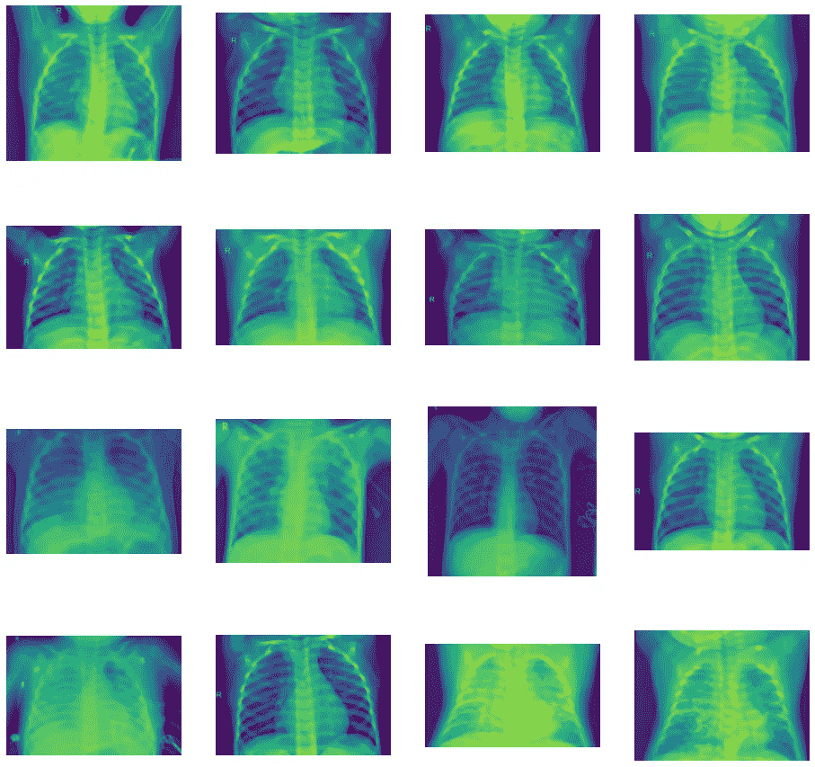
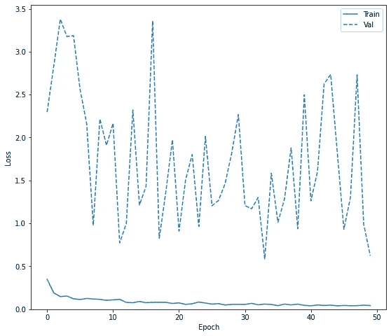
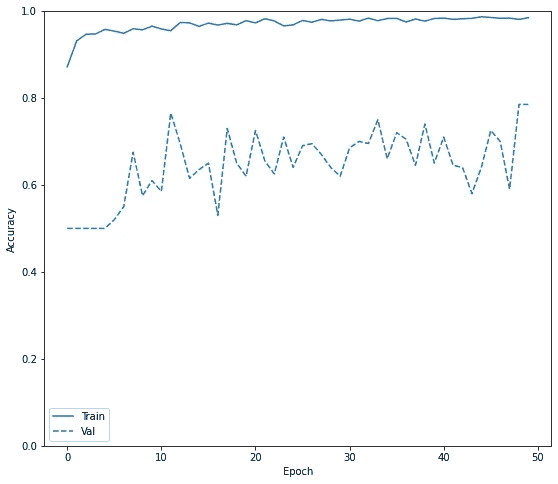
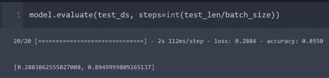

# x 射线图像分类和模型评估

> 原文：<https://towardsdatascience.com/x-ray-image-classification-and-model-evaluation-7810044c0ff5?source=collection_archive---------18----------------------->

## 基于张量流的胸部 x 光图像肺炎检测

图片来自 [Unsplash](https://unsplash.com/photos/DK8jXx1B-1c)

[Kaggle](https://www.kaggle.com/paultimothymooney/chest-xray-pneumonia) 拥有肺炎和正常病例胸部 x 光图像数据集的极好来源。正常 X 射线和受影响的 X 射线的图像之间存在显著差异。机器学习可以在确定疾病方面发挥关键作用，并显著缩短诊断时间，同时减少人工工作量。在本文中，我将遍历这个数据集，并以 90%的评估准确率对图像进行分类

作者图片

我被[在猫和狗之间的数据集上所做的工作所激励，并重用了数据集管道的代码块。首先，我们需要导入必要的包。](https://goodboychan.github.io/python/deep_learning/tensorflow-keras/vision/2020/10/16/01-Image-Classification-with-Cat-and-Dog.html)

初始数据集太大。我选择了一个精简集，对于正常情况有 1000 个图像，对于肺炎有 1000 个图像。将有三个目录:培训、验证和测试。验证和测试数据集对模型来说是全新的，我们不需要对这些数据集执行任何图像增强技术。

接下来导入几个样本。输出显示了两个目标病例的 X 射线图像。

我们将为数据集分配标签:0 代表正常，1 代表肺炎。这就是为什么我们会在模型编译中使用 SparseCategoricalCrossentropy()损失函数。该模型定义如下:

因为在每个目标文件夹中有相等数量的图像，所以通过将一个文件夹的长度乘以 2 来获得总的训练或验证或测试长度。下一部分是图像增强

我们将使用 train_datagen 和 validation_datagen 生成器以 20 个为一批来传输训练图像。

从[到这里](https://goodboychan.github.io/python/deep_learning/tensorflow-keras/vision/2020/10/16/01-Image-Classification-with-Cat-and-Dog.html)放置了一堆操作图像的函数。

这些功能会导致一些随机抖动，并有助于加载图像。下一个块将把标签分配给各个文件夹。如前所述，0 代表正常，1 代表肺炎。这适用于训练、验证和测试的所有三个文件夹。

每当在检查点观察到训练中的改进时，模型将被保存。

然后将使用该数据训练该模型。所有文件夹的长度都是预先获得的。

完成后，我们可以获得训练和验证损失和准确性。

作者图片

作者图片

显然，在 50 个时期之后，在数据集上的训练是极好的，因为准确度已经达到几乎 98%,但是验证没有改善太多。验证数据的准确度约为 75%。这种过度拟合可以通过删除模型中的数据点来避免。在这里，我将继续进行模型评估，该评估在测试数据集上显示了大约 90%的准确性。当然，所有这些数字都取决于图像，并且可能因验证和测试数据集而异。

作者图片

我们已经证明了在 DNN 使用张量流建立图像分类器。灰度胸部 x 光图像用于这种分类。初始训练数据集可以进一步扩展到包括所有图像。像我这样采用 core i-7 8550U 的本地 PC 平台需要 30 多分钟来完成 2000 幅图像数据集上 50 个时期的训练。支持 GPU 的 PC 将能够显著加快训练速度。

[Github 页面](https://mdsohelmahmood.github.io/2021/06/21/X-ray-image-classification.html)