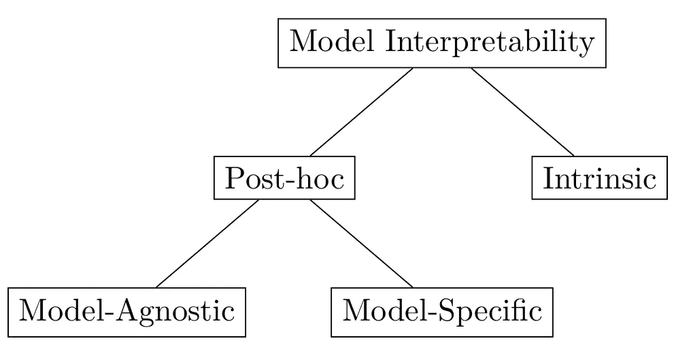
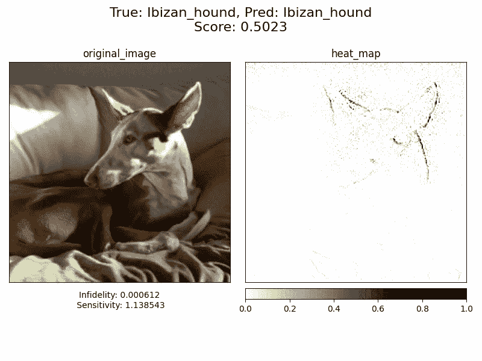
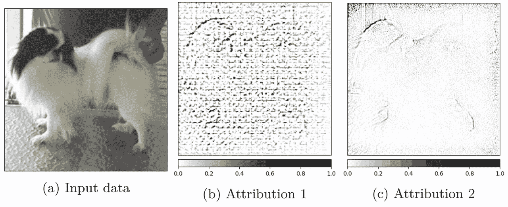

# XAI 方法——简介

> 原文：<https://towardsdatascience.com/xai-methods-the-introduction-5b1b81427c9c?source=collection_archive---------19----------------------->

## 了解 XAI 方法

## 什么是 XAI 方法？可解释性与可解释性。模型可解释性的分类。有哪些归因方式？

图标来源: [*技术向量由乌克利亚克—www.freepik.com*创建 T3](https://www.freepik.com/vectors/technology)

# 可解释的人工智能

可解释的人工智能(XAI)是该领域最年轻和发展最快的分支之一。XAI 方法的目标是为人类可以理解的深度学习模型提供解释。这在医疗保健或安全等安全关键领域尤为重要。这些年来在文献中提出的方法通常承诺它们将为模型如何做出决策的问题提供明确的答案。

## 解释的权利

“解释权”是欧洲议会和理事会在[通用数据保护条例(GDPR)](https://op.europa.eu/en/publication-detail/-/publication/3e485e15-11bd-11e6-ba9a-01aa75ed71a1) 中使用的术语。这个术语经常在 XAI 方法中被提及，它需要一个数据控制器来解释这个机制是如何做出一个决定的。GDPR 的这一部分是为了防止使用人类无法解释的系统(如深度神经网络)而创建的。目标是避免此类系统中的歧视和道德/财务偏见。例如，我们可以使用自动信用评分系统。像这样的系统用于抵押贷款过程。法律禁止基于一系列特征歧视一个人，但这种歧视可能隐藏在一个暗箱系统中(即使该系统的创造者并不知情)。如果申请被银行拒绝，申请人可以要求银行解释拒绝的原因。这可能有助于在下一次申请前提高分数。

# 可解释性与可解释性

在机器学习的上下文中，没有一个关于可解释性和/或可解释性的正式定义，它经常被互换使用[【2】](https://arxiv.org/abs/1802.01933)。Arrieta 等人[【3】](https://arxiv.org/abs/1910.10045)区分两者，定义为:

> ***定义 1.1(可解释性)*** 模型上的被动特征是指人类观察者对模型内部决策过程的理解程度。
> 
> ***定义 1.2(可解释)*** 一个模型的主动特征，与解释模型所采取的行动或程序的概念相关联，目的在于阐明其内部决策过程。

可解释人工智能(XAI)领域的名称指的是模型的特征，但是任何呈现给人类的表示(如输入属性)指的是模型的可解释性。

## 可解释性分类学

图 1:模型可解释性的分类。

有两种主要类型的模型:白盒模型和黑盒模型。第一种类型的可解释性被定义为内在的[【4】](http://www.cs.columbia.edu/~orb/papers/xai_survey_paper_2017.pdf)。这种类型的可解释性涵盖了所有具有可解释内部结构的模型。例如，决策树的结构被认为是可解释的，浅层神经网络的内部结构也是可解释的。这不适用于使用事后可解释性的深度神经网络。事后可解释性意味着我们试图解释模型的预测，而不解释该模型的确切内部机制。由于细胞神经网络的复杂性，事后可解释性是解释这类模型的唯一方法。

> ***备注。*** *这不是唯一的可解释性分类法。可解释性的结构可以用多种方式定义(根据目的、方法或应用程序)。*

## 与模型无关和特定于模型

如分类法所示(见图 1)，事后可解释性分为模型不可知的和模型特定的[【5】](https://ieeexplore.ieee.org/document/8466590)。模型不可知方法是可以应用于任何黑盒模型的方法，而不需要考虑模型的内部结构。这些方法通常不太精确，但是因为它们只基于输入和输出来解释模型的行为。另一方面，特定于模型的方法与特定类型的模型相关联。“类型”的定义不严格，可以指整个领域，如 CNN 或 CNN 的特定架构。

# 归因方法

归因方法是一种事后方法(见*“模型不可知和模型特定”*)。顾名思义，归因方法将输入要素归因于给定的预测。它可以定义为:

> ***定义 2.1(归属方法)*** *给定一个输入向量* x ∈ R ^n *其中* n *n 代表维数，类* C *和模型* F : R ^n → R ^C *。归属方法定义为* A(F，x，C) : R ^n → R ^n *。所提供的解释对应于给定类别* C *和型号* F *的输入向量中元素的“重要性”。*

这个定义可以重写，以使通常的卷积神经网络的输入适合 m×n 输入矩阵:

> ***定义 2.2(归属方法— CNN)*** *给定一个输入矩阵* x ∈ R^{m×n} *其中* m × n *表示输入的维数，类* C *和模型* F : R ^{m×n} → R ^C *。归属方法定义为* A(F，x，C) : R ^{m×n} → R ^{m×n} *。所提供的解释对应于给定类别* C *和型号* F *的输入矩阵中元素的“重要性”。*

为了更好地可视化属性，我们可以查看[图 2](https://erdem.pl/2021/10/xai-methods-the-introduction/#figure-2) 为了预测一类 ibizan_hound，输入图像的每个像素都被赋予一个值，该值定义了其对预测的属性。具有较高属性的像素(特征)可以被认为在预测该类别时“更重要”。我们可以看到，属性值最高的像素是狗的头部和耳朵边缘的像素。

*图 2:为 ibizan_hound 类生成的引导式 GradCAM 的属性可视化。图片来源:斯坦福狗*[*【6】*](https://www.kaggle.com/jessicali9530/stanford-dogs-dataset)

就像可解释性与可解释性的情况一样(第*“可解释性与可解释性”*)，在词汇上缺乏一致。归因方法通常被称为"*显著性方法"*，*特征相关性"*，*特征重要性"*，*热图"*，*神经元激活"*，*显著性遮罩"*。

# 测量 XAI 方法

## 定量和定性研究

研究的类型可分为定性或定量[【7】](http://repository.unmas.ac.id/medias/journal/EBK-00121.pdf)。定性类型的研究通常与非数字数据的观察和处理有关。与定性研究相反的是定量研究，它依赖于对收集数据的数值分析。机器学习模型的可解释性是一个以人为中心的研究领域。这就是为什么大多数 XAI 方法研究人员将他们的解决方案建立在定性测量而不是定量测量的基础上。

## 定性措施

在定性研究中，数据是通过观察、汇总或访谈收集的。这种数据非常主观，与提供数据的人有关。这种主观测量的一个例子如图 3 所示。如果对于相同的输入图像呈现两种属性，那么哪一种属性更好的决定可能会因人而异。当两个属性具有相似的“质量”时，这种可能性更大。

*图 3:相同输入数据的两种不同方法的属性比较。这两种属性都是用不同的 XAI 方法为同一模型生成的。图片来源:斯坦福狗*[*【6】*](https://www.kaggle.com/jessicali9530/stanford-dogs-dataset)

如果没有具体的背景和关于数据生产者的先验知识，就无法对定性计量的结果进行相互比较。即使有这些知识，比较结果可能也是困难的。同样的问题也适用于再现性，如果要重复测量，我们必须确保所有的参与者都会给出相同的答案。定性测量的另一个问题是它们的可扩展性。因为大多数方法依赖于人工输入，为了再次测量相同的方法或将其与另一种方法进行比较，我们必须重复工作两次。

## 量化措施

定量研究中的数据以数字形式存储。这个数字形式必须与以同样方式测量的其他数据具有可比性。每次测量都是可重复的，一旦完成，就可以再次重复使用。由于其可扩展性，这种类型的研究比定性研究具有巨大的优势。定性测量的问题是我们必须定义测量来返回有意义的结果。定义人类视觉感知的度量是一项困难的任务，度量本身应该是客观的，当试图度量像属性这样的复杂事物时，这就更加困难了。有了这样的衡量标准，我们就可以轻松地比较和重现实验。

## 敏感和不忠

如果你对定量方法感兴趣，我写过一篇关于不忠和敏感度度量的文章。两个最流行的指标已经在 [Captum 库](https://captum.ai/)中实现。该文章可从以下网址获得:

[用不忠和敏感来衡量 XAI 的方法](https://erdem.pl/2021/03/measuring-xai-methods-with-infidelity-and-sensitivity)

## 进一步阅读

我决定写一系列文章来解释目前实践中使用的最重要的 XAI 方法。以下是一个列表(将用新文章更新):

*   [显著性——最早归因 XAI 方法之一](https://medium.com/@kemalpiro/xai-methods-saliency-ef3841eae910)
*   [反卷积-使用 CNN 结构进行解释](https://medium.com/@kemalpiro/xai-methods-deconvolution-3599f5964db8)
*   [引导反向传播-利用去卷积引导显著性](https://medium.com/@kemalpiro/xai-methods-guided-backpropagation-77645bd80995)
*   [综合渐变——最流行的 XAI 方法](https://medium.com/@kemalpiro/xai-methods-integrated-gradients-6ee1fe4120d8)
*   [引导式 GradCAM——引导 grad cam 输出以获得更好的解释](https://medium.com/@kemalpiro/xai-methods-guided-gradcam-e0ce20374703)
*   [噪声隧道——如何提高其他方法的精度](https://medium.com/@kemalpiro/xai-methods-noise-tunnel-31ca197fb560)

1.  [欧洲议会和理事会 2016 年 4 月 27 日关于在个人数据处理和此类数据自由流动方面保护自然人的 Reg (EU) 2016/679](https://op.europa.eu/en/publication-detail/-/publication/3e485e15-11bd-11e6-ba9a-01aa75ed71a1) ，并废除 Dir 95/46/EC(一般数据保护条例)2016。
2.  R.吉多蒂、a .蒙雷亚莱、s .鲁杰里、f .图里尼、f .吉安诺蒂、d .佩德雷斯基。[黑盒模型解释方法综述。](https://arxiv.org/abs/1802.01933)美国计算机学会计算调查(CSUR)，51(5):1–42，2018。
3.  A.b .阿里埃塔、n .迪亚斯-罗德里格斯、j .德尔塞尔、a .本内托、s .塔比克、a .巴尔巴多、s .加西亚、s .吉尔-洛佩斯、d .莫利纳、r .本雅明、i in。可解释的人工智能(xai):面向负责任的人工智能的概念、分类法、机遇和挑战。信息融合，58:82–115，2020。
4.  O.毕然棉花公司。机器学习中的解释和证明:综述。 IJCAI-17 可解释 AI 研讨会(XAI)，第 8 卷，第 8–13 页，2017。
5.  A.贝拉达·阿达迪。[窥视黑匣子:对可解释人工智能(xai)的调查。](https://ieeexplore.ieee.org/document/8466590) IEEE 访问，2018 年 6:52138–52160。
6.  A.科斯拉，贾亚德瓦普拉卡什，姚，。斯坦福狗数据集。https://www.kaggle.com/jessicali9530/stanford-dogs-dataset2019 年[。访问时间:2021 年 10 月 1 日。](https://www.kaggle.com/jessicali9530/stanford-dogs-dataset)
7.  J.w .克雷斯威尔。教育研究:计划、实施和定量评估。新泽西州上马鞍河，普伦蒂斯霍尔，2002 年。

*最初发布于*[*https://erdem . pl*](https://erdem.pl/2021/10/xai-methods-the-introduction)*。*