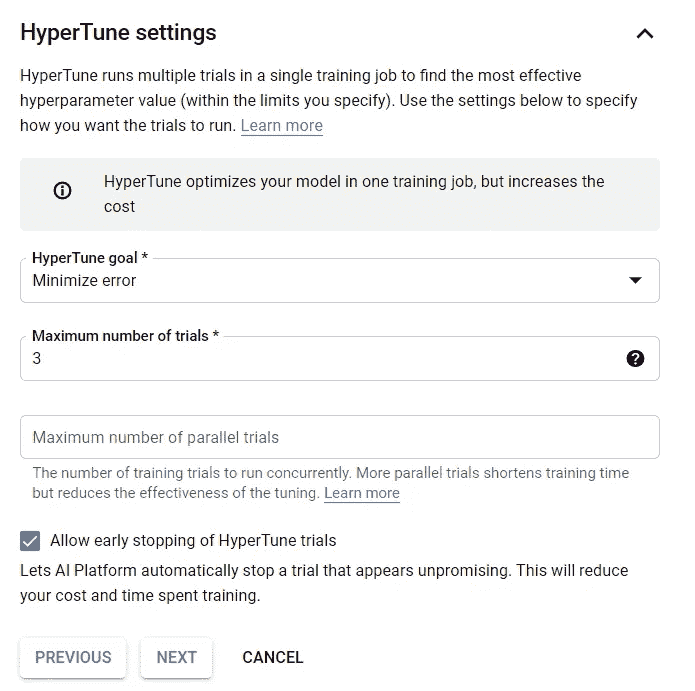

# XGBoost 部署在 GCP，采用谷歌人工智能平台

> 原文：<https://towardsdatascience.com/xgboost-deployment-on-gcp-with-google-ai-platform-ccf2e5b4d6ea?source=collection_archive---------22----------------------->

## 缩小概念验证和二元分类集成解决方案之间的差距

当我第一次听说大约只有 13%的数据科学项目进入生产阶段时，我非常失望。当时，以我在 Jupyter 笔记本上有限的机器学习经验，并不清楚 PoC 阶段之后会发生什么，以及如何发生。此外，ML 部署可以通过多种不同的方式实现——这取决于项目的目标、可用的工具以及这些工具的成本——因此很难知道选择哪种方式作为起点。幸运的是，最近我有机会参加了来自 [AICamp](https://medium.com/u/dd149458e5b5?source=post_page-----ccf2e5b4d6ea--------------------------------) 的课程“GCP 上的全栈 ML”，该课程涵盖了 Google AI 平台上的模型部署。因此，我决定开发这个项目，一个 Scikit-learn 分类 PoC，在 Google AI 平台上进行后期培训和部署，并由云功能触发。

# 问题是

我使用了由 [**UCI 的机器学习知识库**](https://archive.ics.uci.edu/ml/datasets/Online+Shoppers+Purchasing+Intention+Dataset#) **提供的**网购者购买意向数据集[1]。**在这里，数据以这样一种方式进行整合，即每行对应于来自不同用户的一个会话，有 12，330 个样本(会话)。“收入”(对或错)被用作我的目标列。基于点击流特征，如反弹率、访问页面类别和在这些页面上花费的时间(“产品相关”、“信息”等)，我想评估两个模型的准确性性能:XGBoost 及其“配对”梯度提升。原始链接中提供了数据集中所有要素的详细描述。**

图 1:数据集中的列和数据类型的概述。图片作者。

从图 1 中可以看出，数据没有空值。

# 概念验证

最初，由于分类变量和布尔变量的存在，这些变量使用来自 *sklearn.preprocessing* 的 LabelEncoder 进行编码。依次检查特征之间的相关性:

图 2:特性关联。图片作者。

尽管与其余部分相比，图的左上部分显示了更高的相关性，但最高值出现在 product related _ Duration x product related 和 ExitRates x BounceRates 中。因此，我从特性列表中删除了 ProductRelated_Duration 和 ExitRates，它们是模型的输入，后来也是 GCP 培训的输入。

此外，由于目标类严重不平衡(10，422 个会话，收入=假，1，908 个会话为真)，我采用了一种过采样算法，**合成少数过采样技术，** SMOTE —来解决这个问题。随后，我应用了训练/测试分割，保留了 20%的数据用于验证。

最后，我测试了两个分类器 XGboost 和 Gradient Boosting 的性能，比较了它们的准确性:

图 3:精度值。图片作者。

虽然由于训练和测试分数的差异，观察到一些过度拟合，但是 XGBoost 模型导致了更高的整体性能，这也可以从分类报告中推断出来:

图 4:分类报告。图片作者。

混淆矩阵的输出也显示了我们选择的分类器的平衡性能:

图 5: XGBoost 混淆矩阵。图片作者。

完整的代码(包括将数据转换为 GCP 要求的输入格式的部分，我将在下一节中介绍)如下所示。

所以让我们部署一个 XGBoost 模型吧！

# 部署

在这里，我将使用 Google AI 平台上内置的培训工作选项，因为 XGBoost 在那里可用。如果您想直接使用在 PoC 阶段开发的 Scikit-learn 模型，可以使用 *sklearn.externals.joblib* 导出它。更多信息请点击[链接](https://cloud.google.com/ai-platform/prediction/docs/exporting-for-prediction#joblib)。因此，开发阶段分为:

*   创建培训工作；
*   模型部署；
*   创建一个云函数来与外部应用程序交互。

如前所述，部分代码将修改后数据集的形状(在编码和特征选择之后)转换为 Google AI 平台接受的格式。目标列必须是第一列，并定义为 **string** 或 int **，**，而输入变量设置为 **float。输入的 csv 文件在本项目的资源库中可用，** [**此处**](https://github.com/lptais/Online-shoppers-XGBoost/blob/main/online_shoppers_gcp_input.csv) **。**

## **创建培训工作**

首先，需要将 csv 文件上传到存储桶。转到存储>创建存储桶，选择一个名称并定义您的区域:

图 6:桶的创建。图片作者。

然后在创建和上传文件中单击。之后，进入谷歌人工智能平台>工作，点击新的培训工作。在我们的例子中，由于 XGBoost 是作为内置算法提供的，因此在训练算法步骤中选择这个和后面的“XGBoost ”,然后单击下一步:

图 7:训练算法阶段。图片作者。

在**训练数据**步骤中，通过浏览按钮选择上传到桶中的文件。在“验证数据”中，我们将使用 PoC 中使用的相同分割(20%)。选择您的培训输出路径—可以是同一个存储桶—并单击 NEXT。

图 8:训练数据阶段。图片作者。

最重要的部分是第三个，**算法论证**。在这里，首先定义*目标*，在我们的例子中是**二元:逻辑**，因为它是一个分类问题， *eval_metric* 和 *booster* 。请注意，这种类型目标的输出是样本在正类或“真”类中的概率。将 *eval_metric* 设置为 **error** 以评估分类，并将 *gbtree* 设置为 **booster** ，这是默认设置。另外我选择了 HyperTune 三个参数: *num_boost_round* 、 *max_depth、*和 *eta* 。在 XGboost 的[文档](https://xgboost.readthedocs.io/en/latest/parameter.html)中可以看到每一个的详细描述。

图 9:算法参数阶段。图片作者。

然后，定义 HyperTune 目标以最小化错误——因为我们希望提高分类器的准确性——并将试验次数设为 3，允许提前停止以节省不必要的成本。

图 10:超调设置。图片作者。

在最后一个阶段**作业设置**，为作业定义一个名称，并为存储桶选择相同的区域。选择“扩展层=基本”,然后单击“完成”。很好，您的培训工作已经启动(:大约需要几分钟才能完成。

当作业完成时(您会看到一个绿色标记)，在作业页面中，通过单击相应的作业 id 来检查优化的参数。

## **车型部署**

培训工作完成后，在工作详细信息屏幕中，选择一个成功的试用，然后单击部署模型:

图 11:模型作业详细信息页面。图片作者。

图 12:模型部署页面。图片作者。

键入模型名称，选择同一区域，然后单击确认。现在的最后一部分是给它分配一个版本:

图 13:模型部署页面。图片作者。

点击 SAVE，再次等待几分钟，您将拥有一个已部署的 ML 模型。

## **创建云函数**

云功能允许无服务器部署和通过 REST API 调用 ML 模型的可能性。要设置此部分，请转到 GCP 上的云函数，然后选择创建新函数。在这里，选择一个函数名并再次选择同一区域。将触发器保留为 HTTP。

图 14:云功能配置页面。图片作者。

点击 next，定义你的源代码的运行时(这里我选择了 Python 3.7)，把入口点填成所用函数的同名。

图 15:云函数代码页。作者图片

图 16 所示的代码也可以在存储库中找到。使用云函数 HTTP 链接，可以使用外部应用程序(如 Postman)发送请求并获得预测:

图 16:样本邮递员响应。图片作者。

同样，重要的是要注意，输出是预测的概率，在我们的例子中，这个会话的收入=真。类似的测试也可以在 Google AI 平台中进行，在 Models>Test & Use 下，使用 JSON 格式的输入。

就是这个！现在，您有了一个基于云的部署模型，可以通过外部应用程序调用该模型并返回预测。

我希望你喜欢这篇文章，并希望它能启发你超越 Jupyter 笔记本电脑概念验证:

**参考文献:**

[1]萨卡尔，C.O .，波拉特，S.O .，卡特西奥卢，M. *等*利用多层感知器和 LSTM 递归神经网络实时预测网购者的购买意向。*神经计算&应用* **31，**6893–6908(2019)。[https://doi.org/10.1007/s00521-018-3523-0](https://doi.org/10.1007/s00521-018-3523-0)