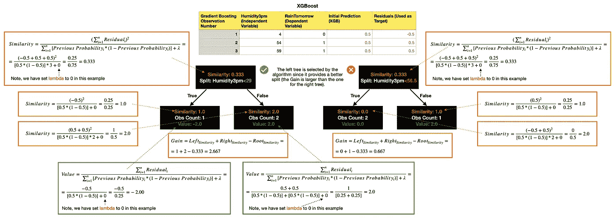

# XGBoost:极端梯度增强—如何改进常规梯度增强？

> 原文：<https://towardsdatascience.com/xgboost-extreme-gradient-boosting-how-to-improve-on-regular-gradient-boosting-5c6acf66c70a?source=collection_archive---------3----------------------->

## 机器学习

## 详细了解这两种算法之间的差异，以及何时应该选择其中一种算法

XGBoost。图片由[作者](https://solclover.com/)提供。

# 介绍

如果你想成为一名成功的数据科学家，你需要了解各种机器学习算法之间的差异。

这个故事是研究不同算法如何工作的系列的一部分，并为您提供示例和 Python 代码，以帮助您踏上数据科学之旅。

# 内容

*   XGBoost 所属的算法类别
*   XGBoost 和梯度增强的基础知识
*   XGBoost 和渐变增强构建树的方式不同
*   计算输出值
*   XGBoost 优化

# XGBoost 属于哪一类算法？

极端梯度推进是一种基于树的算法，它位于机器学习的监督分支之下。虽然它可以用于分类和回归问题，但本文中的所有公式和示例都是指该算法用于**分类**。

> 旁注，由于神经网络独特的机器学习方法，我已经将它们归为一类。然而，它们可以用于解决广泛的问题，包括但不限于分类和回归。下图是**互动**所以一定要点击👇在不同的类别上对**进行放大并展示更多的**。

机器学习算法分类。由[作者](https://solclover.com/)创建的互动图表。

***如果你喜欢数据科学和机器学习*** *，请* [*订阅*](https://solclover.com/subscribe) *每当我发表一个新的故事，你都会收到一封电子邮件。*

# XGBoost 和梯度增强的基础知识

在深入细节之前，让我们回顾一下这些算法的基础。

*   **基于树的算法**—XG boost 和梯度增强都使用决策树作为它们的基本估计器。
*   **预测目标** —使用残差而不是实际的分类标签来构建树。因此，尽管我们关注分类问题，这些算法中的基本估计量是回归树而不是分类树。这是因为残差是连续的，而不是离散的。但是，与此同时，您将在下面看到的一些公式对于分类是独特的，所以请不要假设完全相同的公式适用于回归问题。
*   **树深度** —两种算法都允许您控制树的最大大小，以最小化数据过度拟合的风险。
*   **集成方法** —类似于随机森林或 AdaBoost，这些算法在这个过程中构建许多树。最后，最终的预测是基于所有的树。
*   **学习率** —每棵树的价值由学习率决定。这使得算法在每一步都有更加渐进和稳定的改进。
*   **流程图** —最后，这里简单说明一下 Gradient Boosting 和 XGBoost 使用的流程。

梯度增强和 XGBoost 算法的流程图。图片由[作者](https://solclover.com/)提供。

虽然这些算法还有更多的部分，但以上应该给了你足够的基本理解，所以我们可以在接下来的几节中深入了解更多的细节。

# XGBoost 和渐变增强构建树的方式不同

## 梯度推进

您会很高兴听到常规梯度提升使用标准方法来构建回归树，其中使用 MSE(均方误差)等典型指标或类似指标来确定树的最佳分割。

下面是 MSE 的公式:

该算法为每个可能的节点分裂计算 MSE，然后挑选具有最低 MSE 的一个作为在树中使用的一个。

如果你不熟悉这是如何工作的，我强烈建议你回顾一下我关于梯度增强树的故事中的深入解释:

</gradient-boosted-trees-for-classification-one-of-the-best-machine-learning-algorithms-35245dab03f2>  

## XGBoost

与常规的梯度增强相反，XGBoost 使用自己的方法来构建树，其中相似性得分和增益决定最佳节点分裂。

*   **剩余的**就是`actual (observed) value — predicted value`
*   **先前概率**是在先前步骤中计算的事件的概率。假设每个观察值的初始概率为 0.5，用于构建第一棵树。对于任何后续的树，基于初始预测和来自所有先前树的预测，重新计算先前的概率，如过程图中所示。
*   **λ**是正则化参数。增加λ不成比例地降低了小叶子(具有很少观测值的叶子)的影响，而对大叶子(具有很多观测值的叶子)只有很小的影响。

一旦我们有了每片叶子的相似性分数，我们就可以使用下面的公式计算增益:

然后选择具有最高增益**的节点分裂作为树的最佳分裂。**

> **重要:**XGBoost 还有一个**伽马超参数**，可以手动设置。它允许您删除增益最小的节点。修剪发生在`Gain — Gamma < 0.`
> 
> 此外，请注意，较高的λ值会导致较低的相似性得分，从而导致较低的增益。因此，您可以结合使用 Gamma 和 Lamba，通过修剪小叶子并将它们与其他观察值结合来降低树对单个观察值的敏感度。

# 计算输出值

两种算法计算每片叶子的输出值的方式几乎相同，唯一的区别是 lambda 超参数。

**梯度增强**算法使用以下公式:

同时， **XGBoost** 使用:

## 例子

让我们用一个简单的例子把理论付诸实践。假设我们有一个包含 3 个观测值的数据集，我们使用“湿度 3pm”来预测明天是否会下雨。

下面是梯度推进算法如何构建它的第一棵树:

梯度增强示例。图片由[作者](https://solclover.com/)提供。

这是 XGBoost 算法的等价形式:

极端梯度推进的例子。图片由[作者](https://solclover.com/)提供。

我们可以看到，虽然计算结果有很大不同，但在这种情况下，两种算法都会为第一棵树选择相同的分割。

但是，树叶的输出值是不同的(即使 lambda 设置为 0 ),因为每个算法都从不同的初始预测开始。梯度增强使用整个数据集的事件概率作为其预测，而 XGBoost 总是从 0.5 开始(如果需要，可以手动更改)。

# XGBoost 优化

除了使用自己的方式构建和修剪树，XGBoost 还内置了几个优化功能，以便在处理大型数据集时加快训练速度。以下是几个主要的例子:

*   **近似贪婪算法** —在寻找最佳节点分割时使用加权分位数，而不是评估每个可能的分割。
*   **并行学习** —它可以将数据分割成更小的数据集，以并行运行流程。
*   **稀疏感知分裂发现** —当您有一些缺失数据时，它通过将带有缺失值的观察值放入左叶来计算增益。然后，它通过将它们放入右边的叶子来做同样的事情，并选择产生更高增益的场景。
*   **现金感知访问** — XGBoost 使用 CPU 的高速缓冲存储器来存储梯度，因此它可以更快地计算相似性得分。

# Python 代码

现在让我们使用澳大利亚的天气数据用 Python 构建一个简单的 XGBoost 模型。

## 设置

我们将使用以下数据和库:

*   来自 Kaggle 的澳大利亚天气数据
*   [Scikit-learn 库](https://scikit-learn.org/stable/index.html)，用于将数据拆分为[训练测试](https://scikit-learn.org/stable/modules/generated/sklearn.model_selection.train_test_split.html?highlight=train_test_split#sklearn.model_selection.train_test_split)样本和[模型评估](https://scikit-learn.org/stable/modules/generated/sklearn.metrics.classification_report.html?highlight=classification_report#sklearn.metrics.classification_report)
*   [XGBoost 库](https://xgboost.readthedocs.io/en/latest/index.html)用于构建模型
*   用于数据操作的[熊猫](https://pandas.pydata.org/docs/)和 [Numpy](https://numpy.org/)

让我们导入所有的库:

然后我们从 Kaggle 获取澳大利亚的天气数据，你可以按照这个链接下载:[https://www . ka ggle . com/jsphyg/weather-dataset-rattle-package](https://www.kaggle.com/jsphyg/weather-dataset-rattle-package)。

我们接收数据并推导出一些新的变量用于模型中。

数据看起来是这样的:

一小段 [Kaggle 的澳大利亚天气数据](https://www.kaggle.com/jsphyg/weather-dataset-rattle-package)做了一些修改。图片由[作者](https://solclover.medium.com/)提供。

## 模特培训

接下来，我们定义一个用于模型训练的函数，并运行模型以产生结果:

*   步骤 1 —将数据分为训练样本和测试样本
*   步骤 2-设置模型参数并训练(拟合)模型
*   步骤 3-使用我们的模型预测训练和测试数据上的类别标签
*   步骤 4-生成模型摘要统计数据
*   步骤 5-运行模型并显示结果

这些是上述函数返回的模型评估指标。

XGBoost 模型结果。图片来自[作者](https://solclover.medium.com/)。

# 结论

XGBoost 是 tin 上显示的内容，即常规梯度增强算法的更精确和优化的版本。在大多数情况下，这些算法产生的结果可能会非常相似。如果您处理大型数据集，那么极端梯度增强应该是更好的选择。

我希望这个故事能让你对这两种算法的主要区别有一个很好的了解，但是如果你有任何问题或建议，请随时联系我们。快乐造型！

干杯！👏
**索尔·多比拉斯**

***如果你已经花光了这个月的学习预算，下次请记得我。*** *我的个性化链接加入媒介是:*

<https://solclover.com/membership>  

如果你喜欢这篇文章，你可能也会觉得有趣:

</adaboost-algorithm-remarkably-capable-but-with-one-interesting-limitation-cf95905bf8a0>  </svm-classifier-and-rbf-kernel-how-to-make-better-models-in-python-73bb4914af5b> 