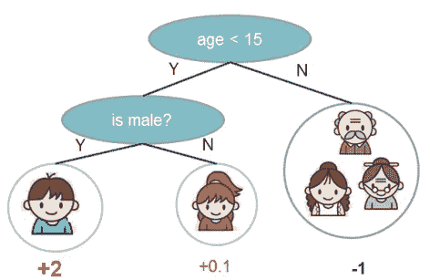
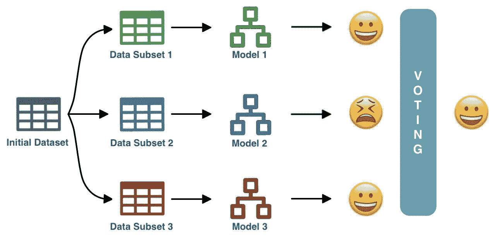
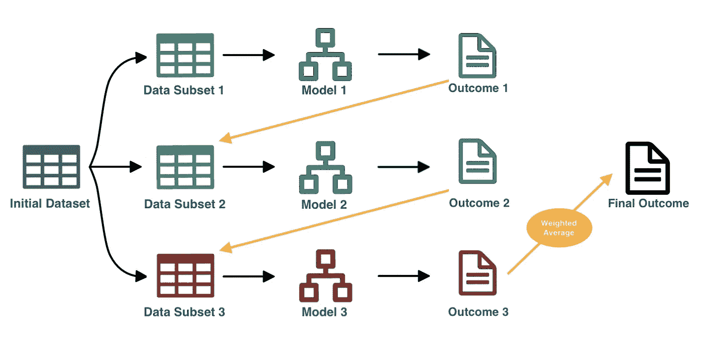
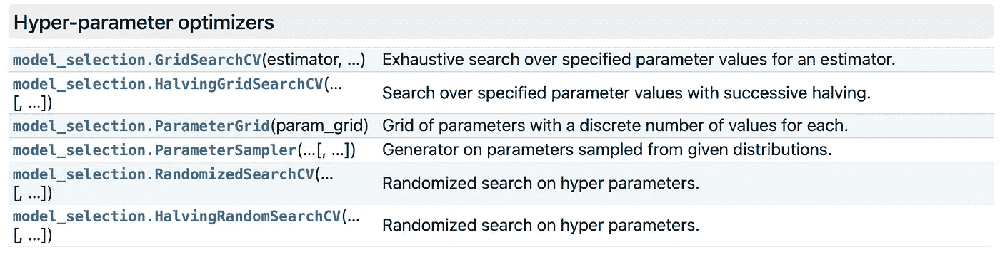

# XGBoost:微调和优化模型的完整指南

> 原文：<https://towardsdatascience.com/xgboost-fine-tune-and-optimize-your-model-23d996fab663?source=collection_archive---------0----------------------->

## 如何调整 XGBoost 超参数并增强模型的性能？


照片由 [@spacex](https://unsplash.com/@spacex) 在 [Unsplash](https://unsplash.com/) 上拍摄

# XGBoost 为什么这么受欢迎？

XGBoost 最初是作为 2014 年的一个[研究项目开始的，它已经迅速成为过去几年最受欢迎的机器学习算法之一。](https://arxiv.org/pdf/1603.02754.pdf)

许多人认为它是最好的算法之一，并且由于它在回归和分类问题上的出色性能，在许多情况下推荐它作为首选。XGBoost 因赢得大量 Kaggle 比赛而闻名，现在用于许多行业应用程序，甚至在机器学习平台中实现，如 [BigQuery ML](/super-fast-machine-learning-to-production-with-bigquery-ml-53c43b3825a3) 。

如果您正在阅读这篇关于 XGBoost 超参数优化的文章，您可能对该算法很熟悉。但是为了更好地理解我们想要调优什么，让我们回顾一下！

# 第 1 部分:理解 XBGoost

XGBoost ( **极限梯度提升**)不仅仅是一个算法。这是一个完整的[开源库](https://github.com/dmlc/xgboost)，被设计为梯度增强框架的优化实现。它侧重于速度、灵活性和模型性能。它的强大不仅仅来自于算法，还来自于所有的底层系统优化(并行化、缓存、硬件优化等等……)。

在大多数情况下，data scientist 将 XGBoost 与“基于树的学习者”一起使用，这意味着您的 XGBoost 模型是基于决策树的。但是即使它们不太受欢迎，你也可以将 XGboost 与其他基础学习者一起使用，比如线性模型或 Dart。因为这是目前最常见的情况，所以在本文的剩余部分，我们将集中讨论树。

> 到那时，你可能会有更多的问题。什么是决策树？什么是助推？梯度推进有什么区别？
> 别担心，我们会全部复述一遍！

## 什么是决策树和购物车？



推车:这个人玩电子游戏吗？—图片来自 XGBoost 文档

决策树是最简单的 ML 算法之一。

这是一种实现只包含条件语句的算法的方法。

XGBoost 使用一种叫做 CART 的决策树:分类和决策树。

*   **分类树**:目标变量是分类的，该树用于识别目标变量可能属于的“类别”。
*   **回归树**:目标变量是连续的，用树来预测其值。

CART 叶不仅包含最终决策值，还包含每个叶的实值分数，无论它们是用于分类还是回归。

## 什么是助推？

Boosting 只是一种使用集成学习原理的方法，但是是按顺序进行的。

如果你不熟悉集成学习，它是一个结合来自多个底层模型的决策，并使用投票技术来确定最终预测的过程。

随机森林和 Bagging 是两种著名的集成学习方法。



使用 Bagging 方法和多数投票策略的集成学习示例—图片由作者提供

Boosting 是一种集成学习，它使用前一个模型的结果作为下一个模型的输入。boosting 不是单独训练模型，而是按顺序训练模型，训练每个新模型来纠正以前模型的错误。在每次迭代(回合)中，正确预测的结果被赋予较低的权重，而错误预测的结果被赋予较高的权重。然后，它使用加权平均值得出最终结果。



使用加权平均策略的 Boosting 方法的集成学习示例—图片由作者提供

## 什么是梯度增强？

最后，梯度推进是一种利用[梯度下降](https://www.youtube.com/watch?v=sDv4f4s2SB8)算法将误差最小化的推进方法。简而言之，梯度下降是一种迭代优化算法，用于最小化损失函数。

损失函数量化了我们的预测与给定数据点的实际结果之间的差距。预测越好，损失函数的输出就越低。


损失函数示例:均方误差

当我们构建模型时，目标是最小化所有数据点的损失函数。例如，均方误差(MSE)是最常用的回归损失函数。

与经典增强相反，梯度增强不仅对错误预测的结果进行加权，而且还根据梯度调整这些权重——由损失函数中损失“下降最快”的方向给出。如果你想了解更多关于渐变提升的知识，可以看看[这个视频](https://www.youtube.com/watch?v=TyvYZ26alZs)。

正如我们在简介中所说，XGBoost 是这种梯度增强方法的优化实现！

## 那么，如何使用 XGBoost 呢？

有两种使用 XGBoost 的常见方法:

*   [学习 API](https://xgboost.readthedocs.io/en/latest/python/python_api.html#module-xgboost.training) :是使用 XGBoost 的基本的、底层的方式。简单而强大，它包括一个内置的交叉验证方法。

```
import xgboost as xgb

X, y = #Import your data
dmatrix = xgb.DMatrix(data=x, label=y) #Learning API uses a dmatrixparams = {'objective':'reg:squarederror'}
cv_results = xgb.cv(dtrain=dmatrix, 
                    params=params, 
                    nfold=10, 
                    metrics={'rmse'})print('RMSE: %.2f' % cv_results['test-rmse-mean'].min())
```

*   [Scikit-Learn API](https://xgboost.readthedocs.io/en/latest/python/python_api.html#module-xgboost.sklearn) :它是 XGBoost 的 Scikit-Learn 包装器接口。它允许以 scikit-learn 兼容的方式使用 XGBoost，就像使用任何本机 scikit-learn 模型一样。

```
import xgboost as xgbX, y = # Import your dataxtrain, xtest, ytrain, ytest = train_test_split(X, y, test_size=0.2)xgbr = xgb.XGBRegressor(objective='reg:squarederror')xgbr.fit(xtrain, ytrain)

ypred = xgbr.predict(xtest)
mse = mean_squared_error(ytest, ypred)
print("RMSE: %.2f" % (mse**(1/2.0)))
```

*请注意，使用学习 API 时，您可以输入和访问评估指标，而使用 Scikit-learn API 时，您必须计算它。*

## **目标函数**

XGBoost 在多种情况下是一个很好的选择，包括回归和分类问题。基于问题和你希望你的模型如何学习，你将选择一个不同的[目标函数](https://xgboost.readthedocs.io/en/latest/parameter.html#learning-task-parameters)。

最常用的有:

*   **reg:squarederror** :用于线性回归
*   **reg:logistic** :用于 logistic 回归
*   **二元:逻辑**:逻辑回归——输出概率

# 第 2 部分:超参数调优

## 为什么应该调整您的模型？

与优化模型相比，未优化模型的性能如何？值得努力吗？在深入研究 XGBoost 模型调优之前，让我们强调一下为什么**您必须调优您的模型**的原因。

作为演示，我们将使用来自 sklearn 的知名[波士顿房价数据集，并尝试预测房价。](https://scikit-learn.org/stable/modules/generated/sklearn.datasets.load_boston.html)

在不进行超参数调整的情况下，如何执行我们的模型:

```
import xgboost as xgb
from sklearn.datasets import load_boston
from sklearn.model_selection import train_test_split
from sklearn.metrics import mean_squared_error

boston = load_boston()
X, y = boston.data, boston.target
dmatrix = xgb.DMatrix(data=x, label=y)params={'objective':'reg:squarederror'}cv_results = xgb.cv(dtrain=dmatrix, params=params, nfold=10, metrics={'rmse'}, as_pandas=True, seed=20)print('RMSE: %.2f' % cv_results['test-rmse-mean'].min()) ## Result : RMSE: 3.38
```

没有任何调整，我们得到了一个***3.38***的 RMSE。这并不坏，但是让我们看看它在几个调整过的超参数下会有怎样的表现:

```
import xgboost as xgb
from sklearn.datasets import load_boston
from sklearn.model_selection import train_test_split
from sklearn.metrics import mean_squared_error

boston = load_boston()
X, y = boston.data, boston.target
dmatrix = xgb.DMatrix(data=x, label=y)params={ 'objective':'reg:squarederror',
         'max_depth': 6, 
         'colsample_bylevel':0.5,
         'learning_rate':0.01,
         'random_state':20}cv_results = xgb.cv(dtrain=dmatrix, params=params, nfold=10, metrics={'rmse'}, as_pandas=True, seed=20, num_boost_round=1000)print('RMSE: %.2f' % cv_results['test-rmse-mean'].min()) ## Result : RMSE: 2.69
```

经过一点点调整，我们现在得到了 2.69 的 ***RMSE。提高了 20%！我们可能会改进得更多。让我们看看如何！***

## 深入研究 XGBoost 超参数

超参数是模型外部的一种参数，在学习过程开始之前设置。它是可调的，可以直接影响模型的性能。

为了找出模型的最佳超参数，您可以使用经验法则，或者我们将在本文中讨论的特定方法。

在此之前，请注意，在使用 XGBoost 时，有几个参数可以优化。你可以在这里找到完整的列表，或者在 [Scikit-Learn API](https://xgboost.readthedocs.io/en/latest/python/python_api.html#module-xgboost.sklearn) 中使用的别名。

对于基于树的学习者，最常见的参数是:

*   **max_depth** :每棵树的最大深度。更深的树可能会提高性能，但也会增加复杂性和溢出的机会。
    *该值必须是大于 0 的整数。默认值为 6。*
*   **learning_rate** :当你的模型朝着它的目标优化时，学习率决定了每次迭代的步长。低学习率使得计算更慢，并且需要更多轮次来实现与具有高学习率的模型相同的残差减少。但是它优化了达到最佳状态的机会。
    *该值必须介于 0 和 1 之间。默认值为 0.3。*
*   **n_estimators** :我们集合中的树的数量。相当于助推轮数。
    *该值必须是大于 0 的整数。默认值为 100。* 注意:在标准库中，这被称为 **num_boost_round** 。
*   **colsample_bytree** :表示每棵树随机抽取的列的分数。这可能会改善过度拟合。
    *该值必须介于 0 和 1 之间。默认值为 1。*
*   **子样本**:代表每棵树要抽样的观察值部分。较低的值可以防止过度拟合，但可能会导致拟合不足。
    *该值必须介于 0 和 1 之间。默认值为 1。*

[**正则化参数**](/l1-and-l2-regularization-methods-ce25e7fc831c) **:**

*   **alpha** (reg_alpha):权重上的 L1 正则化(Lasso 回归)。当处理大量要素时，它可能会提高速度性能。它可以是任何整数。*默认为 0。*
*   **λ**(reg _ lambda):权重上的 L2 正则化(岭回归)。这可能有助于减少过度拟合。它可以是任何整数。*默认为 1。*
*   **伽马**:伽马是一个伪正则化参数(拉格朗日乘数)，取决于其他参数。伽玛越高，正则化程度越高。它可以是任何整数。*默认为 0。*

# 方法 1:直觉和合理的价值观

第一种方法是从合理的参数开始，并按部就班地进行。如果您理解了上面每个超参数的含义，您应该能够直观地设置一些值。

先说合理的价值观。通常是:

> **max _ depth**:3–10
> **n _ estimators**:100(大量观测值)到 1000(少量观测值)
> **learning _ rate**:0.01–0.3
> **col sample _ bytree**:0.5–1 **子样本**:0.6–1

然后，您可以专注于优化 **max_depth** 和 **n_estimators** 。

然后你可以跟着 **learning_rate** 一起玩，增加它来加速模型而不降低性能。如果它在不损失性能的情况下变得更快，您可以增加估计器的数量来尝试提高性能。

最后，您可以使用您的正则化参数，通常从 alpha 和 lambda 开始。对于 gamma，0 表示没有正则化，1-5 是常用值，而 10+被认为非常高。

# 方法 2:优化算法

寻找最佳超参数的第二种方法是通过优化算法。由于 XGBoost 以 Scikit-learn 兼容的方式提供，您可以使用 Scikit-learn 的超参数优化器函数！

最常见的两种是网格搜索和随机搜索。



[sci kit-学习超参数优化器](https://scikit-learn.org/stable/modules/classes.html#hyper-parameter-optimizers)

## 网格搜索

网格搜索是对指定参数值的每种组合的彻底搜索。如果为 **max_depth** 指定 2 个可能值，为 **n_estimators** 指定 3 个可能值，网格搜索将迭代 6 个可能组合:

> max_depth: [3，6]，
> n_estimators:[100，200，300]
> 
> 将导致以下可能性:
> 最大深度:3，n 估计量:100
> 最大深度:3，n 估计量:200
> 最大深度:3，n 估计量:300
> 最大深度:6，n 估计量:100
> 最大深度:6，n 估计量:200
> 最大深度:6，n 估计量:300

让我们使用来自 Scikit 的 **GridSearchCV()** 来学习调优我们的 XGBoost 模型！

*在下面的例子中，我们将使用 Kaggle* *上可用的* [*预期寿命数据集的处理版本。*](https://www.kaggle.com/kumarajarshi/life-expectancy-who)

```
import pandas as pd
import xgboost as xgb
from sklearn.model_selection import GridSearchCVdata = pd.read_csv("life_expectancy_clean.csv")X, y = data[data.columns.tolist()[:-1]],
       data[data.columns.tolist()[-1]]params = { 'max_depth': [3,6,10],
           'learning_rate': [0.01, 0.05, 0.1],
           'n_estimators': [100, 500, 1000],
           'colsample_bytree': [0.3, 0.7]}xgbr = xgb.XGBRegressor(seed = 20)clf = GridSearchCV(estimator=xgbr, 
                   param_grid=params,
                   scoring='neg_mean_squared_error', 
                   verbose=1)clf.fit(X, y)print("Best parameters:", clf.best_params_)
print("Lowest RMSE: ", (-clf.best_score_)**(1/2.0))
```

*   **估算器:** GridSearchCV 是 *sklearn.model_selection* 的一部分，与任何 scikit-learn 兼容的[估算器](https://scikit-learn.org/stable/tutorial/machine_learning_map/index.html)一起工作。我们用 *xgb。XGBRegressor()* ，来自 XGBoost 的 Scikit-learn API。
*   **param_grid:** GridSearchCV 接受一个要在输入中测试的参数列表。正如我们所说，网格搜索将测试每一个组合。
*   **评分**:该指标将用于评估交叉验证模型的性能。在这种情况下， *neg_mean_squared_error* 用于替代 *mean_squared_error* 。由于技术原因，GridSearchCV 只是使用 MSE 的负版本——所以它使函数可以推广到其他指标，我们的目标是更高的分数而不是更低的分数。
*   **详细:**控制详细程度。越高，消息越多。

更多可用参数，您可以在[文档](https://scikit-learn.org/stable/modules/generated/sklearn.model_selection.GridSearchCV.html)中找到。

最后，基于负值的最低 RMSE*clf . best _ score _* 和最佳参数 *clf.best_params_*

```
Best parameters: {'colsample_bytree': 0.7, 'learning_rate': 0.05, 'max_depth': 6, 'n_estimators': 500}
```

## 随机搜索

随机搜索使用大范围(可能无限)的超参数值，并在这些值的组合上随机迭代指定次数。与遍历所有可能组合的网格搜索相反，随机搜索指定了遍历的次数。

如果您为 **max_depth** 输入 10 个可能值，为 **n_estimators** 输入 200 个可能值，并选择进行 10 次**迭代**:

> max_depth: np.arrange(1，10，1)，
> n _ estimators:NP . arrange(100，400，2)
> 
> 10 次迭代的随机可能性示例:
> 1:最大深度:1，n 估计量:110
> 2:最大深度:3，n 估计量:222
> 3:最大深度:3，n 估计量:306
> 4:最大深度:4，n 估计量:102
> 5:最大深度:1，n 估计量:398
> 6:最大深度:6，n 估计量:290 【T38

现在，让我们使用来自 Scikit 的**randomsearccv()**来学习调优我们的模型！

```
import pandas as pd
import numpy as np
import xgboost as xgb
from sklearn.model_selection import RandomizedSearchCVdata = pd.read_csv("life_expectancy_clean.csv")X, y = data[data.columns.tolist()[:-1]],
       data[data.columns.tolist()[-1]]params = { 'max_depth': [3, 5, 6, 10, 15, 20],
           'learning_rate': [0.01, 0.1, 0.2, 0.3],
           'subsample': np.arange(0.5, 1.0, 0.1),
           'colsample_bytree': np.arange(0.4, 1.0, 0.1),
           'colsample_bylevel': np.arange(0.4, 1.0, 0.1),
           'n_estimators': [100, 500, 1000]}xgbr = xgb.XGBRegressor(seed = 20)clf = RandomizedSearchCV(estimator=xgbr,
                         param_distributions=params,
                         scoring='neg_mean_squared_error',
                         n_iter=25,
                         verbose=1)clf.fit(X, y)print("Best parameters:", clf.best_params_)
print("Lowest RMSE: ", (-clf.best_score_)**(1/2.0))
```

*   大多数 *RandomizedSearchCV 的*参数与 *GridSearchCV 的*相似。
*   **n_iter:** 被采样的参数组合数。越高，你测试的组合就越多。它权衡了解决方案的运行时间和质量。

对于 *GridSearchCV* ，我们以 *clf.best_score_* 的负值为基础，用 *clf.best_params_* 和最低 RMSE 打印最佳参数

# 结论

在本文中，我们解释了 XGBoost 如何操作，以便更好地理解如何调优它的超参数。正如我们所见，调优通常会导致模型性能的大幅提升。

使用我们的直觉来调整我们的模型有时可能就足够了。也值得尝试 GridSearch 和 RandomSearch 这样的优化算法。但是大多数时候，通过测试和直觉，结合算法和调整，你会得到更好的结果！

[](https://davidjmartins.medium.com/membership) [## 通过我的推荐链接加入媒体-大卫·马丁斯

### 作为一个媒体会员，你的会员费的一部分会给你阅读的作家，你可以完全接触到每一个故事…

davidjmartins.medium.com](https://davidjmartins.medium.com/membership) 

# 您可能也会感兴趣…

[](/10-best-practices-to-write-readable-and-maintainable-sql-code-427f6bb98208) [## 编写可读和可维护的 SQL 代码的 10 个最佳实践

### 如何编写你的团队可以轻松阅读和维护的 SQL 查询？

towardsdatascience.com](/10-best-practices-to-write-readable-and-maintainable-sql-code-427f6bb98208)