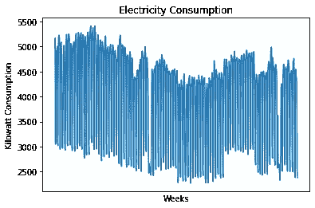

# XGBoost 用于时间序列预测:不要盲目使用

> 原文：<https://towardsdatascience.com/xgboost-for-time-series-forecasting-dont-use-it-blindly-9ac24dc5dfa9?source=collection_archive---------1----------------------->

## 预测技术并不适用于所有的时间序列


来源:图片由[尼罗](https://pixabay.com/users/nile-598962/)发自 [Pixabay](https://pixabay.com/photos/hourglass-time-hours-clock-620397/)

当使用 ARIMA 模型对时间序列进行建模时，我们通常会特别注意季节性、趋势、合适的时间段等因素。

然而，当使用 XGBoost 这样的机器学习模型来预测时间序列时，所有的常识似乎都过时了。相反，我们只是以类似黑盒的方式将数据加载到模型中，并期望它神奇地给我们准确的输出。

时间序列分析鲜为人知的秘密——无论模型有多好，也不是所有的时间序列都可以预测。试图这样做往往会导致虚假或误导性的预测。

为了说明这一点，让我们看看 XGBoost(特别是 XGBRegressor)在预测 1)爱尔兰都柏林市议会市政办公室的用电模式和 2)曼哈顿山谷的季度公寓销售时是如何变化的。

# XGBRegressor 如何预测时间序列

XGBRegressor 使用许多梯度增强的[树](https://xgboost.readthedocs.io/en/latest/python/python_api.html)(在模型中称为 *n_estimators* )来预测因变量的值。这是通过组合决策树(每个决策树都是弱学习器)来形成组合的强学习器来实现的。

预测时间序列时，该模型使用所谓的回望期来预测未来的若干步。例如，如果使用 1 的回望周期，那么 *X_train* (或独立变量)使用时间序列的滞后值，相对于时间**t***【Y _ train】*的时间序列回归，以便预测未来值。

## 预测用电量

让我们以电力消耗预测为例来看看这是如何工作的。



来源:Jupyter 笔记本输出

正在讨论的数据集可从 data.gov.ie[获得。从该图中，我们可以看到，数据中可能存在一个短期的季节性因素，因为我们经常看到消费趋势的显著波动。](https://data.gov.ie/dataset/energy-consumption-gas-and-electricity-civic-offices-2009-2012/resource/6091c604-8c94-4b44-ac52-c1694e83d746)

让我们使用自相关函数来进一步研究。


来源:Jupyter 笔记本输出

根据该自相关函数，很明显，每个 **7** 滞后都有很强的相关性。直觉上，这是有道理的，因为我们预计对于商业建筑来说，消费将在工作日(最有可能是周一)达到高峰，在周末消费下降。

当用 XGBRegressor 预测这样的时间序列时，这意味着 **7** 的值可以用作回望期。

```
# Lookback period
lookback = 7
X_train, Y_train = create_dataset(train, lookback)
X_test, Y_test = create_dataset(test, lookback)
```

根据训练数据运行模型，并做出预测:

```
from xgboost import XGBRegressormodel = XGBRegressor(objective='reg:squarederror', n_estimators=1000)
model.fit(X_train, Y_train)
testpred = model.predict(X_test)
```

让我们计算 RMSE，并将其与测试平均值进行比较(前者的值与后者相比越低越好)。

```
>>> import math
>>> from math import sqrt
>>> test_mse = mean_squared_error(Y_test, testpred)
>>> rmse = sqrt(test_mse)
>>> print('RMSE: %f' % rmse)RMSE: 437.935136>>> np.mean(Y_test)3895.140625
```

我们看到，与平均值相比，RMSE 非常低(整体平均值的 11%)，这意味着 XGBoost 在预测测试集的值方面做得非常好。如果您希望更详细地查看此示例，可点击[此处](/predicting-electricity-consumption-with-xgbregressor-a11b71104754)获得进一步的分析。

## 预测曼哈顿山谷公寓的销售

在上面的例子中，我们显然有一个每周的季节性因素，这意味着一个适当的回顾期可以用来做预测。

然而，有许多时间序列**没有**有季节性因素。这使得任何类型的模型都更难预测这样的时间序列——序列中缺乏周期性波动会在这方面引起重大问题。

这是 2003 年至 2015 年曼哈顿山谷季度公寓销售的直观概览。数据来源于[纽约公开数据](https://data.cityofnewyork.us/Housing-Development/NYC-Calendar-Sales-Archive-/uzf5-f8n2)，曼哈顿山谷的公寓——电梯公寓——的销售价格是从 2003 年到 2015 年按季度汇总的。


来源:Jupyter 笔记本输出

从上面我们可以看到，在某些季度，销售往往会达到高峰，但这种情况似乎没有固定的频率。

让我们再来看一个自相关函数。


来源:Jupyter 笔记本输出

从自相关来看，似乎每 9 个滞后就有一个相关的小峰值，但这些峰值位于自相关函数的阴影区域内，因此在统计上不显著。

如果我们尝试使用 XGBRegressor 模型的回顾期 **9** 来预测季度销售额会怎么样？

指定了与前一示例中相同的模型:

```
from xgboost import XGBRegressormodel = XGBRegressor(objective='reg:squarederror', n_estimators=1000)
model.fit(X_train, Y_train)testpred = model.predict(X_test)
testpred
```

现在，让我们计算 RMSE，并将其与测试集中计算的平均值进行比较:

```
>>> test_mse = mean_squared_error(Y_test, testpred)
>>> rmse = sqrt(test_mse)
>>> print('RMSE: %f' % rmse)RMSE: 24508264.696280>>> np.mean(Y_test)47829860.5
```

我们可以看到，在这种情况下，RMSE 相当大——占测试集计算平均值的 50%。

这表明，该模型在预测曼哈顿山谷公寓的季度总销售额方面没有太大的预测能力。

鉴于似乎不存在季节性，我们缩短回望期如何？让我们尝试一个 **1** 的回顾周期，其中仅使用前一个值。

```
>>> test_mse = mean_squared_error(Y_test, testpred)
>>> rmse = sqrt(test_mse)
>>> print('RMSE: %f' % rmse)RMSE: 21323954.883488>>> np.mean(Y_test)35266600.64285714
```

整个测试集的平均值的大小已经减小，因为现在有更多的值包含在测试集中，这是更低的回顾期的结果。这在一定程度上消除了销售高峰的影响。然而，我们看到 RMSE 的大小并没有减少那么多，误差的大小现在占平均值总大小的 60%以上。

因此，使用 XGBRegressor(即使有不同的回顾期)在预测非季节性数据方面做得并不好。

# 结论

有许多类型的时间序列太不稳定，或者不适合直接预测。然而，像 XGBoost 这样的机器学习模型经常被以即插即用的方式处理，从而将数据输入到模型中，而不考虑数据本身是否适合分析。

因此，本文的主要观点是，无论您是使用 XGBoost 模型，还是其他任何模型，都要确保首先根据时间序列本身的优点对其进行分析。这意味着确定总体趋势以及是否存在季节性模式。

XGBoost 的魅力在于，人们可以潜在地使用该模型来预测一个时间序列，而不必了解该时间序列的技术组成部分——但事实并非如此。

非常感谢您的宝贵时间，非常感谢您的任何问题或反馈。

*免责声明:本文是在“原样”的基础上编写的，没有担保。它旨在提供数据科学概念的概述，不应被解释为专业建议。本文中的发现和解释是作者的发现和解释，不被本文中提到的任何第三方认可或隶属于任何第三方。作者与本文提及的任何第三方无任何关系。*