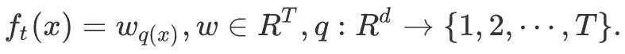

# 时间序列推断的 XGBoost:你需要一艘更大的船

> 原文：<https://towardsdatascience.com/xgboost-for-time-series-youre-gonna-need-a-bigger-boat-9d329efa6814?source=collection_archive---------8----------------------->

罗伯特·H 在 [Unsplash](https://unsplash.com?utm_source=medium&utm_medium=referral) 拍摄的照片

> **更新**:发现我关于渐变提升的新书[实用渐变提升](https://amzn.to/3GCBtNF)。这是用 python 中的许多例子对渐变增强的深入探究。

<https://amzn.to/3GCBtNF> [## 实用的渐变增强:深入探究 Python 中的渐变增强

### 这本书的梯度推进方法是为学生，学者，工程师和数据科学家谁希望…](https://amzn.to/3GCBtNF) 

**更新**:发现我在这个问题上的后续，用线性树很好地解决了这个问题:

</xgboost-for-timeseries-lightgbm-is-a-bigger-boat-197864013e88>  

XGBoost 是一个非常强大和通用的模型。它的应用范围很广，已经成功地应用于许多最大似然分类和回归问题。这里用代码[解释了基本的数学原理](/diy-xgboost-library-in-less-than-200-lines-of-python-69b6bf25e7d9)。

尽管它最初不是为处理时间序列而设计的，但许多数据科学家仍然在这种情况下使用它。他们这样做对吗？让我们看看数学告诉了我们这个用例什么。

# 时间序列的 XGBoost

例如，XGBoost 甚至被用于预测时间序列[这里的](https://machinelearningmastery.com/xgboost-for-time-series-forecasting/)和[这里的](/using-gradient-boosting-for-time-series-prediction-tasks-600fac66a5fc)。秘诀是输入与时间相关的特征:滞后、频率、小波系数、周期…

由于 XGBoost 非常擅长识别数据中的模式，如果您有足够的时态特征来描述您的数据集，它将提供非常不错的预测。

但是，XGBoost 缺少一个对时间序列绝对关键的基本特性。让我们分析一下这个模型背后的数学原理，以理解 XGBoost 要成为一个好的时间序列预测模型还缺少什么。

# XGBoost 的数学基础

在 XGBoost 文档中，有一篇非常说教的[文章](https://xgboost.readthedocs.io/en/latest/tutorials/model.html)详细解释了 XGBoost 模型是如何从数学公式中推导出来的。我强烈建议通读这篇论文，因为这对于真正理解超参数(如γ、α等)的作用至关重要

我还写了一篇解释性的[文章](/diy-xgboost-library-in-less-than-200-lines-of-python-69b6bf25e7d9)，用 200 行代码重建了一个基本的 XGBoost 库。

众所周知，XGBoost 是一个基于树的模型。它可以堆叠任意多的树，每一棵额外的树都试图减少之前的树的误差。总体思路是将许多简单、弱的预测器结合起来，建立一个强预测器。

但是让我们关注 XGBoost 文档中最重要的公式:预测是如何计算的。这是一个非常简单的公式:

摘录自 XGBoost [文档](https://xgboost.readthedocs.io/en/latest/tutorials/model.html)。

其中估计 ***y_i*** 是预测， ***x_i*** 是特征向量， ***f_k(x_i)*** 是为每棵树计算的值， ***K*** 是树的总数。

正如您所看到的，XGBoost 模型本质上是一个关于每棵树的附加模型。让我们看一下 ***f_k*** 来了解树的分数是如何计算的，看看我们这里说的是什么样的函数。

XGBoost 文档再一次给了我们答案，这也很容易理解:

摘自 XGBoost [文档](https://xgboost.readthedocs.io/en/latest/tutorials/model.html)。

***q(x)*** 是将特征 ***x*** 归属于当前树 ***t*** 的特定叶子的函数。 ***w_q(x)*** 则是当前树的叶分数*和当前特征 ***x*** 。*

*总的来说，一旦你训练了你的模型，这是问题中最难的部分，预测简单地归结为根据特征为每棵树确定正确的叶子，并总结每个叶子的值。*

*现在让我们看看这种模型的具体结果是什么，以及对时间序列预测有什么影响。*

# *XGBoost 无法外推！！！*

*同样，XGBoost 是一个非常强大和高效的分类和回归工具，但是它缺少一个非常关键的特性:它不能外推！或者至少，它不能推断出比简单常数更复杂的东西。线性、二次或三次插值是不可能的。*

*正如我们在前面的公式中所看到的，XGBoost 预测只是基于树叶值的总和。这些值没有应用任何变换:没有缩放、没有对数、没有指数，什么都没有。*

*这意味着 XGBoost 只能对以前在训练历史中遇到的情况做出很好的预测。它不会捕捉趋势！*

*下面的几行代码非常有说服力，应该足以说明这种局限性，并让您相信 XGBoost 无法进行外推:*

*这几行代码使用 XGBoost 模型来预测一个非常基本的纯线性系统的值，该系统的输出与时间成正比。如下图所示，XGBoost 在插值时非常出色，正如您可以看到的对 0 到 10 之间的 ***t*** 的预测。*

**

*作者创造的情节。*

*但是当我们分析了潜在的数学模型后，在试图推断时，它完全失败了。事实上，如上所述，XGBoost 模型不能预测没有出现在它的训练中的事件。*

# *你为什么要为插值而烦恼呢？*

*不幸的是，时间序列，或者至少是那些值得关注的时间序列，通常是非平稳的。这意味着它们的统计特征——平均值、方差和标准差——会随着时间而变化。*

*准确预测这种时间序列需要模型不仅能捕捉时间的变化，还能进行外推。*

*我们可以研究两个例子来说明这一点。在第一个例子中，我们想估计在一个天空从不多云的特定地点每平方米接收到的太阳能数量，而不管是哪一天。有了几年的数据，XGboost 将能够做出非常合理的估计，因为接收到的能量数量本质上是一个几何问题，而且地球围绕太阳的运动几乎是完全周期性的。我们面对的是一个静止的系统。*

*另一方面，假设我们不再想预测太阳辐照度，而是想预测温度。像我们现在这样(都？)意识到，由于人类活动，地球正在经历全球变暖，一个多世纪以来，地球的平均温度一直在上升。见下图:*

**

*全球平均气温正在上升。摘自[伯克利地球](http://berkeleyearth.org/wp-content/uploads/2020/01/2019_Time_Series.png)*

*即使对于一个给定的位置，我们观察到季节性的影响，平均温度在时间上是不稳定的。构建一个 XGBoost 模型，拥有尽可能多的气象或气候特征，永远不会对未来产生好的估计。*

# *我们能黑掉 XGBoost 来克服这个吗？*

*对于某些模型，有时可以破解底层数学来扩展它们的应用范围。这篇[文章](/confidence-intervals-for-xgboost-cac2955a8fde)举例说明了如何使用自定义目标来计算置信区间。*

*例如，您可以使用简单的线性回归模型对非线性系统进行建模和预测，只需向它们提供非线性特征。因此，通过向线性模型提供风速的 7 次方，可以实现风力涡轮机发电的良好性能。*

*不幸的是，不可能调整 XGBoost 模型中用于预测的公式来引入外推支持。*

*将 XGBoost 强大的模式识别与外推法结合起来的一个选择是用一个负责这个的边模型来扩充 XGBoost。*

*另一种方法是对数据进行归一化处理，以消除不稳定的影响，回到稳定的情况。*

# *结论*

*XGBoost 和任何其他基于树的模型都不能在数学上执行任何大于 0 阶的外推。也就是说，它们只能外推一个常量值。当试图将这种模型应用于非平稳时间序列时，这是一个需要考虑的巨大限制。*

*然而，XGBoost 仍然是一个非常有吸引力的工具，可以在具有许多特性的复杂数据中显示结构。用它来预测时间序列可能是一个不错的选择，只要你的目标是固定的。如果不是这样，那么您需要预处理您的数据以确保它是正确的，或者考虑将 XGBoost 与另一个负责处理趋势的模型结合起来。*