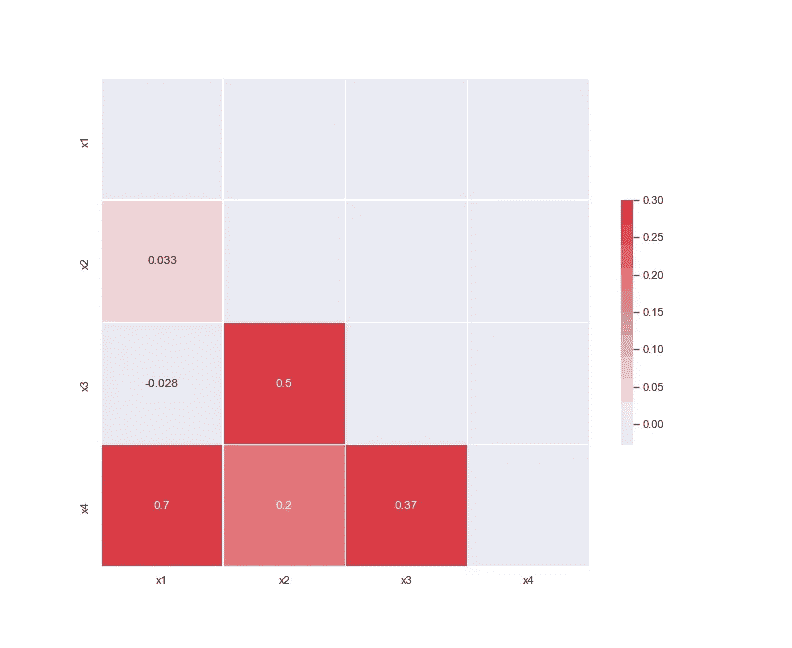
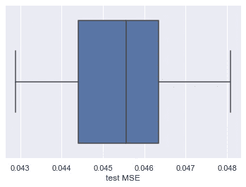

# XGBoost:顺序很重要

> 原文：<https://towardsdatascience.com/xgboost-order-does-matter-60d8d0d5aa71?source=collection_archive---------11----------------------->

## 要素的顺序对 XGBoost 模型有什么影响，如何使用要素重要性来识别数据中的相关要素？


米克·豪普特在 [Unsplash](https://unsplash.com?utm_source=medium&utm_medium=referral) 上的照片

您可能会问自己-为什么我要使用要素重要性来查找数据中的相关要素？例如，查看变量对之间的皮尔逊相关性要简单得多。

没错。

看一看(皮尔逊)相关矩阵:



*作者图片*

*x1* 和 *x4* 相关性高是没有问题的，但是 *x3* 和 *x4* 呢？0.37 的相关性意味着什么？

数据科学家使用机器学习模型，如 XGBoost，将特征(X)映射到目标变量(Y)。理想情况下，我们希望映射尽可能类似于成对数据(X，Y)的真实生成器函数。我们使用标记数据和几个成功指标来衡量给定的学习映射与真实映射相比有多好。

XGBoost 是一个高性能的决策树梯度提升集成，广泛用于表格数据的分类和回归任务。像其他决策树算法一样，它由分裂组成，即迭代选择最能把数据分成两组的特征。该算法在每次迭代中为每个特性分配一个分数，并根据该分数选择最佳分割(要了解更多关于 XGBoost 的信息，我推荐[【1】](https://xgboost.readthedocs.io/en/latest/tutorials/model.html))。然而，如果在模型训练过程中，两个特征在给定的级别上具有相同的分数，会发生什么呢？算法会优先选择哪一个？原来在一些 XGBoost 实现中，首选特性会是第一个(与特性的插入顺序有关)；然而，在其他实现中，随机选择两个特征中的一个。

在继续之前，我想说几句 XGBoost 的随机性。在建立树集合的过程中，一些决定可能是随机的:从数据中取样，为每棵树选择特征的子组，等等。使用默认参数运行 XGBoost，并且不进行并行计算，会产生一组完全确定的树。如果您将参数`subsample`的值更改为小于 1，您将获得随机行为，并且需要设置一个种子以使其可重现(使用`random_state`参数)。在这篇文章中，我使用了`subsample=1`来避免随机性，所以我们可以假设结果不是随机的。

这里有一个简单的例子:

我创建了一个简单的数据集，它有两个特征， *x1* 和 *x2* ，这两个特征是高度相关的(皮尔逊相关系数为 0.96)，并生成了*目标(*真目标)，仅作为 *x1* 的函数。

```
num_samples = 1000
x1 = (np.random.randn(num_samples) 
      + 2 * np.random.randn(num_samples) 
      + 3 * np.random.randn(num_samples) + 4)
x2 = x1 * 0.5 + np.power(x1, 2) * 0.06 + 0.07
df_simple = pd.DataFrame({'x1': x1, 'x2': x2})
df_simple['target'] **=** df_simple['x1'] ***** 0.08
```

使用默认参数训练 XGboost 模型，并查看特征重要性值(我使用了增益特征重要性类型。要阅读更多关于 XGBoost 类型的特性重要性，我推荐[【2】](/interpretable-machine-learning-with-xgboost-9ec80d148d27)，我们可以看到 *x1* 是最重要的特性。太好了！

```
simple_model = xgb.XGBRegressor()
simple_model.fit(X_train, y_train)
...
x1 importance: 0.295
x2 importance: 0.0
```

现在，我们将用相同的参数训练一个 XGBoost 模型，只改变特征的插入顺序。 *x2* 得到了几乎所有的重要性。

不太好…

```
simple_model_reverse = xgb.XGBRegressor()
simple_model_reverse.fit(X_train[['x2', 'x1']], y_train)
...
x1 importance: 0.03
x2 importance: 0.118
```

显然，0.96 的相关性非常高。从一开始，我们就不应该包含这两个特性。

回到我们关于 0.37 相关性的问题，这里有另一个非常简单的例子:

数据集由 4 个特征组成，其中 *x3* 是 *x2* 的噪声变换， *x4* 是 *x1* 、 *x2* 和 *x3* 的非线性组合，而*目标*只是 *x1* 和 *x3* 的函数。

```
x1 = np.random.randn(num_samples)
x2 = np.random.uniform(0, 1, num_samples)
x3 = x2 * 2 - 0.4345 + np.random.randn(num_samples)
x4 = [x1[i] if x1[i] < 0.1 else 
      x2[np.random.choice(num_samples)] 
      + x3[i] for i in range(num_samples)]
df = pd.DataFrame({'x1': x1, 'x2': x2, 'x3': x3, 'x4': x4})
df['target'] = (0.2 * df['x1'] 
               + 0.67 * np.sqrt(np.power((df['x1'] - df['x3']), 2))
               + df['x1'] * df['x3'])
```

为了模拟这个问题，我用相同的默认参数为 4 个特性的每个可能的排列(24 个不同的排列)重新构建了一个 XGBoost 模型。下图可以看到，MSE 是一致的。但是，与模型的性能一致性相反，特性重要性排序确实发生了变化。



(左)测试 MSE 分布|(右)特征重要性分布| *作者图片*

在 75%的排列中， *x4* 是最重要的特征，其次是 *x1* 或 *x3* ，但在另外 25%的排列中， *x1* 是最重要的特征。这里有两个问题:

1.  顺序不一致。
2.  目标只是一个 *x1* 和 *x3* 的算术表达式！ *x4* 不是产生真正目标的方程式的一部分。

不同的特征排序在特征和目标变量之间产生不同的映射。原因可能是变量之间复杂的间接关系。但我为什么要在乎呢？

将特征重要性视为每个特征对**真**目标的贡献的良好近似值可能是不正确的。请务必记住，它仅反映每个要素对模型所做预测的贡献。有时候这正是我们需要的。但是，在其他情况下，我们想知道特征重要性值是解释模型还是数据([【3】](https://arxiv.org/abs/2006.16234))。

## 结论

一个特征可能与另一个特征不相关(线性地或以另一种方式)。然而，在训练过程中，在特征空间的某个子空间，它可能得到与另一个特征相同的分数，并被选择来分割数据。如果两个特征可以被模型互换使用，这意味着它们以某种方式相关，可能是通过一个混杂的特征。

注意功能顺序。如果您不确定，请尝试不同的顺序。使用您的领域知识和统计数据，如皮尔逊相关或交互图，来选择排序。批评特征重要性的输出。同样，用你的领域知识去理解另一个订单是否同样合理。

## 参考

[1] [XGBoost 教程—助推树简介](https://xgboost.readthedocs.io/en/latest/tutorials/model.html)

[2] [斯科特·伦德伯格](/interpretable-machine-learning-with-xgboost-9ec80d148d27)[用 XGBoost](https://medium.com/u/3a739af9ef3a?source=post_page-----60d8d0d5aa71--------------------------------) 进行可解释的机器学习

[3]陈，h .，Janizek，J. D .，Lundberg，s .，& Lee，S. I .，[忠于模型还是忠于数据？](https://arxiv.org/abs/2006.16234) (2020)，arXiv 预印本 arXiv:2006.16234。‏

[4][XG boost](https://vishesh-gupta.medium.com/correlation-in-xgboost-8afa649bd066)中的相关性由[维谢什·古普塔](https://medium.com/u/866f05f2fd9?source=post_page-----60d8d0d5aa71--------------------------------)

[5] [特征重要性结果对特征顺序敏感](https://github.com/dmlc/xgboost/issues/3362)