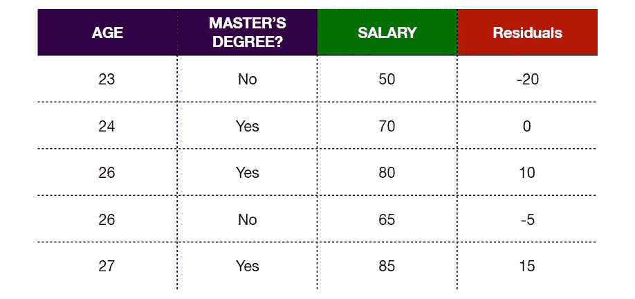

# XGBoost 回归:把我当 10 岁解释给我听

> 原文：<https://towardsdatascience.com/xgboost-regression-explain-it-to-me-like-im-10-2cf324b0bbdb?source=collection_archive---------0----------------------->

## [入门](https://towardsdatascience.com/tagged/getting-started)

当我刚刚开始探索理解机器学习算法时，我会被所有的数学知识淹没。我发现，如果没有完全掌握直觉，就很难理解算法背后的数学。所以我会被那些将算法分解成更简单、更容易理解的步骤的资源所吸引。这就是我今天想要做的。用一种 10 岁孩子也能理解的方式解释 XGBoost 算法。开始了。

让我们从由五个人组成的训练数据集开始。我们记录了他们的年龄，是否有硕士学位，以及他们的工资(以千计)。我们的目标是使用 XGBoost 算法预测*的薪水*。

## 步骤 1:进行初步预测并计算残差

这个预测可以是任何东西。但是让我们假设我们最初的预测是我们想要预测的变量的平均值。

我们可以使用以下公式计算残差:

这里，我们的观察值是*薪水*列中的值，所有预测值都等于 70，因为这是我们选择的初始预测值。

## 步骤 2:构建 XGBoost 树

每棵树从一片叶子开始，所有的剩余部分都进入那片叶子。

现在我们需要计算这个叶子的相似性分数。

λ (lambda)是一个正则化参数，可降低预测对单个观测值的敏感度，并防止数据过度拟合(这是指模型完全符合训练数据集)。λ的默认值是 1，因此在本例中我们让λ = 1。

现在，我们应该看看，如果我们使用基于预测值的阈值将残差分成两组，我们是否能更好地对残差进行聚类，预测值是*年龄*和*硕士学位？。*分割*残差*基本上意味着我们正在向我们的树添加分支。

先来试试用*硕士* **劈叶子？**

然后计算上述分裂的左右叶的**相似性分数**:

现在我们需要量化叶子聚集相似残差*比根聚集相似残差*好多少。我们可以通过计算将*残差*分成两组的**增益**来做到这一点。如果**增益**为正，那么分裂是个好主意，否则就不是。

然后我们将这个**增益**与*年龄*的分裂进行比较。由于*年龄*是一个连续变量，寻找不同分裂的过程就有点复杂了。首先，我们按照*年龄*的升序排列我们数据集的行。然后我们计算*年龄*相邻值的平均值。

现在，我们使用四个平均值作为阈值来分割*残差*，并为每个分割计算**增益**。第一次拆分使用*年龄< 23.5* :

对于这种分裂，我们发现**相似性得分**和**增益**与我们发现*硕士学位的方式相同？*

对剩下的*年龄*劈叉做同样的事情:

出了一个*硕士学位？*分裂和四个*年龄*分裂，其中*硕士*分裂*具有最大的**增益**值，所以我们将其作为我们的初始分裂。现在我们可以通过拆分我们的*硕士学位来给树添加更多的分支？*叶子再次使用上述相同的过程。但是，只有这一次，我们用最初的*硕士学位？*叶作为我们的根节点，并尝试通过获得大于 0 的最大**增益**值来分割它们。*

让我们从左边的节点开始。对于这个节点，我们只考虑*硕士学位中值为‘Yes’的观测值？*因为只有那些观测值落在左节点。

因此，我们使用与之前相同的过程来计算*年龄*分割的**增益**，但是这次仅使用高亮显示的行中的*残差*。

由于只有*年龄< 25* 给我们一个正的**增益**，我们使用这个阈值分割左节点。移动到我们的右节点，我们只查看*硕士学位中带有‘否’值的值？*

我们在右侧节点中只有两个观察值，因此唯一可能的分割是*年龄< 24.5* ，因为这是突出显示的行中两个*年龄*值的平均值。

这种分割的**增益**为正，所以我们最终的树是:

## ***第三步:修剪树木***

修剪是我们避免过度拟合数据的另一种方法。为了做到这一点，我们从树的底部开始，一路向上，看看一个分割是否有效。为了建立有效性，我们使用γ (gamma)。如果 **Gain —** γ为正，那么我们保留该分割，否则，我们移除它。γ的默认值是 0，但是为了便于说明，让我们将γ设置为 50。根据之前的计算，我们知道了**增益**值:

因为**增益—** γ对于除了*年龄< 24.5* 之外的所有分裂都是正的，所以我们可以移除那个分支。所以生成的树是:

## ***第四步:计算叶子的输出值***

我们快到了！我们现在要做的就是在叶节点中计算一个值，因为我们不能让一个叶节点给我们多个输出。

这类似于计算**相似性得分**的公式，除了我们没有平方*残差*。使用公式和λ = 1，**鼓滚** 我们的最终树是:

## ***第五步:做出新的预测***

既然所有艰难的模型构建都已过去，我们就进入激动人心的部分，看看使用新模型后我们的预测有多大改进。我们可以使用这个公式进行预测:

XGBoost 学习率是ɛ (eta ),默认值是 0.3。所以我们第一次观察的预测值将是:

同样，我们可以计算其余的预测值:

## ***第六步:使用新的预测值计算残差***

我们看到新的*残差*比以前的小，这表明我们已经朝着正确的方向迈出了一小步。随着我们重复这个过程，我们的*残差*将变得越来越小，这表明我们的预测值越来越接近观察值。

## ***步骤 7:重复步骤 2–6***

现在我们只是一遍又一遍地重复相同的过程，建立一个新的树，进行预测，并在每次迭代中计算*残差*。我们这样做，直到*残差*非常小，或者我们达到了为我们的算法设置的最大迭代次数。如果我们在每次迭代中构建的树由 Tᵢ表示，其中 *i* 是当前迭代，那么计算预测的公式是:

仅此而已。感谢您的阅读，祝您接下来的算法之旅好运！

如果你想支持我的工作，可以考虑使用[我的链接注册一个媒体订阅](https://medium.com/@shreya.rao/membership)！(每月 5 美元，随时取消)