# Python 中 CPU 和 GPU 上的 Xgboost 回归训练

> 原文：<https://towardsdatascience.com/xgboost-regression-training-on-cpu-and-gpu-in-python-5a8187a43395?source=collection_archive---------20----------------------->

## 如何使用 GPU 解锁 Python 中 xgboost 模型的快速训练


GPU vs CPU 作者绘画

在本文中，我将介绍使用 GPU 而不是默认 CPU 来训练 xgboost 模型所需的步骤。

此外，还分析了矩阵的大小和某些超参数对训练速度的影响。

随意从这里克隆或派生所有代码:[https://github.com/Eligijus112/xgboost-regression-gpu](https://github.com/Eligijus112/xgboost-regression-gpu)。

为了在 GPU 上训练机器学习模型，你需要在你的机器上安装一个 **G** 图形 **P** 处理**U**nit——GPU-a 显卡。默认情况下，机器学习框架会在计算机内部搜索一个**C**entral**P**processing**U**nit——CPU。

我在训练中使用的机器内部:

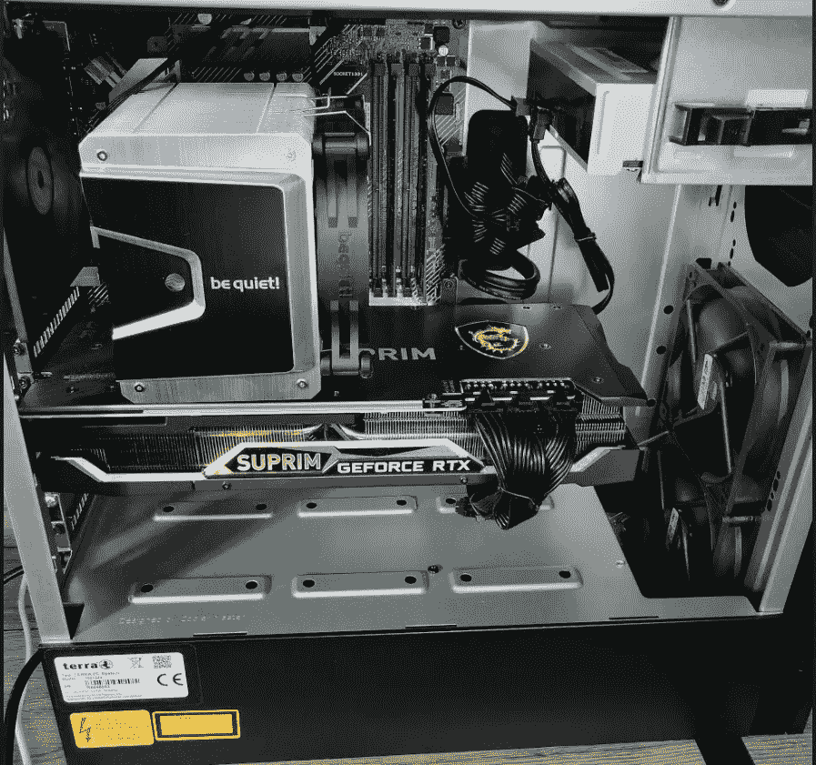

在我的桌面内部；照片归作者所有

有问题的主要部分是:

***GPU —英伟达 GeForce RTX 3080***

***CPU — AMD 锐龙 7 5800X***

下一步是获得 Nvidia 提供的所有驱动程序，使软件能够联系 GPU 硬件，并使用那里的内存来优化机器学习系数。

我不会复制粘贴其他优秀文章中出现的相同代码和链接。要完整安装所有必需的软件包[，请遵循以下步骤](/installing-tensorflow-with-cuda-cudnn-and-gpu-support-on-windows-10-60693e46e781)。

一旦完成了上一节中的所有步骤，我们需要确保一切都正常工作。理想的地方是 anaconda 提示符命令行面板。在其中，键入:

```
**python** **import tensorflow as tf****tf.test.is_built_with_cuda()****tf.config.list_physical_devices()**
```

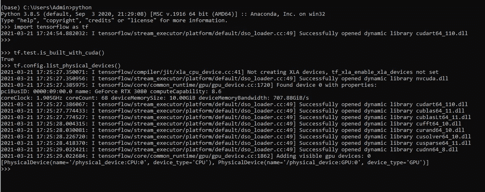

命令列表；作者图片

如果没有丢失任何东西并且安装正确，本地计算机上的命令应该会输出与图中非常相似的输出。主线是 TensorFlow 找到了我的显卡。从我的实践来看，这意味着 scikit-learn 机器学习框架也可以使用该卡。

现在我们有了能够使用 GPU 的软件，让我们来训练一些模型吧！

对于建模任务，我将加载包含 **1017209** 行和以下各列的数据:

**店铺** —店铺识别号

**日期** —店铺销售记录的日期

**星期几** —日期的星期几

**销售额** —该日期销售商品的收入(仅在 train_data.csv 中可用)

**ShopOpen** —布尔标志，表示商店在该日期是否营业(如果不营业，销售额应为 0)

**促销** —如果在该日期进行了任何促销，则为布尔标志

**法定假日** —日期是否为法定假日的因子变量

**学校假期** —日期是否为学校假期的因子变量

**商店类型** —描述商店类型的因素变量

**分类类型** —描述商店分类类型的因素变量

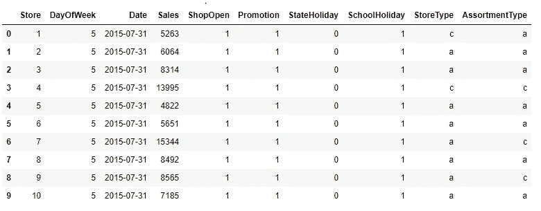

数据片段；作者图片

任务是使用所有其他特性对 **Sales (Y)** 变量进行建模。注意，所有其他特征都是分类的。

添加了关于一月中的某一天和一年中的某一月的两个附加特征后，我们可以检查数据集中有多少个唯一的分类值:

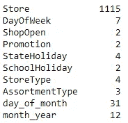

独特的分类水平；作者图片

Y 变量的分布:

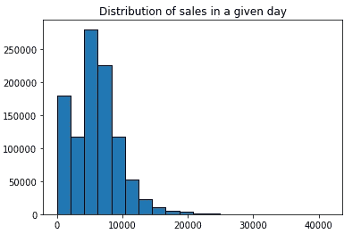

y 变量直方图；作者图片

完整 Y 和 X 矩阵的最终尺寸:

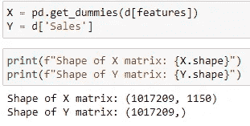

尺寸；作者图片

X 矩阵有 1150 个特征和超过一百万行。测试计算速度的理想真实数据集！

建模类将是 python 中的 xgboost 回归实现:

 [## XGBoost 参数-XGBoost 1 . 4 . 0-快照文档

### min_child_weight [default=1]子对象中所需的实例权重的最小总和(hessian)。如果树分区步骤…

xgboost.readthedocs.io](https://xgboost.readthedocs.io/en/latest/parameter.html) 

初始化模型类的模板是:

```
**import xgboost as xgb** **model = xgb.XGBRegressor(**kwargs)**
```

回归的目标参数应该是: **'reg:squarederror '。**

***为了能够在 GPU 上进行训练，唯一需要做的就是传递一个参数 tree_method = 'gpu_hist '。***

CPU 和 GPU 字典示例:

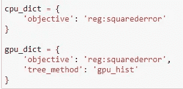

CPU 和 GPU kwargs 作者图片

可能出现的第一个有趣的问题是，训练速度如何根据 CPU 和 GPU 训练的行数而不同？

我们现在将使用默认的超参数，并且只改变用来训练模型的行数。

正如我们所看到的，当添加更多行时，GPU 和 CPU 之间的差异迅速增加:

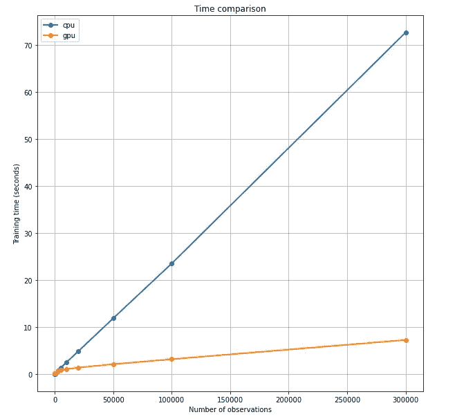

训练行数 vs 训练时间；作者图片

从图中可以清楚地看出，在训练 CPU 模型时增加行数会线性地增加训练时间，而增加 GPU 训练类型的行数会对数地增加训练时间。

```
**log(n) << n for big n.**
```

有趣的是，对于非常小的数据集，CPU 实际上表现得更好:

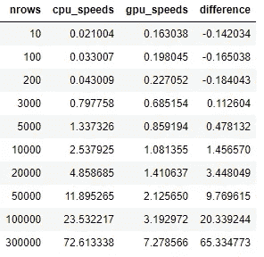

速度表 I；作者图片

这是因为调用 GPU API 进行计算比调用 CPU API 花费的时间更长。当然，实际计算在 GPU 上更快，但是请求的开销使得在小而简单的数据集上，CPU 可能是更好的选择。

完整的伪代码:

第二个有趣的问题是某些超参数值的变化如何影响训练时间？

为此，我们将设置一个 30000 行的随机样本，并且只改变两个超参数: **n_estimators** 和 **max_depth。**

带有拟合速度结果的表尾，按秒差排序:

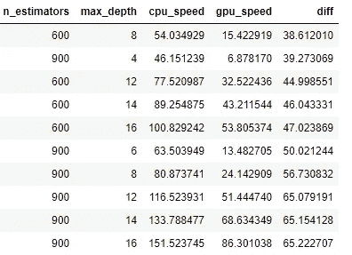

速度表 II；作者图片

一个 3d 表面图，其中 Z 轴是速度差(正值表示 GPU 训练更快的秒数):

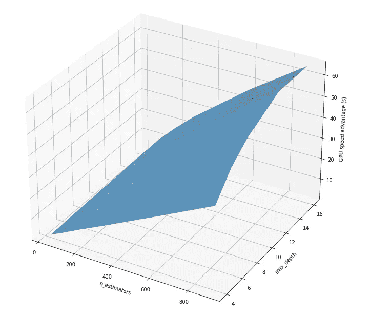

速度差的 3D 平面；作者图片

有趣的是，平面显示增加估计器的数量线性地增加训练时间的差异，增加 max_depth 参数没有线性效应。

代码片段:

总之，根据我的桌面规格，GPU 显著减少了大型 xgboost 模型的训练时间。

使用 GPU 启用 xgboost 模型的训练非常简单——只需将超参数 tree_method 设置为**“GPU _ hist”。**