# 带 AWS Sagemaker 2.20 的 Xgboost '调试器'

> 原文：<https://towardsdatascience.com/xgboost-with-aws-sagemaker-2-20-debugger-41429236f80d?source=collection_archive---------37----------------------->

## **用几行 Python 代码快速简单地获得完整的数据科学分析报告**


由[迈克尔·福塞特](https://unsplash.com/@michaelfousert?utm_source=unsplash&utm_medium=referral&utm_content=creditCopyText)在 [Unsplash](https://unsplash.com/s/photos/lego-paris?utm_source=unsplash&utm_medium=referral&utm_content=creditCopyText) 上拍摄的照片

*文章合著者* *作者:* @bonnefoypy，Olexya 公司 CEO。

D 由于数据量巨大，使用自动化库寻找更快分析的技巧是成为独角兽数据科学家的一个关键优势。AWS sagemaker 提供了各种工具，用于在几行代码中开发机器和深度学习模型。对于任何数据科学家来说，机器学习的过程都是极具挑战性的，包括处理缺失数据、编码数据类型、计算特征之间的关联-相关性、塑造数据结构、选择正确的模型以及为推理进行经济高效的模型部署。在本文中，我们将回顾 AWS‘debugger’的最新版本(Sagemaker 2.20)，该版本使用众所周知的 XGboost 算法，使用少量 python 代码行生成一流的数据科学分析报告。

在本文中，我们将分析成人糖尿病数据集，您可以通过以下代码阅读:

```
import pandas as pd 

 data = pd.read_csv('diabetes.csv')
 data 

 X_display = data.drop('Diabetes', axis = 1)
 y_display= data['Diabetic']display(X_display.describe())
hist = X_display.hist(bins=30, sharey=True, figsize=(20, 10))
```

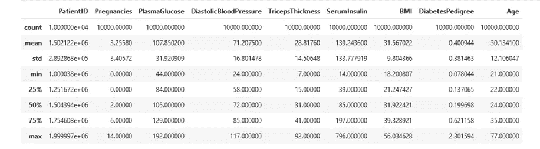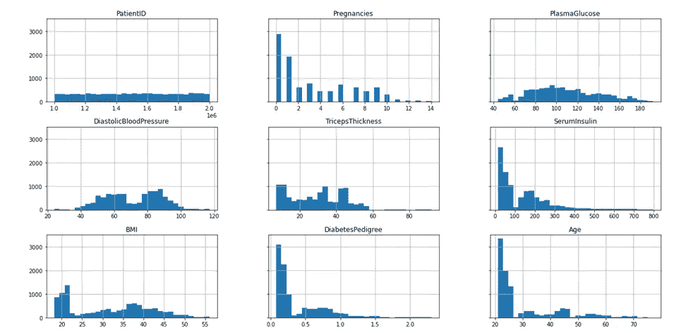

**数据集描述(**图片由作者提供)

我们将数据分为训练集、验证集和测试集，并使用以下代码将其保存到我们的 AWS S3 数据存储中(有关完整的分析，请查看以下网址中的完整代码) :

```
import sagemaker, boto3, osbucket = sagemaker.Session().default_bucket()prefix = "demo-sagemaker-xgboost-diabetes -prediction"boto3.Session().resource('s3').Bucket(bucket).Object(os.path.join(prefix, 'data/train.csv')).upload_file('train.csv')boto3.Session().resource('s3').Bucket(bucket).Object(os.path.join(prefix, 'data/validation.csv')).upload_file('validation.csv')
```

输出:

```
AWS Region: eu-west-3RoleArn: arn:aws:iam::61xxxxxx :role/service-role/AmazonSageMaker-ExecutionRole-eu-west-3-philippe-bouaziz
```

AWS 地区:欧盟-西方-3

role arn:arn:AWS:iam::61 xxxxx:role/service-role/Amazon 管理人员-执行 role-eu-west-3-Philippe-bouaziz

```
from sagemaker.debugger import Rule, rule_configsfrom sagemaker.session import TrainingInputs3_output_location='s3://{}/{}/{}'.format(bucket, prefix, 'xgboost_model')container=sagemaker.image_uris.retrieve("xgboost", region, "1.2-1")print(container)
```

输出:

```
61xxxxxx.dkr.ecr.eu-west-3.amazonaws.com/sagemaker-xgboost:1.2-1
```

我们可以使用各种参数和规则轻松个性化我们的模型，如下面的代码所示:

```
xgb_model=sagemaker.estimator.Estimator(image_uri=container,role=role,instance_count=1,instance_type='ml.m5.large',volume_size=5,output_path=s3_output_location,sagemaker_session=sagemaker.Session(),rules=[Rule.sagemaker(rule_configs.create_xgboost_report())])
```

超参数的设置可以在一个步骤中完成:

```
xgb_model.set_hyperparameters(max_depth = 5,eta = 0.2,gamma = 4,min_child_weight = 6,subsample = 0.7,objective = "binary:logistic",num_round = 1000)
```

最后，我们可以轻松地拟合我们的模型:

```
xgb_model.fit({"train": train_input, "validation": validation_input}, wait=True)
```

输出:

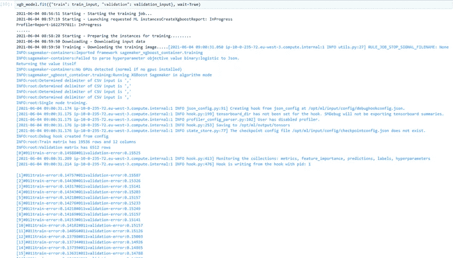

**Xgboost 算法训练和验证错误(**图片由作者提供)

大多数数据科学家声称，真正的工作是从迭代这一步开始的，找到最佳超参数是部署最佳模型的关键。一份清晰的数据科学分析报告可能是成功结果的重要过渡。AWS sagemaker 调试器用如下所示的几行代码提供了两个报告，满足了这一需求:

```
from IPython.display import FileLink, FileLinksdisplay("Click link below to view the XGBoost Training report",FileLink("CreateXgboostReport/xgboost_report.html"))profiler_report_name = [rule["RuleConfigurationName"]for rule in xgb_model.latest_training_job.rule_job_summary()if "Profiler" in rule["RuleConfigurationName"]][0]profiler_report_namedisplay("Click link below to view the profiler report",FileLink(profiler_report_name+"/profiler-output/profiler-report.html"))xgb_model.model_data
```

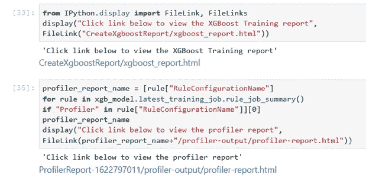

作者图片

**XGboost profiler 报告**

profiler 报告显示每个工作线程(节点)的资源利用率统计信息，例如总 CPU 和 GPU 利用率，以及 CPU 和 GPU 上的内存利用率。该表还显示了数据的描述性统计，包括最小值和最大值以及 p99、p90 和 p50 百分位数。

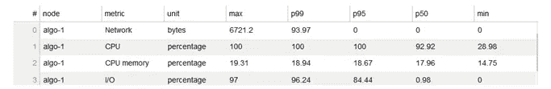

**资源利用统计(**图片由作者提供)

报告的第二部分演示了在培训工作中使用的调试器内置规则的完整概要。最佳参数包括:批量大小、异常值、清晰显示表格中的数据加载器配置，表明数据流中未来的成本效益改进。

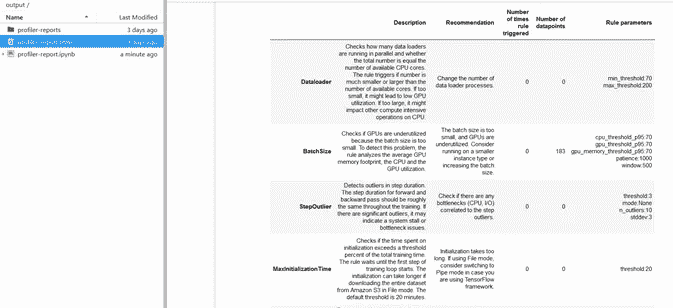

**调试器内置规则参数(**图片由作者提供)

该报告还分析了在训练实例上并行运行的数据加载进程的数量，并将其与核心总数进行了比较。如果该数量少于 70%,则可能会降低数据处理速度，从而导致更高的费用；如果该数量大于 200%,则内核总数可能会降低模型在 CPU 上的性能。

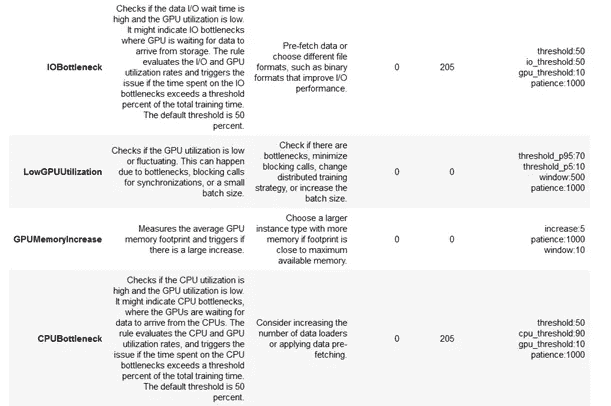

**数据加载流程报告**

更多详情参见本 [**github**](https://github.com/awslabs/sagemaker-debugger) 。

**XGBoost 培训报告**

此报告提供了 XGBoost 模型培训评估结果的摘要、模型性能的见解以及交互式图表。在创建报告的过程中，包括绘图在内的输出会自动保存到 S3，如以下代码所示:

```
# Parameterspath = "/opt/ml/processing/input/tensors"plot_step = 995s3_path = "s3://sagemaker-eu-west-3-xxxx/demo-sagemaker-xgboost-adult-diabetes-prediction/xgboost_model/sagemaker-xgboost-2021-06-04-08-56-51-612/debug-output"
```

该报告包括数据集的真实(目标)标签的直方图。您可以看到目标标签的**分布是否不平衡(用于分类),建议通过生成合成样本、重采样或收集更多数据来校正我们的数据集。该分布还显示了数据集的左偏度或右偏度(用于回归)，建议使用 numpy.log 或 numpy。exp 来减少我们数据的偏斜度。**

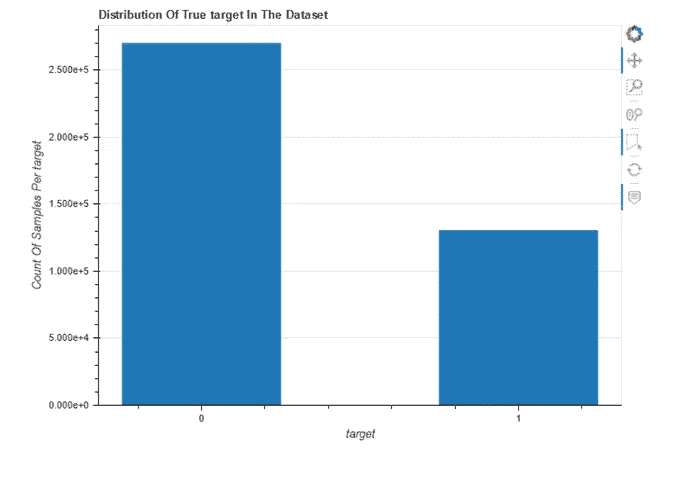

**目标分布**(图片由作者提供)

本报告的另一个重要情节是**特征重要性**。该方法根据输入要素在预测标注变量时的有用程度为输入要素分配分数。对于我们的 Xgboost 算法，考虑了 3 个参数:

**权重**(或频率)是模型中出现的相对特征的百分比。

**增益**是解释每个特征相对重要性的最相关属性。

**覆盖率**通过特征测量观察值的数量。

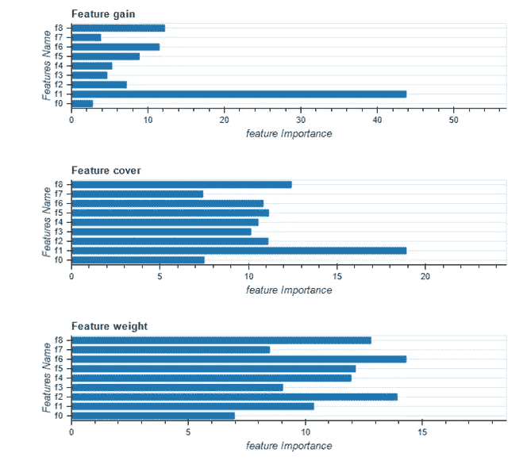

**功能重要性图表(**图片由作者提供)

SageMaker 调试器还描述了 XGBoost 学习任务参数的损失值曲线，更多细节请参考此 [**链接**](https://xgboost.readthedocs.io/en/latest/parameter.html#learning-task-parameters) 。

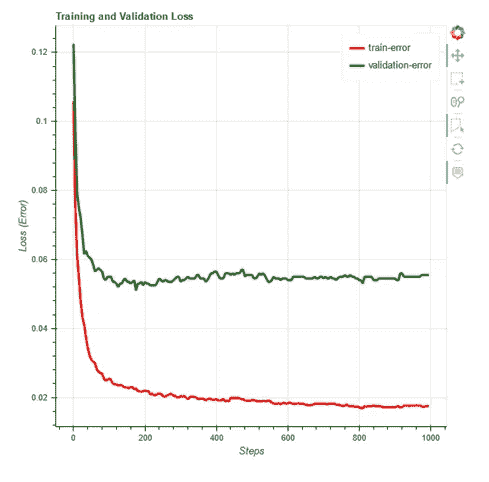

**训练和验证损失曲线(**图片由作者提供)

这些损失曲线给了我们宝贵的见解。如果模型过度拟合，我们的模型会拟合太多的训练数据，这会导致对验证集的负面模型估计。如果模型不合适，则模型参数设置不正确。

对于 Xgboost，如果模型不合适，您可能希望通过增加树的深度(max_depth)、减少正则化参数(lambda，alpha)或者甚至减少 gamma 和 eta 参数来调整参数。如果模型过拟合，您可能希望减少每棵树的深度 max_depth，增加 min_child_weight，甚至增加其他有价值的参数，如 gamma 和 eta、lambda 和 alpha、subsample 和 colsample_bytree。

该报告的另一个关键要素是评估性能指标，如混淆矩阵、精确度、召回率、F 分数和操作特性曲线。如下图所示:

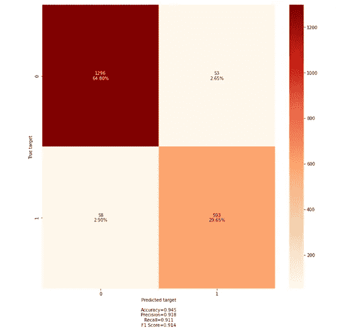

**分类器混淆矩阵(**图片由作者提供)

下面的混淆矩阵显示了分类结果。对角线单元上的真正计数和非对角线单元上的误分类预测数。

包括准确度、精确度、召回率和 F1 得分在内的性能模型得分指标的完整摘要还提供了使用 [**Scikit-learn 指标和评分 API**](https://scikit-learn.org/stable/modules/model_evaluation.html)的功能，如下所示:

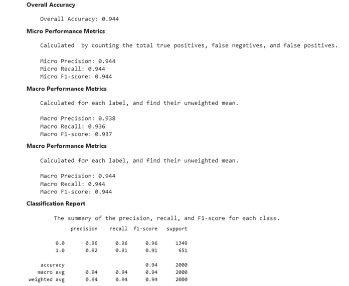

**分类器性能报告(**图片由作者提供)

**接收器工作特性** **曲线**显示了 TPR 与 FPR 的比值以及用于评估二元分类的**曲线下面积(AUC)** 。如果 AUC 值接近 1，则模型性能最佳，否则，如果 AUC 小于 0.6，则意味着模型性能不佳，需要进一步调整参数，甚至改变模型算法。

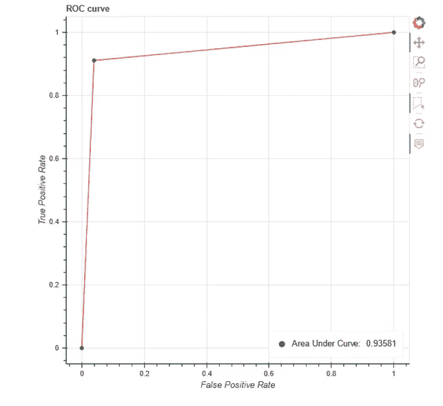

**Roc 曲线(**图片由作者提供)

最后，报告显示了残差直方图的**分布。对于**回归**，直方图应显示一个值为零的良好模型训练的正态分布。对于**分类**，残差显示正确预测计数与错误预测计数的比率。**

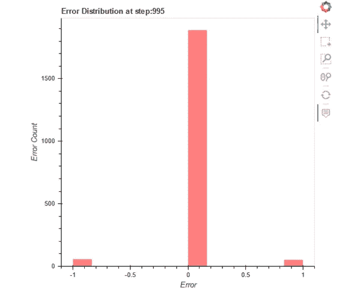

**残差分布(**图片由作者提供)

总之，AWS sagemaker 调试器可从 panda 数据帧轻松生成配置文件报告，为找到模型最佳参数和模型训练的最佳技术条件提供重要见解，这是高效模型训练和部署的重要步骤。

本文是对 AWS Xgboost 调试器和另一个数据集的回顾，仅用于教学目的，所使用的代码已被修改(图表大小、颜色、质量、格式)，仅用于设计目的。有关 SageMaker 调试器的更多信息，请参见 [**SageMaker 调试器 XGBoost、** **训练报告**](https://docs.aws.amazon.com/sagemaker/latest/dg/debugger-training-xgboost-report.html) 和 [**SageMaker 调试器剖析报告**](https://docs.aws.amazon.com/sagemaker/latest/dg/debugger-profiling-report.html) 。