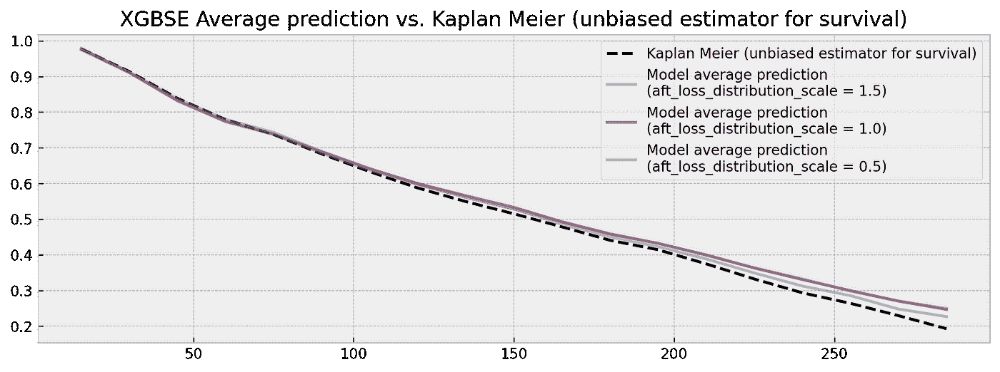

# xgbse:改进 XGBoost 用于生存分析

> 原文：<https://towardsdatascience.com/xgbse-improving-xgboost-for-survival-analysis-393d47f1384a?source=collection_archive---------5----------------------->

## [实践教程](https://towardsdatascience.com/tagged/hands-on-tutorials)

## 介绍 [**XGBoost 生存嵌入(xgbse)**](https://loft-br.github.io/xgboost-survival-embeddings/index.html) ，我们的生存分析包建立在 XGBoost 之上

> “在使用统计建模从数据中得出结论时，有两种文化。假设数据是由给定的随机数据模型生成的。另一种使用算法模型，并将数据机制视为未知。” *—利奥·布雷曼，* [*统计建模:两种文化*](https://projecteuclid.org/euclid.ss/1009213726)

[生存分析](https://en.wikipedia.org/wiki/Survival_analysis#:~:text=Survival%20analysis%20is%20a%20branch,and%20failure%20in%20mechanical%20systems.)是统计学的一个分支，涉及事件持续时间的建模，最重要的是提供工具来处理(而不是简单地丢弃)*删截的*数据，关于持续时间的部分但有用的信息。例如，如果一套公寓在市场上出售 90 天，我们不知道它实际上需要多长时间才能卖出去，但我们*知道*至少花了*90 天(其中 90 天是审查*的*时间)。生存分析对于广泛的应用是有用的，例如预测性维护、客户流失、信用风险、资产流动性风险以及许多其他应用。*

生存分析模型最常见的输出是生存曲线，它显示了一段时间内生存(事件未发生)的累积概率。其他模型可能输出*风险*，它是一个与曲线衰减速度成比例的数字，或者是一个*预期时间*，通过直接优化或对曲线进行数值积分获得。


当我们关心事件预测的时间时，生存曲线可以给我们很多洞察力。图片作者。

在 [Loft](https://a16z.com/2020/01/03/loft/) ，我们是生存分析模型的大用户，因为在巴西寻找新家的旅程相当漫长，沿途有几个里程碑(拜访、报价、契约、翻新等)。特别是，由于 Loft 经营着一家[ibuer](https://www.opendoor.com/w/guides/what-is-an-ibuyer)(利用自有资产购买、翻新和出售公寓)，我们对出售公寓的时间建模很感兴趣，因为持有时间过长是我们面临的最大风险。产生这些估计值的模型用于做出价值百万美元的决策，因此对辨别性能和校准有严格的要求。

因此，我们投入了大量时间探索生存分析包。在我们的探索中，我们发现大多数实现都包含两种文化中的一种:

1.  具有良好统计特性的模型(如校准的生存曲线)，但缺乏表达能力和计算效率
2.  高效且富于表现力的模型，但缺乏一些统计特性(仅产生风险或未校准的预期存活时间— XGBoost 适合此处)

考虑到这个场景，我们开始了一个旅程，将这两种文化结合到一个满足我们需求的包中:[**【xgbse】**](https://github.com/loft-br/xgboost-survival-embeddings)。现在我们正在开源它！

我们选择 XGBoost 作为我们的“基础模型”,因为它的实现高效且易于使用，并利用一些技巧为它添加了很好的统计属性。接下来我们将提供更多关于 XGBoost 缺点和这些技巧的细节。

## XGBoost 生存分析的缺点

XGBoost 实现提供了两种生存分析方法: [**Cox**](https://forecast.global/insight/underrated-in-ml-intro-to-survival-analysis/) 和 [**加速失效时间(AFT)**](https://xgboost.readthedocs.io/en/latest/tutorials/aft_survival_analysis.html) 。当涉及到根据风险(歧视)对个体进行排序时，两者都表现出竞争性能(通过 C-index 衡量，ROC AUC 相当于生存)同时又快如闪电。

然而，当涉及到其他期望的统计特性时，我们可以观察到缺点。具体来说，有三个值得关注的属性:

*   **生存曲线的预测**而不是**点估计**
*   **置信区间的估计**
*   **校准后的**(无偏)预期存活时间

让我们以 AFT 实现为例(因为 Cox 只输出风险，而不输出时间或存活率)。AFT 模型输出的值应该被解释为每个样本的预期存活时间。为了计算这个时间，它假设时间和事件的基本分布，由`aft_loss_distribution`和`aft_loss_distribution_scale`超参数控制。由于他们控制了模型的固有假设，我们预计他们会彻底改变模型的输出。


解释`aft_loss_distribution`和`aft_loss_distribution_scale, the latter represented by the "z" variable in the formulas. Source: [XGBoost AFT documentation](https://xgboost.readthedocs.io/en/latest/tutorials/aft_survival_analysis.html).`影响的表格

为了证实这一点，让我们使用代谢数据集进行一个实验。我们将测试`aft_loss_distribution_scale`的不同值，同时保持`aft_loss_distribution`为`"normal"`，并检查这将如何影响模型性能。我们测试以下值:`[0.5, 1.0, 1.5]`。下面的要点给出了如何运行这个简单实验的粗略想法，但是你可以在这里找到完整的代码。结果非常有趣，如果不是惊人的话:

显示 XGBoost 为不同的超参数输出不同的平均预测时间的脚本，这不是一个理想的统计属性。完整代码[此处](https://github.com/loft-br/xgboost-survival-embeddings/blob/main/examples/how_xgbse_works.ipynb)。

```
aft_loss_distribution_scale: 1.5
C-index: 0.645
Average predicted survival time: 203 days
----
aft_loss_distribution_scale: 1.0
C-index: 0.648
Average predicted survival time: 165 days
----
aft_loss_distribution_scale: 0.5
C-index: 0.646
Average predicted survival time: 125 days
----
```

在所有这三种情况下，我们都可以建立 C 指数结果接近最先进水平的模型[8]。然而，我们的预测变化很大，两个模型显示平均预测存活时间相差 78 天。如果我们分析的是单一样本，这种差异或许是可以理解的。但是，我们正在查看完整的验证数据集，无论我们使用哪种模型，平均预测都应该相当稳定。

如果我们将这些结果与 Kaplan Meier 等无偏生存估计量一起绘制，我们可以检查到，对于`aft_loss_distribution_scale`中的`0.5`的每一步，我们在曲线中大约向右移动了十分之一。此外，我们没有看到完整的生存曲线:XGBoost 只输出时间点的事件预测(也没有置信区间)。


Vanilla XGBoost 输出对超参数过度敏感的预测，这阻止了它在对存活曲线校准敏感的应用上的使用。图片作者。

鉴于这些结果，我们提出了一个问题:“我们应该相信什么模型？”。虽然我们可以尝试优化一些误差指标，如 L1 损耗[9]，但我们希望为依赖于稳定和校准的事件时间估计的应用提供更多保证。只有点估计，没有置信区间，没有“设计校准”,会损害信任，阻碍生存分析模型的生产。

## 通过将 XGBoost 用作特性转换器来改进它

虽然需要扩展以获得更好的统计属性，但 XGBoost 无疑是一个强大的工具。C-index 结果表明，该模型具有很好的区分性能，可以与最先进的技术相媲美。我们只需要调整我们如何使用它。

除了用于预测任务之外，梯度提升树(gbt)还可以用作输入数据的*特征转换器。集合中的树在区分目标的特征上执行分裂，在它们的结构中编码相关信息。特别地，集合中每棵树的终端节点(叶子)定义了一个非常漂亮的输入数据的<http://scikit-learn.org/stable/auto_examples/ensemble/plot_feature_transformation.html>****【嵌入】*** 。**

****

**我们可以从像 XGBoost 这样的森林模型中提取特征，将原始的特征空间转换为“叶子出现”嵌入。橙色节点表示集合中单个样本的路径。图片作者。**

**这种 ***树系综嵌入*** 具有非常方便的性质:**

1.  ****稀疏和高维:**树处理非线性并将原始特征投射到稀疏的高维嵌入中，这有助于线性模型在其上训练时表现良好。例如，在嵌入上训练的逻辑回归(具有独热编码叶指数的特征)可以显示与实际集合相当的性能，具有概率校准的额外好处(参见[1]、[2]和[3])**
2.  ****监督:**树也起到了噪音过滤器的作用，只通过具有预测能力的特征进行分割。因此，嵌入实际上具有比输入数据更低的固有维数(见[4])。这减轻了维数灾难，并允许在嵌入(使用汉明距离)上训练的 kNN 模型具有与实际集成相当的性能。有了邻近集，我们可以使用稳健的估计量，如 Kaplan-Meier 来进行预测。**

**这两个属性是我们构建 xgbse 的基础。接下来我们将展示如何充分利用它们。**

## **逻辑回归、时间窗、嵌入作为输入**

**我们的第一种方法`XGBSEDebiasedBCE`，灵感来自于[5]中的多任务逻辑回归方法、[6]中的 BCE(二元交叉熵)方法以及[1]、[2]和[3]中的概率校准思想。**

**它包括在潜在的 XGBoost 模型产生的嵌入基础上训练一组逻辑回归，每个回归在不同的用户定义的离散时间窗口预测存活率。分类器在审查时删除个体，目标是每个窗口的存活指标。**

**因为嵌入是稀疏的和高维的，所以线性模型实际上可以*提高*整体性能，同时还向其添加了良好的统计属性，例如概率校准(因为逻辑回归是通过设计来校准的)。**

****

**`In XGBSEDebiasedBCE we stack several logistic regressions on top of XGBoost, which is used as a feature transformer. Each logistic regression predicts survival at different user-defined time windows. The predictions are then composed to form a survival curve.` 图片作者。**

**由于删除了被审查的个体，这种简单的方法倾向于给出有偏差的生存曲线。因此，我们做了一些调整，使得逻辑回归估计了[卡普兰-迈耶公式](https://www.math.wustl.edu/~sawyer/handouts/greenwood.pdf)中的`di/ni`项(点概率),然后使用 KM 估计量来获得几乎无偏的生存曲线。**

**通过这种方式，我们可以从 XGBoost 中获得完整的生存曲线，以及稍加修改的置信区间(比如执行几轮 bootstrap)。逻辑回归模型的训练和评分是高效的，通过`joblib`并行执行，因此模型可以扩展到数十万或数百万个样本。**

## **Kaplan-Meier 关于最近邻**

**正如上一节所解释的，尽管 XGBoost 产生的嵌入是稀疏的和高维的，但它的固有维数实际上应该低于输入数据。这使得我们能够将 XGBoost“转换”成最近邻模型，其中我们使用汉明距离来定义与在系综终端节点处最常同时出现的元素相似的元素。然后，在每个邻集，我们可以用稳健的方法得到生存估计，如 Kaplan-Meier 估计。**

****

**在 XGBSEKaplanNeighbors 中，我们在作者的`of XGBoost, which is used as a feature transformer. We use hamming distance to build neighbor-sets. At each neighbor-set a KM estimator is executed to get a survival curve.` 图片上叠加了一个 kNN 模型。**

**我们建议使用`dart`作为助推器，以防止任何树在集合中支配方差，并打破叶共现相似性逻辑。我们构建了一个高性能的 KM 估计器实现，以矢量化的方式计算几条存活曲线，包括基于指数 Greenwood 公式的上下置信区间[7]。**

**然而，由于最近邻搜索，在训练(构建搜索索引)和评分(实际搜索)上，这种方法在数十万样本的规模上可能非常昂贵。**

## **一棵树，树叶上有卡普兰-迈耶**

**作为对`XGBSEKaplanNeighbors`的简化，我们还提供了一个单一的树实现。我们没有进行昂贵的最近邻搜索，而是通过 XGBoost 拟合一棵树，并计算其每片叶子的 KM 曲线。**

****

**我们使用 vanilla XGBoost 实现来拟合一棵树，并对它的每一片叶子执行一条 KM 曲线，而不是使用默认的预测。图片作者。**

**这是迄今为止最有效的实现，能够轻松扩展到数百万个示例。在拟合时，树被构建，并且所有 KM 曲线被预先计算，因此在评分时，简单的查询将足以获得模型的估计。**

**然而，由于我们拟合的是一棵树，预测能力可能会更差。这可能是一个明智的权衡，但我们也提供了`XGBSEBootstrapEstimator`，一个引导抽象，我们可以在其中安装一个`XGBSEKaplanTree`森林来提高准确性和减少差异。**

## **它解决问题了吗？**

**现在我们回到第一个例子，看看`XGBEmbedKaplanNeighbors`表现如何:**

```
**aft_loss_distribution_scale: 1.5
C-index: 0.640
Average probability of survival at [30, 90, 150] days: [0.9109, 0.6854, 0.528]
----
aft_loss_distribution_scale: 1.0
C-index: 0.644
Average probability of survival at [30, 90, 150] days: [0.9111, 0.6889, 0.5333]
----
aft_loss_distribution_scale: 0.5
C-index: 0.650
Average probability of survival at [30, 90, 150] days: [0.913, 0.6904, 0.5289]
----**
```

**根据 30 天、90 天和 150 天的平均存活概率来衡量，该模型显示出良好的结果，具有可比性的 C 指数结果和预测非常接近并且独立于`aft_loss_distribution_scale`选择。从视觉上看，平均模型预测与 Kaplan Meier 的比较产生了更好的结果:**

****

**XGBSE 输出一个完整的生存曲线，它比普通的 XGBoost 稳定得多，它的平均预测相当接近无偏的 KM 估计量。图片作者。**

**偏差小得多，完整的生存曲线和稳定性！虽然说这个问题已经解决太苛刻了，但我们相信我们可以建立一个强大的生存分析包，使“两种文化”更加接近。**

## **你自己试试吧！**

**XGBoost 生存嵌入在几个生存分析[基准](https://loft-br.github.io/xgboost-survival-embeddings/benchmarks/benchmarks.html)中显示了很好的结果，在大多数情况下胜过普通的 XGBoost 和参数方法。它可通过 pip 安装，并与 scikit-learn 兼容。还有更多的功能可以尝试，比如置信区间、生存曲线的外推、通过原型的可解释性、度量等等。我们致力于在未来改进 lib 并添加新内容。**

**更多详情，请查看 [github](https://github.com/loft-br/xgboost-survival-embeddings) 上的库、[文档](https://loft-br.github.io/xgboost-survival-embeddings/index.html)和[示例](https://github.com/loft-br/xgboost-survival-embeddings/tree/main/examples)！我们邀请社区做出贡献。请试用它，报告错误，并让我们知道你的想法！**

**由[达维·维埃拉](https://www.linkedin.com/in/davivieirab/)、[古伊列梅·马梅罗拉](https://www.linkedin.com/in/gdmarmerola/)、[加布里埃尔·希门尼斯](https://www.linkedin.com/in/gabriel-gimenez-b8b010140/)和[熊伟·埃斯蒂玛](https://www.linkedin.com/in/vrcestima/)拍摄。**

## **参考**

**[1] X. He、J. Pan、O. Jin、T. Xu、B. Liu、T. Xu、Y. Shi、A. Atallah、R. Herbrich、S. Bowers 和 J. Q. Candela。[预测脸书广告点击量的实践经验](https://research.fb.com/wp-content/uploads/2016/11/practical-lessons-from-predicting-clicks-on-ads-at-facebook.pdf) (2014)。第八届在线广告数据挖掘国际研讨会论文集(ADKDD'14) *。***

**[2] [用系综树进行特征变换](https://scikit-learn.org/stable/auto_examples/ensemble/plot_feature_transformation.html)。sci kit-在[https://scikit-learn.org/](https://scikit-learn.org/)学习文档。**

**[3] G .马尔梅罗拉。[基于树的模型的概率校准](https://gdmarmerola.github.io/probability-calibration/)。在[https://gdmarmerola.github.io/](https://gdmarmerola.github.io/)的个人博客。**

**[4] G .马尔梅罗拉。[使用 RFs 和 UMAP](https://gdmarmerola.github.io/umap-supervised-embeddings/) 监督维度缩减和大规模聚类。https://gdmarmerola.github.io/的[个人博客。](https://gdmarmerola.github.io/)**

**[5] C .于，r .格雷内尔，h .林，v .巴拉科斯*。* [将患者特异性癌症存活分布作为一系列因变量](http://www.cs.cornell.edu/~cnyu/papers/nips11_survival.pdf)进行学习。神经信息处理系统进展 24 (NIPS 2011)。**

**[6] H .克瓦梅。博根。[行政审查下的 Brier 评分:问题与解决](https://arxiv.org/pdf/1912.08581.pdf)。arXiv 预印本 arXiv:1912.08581。**

**[7]索耶。[生存分析中的格林伍德和指数格林伍德置信区间](https://www.math.wustl.edu/~sawyer/handouts/greenwood.pdf)。圣路易斯华盛顿大学网站上的讲义。**

**[8] H .克瓦梅。博根和我.谢尔。[使用神经网络和 Cox 回归进行事件时间预测](https://jmlr.org/papers/v20/18-424.html)。机器学习研究杂志，20(129):1–30，2019。**

**[9] H .海德尔、b .赫恩、s .戴维斯、r .格雷内尔。[建立和评估个体生存分布的有效方法](https://arxiv.org/pdf/1811.11347.pdf)。机器学习研究杂志 21(2020)1–63。**