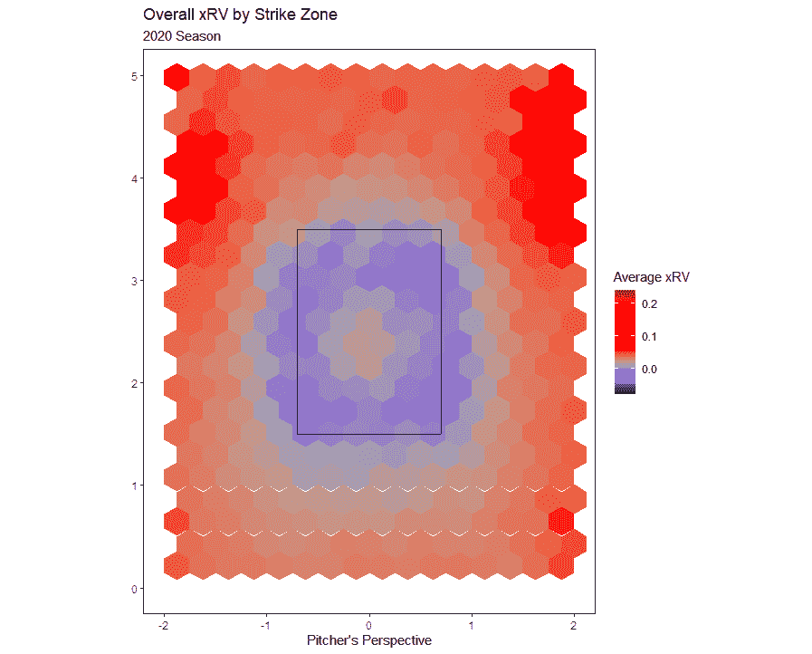
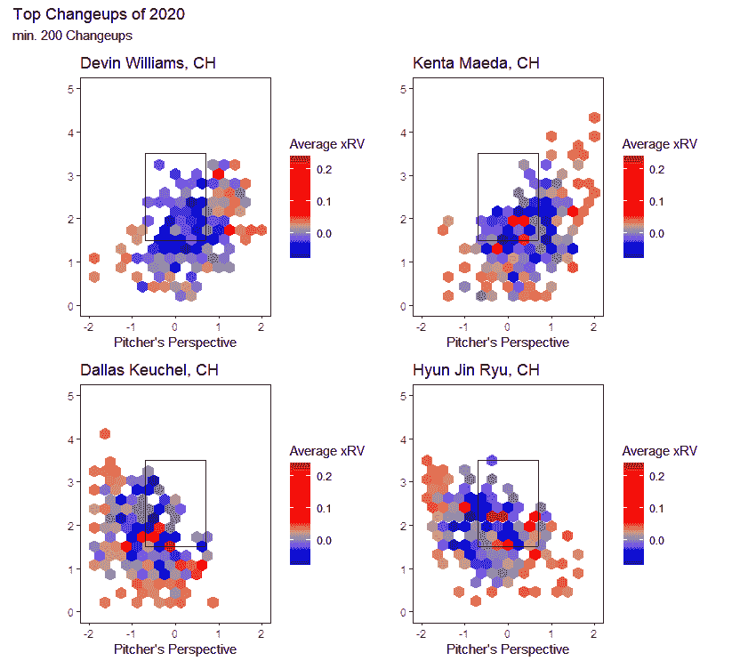
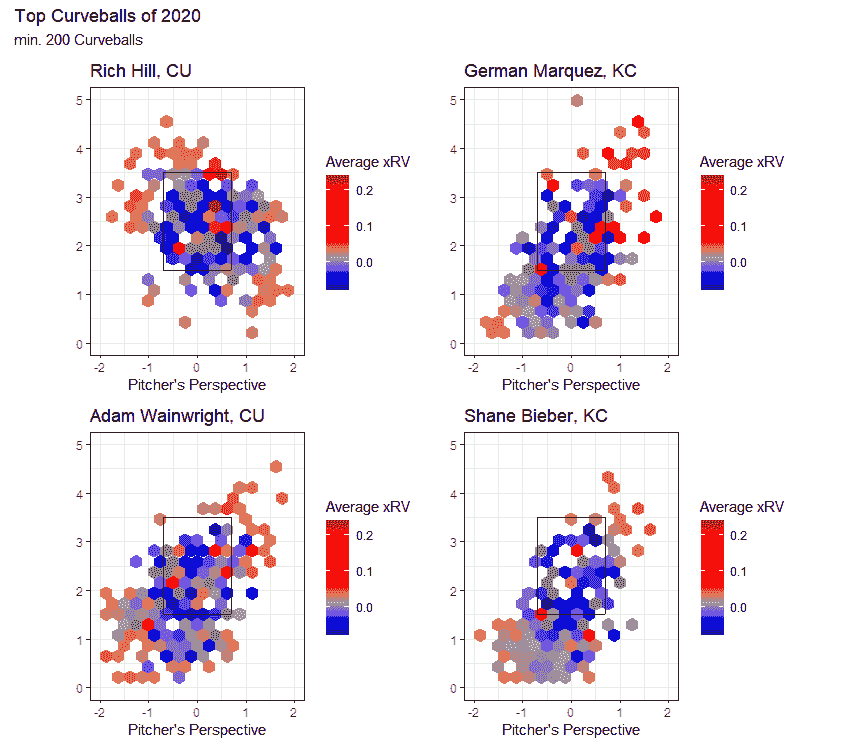
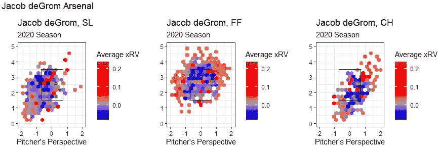
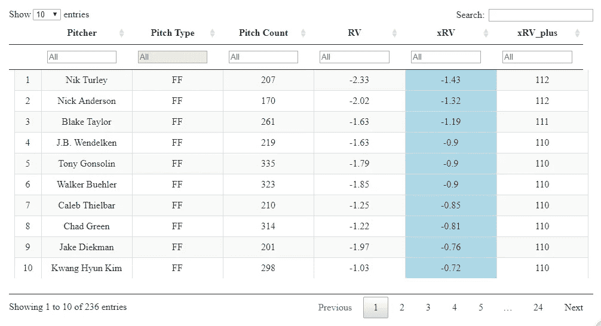
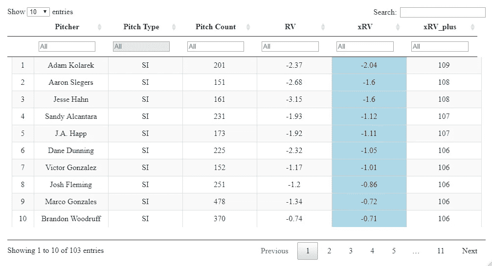
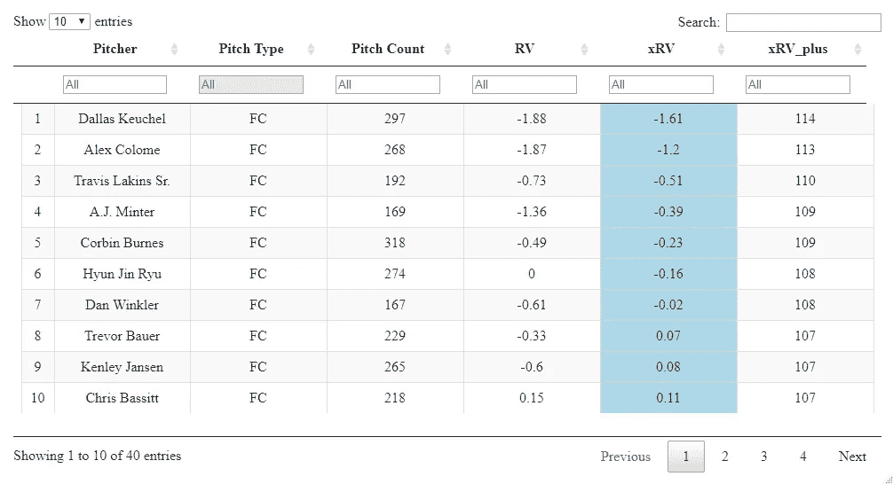
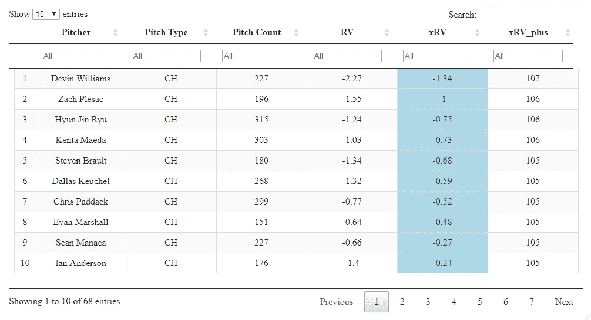
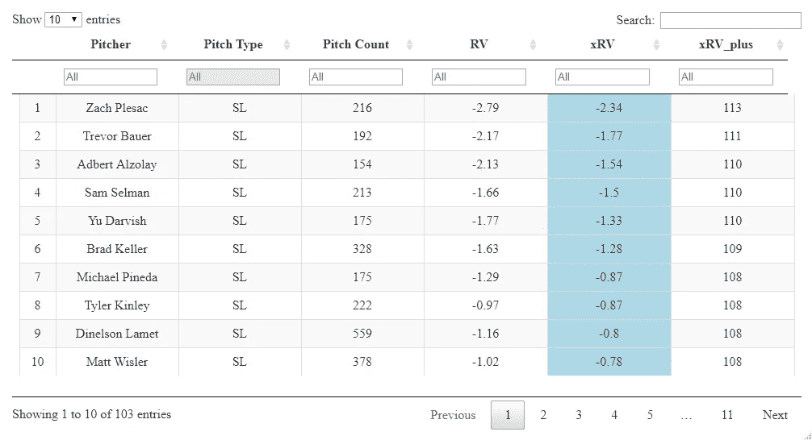
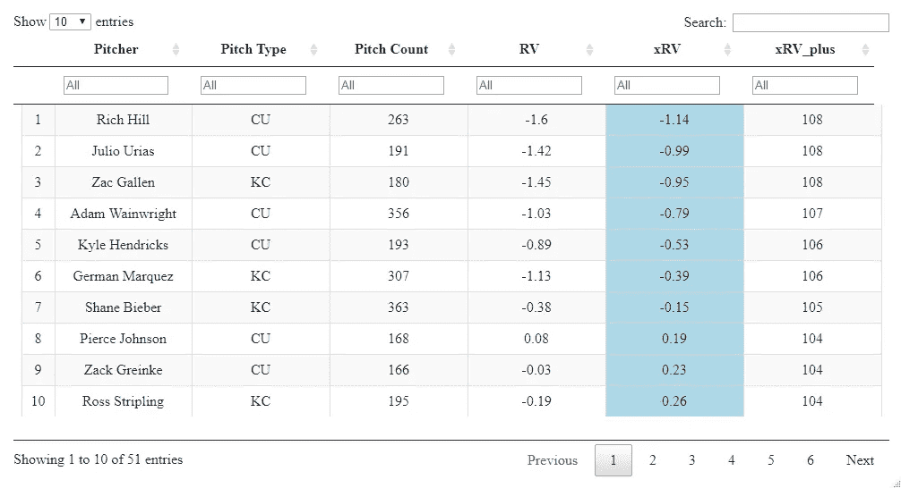

# xRV 3:最终更新

> 原文：<https://towardsdatascience.com/xrv-the-final-update-cb7b09192ace?source=collection_archive---------47----------------------->

整个夏天，我都在这个博客上记录我试图为 MLB 球场创建一个球场水平运行值估计器，这将是我在可预见的未来的最后一次更新。本文介绍了我是如何做到这一点的，然后深入分析了我为提高我的球场水平预期跑分值指标所采取的步骤。最后，我提供了一些有趣的分析、图表和排行榜。

同样，我在这里向公众公开我的这个项目的所有可复制代码。

*关于 xRV 的兄弟指标 QOS+的信息在本文的底部。*

# 回顾:以前的迭代

## **1.0 版本:KNN 惨败**

今年 3 月，我写了我第一次尝试量化 2019 赛季 MLB 每场比赛的好坏。为此，我使用了一个名为 K-最近邻回归器的模型，其中该赛季的每个球场都被赋予了 2019 年以来 100 个最相似球场的平均运行值。当把每个投球的预测值加起来时，好的投手往往得分高，差的投手往往得分低。

[我就此写了一篇文章，](https://medium.com/something-tangible/pitch-quality-2-estimating-war-aeda0fc0b7e3)相信这是我的模型相当不错的证据。直到最近，在 Nick Wan 的 Twitch stream 上，我才知道几乎每一个音高标准(好的或坏的)都会很好地聚合。这一指标的最终 RMSE 为 0.22，与 2019 年的 pitch run 值的标准差相同。换句话说，这个模型一点也不好。

这可能是因为 KNN 对于这类问题不是一个非常健壮的模型类型，我做了零特征选择或模型验证，这是模型建立过程中两个非常重要的步骤。于是，9 月份又试了一次。

## **2.0 版本:专利克星**

在我的下一个版本的音高质量标准中，我确保一丝不苟地记录我的所有步骤，并公开代码以增加问责。以防这个模型和 1.0 版本一样糟糕，我想更快地得到反馈。在这个用 2020 年的数据创建的模型中，我转向使用随机森林，这是一种更适合这种非线性数据的非参数模型类型。每一个投球手都被 16 个模型中的一个预测，这些模型是针对该投球手的投球类型组(快速球或非快速球)和排分裂(RvR、RvL、LvL、LvR)的。

2.0 版是 1.0 版的客观改进，因为最终 RMSE 从 0.22 下降到约 0.14。作为一名分析师，我也有所提高，这一次是执行特性选择和验证，并且通常有一个更合理的模型构建过程。然而，代码效率很低，为了节省运行时间，我不得不将音高分成 2 组，而不是通常的 7 或 8 组。我这个项目的代码张贴在[上面](https://github.com/ethanmoore21/PitchQuality/blob/master/qop_3_rfs.R)，所以你可以自己决定是否同意我的自我评估。

在制作 2.0 版本时，我学到了很多关于模型构建过程的知识，这也是这个项目对我的价值所在。尽管如此，我知道还有一些需要改进的地方，这在我的脑海里已经有一段时间了。进入 3.0 版本。

# 最终模型:版本 3.0

这个模型比前两个版本做了一些关键的改进。也就是说，我为六个音高类型组(FF，SI，FC，ch，SL，CU)中的每一个都创建了模型，而不是仅仅两个(FB，非 FB)，这要归功于更高效的代码(函数！！！).能够为每个音高类型而不是宽泛的音高类型组选择特征极大地提高了 RMSE 模型的性能。

我将按照传统的数据科学工作流程对这一版本进行分解，涉及数据获取、数据清理和特征创建、特征选择、模型创建、模型验证、结果以及一点分析。

## 数据采集

我使用比尔·佩蒂的 [baseballr](http://billpetti.github.io/baseballr/) 包和 scrape_statcast_savant()函数获取了这个项目的所有数据，获得了 2020 赛季的每一场比赛。(其他季节的数据也可以，但我没有计算能力来预测多个季节。)这给了我一个超过 250，000 个观察值和每个观察值的大约 90 个变量的数据集。非常感谢[baseballsavant.com](https://baseballsavant.mlb.com/statcast_leaderboard)将这些数据公之于众，让这个项目成为可能。

## 数据清理和特征创建

创建音调级质量度量的最大问题是找到一个好的响应变量。我看到过一些类似的指标试图预测摇摆罢工的概率，或者试图预测 [CSW%](https://www.pitcherlist.com/csw-rate-an-intro-to-an-important-new-metric/) 。从一开始，我就想预测跑垒得分，即每一次投球的平均跑垒得分。不出所料，这个指标并不容易获得，所以我在[关于线性权重的 Fangraphs 词汇表帖子](https://library.fangraphs.com/principles/linear-weights/)的帮助下自己计算了一下。

这个项目的这一部分大部分是从我以前做的项目中截取的，我以前做的项目专注于推导本赛季每个投球的跑分值。在这里，我做了几个重要的选择，例如，把导致保送的投球视为具有球的价值(不是保送),把导致三振的投球视为具有好球的价值。这些选择是风格上的，可以挑剔或容易调整。

除了创建我的响应变量 Run 值之外，我还创建了几个名为 velo_diff、hmov_diff 和 vmov diff 的新变量，它们代表每个非快速球投球的速度、水平移动和垂直移动与投手快速球平均值的差异。这些变量只考虑了非快速球模型。

注意:在整个过程中，我使用六个音高类型组。这些是四缝线快速球(FF)、伸卡球(Si)、切球(FC)、变速球(包括标记为变速球 ch 和分裂球 FS 的球)、滑球(SL)和曲球(标记为曲球 CU 或指节曲线球 KC 的球)。从哲学上讲，使用 MLBAM 音高分类让我有点痛苦，但我认为在这种情况下是没问题的。其他投球类型，如关节球、投球和投球出局都被删除。

最后，我删除了重要列中缺少值的行(这只是几百个观察值),并翻转了一些左手投手的测量值，使其与右手投手的测量值在相同的范围内。

## 特征选择

作为棒球迷和分析师，我们知道，使一个球场有价值或没有价值的方面可能会因球场类型而有很大不同。因此，在决定在我们的模型中使用哪些功能时，将音高类型考虑在内非常重要。我创建了一个函数来告诉我哪些特性对预测运行值最重要(使用 Boruta 算法)。以下是非快速球的代码:

```
Boruta_PitchType <- Boruta(lin_weight ~ release_speed + release_pos_x_adj + release_extension + release_pos_z + pfx_x_adj + pfx_z + plate_x + plate_z + release_spin_rate + release_spin_direction + velo_diff + hmov_diff + vmov_diff, data = rr_data_sampled)
```

然后，我将我的数据帧分成六个，每个音高类型组一个，并对每个音高类型特定的数据帧运行该函数，存储结果以备后用。

```
#Fastballs- 4 Seam
ff_data <- season_mlb5%>%
  filter(pitch_type == "FF")FF_features <- feature_selection(ff_data)
```

## 模型创建

现在我们知道了我们将使用哪些变量来模拟运行值，我们需要一个模型！该指标的 2.0 版使用随机森林，3.0 版也是如此。我尝试使用极端的梯度增强，但是最初的 XGBoost 模型并没有比 2.0 版本更好，所以我坚持使用随机森林。

我创建了一个函数，它接受一个数据框和一组要素作为输入，并拟合一个随机森林模型，返回模型本身作为输出。

```
rf_model <- function(df, features) {

  features1 <- append(features, c("lin_weight"))
  df1 <- df[,features1]

  randomForest(lin_weight ~ ., data = df1, importance = T)

}
```

## 模型验证

接下来，我创建了一个函数来验证这些模型。该函数将输入数据集随机分为训练集(70%)和测试集(30%)，拟合投手和击球手排(LvL、LvR、RvL、RvR)的每个组合的数据模型，将模型预测应用于测试集，并输出 RMSE。我对每个特定音高类型的数据帧运行了这个验证函数，总共创建了 24 个随机森林模型。

```
ff_w_preds_val <- validate(ff_data, FF_features)
```

每个音调类型特定数据帧的验证 RMSE 在 0.08 和 0.11 之间，这意味着每个游程值预测偏离其实际游程值平均 0.08 到 0.11 个游程。在理想情况下，我会在这里使用 K 重交叉验证，而不是每个模型只验证一次。然而，当我运行代码时，这些值几乎总是在这个范围内，交叉验证将花费比我愿意花费的更多的时间。

当我将所有的测试数据聚集回一个数据集时，我的总验证 RMSE 大约是 **0.10 次运行**，这与 2.0 版本的验证 RMSE 非常相似。看起来不错。

## 结果

这里的最后一步是在 2020 年将模型应用于所有球场。同样，我创建了一个函数来做这件事，大大降低了这一步的运行时间！我将每个音高类型特定的数据帧和来自特征选择步骤的相应特征列表传递到函数中，并获得最终预测。

```
ff_w_preds <- application(ff_data, FF_features)
```

预测的总聚合 RMSE 也大约为 **0.10 次**。2.0 版本的最终 RMSE 约为 0.14，因此相比之下，我对 3.0 版本的性能提升感到满意。最后，我将预测重新加入到原始数据框架中进行分析。

## 分析

除了排行榜，我马上会讲到，我可以用这些预测制作一些有趣的图表。第一个是简单的预测图(称为预期运行值或 xRV ),绘制在走向区域的十六进制图上:



很明显，蓝色意味着该区域的球场有一个对投手有利的负 xRV，而红色六边形有一个对进攻有利的正 xRV。看到好球带内的球对投手团队来说是典型的好球是很酷的，中中球比好球带外的球要好！

我把这个图分解成特定的投手和感兴趣的投手类型(感谢 patchwork 和 stat_summary_hex()函数！)，喜欢变速球最好的投手…



…和弧线球…



…2020 年。对于像雅各布·德格罗姆这样的个人投手来说，情况也是如此。



**排行榜**

我知道一些读者只是想知道谁在这个指标上表现得好，所以这里有一些排行榜。我不认为我能把这些表格嵌入到 Medium 中，所以享受这些截图吧！在这里，我还包括一个称为 xRV+的 xRV 重新标度，其中 100 是该音高类型的平均值，每增加 10 点(110 xRV+)就是平均值以上的一个标准差。请记住，xRV 是一个速度统计，当汇总到投手或投球类型等级时，意味着单位是“每 100 次投球允许的得分”

**解读示例:**“尼克·特利的快速球的 xRV 为-1.43 分，所以我们预计他平均每 100 个快速球阻止了 1.43 分。”

*所有排行榜都是 min。150 个音高。*

2020 年最佳快速球:



2020 年最佳下沉球:



2020 年最佳刀具:



2020 年最大变化:



2020 年排行榜:



2020 年最佳曲线球:



## 限制

我了解到自我评估在研究领域和一般情况下非常重要，所以下面是我对这个模型不足之处的想法。

1.  有人告诉我，这个问题通常最好用极端梯度推进模型来解决。如果我有更多的时间，我会喜欢尝试这种方法，并与这个版本进行比较。可能是一个很好的改进机会。
2.  我有点担心这个模型有点过度拟合，因为最终的 RMSE 和验证的 RMSE 基本上是一样的。虽然我知道使用随机森林很难过度拟合，但我认为这种“切片和骰子”的方法(24 种不同的模型！)可能就是这么做的。
3.  我希望我能使用更多季节的数据。我的计算能力限制了这种可能性，但有一些方法我没有考虑到，直到为时已晚。我希望能够评估 xRV 每一季的“粘性”,以及这一指标从一年到下一年的预测性。这可以帮助我解决我对过度合身的怀疑！
4.  我认为一个单一的模型会更加简洁，运行速度更快，所以如果有人可以复制这种方法的结果，我会很乐意找到它。
5.  早些时候，我决定让这个模型“上下文无关”，在我创建的 response 列中不考虑比赛的比赛情况(例如，0–0 和 0–2 的全垒打具有相同的重量，满垒和空垒的全垒打具有相同的值)。我想知道我是否应该在某个时候将上下文折叠回去，使这个度量标准在现实生活中更适用。

总的来说，我认为这个项目有很大的改进空间。我不期望愿意或能够将这个项目进行得更深入，但希望通过写这篇文章并在这里提供我的代码，我可以成为下一个想尝试这个项目的人的出发点！

再次，我的这个项目的代码库可以在这里找到。

## 补充视频

我制作了一个视频，在那里我找到了 xRV 的一些最好和最差的投手投球和个人投球，并用 baseballsavant.com 以一种更有趣和非正式的形式做了一些现场分析。那个环节就是[这里的](https://youtu.be/Rcx8TsCjxBs)！

## 关于 QOS+的说明:

本赛季，Eno Sarris 在《The Athletic》上发表的几篇文章中使用了 xRV 的一个兄弟指标，名为 Quality of Stuff Plus (QOS+)。除了本文详细介绍的对 xRV 的改进，QOS+也做了后续的(和类似的)调整。这些指标之间有一些关键的差异，但最相关的一点是 QOS+在其预测中不考虑沥青的板位置。对于 QOS+的任何未来使用，预计这些变化将得到反映。