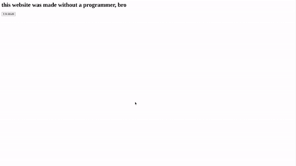

# 是的，人工智能会取代你的工作。

> 原文：<https://towardsdatascience.com/yes-ai-will-take-your-job-7edcb18a1ac0?source=collection_archive---------23----------------------->

## 意见

## 对不起，但这是真的。


马丁·克劳森在 [Unsplash](https://unsplash.com?utm_source=medium&utm_medium=referral) 上的照片

> *“骄傲的人总是俯视一切……只要你在俯视，你就看不到高于你的东西。”— C.S .刘易斯*

人类是骄傲的。

我们认为人类的智力是最高的，因此嘲笑人工智能，甚至嘲笑它令人难以置信的智力和创造力。

AI 可以[用任何语言](/will-gpt-3-kill-coding-630e4518c04d)编码，做出令人惊叹的艺术(我们会深入探讨)，用特斯拉的全自动驾驶比我们开得更好。这些都是去年的进步。

认为人工智能最终不会比你做得更好是纯粹的骄傲，或者是对指数增长的无知。

# 指数改进

人工智能生成器——无论是文本、艺术、代码还是音乐——曾经是古怪、有趣的小工具，产生你在左边看到的东西(一个到处都是眼睛和狗脸的发烧梦怪物)。现在，你可以告诉 AI 画一个想法(例如，“鳄梨形状的扶手椅”)，它会立即画出创造性的功能性艺术。

[文案。AI](http://copyist.ai) 是我发现的基于 OpenAI 的 GPT-3 的许多最新产品之一，它使用该技术来生成营销文案，包括广告、增长想法、文章大纲和 SEO 优化。上面右边的艺术是由 [DALL-E](https://openai.com/blog/dall-e/) 制作的，它还没有对公众开放(在 OpenAI 团队之外)。)然而，公开的是文本生成(比如文章标题、广告文案、营销理念等等。)我向 GPT 3 频道询问了关于“人工智能失业”的文章标题想法，以下是我立刻得到的结果:

*   “机器人的崛起和工作岗位的减少:人工智能将如何影响经济”
*   “机器会来抢你的工作”
*   "当机器人取代人类时，劳动力会发生什么变化？"

无论你是一名程序员、插画师、广告文案、优步司机、工厂工人……或者，嗯，任何事情，不需要太多想象力就能看到人工智能在某个时候取代你的工作。

除了自傲，人类在理解指数增长方面也是出了名的糟糕。这就是为什么新冠肺炎让世界大部分地区感到惊讶，尽管专家们认为这一天即将到来。1 个病例变成 2 个，4 个，8 个，在你知道之前，将近 1 亿人(截至发稿时)已经或曾经患有新冠肺炎。

人工智能是指数增长的另一个例子，它从小到大，无足轻重，到目前在许多方面与人类不相上下或超过人类。很快，人工智能将比我们聪明几十亿倍。

# 长期思考

对于指数增长函数，很难想象长期的未来会是什么样子——但这是不可避免的，所以我们至少应该考虑一下。

许多人认为在短期或中期内，人工智能*创造就业*可能会实际发生，但当考虑更大的时间范围时，这真的无关紧要(不仅仅是工厂自动化的人工智能——而是我们上面探索的一些内容，如设计、营销和编码)。

从 1990 年到 2007 年，工厂自动化已经导致美国失去了 [40 万个](https://time.com/5876604/machines-jobs-coronavirus/)工作岗位。到 2025 年，将有 200 多万个制造业岗位被自动化淘汰。

但美国不是一个制造业经济体，而且很长一段时间以来都不是。不到 1300 万美国人受雇于制造业，而大约 6000 万美国人是知识工作者——在设计、营销、编码等领域。

在全球范围内，预计到 2030 年，自动化将取代多达 [8 亿个工作岗位](https://www.mckinsey.com/featured-insights/future-of-work/jobs-lost-jobs-gained-what-the-future-of-work-will-mean-for-jobs-skills-and-wages)，但即使是这些估计也在很大程度上没有考虑到最近的进步，如 GPT-3、DALL-E，以及对这些模型进行许多数量级改进的必然性。

# 解决异议

考虑到人们对人工智能优越性和人工智能导致的失业的许多反对意见，这是很有趣的。我已经提到骄傲和无知导致许多人批评 AI，但是让我们仔细看看。

在一篇名为《[最新的 AI 会杀死编码吗？](/will-gpt-3-kill-coding-630e4518c04d)”其中一条顶级评论是这样说的:

> *“程序员需要提供一个例子。”*

这是一个无法理解指数增长的例子，因为 AI 自然会改进到不需要例子来创建代码的地步。事实上，*自从 6 个月前的那条评论*以来，它已经走到了那一步。GPT-3 " [指令系列](https://www.reddit.com/r/GPT3/comments/kiym80/a_new_gpt3_modelengine_called_the_instructseries/)"支持生成文本，包括代码，无需给出示例。

另一条评论是这样说的:

> *“你知道你对你想要的行为的描述具体到足以生成一个工作软件吗？码。”*

这不是真的。这都是我告诉 GPT-3(没有给出代码示例)制作一个工作网站的功能描述:

> *创建一个工作的 HTML 网站，在一个写着“怀疑 X”的按钮上方写着“这个网站是在没有程序员的情况下创建的，兄弟”，当点击该按钮时，会创建一个弹出窗口，显示“它确实是”*

下面是 GPT-3 在点击上述请求的“提交”后立即生成的代码:

```
<html><head><title>this website was made without a programmer, bro</title></head><body><h1>this website was made without a programmer, bro</h1><button onclick="alert('it really was')">X to doubt</button></body></html>
```

是的，这个网站是有效的。这是一个有趣的例子，但这很容易被生产成更大的东西。



下面是这篇文章的另一个流行评论:

> “GPT-3 是有史以来最大的查找表。”

回想一下之前的鳄梨椅——它不存在于互联网上，所以不能通过查找来检索。它重新产生了。类似地，我之前生成的文章标题“机器人的崛起和工作岗位的减少:人工智能将如何影响经济”，在谷歌上返回 0 个结果。我刚刚在上面做的网站并不存在，除了在我的脑海里。

另一个评论通过攻击特斯拉进行了一次稻草人式的辩论:

> *“这就是为什么特斯拉汽车仍然会撞上箱式卡车。”*

现实世界的统计数据显示，特斯拉已经[远比人类安全](https://www.claimsjournal.com/news/national/2018/10/08/287154.htm)。

我们可以一整天都在批评 GPT-3，甚至更广泛地批评艾。在波士顿动力公司的视频中，机器人随着“你爱我吗？，“你会看到类似“这是 CGI”的评论

人类真的非常骄傲。我很抱歉，但是 AI 会接替你的工作。