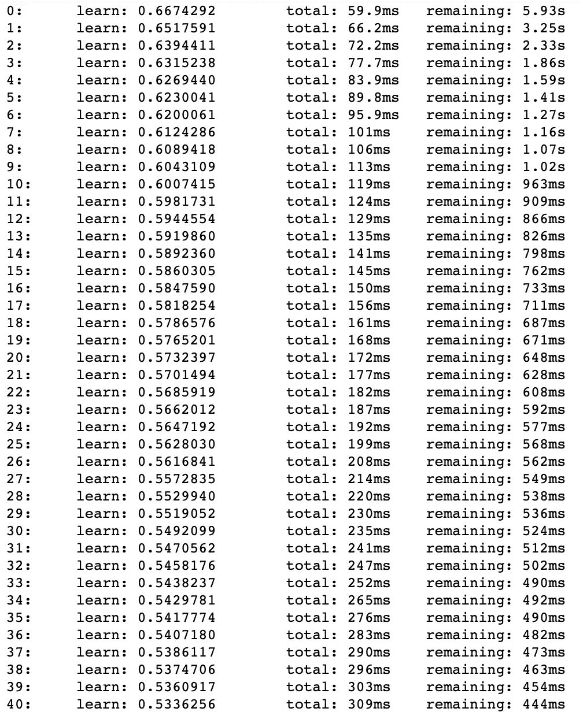
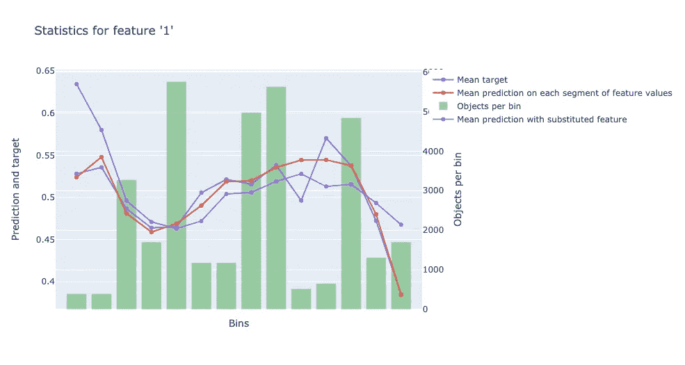
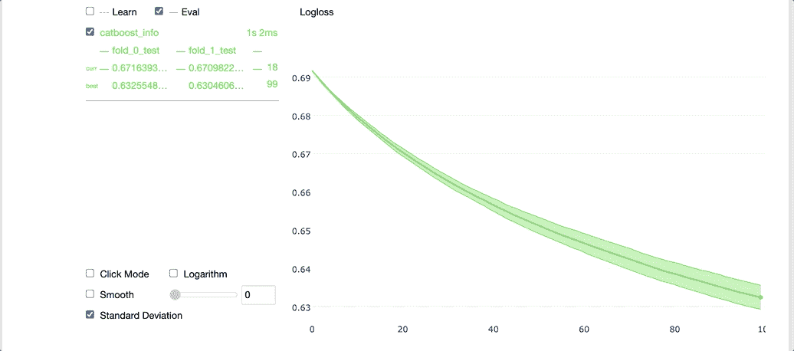
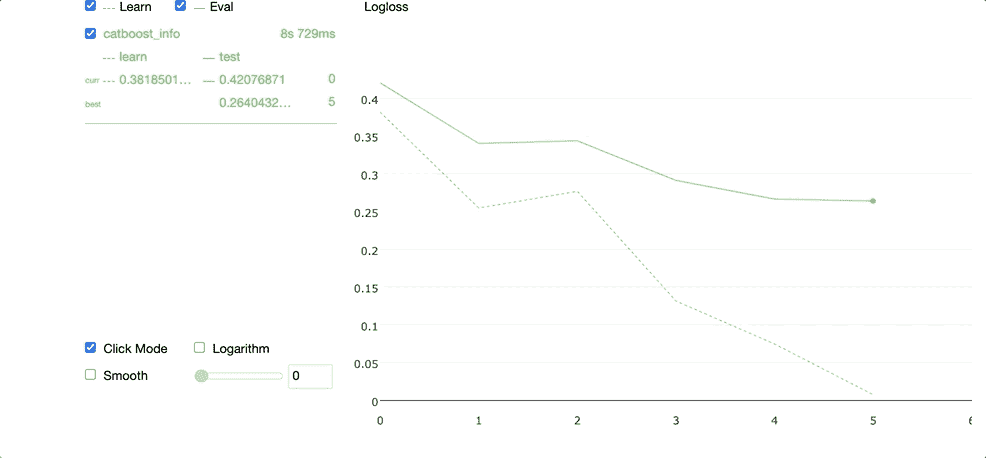

# 是的，XGBoost 很酷，但是你听说过 CatBoost 吗？

> 原文：<https://towardsdatascience.com/yes-xgboost-is-cool-but-have-you-heard-of-catboost-1930ebacd36d?source=collection_archive---------28----------------------->

## 对这个现代梯度推进库的介绍


在 [Unsplash](https://unsplash.com/s/photos/cat?utm_source=unsplash&utm_medium=referral&utm_content=creditCopyText) 上由 [Manja Vitolic](https://unsplash.com/@madhatterzone?utm_source=unsplash&utm_medium=referral&utm_content=creditCopyText) 拍摄的照片

如果您曾经做过数据科学家，参加过 Kaggle 竞赛，甚至在互联网上浏览过数据科学文章，那么您很有可能听说过 XGBoost。即使在今天，它也经常是许多从事一般机器学习任务的 Kagglers 和数据科学家的首选算法。

虽然 XGBoost 很受欢迎，但它确实有一些局限性，我在下面的文章中提到了这一点。

</why-xgboost-cant-solve-all-your-problems-b5003a62d12a>  

您可能听说过 XGBoost，但是您听说过 CatBoost 吗？CatBoost 是 Yandex 的研究人员创建的另一个开源梯度增强库。虽然它可能比 XGBoost 慢，但它仍然有几个有趣的特性，可以作为替代方案使用，或者包含在 XGBoost 的集成模型中。对于一些基准数据集，CatBoost 甚至优于 XGBoost。

**在本文中，我将把这个框架与 XGBoost 进行比较，并演示如何在一个简单的数据集上训练 CatBoost 模型。**

# CatBoost 和 XGBoost 有什么不同？

和 XGBoost 一样，CatBoost 也是一个梯度提升框架。但是，CatBoost 有几个与 XGBoost 不同的特性，如下所示:

*   **CatBoost 是梯度增强的一种不同实现，它利用了一种称为*有序增强*的概念，这在** [**CatBoost 论文**](https://arxiv.org/pdf/1706.09516.pdf) **中有详细介绍。**
*   **因为 CatBoost 具有不同的梯度增强实现，所以它有可能在某些任务上胜过其他实现。**
*   **CatBoost 具有用于交叉验证和网格搜索的可视化小部件，可在 Jupyter 笔记本中查看。**
*   **CatBoost 中的** [**池模块**](https://catboost.ai/docs/concepts/python-reference_pool.html) **支持分类和文本特征的预处理。**

要获得完整的特性列表，请务必查看 [CatBoost 文档页面](https://catboost.ai/docs/concepts/about.html)。虽然 CatBoost 确实有额外的特性，但是这个实现的主要缺点是它通常比 XGBoost 慢。但是如果你愿意牺牲速度，这种权衡在某些情况下可能是合理的。

# 装置

要安装带有 pip 的 CatBoost，只需运行下面列出的命令。

```
pip install catboost
```

或者，您也可以使用以下命令将 CatBoost 与 Conda 一起安装。

```
conda config --add channels conda-forge
conda install catboost
```

# 使用 CatBoost 分类

在本教程中，我将演示如何使用通过 Scikit-learn 生成的简单数据集，通过 CatBoost 训练分类模型。你可以在 [GitHub](https://github.com/AmolMavuduru/CatBoostTutorial) 上找到这个教程的[完整代码](https://github.com/AmolMavuduru/CatBoostTutorial)。

## 导入库

在下面的代码中，我从 CatBoost 导入了 Numpy 和 Pandas 等基本库以及一些模块。

```
import numpy as np
import pandas as pd
from catboost import CatBoostClassifier, Pool, cv
```

## 创建数据集

在下面的代码中，我使用 Scikit-learn 中的 make_classification 函数创建了一个数据集。

```
from sklearn.datasets import make_classification
X, y = make_classification(n_samples=50000, 
                           n_features=20, 
                           n_informative=15, 
                           n_redundant=5,
                           n_clusters_per_class=5,
                           class_sep=0.7,
                           flip_y=0.03,
                           n_classes=2)
```

接下来，我们可以使用下面的代码将数据集分成训练集和测试集。

```
from sklearn.model_selection import train_test_splitX_train, X_test, y_train, y_test = train_test_split(X, y, test_size=0.33, random_state=42)
```

## 训练模型

CatBoost 有一个非常简单的 Scikit-learn 风格的 API 用于训练模型。我们可以实例化一个 CatBoostClassifier 对象，并根据训练数据对其进行训练，如下面的代码所示。请注意，迭代参数对应于提升迭代的次数(或树的数量)。

```
model = CatBoostClassifier(iterations=100,
                           depth=2,
                           learning_rate=1,
                           loss_function='Logloss',
                           verbose=True)model.fit(X_train, y_train)
```

当 verbose 参数设置为 True 时，训练模型会将每次迭代中的训练损失写入标准输出。



通过训练模型生成的标准输出日志。

请注意总时间以及剩余时间是如何写入标准输出的。

## 计算特征统计

我们还可以使用 calc_feature_statistics 函数从训练数据集中计算详细的要素统计数据，如下所示。

```
model.calc_feature_statistics(X_train, y_train, feature=1, plot=True)
```

请注意，feature 参数指示要为哪个特性计算统计数据。该参数可以是索引的整数、指定功能名称的字符串或指定多个功能的字符串或整数列表。



用 CatBoost 生成的特征统计图。

上图有助于我们理解模型在根据不同箱中的特征值预测目标时的行为。这些条柱对应于指定特征的不同值范围，并在 CatBoost 模型中创建决策树时使用。

## 获取功能重要性

我们还可以使用经过训练的 CatBoost 模型来计算特征重要性。为此，我们首先必须获取训练数据，并使用池模块将其转换为预处理的 CatBoost 数据集。之后，我们可以简单地使用 get_feature_importance 函数，如下所示。

```
train_data = Pool(data=X_train, label=y_train)model.get_feature_importance(train_data)
```

该函数返回一个 Numpy 数组的要素重要性，如下所示。

```
array([3.01594829, 7.75329451, 5.20064972, 4.43992429, 4.30243392,
       8.32023227, 9.08359773, 2.73403973, 7.11605088, 2.31413571,
       7.76344028, 1.95471762, 6.66177812, 7.78073865, 1.63636954,
       4.66399329, 4.33191962, 1.836554  , 1.96756493, 7.12261691])
```

## 交叉验证

为了使用 CatBoost 执行交叉验证，我们需要完成以下步骤:

1.  使用池模块创建预处理数据集。
2.  为 CatBoost 模型创建一个参数字典。
3.  使用 cv 函数为模型生成交叉验证分数。

请注意，Pool 模块还包括用于预处理文本和分类特征的可选参数，但是由于我们数据集中的所有特征都是数值型的，所以在本例中我不需要使用这些参数。

```
cv_dataset = Pool(data=X_train,
                  label=y_train)params = {"iterations": 100,
          "depth": 2,
          "loss_function": "Logloss",
          "verbose": False}scores = cv(cv_dataset,
            params,
            fold_count=5, 
            plot="True")
```

在 plot 参数设置为 True 的情况下运行上面的代码，可以得到一个很酷的小部件，如下图所示。



CatBoost 交叉验证小部件。

在左侧，我们可以看到每个折叠的交叉验证结果，在右侧，我们可以看到一个图表，其中包含模型的平均学习曲线以及标准偏差。x 轴包含迭代次数，y 轴对应于验证损失值。

## 网格搜索

我们还可以执行网格搜索，其中库比较不同超参数组合的性能，以找到最佳模型，如下所示。

```
model = CatBoostClassifier(loss_function='Logloss')grid = {'learning_rate': [0.03, 0.1],
        'depth': [4, 6, 10]}grid_search_result = model.grid_search(grid,
                                       X=X_train, 
                                       y=y_train,
                                       cv=3,
                                       plot=True)
```

运行上面的代码会产生下面 GIF 中演示的小部件。



CatBoost 网格搜索小部件。

我们可以通过选择 **params** 属性来访问网格搜索中的最佳参数。

```
print(grid_search_result['params'])
```

上面的 print 语句为我们提供了网格搜索中的最佳参数，如下所示。

```
{'depth': 10, 'learning_rate': 0.1}
```

## 测试模型

我们可以通过运行 predict 函数从经过训练的 CatBoost 模型中生成预测。

```
model.predict(X_test)
```

运行上面的 predict 函数会产生一个 Numpy 类标签数组，如下所示。

```
array([0, 1, 0, ..., 0, 1, 1])
```

如果我们想要评估模型在测试数据上的性能，我们可以使用 score 函数，如下所示。

```
model.score(X_test, y_test)
```

运行上面的函数产生了以下输出。

```
0.906
```

基于以上结果，我们可以看到该模型达到了 90.6%的测试准确率。

## 保存模型

您还可以将 CatBoost 保存为各种格式，例如 PMML，如下面的代码所示。

```
model.save_model(
    "catboost.pmml",
    format="pmml",
    export_parameters={
        'pmml_copyright': 'my copyright (c)',
        'pmml_description': 'test model for BinaryClassification',
        'pmml_model_version': '1'
    }
)
```

# 摘要

CatBoost 是一个更新的梯度增强框架，具有额外的特性，值得考虑作为 XGBoost 的潜在替代方案。它可能没有 XGBoost 那么快，但是它确实有一些有用的特性，并且有可能在某些任务上超过 XGBoost，因为它是梯度增强的改进实现。

像往常一样，你可以在 [GitHub](https://github.com/AmolMavuduru/CatBoostTutorial) 上找到本文使用的代码。

# 加入我的邮件列表

你想在数据科学和机器学习方面变得更好吗？您想了解数据科学和机器学习社区的最新图书馆、开发和研究吗？

加入我的[邮件列表](https://mailchi.mp/e8dd82679724/amols-data-science-blog)，获取我的数据科学内容的更新。当你[注册](https://mailchi.mp/e8dd82679724/amols-data-science-blog)的时候，你还会得到我免费的**解决机器学习问题的逐步指南**！也可以在 [Twitter](https://twitter.com/amolmavuduru1) 关注我，了解内容更新。

当你这么做的时候，考虑加入媒体社区，阅读成千上万其他作家的文章。

# 来源

1.  长度普罗霍伦科娃，古塞夫等。艾尔， [CatBoost:具有分类特征的无偏增强](https://arxiv.org/pdf/1706.09516.pdf)，(2019)，arXiv.org。