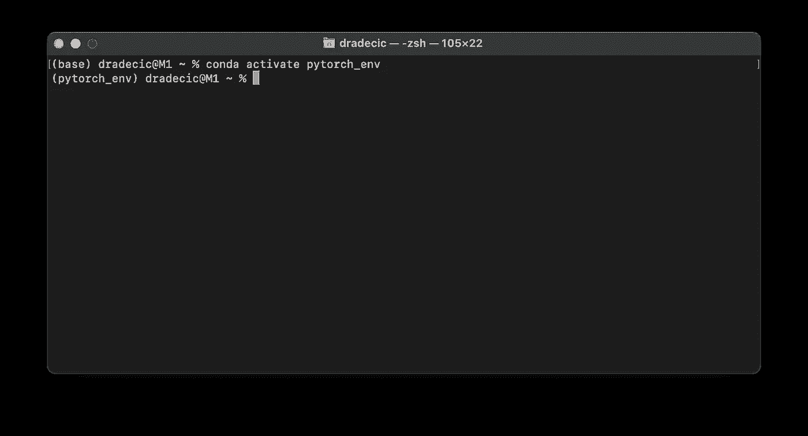
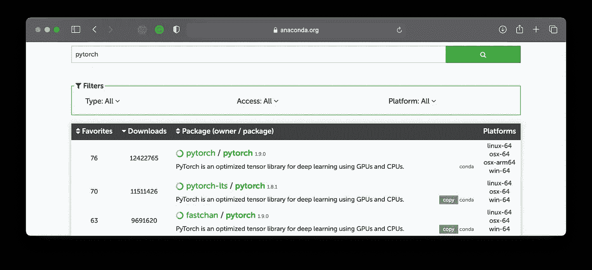
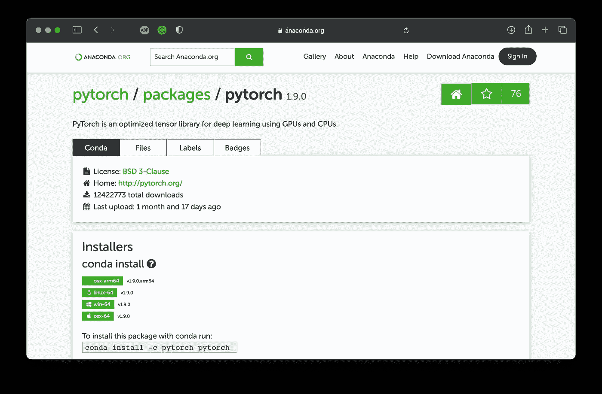
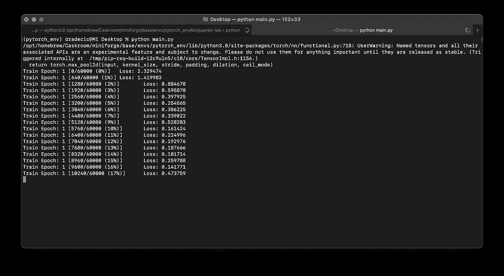
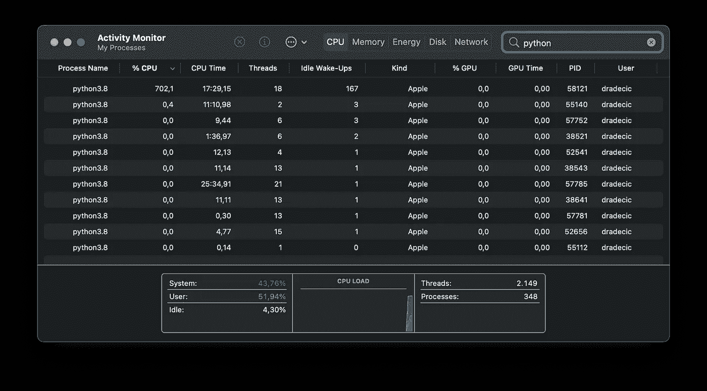

# 是的，你可以在 M1 的 MacBooks 上运行 PyTorch，具体操作如下

> 原文：<https://towardsdatascience.com/yes-you-can-run-pytorch-natively-on-m1-macbooks-and-heres-how-35d2eaa07a83?source=collection_archive---------1----------------------->

## 在 M1 苹果电脑上安装 PyTorch 并训练你的第一个神经网络——一个完整的分步指南


照片由[伊戈尔·莱皮林](https://unsplash.com/@ilepilin?utm_source=unsplash&utm_medium=referral&utm_content=creditCopyText)在 [Unsplash](https://unsplash.com/s/photos/torch?utm_source=unsplash&utm_medium=referral&utm_content=creditCopyText) 上拍摄

M1 macbook 已经不再是新的了。不知何故，安装 Python 的深度学习库仍然不是一个简单的过程。至少有了 TensorFlow。PyTorch 不一样。

今天您将学习如何在您的 M1 机器上安装和运行 PyTorch。你用哪台 M1 电脑(Air、Pro、Mini 或 iMac)都没什么区别。

让我们开始吧。

# 步骤 1 —安装和配置 Miniforge

我花了很多时间为数据科学配置 M1 Mac 电脑。它从来没有一点瑕疵。直到我发现了这个选项。根据网速的不同，完全设置需要 5 到 10 分钟。

首先，你需要安装[自制软件](https://brew.sh/)。这是一个用于 Mac 的软件包管理器，您可以通过从终端执行以下行来安装它:

```
/bin/bash -c "$(curl -fsSL https://raw.githubusercontent.com/Homebrew/install/HEAD/install.sh)"
```

请记住——如果你正在安装一台新的 M1 Mac，很可能你不会安装自制软件所需的 XCode 构建工具。终端会通知您这些是否丢失，并询问您是否要安装它们。

一旦安装了 XCode 构建工具和 Homebrew，您就可以重启终端并安装 Miniforge:

```
brew install miniforge
```

这是几百 MB 的下载，所以需要一些时间来完成。完成后，初始化 Z 外壳(zsh)的 conda:

```
conda init zsh
```

最后，重启终端。**就是这样！** Miniforge 现已安装，您可以开始创建虚拟环境了。接下来我们就这样做吧。

# 步骤 2 —创建虚拟环境

以下终端命令将基于 Python 3.8 创建一个名为`pytorch_env`的新虚拟环境:

```
conda create --name pytorch_env python=3.8
```

创建后，使用以下命令激活它:

```
conda activate pytorch_env
```

您应该会看到类似这样的内容:



图 1 —激活 PyTorch 环境(图片由作者提供)

接下来让我们安装库。

# 步骤 3 —安装 PyTorch

你可以在 Anaconda 的网站上找到一个本地 PyTorch 包。您应该在 Platform 下查找`osx-arm64`,它会告诉您它是 M1 兼容的:



图 2 —蟒蛇身上的 PyTorch 包(图片由作者提供)

点击软件包将为我们提供安装说明，如下所示:



图 3 — PyTorch 安装说明(图片由作者提供)

您可以使用以下命令安装 PyTorch 和 Torchvision(针对数据集):

```
conda install -c pytorch pytorch torchvision
```

就这样——py torch 现在安装好了！接下来让我们测试这该死的东西。

# 步骤 4 —测试

让我们保持简单，不要从头开始写任何东西。PyTorch 的 GitHub 页面附带了许多例子，其中之一是用于训练手写数字分类器的脚本( [link](https://github.com/pytorch/examples/blob/master/mnist/main.py) )。

只需下载脚本并从终端运行它:

```
python main.py
```

您将看到以下输出:



图片 4 — PyTorch 模型培训(图片由作者提供)

一切按预期运行！让我们打开活动监视器来验证 Python 是否正在本机运行:



图 5——Mac 上的活动监视器(图片由作者提供)

如果你在“Kind”下看到“Apple”，这意味着程序是在 M1 芯片上本地运行的，而不是在 Rosetta 仿真器下。

检查！

# 最后的想法

现在，PyTorch 已经成功安装在 M1 机器上。你不能对 TensorFlow 遵循同样的步骤，因为一旦你开始训练模型，Python 就会崩溃。如果你想让我也涵盖 TensorFlow 安装，请告诉我。

您必须承认，原生安装 PyTorch 比您预期的要容易。当然，它不会像在 GPU 上运行得那么快，但它足以让你开始学习和尝试。

感谢阅读。

*喜欢这篇文章吗？成为* [*中等会员*](https://medium.com/@radecicdario/membership) *继续无限制学习。如果你使用下面的链接，我会收到你的一部分会员费，不需要你额外付费。*

<https://medium.com/@radecicdario/membership>  

# 了解更多信息

*   [2021 年学习数据科学的前 5 本书](/top-5-books-to-learn-data-science-in-2020-f43153851f14)
*   [如何使用 Cron 调度 Python 脚本——您需要的唯一指南](/how-to-schedule-python-scripts-with-cron-the-only-guide-youll-ever-need-deea2df63b4e)
*   [Dask 延迟—如何轻松并行化您的 Python 代码](/dask-delayed-how-to-parallelize-your-python-code-with-ease-19382e159849)
*   [如何使用 Python 创建 PDF 报告—基本指南](/how-to-create-pdf-reports-with-python-the-essential-guide-c08dd3ebf2ee)
*   [即使没有大学文凭也要在 2021 年成为数据科学家](/become-a-data-scientist-in-2021-even-without-a-college-degree-e43fa934e55)

# 保持联系

*   关注我在[媒体](https://medium.com/@radecicdario)上的更多类似的故事
*   注册我的[简讯](https://mailchi.mp/46a3d2989d9b/bdssubscribe)
*   在 [LinkedIn](https://www.linkedin.com/in/darioradecic/) 上连接