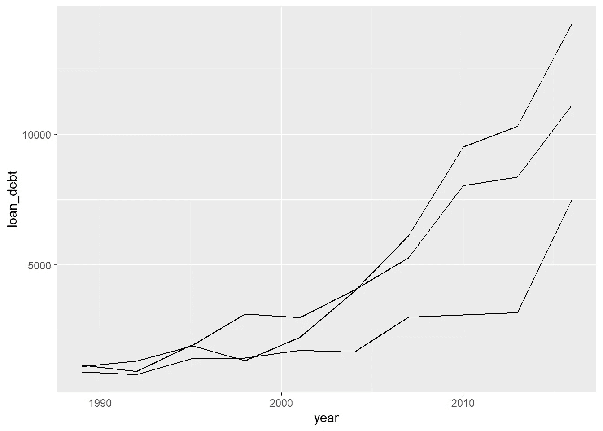
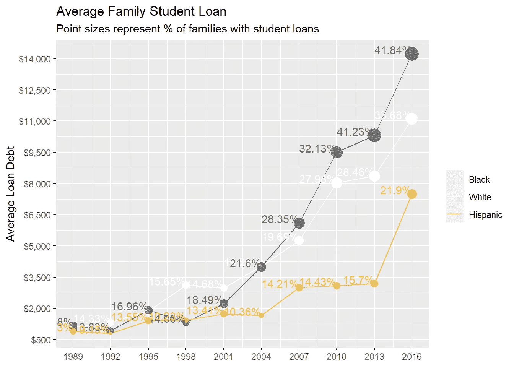

# 又一个显示美国种族不平等的阴谋！

> 原文：<https://towardsdatascience.com/yet-one-more-plot-to-show-uss-race-inequality-c12fa166aee0?source=collection_archive---------49----------------------->


来源:Arafath Hossain

## 关于如何使用 R 制作动画情节的简短教程；并用它来传达美国种族不平等的一个延续方面的旅程。

# 背景

上周的 [TidyTuesday](https://github.com/rfordatascience/tidytuesday/) 全是关于美国的财富不平等。自从我在一所大学工作以来，我已经看到学生的成功在不同种族之间是如何变化的。回顾他们的社会经济背景，很明显隐藏在他们种族背后的财富在他们的成功中扮演了重要角色。这使得学生债务数据成为我研究的一个有趣案例。

这就是结果:一个动画图表将向你展示美国种族在学生债务积累方面的历史差异，以及这种差异是如何日益恶化的。

# 数据

如前所述，数据来自 TidyTuesday。下面是关于数据的[细节](https://github.com/rfordatascience/tidytuesday/blob/master/data/2021/2021-02-09/readme.md)。

```
# libraries
# devtools::install_github("thomasp85/transformr")
library(ggplot2)
library(tidyverse)
library(ggtext)
library(gganimate) 
library(extrafont)
library(knitr)
library(kableExtra)# data
student_debt <- readr::read_csv('https://raw.githubusercontent.com/rfordatascience/tidytuesday/master/data/2021/2021-02-09/student_debt.csv')# glimpse of the data
student_debt %>%
  head(5) %>%
  knitr::kable(caption = "Top 5 lines of the data") %>%
  kable_classic(full_width = F, html_font = "Cambria")
```


这些数据的一个优点是它已经被清理了！要了解更多关于清洁步骤的信息，请点击此处的文档。以下是数据的简短描述:


## 制作动画情节(一次一个情节)

我会用`gganimate`包来出剧情。在使用`gganimate`之前，我们将首先使用来自 r 的强大的数据 viz 包`ggplot`制作一个我们喜欢的图形。在下面的代码块和后续段落中，我将一步一步地告诉你如何做。

# 静态线图

让我们从一个非常简单的线图开始，它将显示不同种族学生债务的年度趋势。这个情节将作为骨架，在此基础上，我们将继续添加新的层和附加的铃铛和哨子，使它更好，更有意义。

```
student_debt %>%
  ggplot(
    aes(x = year, 
        y=loan_debt, 
        group = race)
  ) +
    geom_line()
```



一些直接的改进点是:

*   添加标题并标记轴，
*   用不同的颜色分隔线条，
*   x 轴和 y 轴上的默认值意义不大。分解 x 和 y 轴的值可能会使它们更有意义。

```
student_debt %>%
  ggplot(
    aes(x = year, 
        y=loan_debt, 
        group = race)
  ) +
  geom_line(aes(color = race)) +
  scale_x_continuous(breaks = seq(1989, 2016, 3)) + 
    scale_y_continuous(breaks = seq(500, 15000, 1500), 
                       labels = scales::dollar) +
  labs(title="Average Family Student Loan",
         x = NULL, color = NULL, y = "Average Loan Debt")
```


相当大的进步！

# 具有额外洞察力的情节

我们有一个尚未使用但非常重要的数据可供我们使用— `loan_debt_pct`:有学生贷款债务的家庭的百分比。我们可以通过使用新添加的点将这种洞察力添加到我们的情节中！

```
student_debt %>%
  ggplot(
    aes(x = year, 
        y=loan_debt, 
        group = race)
  ) +

  geom_line(aes(color = race)) +

  geom_point(aes(
    size = loan_debt_pct)
             ) +

  scale_x_continuous(breaks = seq(1989, 2016, 3)) + 
    scale_y_continuous(breaks = seq(500, 15000, 1500), 
                       labels = scales::dollar) +
  labs(title="Average Family Student Loan",
         color = NULL,
         x = NULL, y = "Average Loan Debt",
         subtitle ="Point sizes represent % of families with student loans")
```


现在让我们再做一些改进:

*   不同线上的点的颜色代表相应的种族。让我们用和线条一样的颜色来说明这一点，
*   在这样做的同时，让我们也将颜色从自动生成的`ggplot`颜色更改为我们自定义的颜色(例如，黑人用黑色，白人用白色，西班牙人用棕色)。
*   race 变量的图例顺序也与图表上的线条顺序不一致。让我们也重新排列一下传说，
*   尺寸图例也需要一些修改。因为仅仅从一个角度来测量圆圈的大小是很困难的，所以让我们把这些图例去掉，而在图上标出实际的百分比。

```
student_debt %>%
  mutate(race = fct_relevel(race, "Black", "White", "Hispanic")) %>%
  ggplot(
    aes(x = year, 
        y=loan_debt, 
        group = race,
        color = race)
  ) +

  geom_line(aes()) +

  geom_point(aes(
    size = loan_debt_pct),
    show.legend = FALSE) +

  geom_text(aes(
    label = paste0(round(loan_debt_pct * 100, 2), "%")
  ), 
  show.legend = FALSE,
  hjust = 1, vjust = 0) + 

  scale_x_continuous(breaks = seq(1989, 2016, 3)) + 
    scale_y_continuous(breaks = seq(500, 15000, 1500), 
                       labels = scales::dollar) +
  scale_color_manual(values = c("White" = "#ffffff", "Black" = "#787575", "Hispanic" = "#f5bf42")) + 

  labs(title="Average Family Student Loan",
         color = NULL,
         x = NULL, y = "Average Loan Debt",
         subtitle ="Point sizes represent % of families with student loans")
```



# 使其在视觉上吸引人

我们的图表几乎准备好了；内容方面。但是视觉上可以好很多。默认 ggplot 背景上的颜色混合不好。为了使它更好，我修改了 ggplot 中的`theme_dark()`,并为这个图创建了一个定制的。由于本教程不是关于 ggplot 主题的，所以我在这里不多讨论主题。这将是未来另一个教程的一部分。但是如果你有兴趣玩 ggplot 主题，我推荐一个不错的[教程](https://rpubs.com/mclaire19/ggplot2-custom-themes)。

在图的迭代中，我们将进行以下更改:

*   将默认主题更改为较暗的主题，
*   调整线条样式以匹配深色主题，
*   为了使百分点文本不那么混乱，我们也让它们只出现在最近三年。

```
student_debt %>%
  mutate(race = fct_relevel(race, "Black", "White", "Hispanic")) %>%
  ggplot(
    aes(x = year, 
        y=loan_debt, 
        group = race,
        color = race)
  ) +

  geom_line(aes(),
            size = 1,
            linetype = "dashed") +

  geom_point(aes(
    size = loan_debt_pct),
    show.legend = FALSE) +

  geom_text(aes(
    label = ifelse(year >= 2010, 
                   paste0(round(loan_debt_pct * 100), "%"),
                   "")
    ), 
  show.legend = FALSE,
  size = 4,
  hjust = 1, vjust = 0) + 

  theme_race() + 

  scale_x_continuous(breaks = seq(1989, 2016, 3)) + 
    scale_y_continuous(breaks = seq(500, 15000, 1500), 
                       labels = scales::dollar) +
  scale_color_manual(values = c("White" = "#ffffff", "Black" = "#787575", "Hispanic" = "#f5bf42")) + 

  labs(title="Average Family Student Loan",
         color = NULL,
         x = NULL, y = "Average Loan Debt",
         subtitle ="Point sizes represent % of families with student loans")
```


# 让剧情动起来吧！

我认为我们已经处于足够好的状态，可以继续制作动画情节了。使用`gganimate`制作图表动画非常简单。我们将添加大约 2 行代码来实现它。

```
student_debt %>%
  mutate(race = fct_relevel(race, "Black", "White", "Hispanic")) %>%
  ggplot(
    aes(x = year, 
        y=loan_debt, 
        group = race,
        color = race)
  ) +

  geom_line(aes(),
            size = 1,
            linetype = "dashed") +

  geom_point(aes(
    size = loan_debt_pct),
    show.legend = FALSE) +

  geom_text(aes(
    label = ifelse(year >= 2010, 
                   paste0(round(loan_debt_pct * 100), "%"),
                   "")
    ), 
  show.legend = FALSE,
  size = 4,
  hjust = 1, vjust = 0) + 

  theme_race() + 

  transition_reveal(year) +

  scale_x_continuous(breaks = seq(1989, 2016, 3)) + 
    scale_y_continuous(breaks = seq(500, 15000, 1500), 
                       labels = scales::dollar) +
  scale_color_manual(values = c("White" = "#ffffff", "Black" = "#787575", "Hispanic" = "#f5bf42")) + 

  labs(title="Average Family Student Loan",
         color = NULL,
         x = NULL, y = "Average Loan Debt",
         subtitle ="Point sizes represent % of families with student loans")
```


在我们的动画中，有两个方面需要改进，以使视觉效果对读者更友好:

*   一旦新的数据点被填充，点和文本就会消失。让他们留下来，
*   动画运行和回收太快。让我们慢一点，让它在完成一个循环后停顿更长时间，
*   让我们在图表顶部添加一个计数器，它将随着图表的移动显示当前年份，
*   作为最后的润色，让我们也为标签添加一些清晰度，并添加一个源信用。

```
student_debt %>%
  mutate(race = fct_relevel(race, "Black", "White", "Hispanic")) %>%
  ggplot(
    aes(x = year, 
        y=loan_debt, 
        color = race)
  ) +

  geom_line(aes(),
            size = 1,
            linetype = "dashed") +

  geom_point(aes(
    size = loan_debt_pct,
    group = seq_along(year)),
    show.legend = FALSE) +

  geom_text(aes(
    label = ifelse(year >= 2010, 
                   paste0(round(loan_debt_pct * 100), "%"),
                   ""),
    group = seq_along(year)
    ), 
  show.legend = FALSE,
  size = 4,
  hjust = 1, vjust = 0) + 

  theme_race() + 

  transition_reveal(as.integer(year)) + # as.integer(year) makes the year showing in subtitle as integer.

  scale_x_continuous(breaks = seq(1989, 2016, 3)) + 
    scale_y_continuous(breaks = seq(500, 15000, 1500), 
                       labels = scales::dollar) +
  scale_color_manual(values = c("White" = "#ffffff", "Black" = "#787575", "Hispanic" = "#f5bf42")) + 

  labs(title="Average Student Loan Taken by the US Families",
       x = NULL, color = NULL,
       y = "Average Loan Debt \n($ normalized to 2016 dollars)", 
       caption = "Source: Urban Institute, and the US Census,\n2017 | Arafath Hossain",
       subtitle ="Point sizes represent % of families with student loans \nYear: {frame_along}") -> plot
```

# 最终视觉

所以，在所有这些更新之后，这里是我们的最后一个视频，它带我们踏上了美国种族不平等的一个永久化的方面的旅程。

```
plot %>% 
  animate(fps = 8, end_pause = 12, height = 6, width = 10, units = "in", res = 150)
```


情节动画可以是一个很好的工具来传达你的信息，当它呼吁一个特定的趋势随着时间的推移。我很高兴在这个地块上工作，希望你也能在你的项目中发现它的乐趣和用处！

# 感谢阅读！

**想了解更多关于如何高效绘制数据的信息吗？试试这个教程:**

[](/is-that-red-wine-good-enough-49326a4c08e4) [## 那种红酒够好吗？

### 一个介绍性的教程，介绍预测建模的基本工作流程，并演示如何记录…

towardsdatascience.com](/is-that-red-wine-good-enough-49326a4c08e4) 

# 阿拉法特·侯赛因

*   ***如果你喜欢这个，*** [***跟我上中等***](https://medium.com/@curious-joe) ***更多***
*   ***让我们连线上***[***LinkedIn***](https://www.linkedin.com/in/arafath-hossain/)