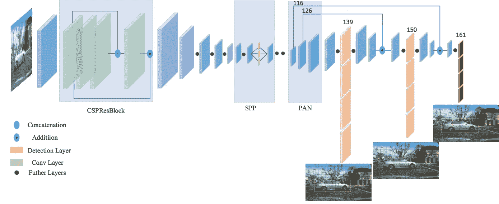
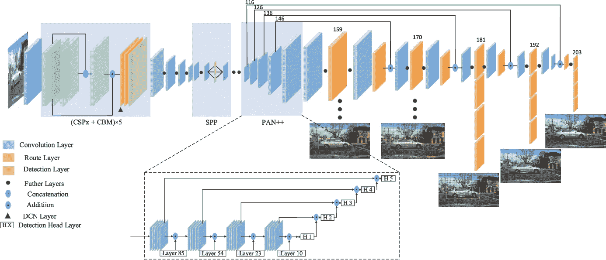
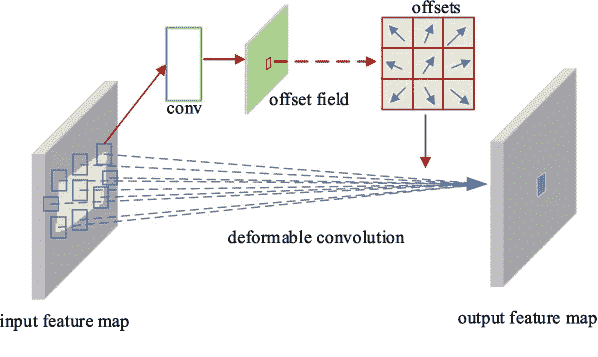
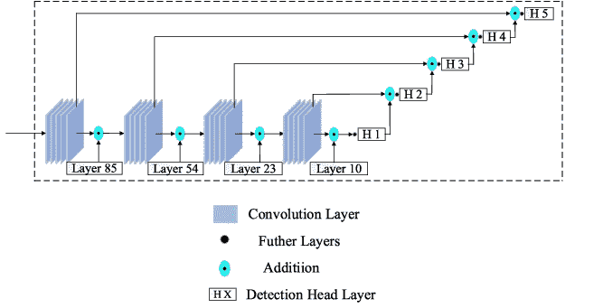
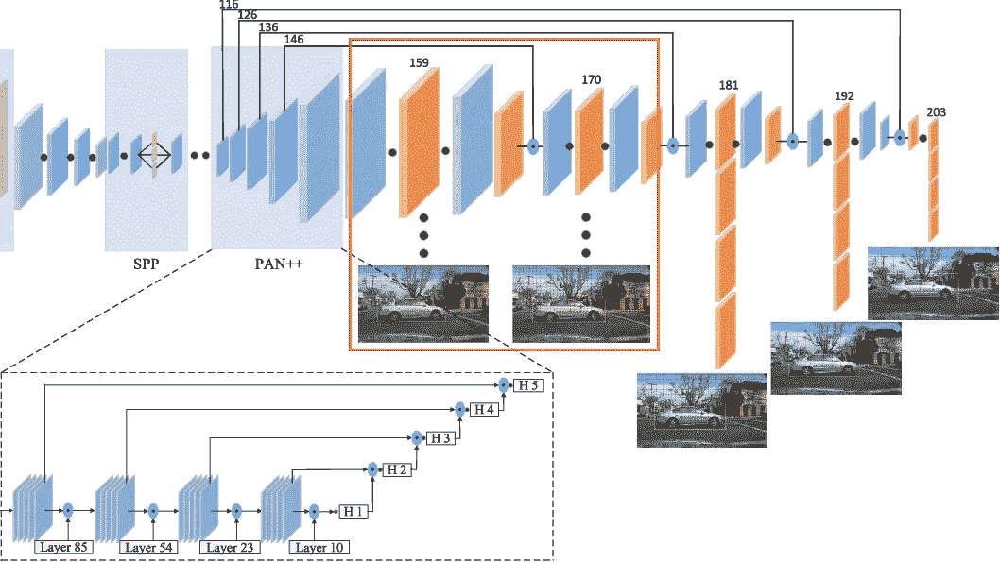
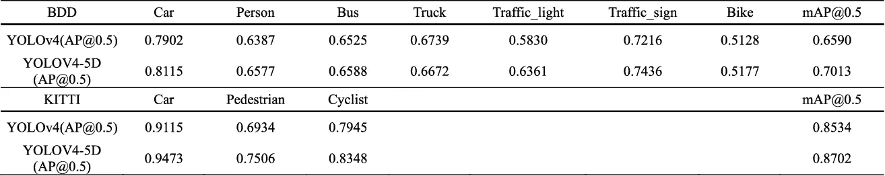
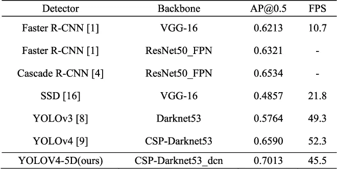
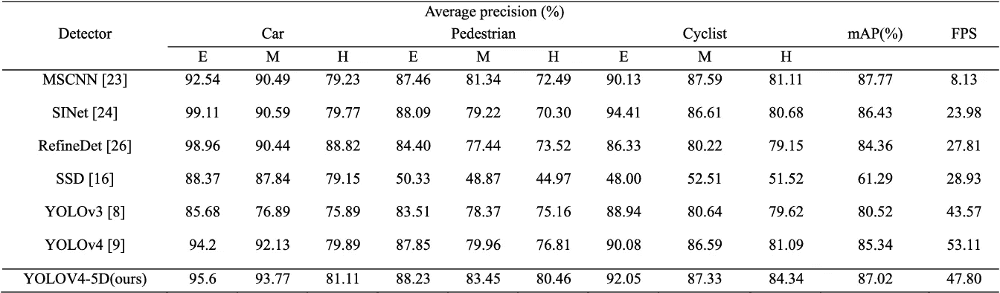
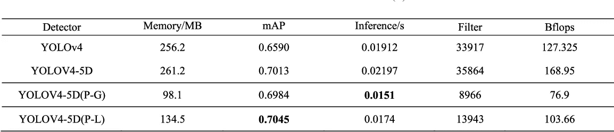

# yolov 4–5D:yolov 4 的自动驾驶增强版

> 原文：<https://towardsdatascience.com/yolov4-5d-an-enhancement-of-yolov4-for-autonomous-driving-2827a566be4a?source=collection_archive---------18----------------------->

## 你只看一次，但有五个刻度

在过去的几年中，目标检测已经成为深度学习和模式识别研究中最热门的话题，并且已经成为所有计算机视觉研究人员必须知道的问题。如果你读这篇文章是因为你知道文章标题中有趣的是什么，我相信你有一些物体检测的背景，所以我想忽略解释基本的东西，如什么是物体检测和有多少种物体检测器，答案可以很容易地在数百万个来源中找到，通过在谷歌或任何搜索网站上键入非常简单的关键字。但至少，我可以从总结一系列 YOLO 算法开始，到目前为止，这些算法一直是对象检测的图标，也是最有吸引力的基线方法，其他方法都是基于它进行改进的。

2015 年，Joseph Redmon 和他的合著者推出了 YOLO 的第一个版本,该版本在实时物体检测方面取得了突破。 [YOLOv1](https://arxiv.org/abs/1506.02640) 是一个一阶段的物体检测器，与当时的两阶段方法相比，推理速度快，精度可接受。 [YOLOv2](https://arxiv.org/abs/1612.08242) ，也称为 YOLO9000，是一年后提出的，通过应用锚箱的概念来提高检测精度。2016 年， [YOLOv3](https://arxiv.org/abs/1804.02767) 进行了进一步的改进，采用了新的骨干网络 Darknet53，并使用特征金字塔网络(FPN)作为模型颈部，能够检测三种不同比例的对象。从下一个版本 [YOLOv4](https://arxiv.org/abs/2004.10934) 开始，Joseph 宣布由于一些个人原因停止进行这个项目，并将 YOLO 项目的主导特权交给了 Alexey Bochkovskiy，Alexey 在 2020 年引入了 YOLOv4。YOLOv4 通过使用新的主干 CSPDarknet53 (CSP 代表跨阶段部分)，添加空间金字塔池(SPP)，路径聚合网络(PAN)，并引入镶嵌数据增强方法，提高了前任 YOLOv3 的性能。你可以通过[官网](https://pjreddie.com/darknet/)或者 github 回购[暗网](https://github.com/AlexeyAB/darknet)看一下 YOLO 项目。

YOLOV4 的网络架构(图见[论文](https://www.semanticscholar.org/paper/YOLOv4-5D%3A-An-Effective-and-Efficient-Object-for-Cai-Luan/0e582215eaf70ca498d1656dd6e372b3ea3e9966)

目前，YOLOv4 已经是 YOLO 系列中最先进的型号(实际上存在一个名为 YOLOv5 的版本，但由于一些原因，该版本没有被确认为官方版本，这可以在这篇[文章](https://blog.roboflow.com/yolov4-versus-yolov5/)中找到)。但是 YOLOv4 仍然没有针对所有场景进行优化；也就是说，在具有许多小物体的场景的情况下，YOLOv4 仍然在努力，并且不是真正准确的，例如，在自动驾驶场景中，在道路上存在许多小而远的物体，如行人、车辆、交通标志等。如题，这篇帖子介绍了[YOLOv4–5D](http://ieeexplore.ieee.org/document/9374990)，yolov 4 针对自动驾驶场景的改进。

yolov 4–5D 的新功能:

*   主干:CSPDarknet53_dcn
*   脖子:PAN++的
*   头部:增加 2 个大规模图层
*   网络修剪

yolov 4–5D 的网络架构(图见[论文](https://www.semanticscholar.org/paper/YOLOv4-5D%3A-An-Effective-and-Efficient-Object-for-Cai-Luan/0e582215eaf70ca498d1656dd6e372b3ea3e9966)

# ***1。主干:cspdarknet 53 _ DCN***

CSPDarknet53 是 YOLOv4 的主干，yolov 4 是第一个将跨阶段部分(CSP)结构集成到主干或特征提取器中的模型。yolov 4–5D 中引入的修改主干通过用可变形卷积网络(DCN)替换几层中的常规卷积来重新设计，并表示为 CSPDarknet53_dcn。具体而言，为了平衡效率和效果，最后一级中的 3×3 卷积层被替换为 DCN。DCN 的显著特点是它使用一个可学习的偏移值来描述目标特征的方向，这样，感受野就不局限于一个固定的范围，而是可以灵活地适应目标几何形状的变化。此外，DCN 只是轻微地影响了模型中的参数数量。具有上述特征的 DCN 被整合到 yolov 4-5D 的骨架中，形成 CSPDarknet53_dcn。

可变形卷积(图见[文件](https://www.semanticscholar.org/paper/YOLOv4-5D%3A-An-Effective-and-Efficient-Object-for-Cai-Luan/0e582215eaf70ca498d1656dd6e372b3ea3e9966)

# 2.脖子:PAN++的

与 YOLOv4 不同，yolov 4 使用 PAN 作为模型颈部的一部分(与 SPP 一起)。在 yolov 4–5D 中，使用 PAN++并将其设计为特征融合模块。PAN++被应用来平衡主干中低层特征的语义信息和高层特征的位置信息。整个网络设计为输出 5 种不同尺度的检测，有利于小目标检测。

PAN ++ in yolov 4–5D(图改编自[论文](https://www.semanticscholar.org/paper/YOLOv4-5D%3A-An-Effective-and-Efficient-Object-for-Cai-Luan/0e582215eaf70ca498d1656dd6e372b3ea3e9966)

# 3.头部:增加 2 个大规模图层

如上所述，再增加 2 个大尺度探测层的目的是增强探测小物体的能力。

yolov 4–5D 增加了两个大规模的更好的小物体检测(红框中)(图改编自[论文](https://www.semanticscholar.org/paper/YOLOv4-5D%3A-An-Effective-and-Efficient-Object-for-Cai-Luan/0e582215eaf70ca498d1656dd6e372b3ea3e9966)

# 4.网络修剪

批量标准化中的稀疏比例因子的概念被用于通道修剪，以修剪 yolov 4-5D 的主干。因为比例参数γ是一个可学习的因子，它能够表示通道的重要性。设置一个小的剪枝阈值，一般为 0.1。哪个通道的γ低于 0.1 将被修剪。

# 5.结果

下表显示了 YOLOv4–5D 与 yolov 4 的性能对比:

在 BDD 和 KITTY 数据集上，yolov 4–5D vs yolov 4([论文](https://www.semanticscholar.org/paper/YOLOv4-5D%3A-An-Effective-and-Efficient-Object-for-Cai-Luan/0e582215eaf70ca498d1656dd6e372b3ea3e9966)中的表格)

YOLOv4–5D 将 yolov 4 的性能提高了一个显著的差距。在 BDD 数据集上，IoU 0.5 的整体 mAP 从 65.90%提高到 70.13%，提高了 4.23%。在 KITTY 数据集上，YOLOv4-5D 以 87.02%的 mAP 产生了更高的检测性能，与原始 yolov 4 的 85.34% mAP 相比，差距为 1.68%。

下表显示了 yolov 4–5D 与其他先进方法的进一步性能比较:

yolov 4–5D 与 BDD 验证数据的其他方法(在[论文](https://www.semanticscholar.org/paper/YOLOv4-5D%3A-An-Effective-and-Efficient-Object-for-Cai-Luan/0e582215eaf70ca498d1656dd6e372b3ea3e9966)中的表格)

yolov 4–5D 与其他方法对 KITTY 验证数据的比较(见[论文](https://www.semanticscholar.org/paper/YOLOv4-5D%3A-An-Effective-and-Efficient-Object-for-Cai-Luan/0e582215eaf70ca498d1656dd6e372b3ea3e9966)中的表格)

最后，通过模型剪枝，yolov 4–5D 的推理速度在保持准确性的同时显著提高了 31.3%。

修剪过的 yolov 4–5D 性能(在[论文](https://www.semanticscholar.org/paper/YOLOv4-5D%3A-An-Effective-and-Efficient-Object-for-Cai-Luan/0e582215eaf70ca498d1656dd6e372b3ea3e9966)中的表格)

# 结论

在这篇文章中，我介绍了 YOLOv4-5D，这是 yolov 4 的一个改进，用于自动驾驶场景中的物体检测。YOLOv4–5D 表现出比 yolov 4 更高的性能，在 BDD 数据集上 mAP 提高了 4.23%，在 KITTY 数据集上 mAP 提高了 1.68%。此外，yolov 4–5D 的修剪版本在保持相同精度的情况下，仅用 98.1MB 的内存进一步提高了 31.3%的推理速度。

欢迎读者访问我的脸书粉丝页，这是关于机器学习的分享:[投入机器学习](https://www.facebook.com/diveintomachinelearning)。我的另一篇关于用 Darknet 和 Tensorflow-Keras 执行 YOLOv4 物体检测的帖子也可以在[这里](/darkeras-execute-yolov3-yolov4-object-detection-on-keras-with-darknet-pre-trained-weights-5e8428b959e2)找到。

感谢您抽出时间！