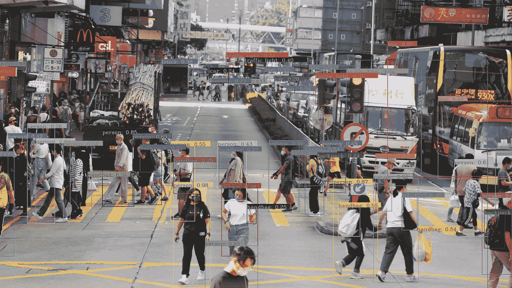
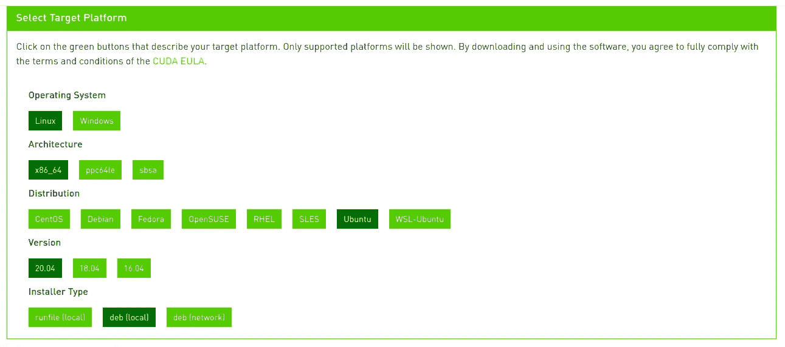
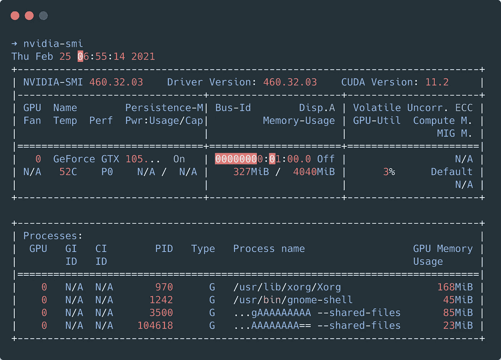
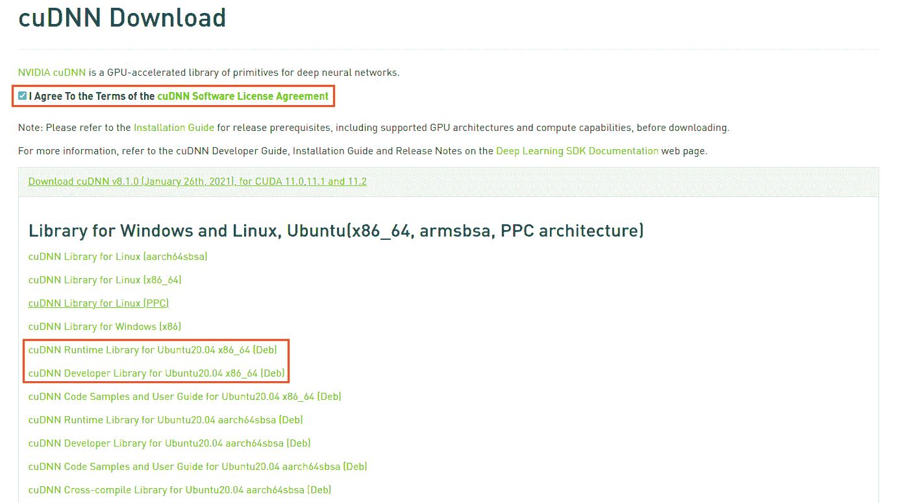
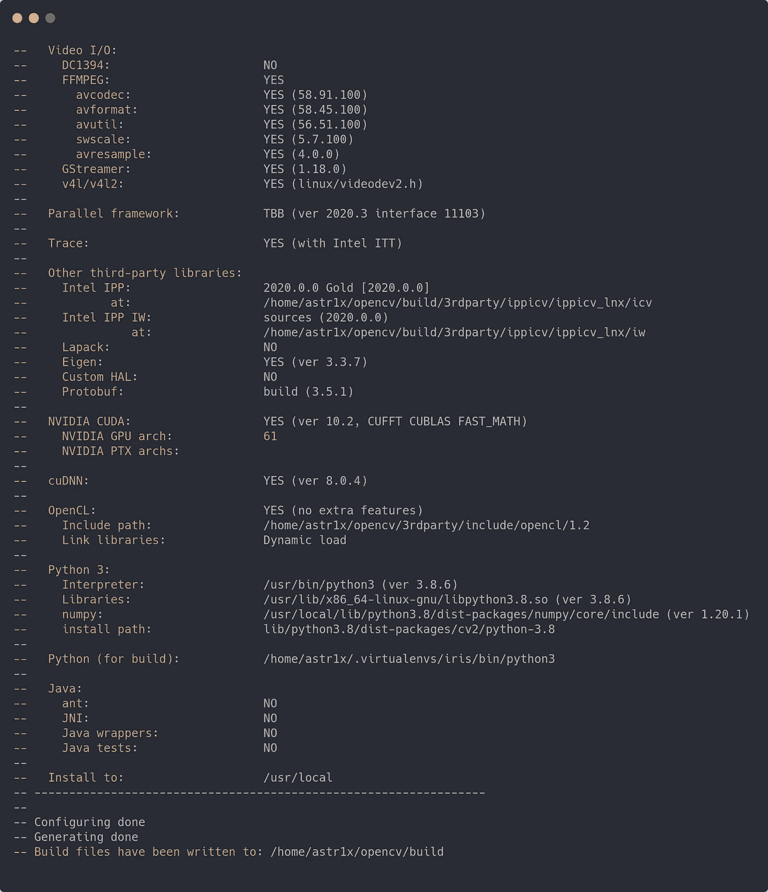
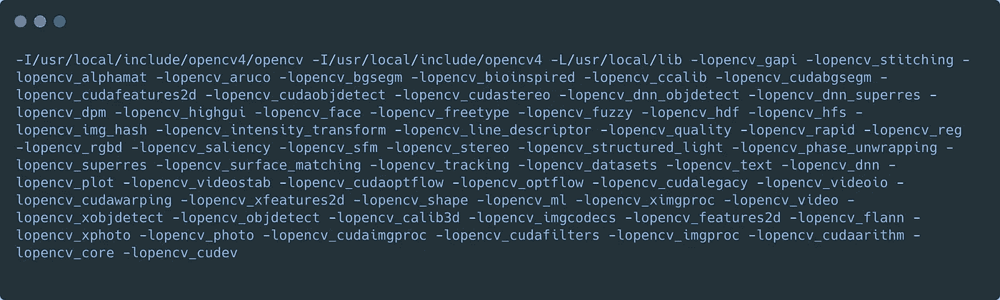

# 通过支持 CUDA 的 OpenCV 提高 YOLOv4 性能

> 原文：<https://towardsdatascience.com/yolov4-with-cuda-powered-opencv-dnn-2fef48ea3984?source=collection_archive---------6----------------------->

## 用 CUDA 11.2 和 cuDNN8.1.0 构建 OpenCV，获得更快的 YOLOv4 DNN 推理 fps。



[阿卡什拉伊](https://unsplash.com/@raiakash?utm_source=unsplash&utm_medium=referral&utm_content=creditCopyText)在 [Unsplash](https://unsplash.com/s/photos/busy-roads?utm_source=unsplash&utm_medium=referral&utm_content=creditCopyText) 上的照片|作者检测

YOLO(You-Only-Look-Once 的缩写)无疑是在 COCO 数据集上训练的最好的物体检测器之一。YOLOv4 是最新的迭代，具有很大的准确性和性能的权衡，使自己成为最先进的物体探测器之一。在智能视频分析管道中采用任何对象检测器的典型机制包括使用 Tensorflow 或 PyTorch 等能够在 NVIDIA GPU 上运行的库来加速模型推断。OpenCV 用于图像/视频流输入、预处理和后处理视觉效果。如果我告诉你，OpenCV 现在能够利用 NVIDIA CUDA 的优点，通过 DNN 模块原生运行 YOLOv4，会怎么样？在这篇博客中，我将带你用 CUDA 和 cuDNN 构建 OpenCV，用 DNN 模块加速 YOLOv4 推理。

# 介绍

我认识的大多数发烧友都有支持 GPU 的设备。我的目标一直是让 GPU 加速成为主流。谁不喜欢开得更快呢？我用过 OpenCV 4.5.1，CUDA 11.2 和 cuDNN 8.1.0，让这个球滚动起来，让推论更容易！首先，您需要设置 CUDA，然后安装 cuDNN，最后构建 OpenCV。此外，博客分为几个部分，以便更容易跟踪！

# CUDA 11.2 和 cuDNN 8.1.0 安装

最有可能导致计算机无法启动的部分。开个玩笑！做好每一件事，这应该是轻而易举的。

## **安装 CUDA 11.2**

基于您的平台，从从 [CUDA 库](https://developer.nvidia.com/cuda-downloads)下载 deb 文件开始。



作者图片| CUDA 平台选择

一旦您选择了合适的平台，将会为您提供安装命令。如果你的平台和我的相似，你可以安装如下—

```
wget [https://developer.download.nvidia.com/compute/cuda/repos/ubuntu2004/x86_64/cuda-ubuntu2004.pin](https://developer.download.nvidia.com/compute/cuda/repos/ubuntu2004/x86_64/cuda-ubuntu2004.pin)sudo mv cuda-ubuntu2004.pin /etc/apt/preferences.d/cuda-repository-pin-600wget [https://developer.download.nvidia.com/compute/cuda/11.2.1/local_installers/cuda-repo-ubuntu2004-11-2-local_11.2.1-460.32.03-1_amd64.deb](https://developer.download.nvidia.com/compute/cuda/11.2.1/local_installers/cuda-repo-ubuntu2004-11-2-local_11.2.1-460.32.03-1_amd64.deb)sudo dpkg -i cuda-repo-ubuntu2004-11-2-local_11.2.1-460.32.03-1_amd64.debsudo apt-key add /var/cuda-repo-ubuntu2004-11-2-local/7fa2af80.pubsudo apt updatesudo apt -y install cudasudo reboot
```

如果做得正确，当您运行`nvidia-smi`时，您应该得到以下输出



图片作者| nvidia-smi

最后，在您的。巴沙尔或者。zshrc

```
# CUDA
export CUDA=11.2
export PATH=/usr/local/cuda-$CUDA/bin${PATH:+:${PATH}}
export CUDA_PATH=/usr/local/cuda-$CUDA
export CUDA_HOME=/usr/local/cuda-$CUDA
export LIBRARY_PATH=$CUDA_HOME/lib64:$LIBRARY_PATH
export LD_LIBRARY_PATH=/usr/local/cuda-$CUDA/lib64${LD_LIBRARY_PATH:+:${LD_LIBRARY_PATH}}
export LD_LIBRARY_PATH=/usr/local/cuda/extras/CUPTI/lib64:$LD_LIBRARY_PATH
export NVCC=/usr/local/cuda-$CUDA/bin/nvcc
export CFLAGS="-I$CUDA_HOME/include $CFLAGS"
```

不要忘记跟进`source ~/.bashrc`或`source ~/.zshrc`

## 安装 cuDNN 8.1.0

为此，你需要有一个 NVIDIA 的帐户，所以请确保你登录。一旦你这样做，头[在这里](https://developer.nvidia.com/rdp/cudnn-download)，并下载标记的文件。



作者图片| cuDNN 精选

下载完 deb 文件后，运行以下命令—

```
sudo dpkg -i libcudnn8_8.1.0.77-1+cuda11.2_amd64.deb
sudo dpkg -i libcudnn8-dev_8.1.0.77-1+cuda11.2_amd64.deb
```

这标志着 NVIDIA CUDA 和 cuDNN 安装完成！

# 从源代码构建 OpenCV 4.5.1

有趣的是，这让我很兴奋！本节将帮助您使用 CUDA、GStreamer 和 FFMPEG 从源代码构建 OpenCV！要执行的命令有一长串，所以开始吧。

首先，安装 python 开发者包—

```
sudo apt install python3-dev python3-pip python3-testresources
```

接下来，让我们安装构建 OpenCV 所需的依赖项

```
sudo apt install build-essential cmake pkg-config unzip yasm git checkinstall
sudo apt install libjpeg-dev libpng-dev libtiff-dev
sudo apt install libavcodec-dev libavformat-dev libswscale-dev libavresample-dev
sudo apt install libgstreamer1.0-dev libgstreamer-plugins-base1.0-dev
sudo apt install libxvidcore-dev x264 libx264-dev libfaac-dev libmp3lame-dev libtheora-dev
sudo apt install libfaac-dev libmp3lame-dev libvorbis-dev
sudo apt install libopencore-amrnb-dev libopencore-amrwb-dev
sudo apt-get install libgtk-3-dev
sudo apt-get install libtbb-dev
sudo apt-get install libatlas-base-dev gfortran
sudo apt-get install libprotobuf-dev protobuf-compiler
sudo apt-get install libgoogle-glog-dev libgflags-dev
sudo apt-get install libgphoto2-dev libeigen3-dev libhdf5-dev doxygen
```

Numpy 是这个版本的一个重要 python 包。使用 pip 安装它—

```
pip3 install numpy
```

现在，您应该已经为构建做好了一切准备。运行以下命令下载并提取源代码—

```
mkdir opencvbuild && cd opencvbuild
wget -O opencv.zip https://github.com/opencv/opencv/archive/4.5.1.zip
wget -O opencv_contrib.zip https://github.com/opencv/opencv_contrib/archive/4.5.1.zip
unzip opencv.zip
unzip opencv_contrib.zip
mv opencv-4.5.1 opencv
mv opencv_contrib-4.5.1 opencv_contrib
```

让我们准备食谱吧！

```
cd opencv
mkdir build && cd build
```

确保根据您的 GPU 更改`CUDA_ARCH_BIN`。

```
cmake \
-D CMAKE_BUILD_TYPE=RELEASE -D CMAKE_C_COMPILER=/usr/bin/gcc-7 \
-D CMAKE_INSTALL_PREFIX=/usr/local -D INSTALL_PYTHON_EXAMPLES=ON \
-D INSTALL_C_EXAMPLES=ON -D WITH_TBB=ON -D WITH_CUDA=ON -D WITH_CUDNN=ON \
-D OPENCV_DNN_CUDA=ON -D CUDA_ARCH_BIN=7.5 -D BUILD_opencv_cudacodec=OFF \
-D ENABLE_FAST_MATH=1 -D CUDA_FAST_MATH=1 -D WITH_CUBLAS=1 \
-D WITH_V4L=ON -D WITH_QT=OFF -D WITH_OPENGL=ON -D WITH_GSTREAMER=ON \
-D WITH_FFMPEG=ON -D OPENCV_GENERATE_PKGCONFIG=ON \
-D OPENCV_PC_FILE_NAME=opencv4.pc -D OPENCV_ENABLE_NONFREE=ON \
-D OPENCV_EXTRA_MODULES_PATH=../../opencv_contrib/modules \
-D PYTHON_DEFAULT_EXECUTABLE=$(which python3) -D BUILD_EXAMPLES=ON ..
```

你应该会看到一个类似这样的成功的构建—



作者图片

确保 CUDA 被检测到并且构建路径是准确的。如果一切正常，继续执行下面的命令来启动构建—

```
make -j$(nproc)
sudo make install
```

要检查您是否成功构建了 OpenCV，请运行以下命令—

```
pkg-config --libs --cflags opencv4
```

成功安装后，它应该会给你这样的输出—



作者图片| OpenCV 成功构建

很高兴看到你能走到这一步！现在，您应该已经准备好运行示例应用程序了。

# 运行应用程序

继续克隆这个存储库并获取权重。从安装 git-lfs 开始

```
sudo apt install git git-lfs
```

用模型文件克隆存储库

```
# Using HTTPS
git clone https://github.com/aj-ames/YOLOv4-OpenCV-CUDA-DNN.git
# Using SSH
git clone git@github.com:aj-ames/YOLOv4-OpenCV-CUDA-DNN.gitcd YOLOv4-OpenCV-CUDA-DNN/git lfs install
git lfs pull
```

您可以在图像、视频摄像头或 RTSP 输入上运行该应用程序。

```
# Image
python3 dnn_infernece.py --image images/example.jpg --use_gpu# Video
python3 dnn_inference.py --stream video.mp4 --use_gpu

# RTSP
python3 dnn_inference.py --stream rtsp://192.168.1.1:554/stream --use_gpu

# Webcam
python3 dnn_inference.py --stream webcam --use_gpu
```

页（page 的缩写）S —移除`--use-gpu`标志以禁用 GPU。适得其反不是吗？

# 极客的一些基准！

如果收益不可观，我们就不会这样做。相信我，没错！在 GPU 上运行让我的 FPS 提高了 10–15 倍！

我在两种配置上进行了测试

1.  英特尔酷睿 i5 7300 HQ+NVIDIA GeForce GTX 1050 ti
2.  英特尔至强 E5–1650 v4+英伟达特斯拉 T4

我会让数字说话的！

```
|     Device     |     FPS      |    Device      |     FPS      |
| :------------: | :----------: | :------------: | :----------: |
| Core i5 7300HQ |     2.1      |   GTX 1050 Ti  |     20.1     |
| Xeon E5-1650   |     3.5      |   Tesla T4     |     42.3     |
```

# 外卖

GPU 加速正在渗透到多个库和应用中，使用户能够以前所未有的速度运行更繁重的工作负载！计算机视觉曾经是一项并非所有人都能获得的技术，但随着神经网络的改进和硬件计算能力的提高，这一差距已经显著缩小。随着人工智能比以往任何时候都发展得更快，我们面临着大量的硬件灵活性！💪