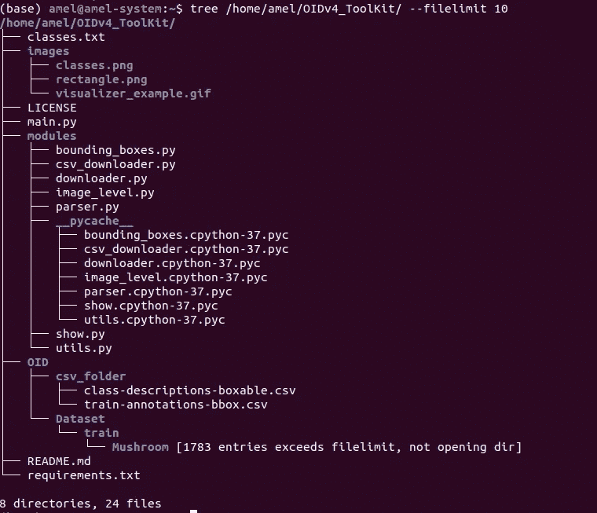
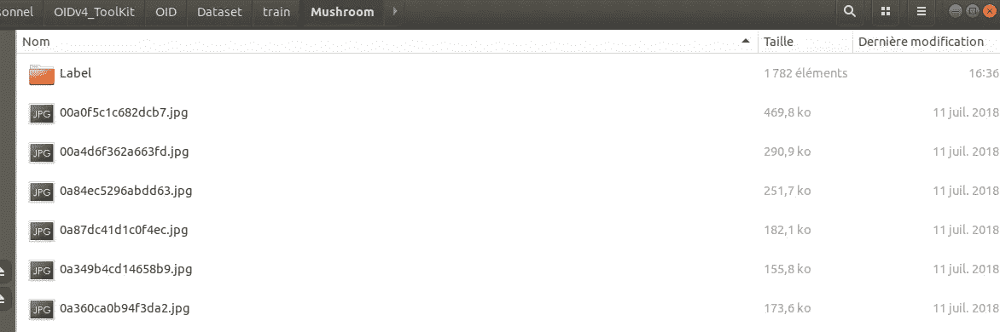
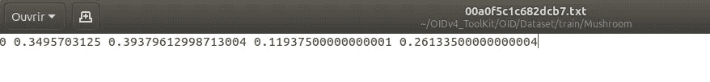

# YOLOv5，自定义数据集上的端到端对象检测器项目

> 原文：<https://towardsdatascience.com/yolov5-end-to-end-object-detector-project-on-custom-dataset-5d9cc2c95921?source=collection_archive---------5----------------------->

## YOLOv5，请检测蘑菇！

这可能是你给一个在森林里行走的无人机的命令。那太棒了！我们将在这里使用的技术是如此之轻，我敢肯定这不是一个幻想。

《草坪上的蘑菇》图片来自[公开图片数据集 V6](https://storage.googleapis.com/openimages/web/visualizer/index.html?set=train&type=detection&c=%2Fm%2F052sf&id=c44d38c06d38c4e5) 作者:[詹姆斯·鲍威](https://www.flickr.com/people/jamesrbowe/) ( [许可](https://creativecommons.org/licenses/by/2.0/))

在我的[上一篇文章](/computer-vision-lets-classify-mushrooms-6b3abe1561eb)中，我通过 Tensorflow 库使用 CNN 对蘑菇进行了分类。我使用了 Kaggle 上可用的[真菌竞争数据集](https://www.kaggle.com/c/fungi-challenge-fgvc-2018)。该数据集的许多图像包含具有丰富背景的多个对象。我问自己，如果对单个蘑菇或一群蘑菇的裁剪图像进行训练，也许我的模型可以得到改进。这也将有助于我的不平衡数据集。接下来是最先进的图像检测技术。

如果你关注人工智能新闻，你肯定听说过 YOLO。如果不是，你可能会问自己这是不是“你只能活一次”的哲学把戏。所以请放心，它不是。这个巧妙的缩写是“你只看一次”。请留下来，我们将定制这个华丽的工具来检测蘑菇。

如果你对这些都不熟悉，你可以在这里找到一篇关于物体检测的惊人文章。

## 在我们开始之前，先讲一个关于 YOLOv5 出生争议的小故事

YOLO 最初是由约瑟夫·雷德蒙在 2016 年 5 月创作的。这是实时物体检测的一次革命。请注意，这是约瑟夫雷德蒙来了这个如此好的名字。该代码已更新与阿里法尔哈迪的 3 个最初版本的关联。在那里，先驱们通过 Twitter 祝福阿列克谢·博奇科夫斯基(Alexey Bochkovskiy)领导 YOLO 学会。约瑟夫·雷德蒙的推文声明这不再是他的了。Alexey Bochkovskiy 在 2020 年 4 月推出了 YOLOv4。

YOLOv4 之后很多天，YOLOv5 被 Glenn Jocher 发布。关于这个名字有很大的争议，因为这个基于 Pytorch 的新模型与最初的 YOLO 毫无关系。这不是 YOLO 的新版本。这在社会上引起了很大的争议。你可以从阿列克谢·博奇科夫斯基[这里](https://github.com/AlexeyAB/darknet/issues/5920)以及[这里](https://blog.roboflow.com/yolov4-versus-yolov5/)的回应中读到它。无论如何，这个名字很棒，它是一个很棒的工具。我不知道 Alexey Bochkovskiy 将如何命名他的代码的新版本，或者他是否会制作一个新版本。不如不叫 YOLOv5，我们叫它 YOLOP“你只看一次 Pytorch”？我喜欢 YOLOP！

反正说了这么多，还是看看怎么定制它来检测我的蘑菇吧。

这里的想法是在蘑菇的标记数据集上训练 YOLOv5，保存宝贵的权重，并在我的 Kaggle 数据集或任何蘑菇图像上使用它们进行检测。

首先，您可以在 python 环境中的 Jupyter 笔记本上或者直接在终端控制台窗口上尝试下面的命令。我两个都做了，在终端控制台窗口中做更简单，但是如果你想打包并重试，我发现将代码封装在 Jupyter 笔记本下的函数中更容易。如果你想在电脑上不安装任何东西的情况下尝试一下，你可以直接在谷歌 colab 笔记本上尝试。多酷啊！

## **下载带边界框的标注数据集**

***选择数据集***

我们需要的是一个数据集，它能给每张图片提供我们最喜欢的物体的位置:蘑菇。因此，该模型将能够在看不见的图像上预测/检测蘑菇的位置。

我尝试了多个开放数据集，发现谷歌开放图像数据集是最容易使用的。[网站](https://storage.googleapis.com/openimages/web/visualizer/index.html?set=train&type=detection&c=%2Fm%2F052sf)允许显示带有检测框的图像。对我来说很有吸引力也很幸运，他们有蘑菇课。

[打开图像数据集 V6 的首页](https://storage.googleapis.com/openimages/web/visualizer/index.html?set=train&type=detection&c=%2Fm%2F052sf)类蘑菇

***下载数据集***

我选择使用开源工具包 [OIDv4_ToolKit](https://github.com/EscVM/OIDv4_ToolKit) 。随意使用 OID V6 推荐的[五十一](http://fiftyone.ai/)开源工具或者直接手动下载。

在这里，我要求蘑菇类的 6000 个图像，但训练集上可用的最大图像数是 1782。

我的终端控制台的图像

现在，我们有了带有边框的图像。

看看目前为止我在本地下载了什么。

我的终端控制台的图像

这些图像现在可以在蘑菇文件夹中找到，其中包含一个标签文件夹。

我的蘑菇文件夹截图

再走两步，我们就完成了数据集。首先，我们需要把所有的标签和图片放在同一个根目录下。轻松点。其次，我们需要将标签/边界框文件转换成正确的格式。txt 文件中存储的注释是坐标(XMin，YMin，XMax，YMax)。请注意，我们需要在 0 和 1 之间缩放的坐标。为了做到这一步，我知道你可以使用一些标签应用程序。但是我喜欢自己做！
所以首先我们修改 OIDv4_ToolKit/classes.txt 文件，只放蘑菇类。之后，我试着从 AIGuyCode 中取出 [convert_annotations.py](https://github.com/theAIGuysCode/OIDv4_ToolKit/blob/master/convert_annotations.py) 。并没有马上见效。因此，我将代码 convert_annotations.py 放在笔记本中，并对我的文件路径进行了硬编码。不知道为什么不行。但是代码很好，而且是开源的。
看看这里的！

让我们看看结果:

蘑菇文件夹的图像:注释和图像在同一个根目录下

让我们检查注释中的差异

以前

在...之后

现在我们准备好了！我们的图像数据集具有正确格式的边界框。现在就去拿模型吧！

## 安装 YOLOv5

YOLOv5 可用[这里](https://github.com/ultralytics/yolov5)。让我们克隆它。

我们需要该软件包附带的所有要求。为此，您可以使用 [requirement.txt](https://github.com/ultralytics/yolov5/blob/develop/requirements.txt) 文件，或者使用 pip 命令，如果您想更紧密地控制您对环境所做的事情。

请查看我在 [github](https://github.com/AmelNozieres/Mushrooms_YOLOv5) 上的 YOLOv5 文件夹。

我们需要添加一个 Yaml 文件，以便 YOLOv5 能够找到这个类。这里我在数据文件夹里加了 [*蘑菇. yaml*](https://github.com/AmelNozieres/Mushrooms_YOLOv5/blob/main/data/Mushrooms.yaml) 。请注意，您应该在这里输入我们之前用 OIDv4_ToolKit 修改的蘑菇文件夹的路径。

## 训练 YOLOv5 型

在 YOLOv5 的下载包中，我们有该型号的 [4 个版本](https://github.com/AmelNozieres/Mushrooms_YOLOv5/tree/main/models):yolov 5s，YOLOv5m，YOLOv5l 和，YOLOv5x。我会用小的，它是 YOLOv5s。你猜对了，字母 s、m、l 和 x 代表型号尺寸。

在训练命令中，为选定的模型提供以下参数:

*   **img:** 输入图像尺寸
*   **批量:**批量大小
*   **时期:**训练时期的数量
*   **数据:**我们之前创建的 yaml 文件
*   **cfg:** 这里选的型号我用的是小的
*   **权重:**一个自定义的权重路径如果为空，它将被保存在 yolov 5/runs/train/yolov 5 _ results/weights 中
*   **名称:**结果名称
*   **设备:** 0 使用 GPU
*   **缓存:**缓存图像以加快训练速度

这就是运行它所需要的一切

让我们看看结果:

results.png 存储在 yolov5/runs/train 文件夹中

所以在 yolov5n 文件夹里，你会得到你需要的所有报道。

我们来预测一下！

使用这个命令，您可以使用训练步骤中存储的权重来检测一个给出其路径的图像或所有测试图像。

很好，不是吗？

这也适用于视频和实时，所以在无人机的视频上编码应该很棒。

当我开始这个项目时，我不能在同一个地方找到所有的信息，所以这篇文章是我的经验的反馈，我希望是更完整的可能。如果你有任何问题，请在评论中告诉我。我当然找到了一些我忘记放在这里的其他技巧。希望这有助于您编写自己的检测器。如果你这样做，请让我知道你的项目。

编码快乐！

PS:我把我的代码放在 Github 上。