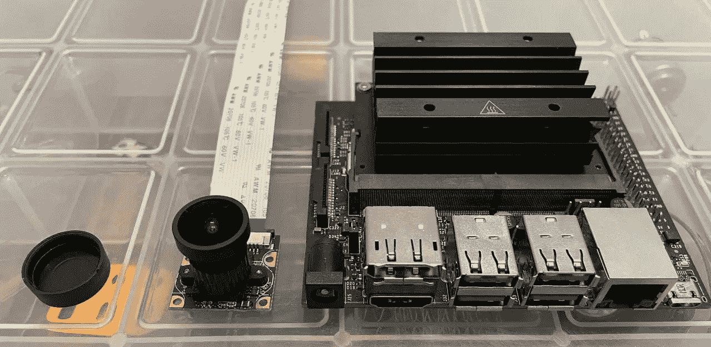
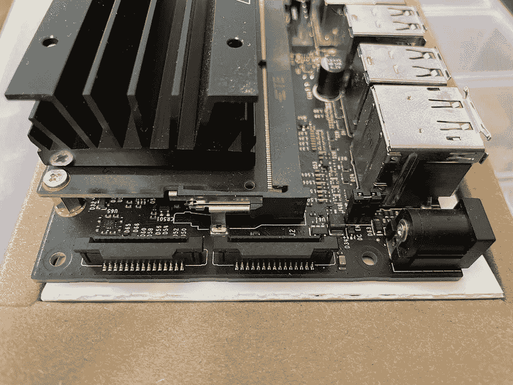
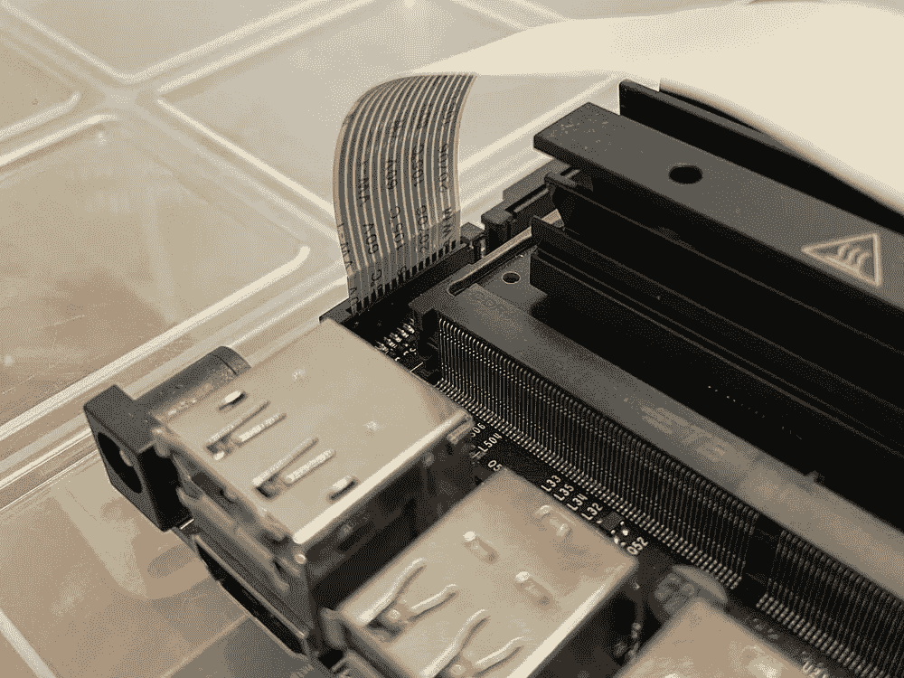
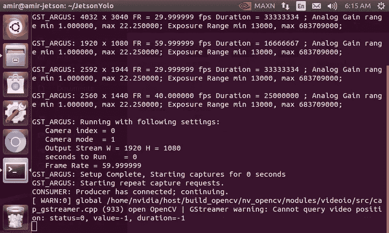
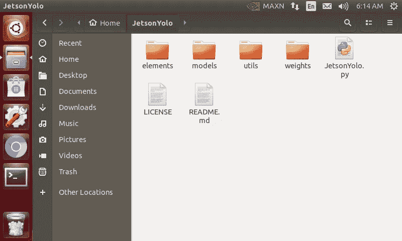
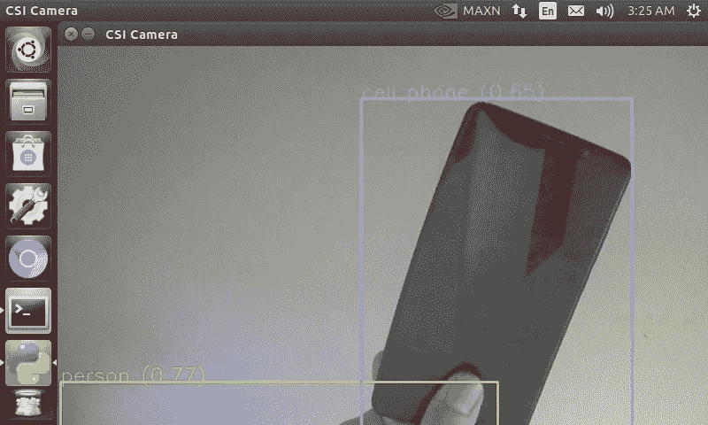

# NVIDIA Jetson Nano 上的 Yolov5 对象检测

> 原文：<https://towardsdatascience.com/yolov5-object-detection-on-nvidia-jetson-nano-148cfa21a024?source=collection_archive---------4----------------------->

## 使用 Jetson nano 开发套件进行 IMX477 CSI 摄像机配置和 Yolov5 物体检测的分步指南。



作者图片

本文介绍了在 NVIDIA Jetson Nano 上使用 Yolov5 和 openCV 进行 CSI 摄像机安装、软件和硬件设置以及对象检测的一个简单易行的过程。该项目使用 [**CSI-Camera**](https://github.com/JetsonHacksNano/CSI-Camera) 创建流水线并捕获帧，使用 [**Yolov5**](https://github.com/ultralytics/yolov5) 检测对象，在 Jetson 开发套件上实现了完整的可执行代码。查看视频说明的[**CodePlay jetson nano YouTube 播放列表**](https://www.youtube.com/watch?v=-A_CDLtQig4&list=PLZIi3Od9VUwW49q6T1VjShktoOgrDi3O4&index=3) 和[**jetson yolo Github**](https://github.com/amirhosseinh77/JetsonYolo)。

# 要求

杰特森纳米最常用的相机之一是树莓 Pi 相机模块 V2，但如果你需要更高的分辨率呢？最近，我试图在一个项目中使用 Waveshare IMX477 CSI 摄像机，但在将其连接到电路板时遇到了问题。最后，在尝试了几种不同的方法后，我想出了一个简单的流程，并决定与他人分享。本文由几个部分组成，包括硬件、驱动程序和 python 库安装，最后是 Yolov5。这些步骤对于使用 Jetson Nano 板上的摄像头进行物体检测都是必不可少的。

## 摄像机设置

将摄像机安装在载板上的 MIPI-CSI 摄像机连接器中。拉起摄像头端口的塑料边。推入摄像头色带，确保摄像头色带上的针脚朝向 Jetson Nano 模块。向下推塑料接头。您可以使用 [**Arducam 摄像机设置**](https://www.arducam.com/docs/camera-for-jetson-nano/native-jetson-cameras-imx219-imx477/imx477/) **指南**了解更多信息。



作者图片

## 相机驱动程序

默认情况下，NVIDIA JetPack 支持几种不同传感器的摄像头，其中最著名的是 Raspberry Pi camera v2。但是如果你使用的是另一种类型的相机，你需要安装一个传感器驱动程序。在这个项目中使用了一个带有 imx 477–160 传感器的 12.3 MP 摄像头，需要一个**附加驱动器**来连接。Arducam 为带有 IMX477 传感器的摄像机提供了一个易于绝缘的 [**IMX477 驱动器**](https://www.arducam.com/docs/camera-for-jetson-nano/native-jetson-cameras-imx219-imx477/imx477-how-to-install-the-driver/) 。(确保访问网站并使用最新的命令。)

下载自动安装脚本:

```
**cd ~****wget** [**https://github.com/ArduCAM/MIPI_Camera/releases/download/v0.0.3/install_full.sh**](https://github.com/ArduCAM/MIPI_Camera/releases/download/v0.0.3/install_full.sh)
```

安装驱动程序:

```
**chmod +x install_full.sh****./install_full.sh -m imx477**
```

最后，输入 y 重新启动板。

使用以下命令检查摄像机是否被正确识别。

```
**ls /dev/video0**
```

您可以使用[**JetsonHacks**](https://github.com/JetsonHacksNano/CSI-Camera/blob/master/simple_camera.py)**python 代码通过 **OpenCV** 从相机中捕捉帧。**

****

**作者图片**

## **火炬&火炬视觉**

**Yolov5 模型是在 Pytorch 框架中实现的。PyTorch 是一个基于 Torch 库的开源机器学习库，用于计算机视觉和自然语言处理应用。这里有一个在 Jetson 开发套件上安装 PyTorch 的完整指南。**

# **推理**

****在 Jetson nano 上克隆** JetsonYolo 存储库。**

```
**git clone** [**https://github.com/amirhosseinh77/JetsonYolo.git**](https://github.com/amirhosseinh77/JetsonYolo.git)
```

****

**作者图片**

## **下载 Yolov5 型号**

**根据模型尺寸、所需速度和精度选择所需的模型。您可以在**资产**部分的 中找到可用的型号 [**。使用下面的命令下载模型，并将其移动到 **weights** 文件夹。**](https://github.com/ultralytics/yolov5/releases)**

```
**cd weights****wget** [**https://github.com/ultralytics/yolov5/releases/download/v5.0/yolov5s.pt**](https://github.com/ultralytics/yolov5/releases/download/v5.0/yolov5s.pt)
```

**运行`**JetsonYolo.py**`用摄像机检测物体。**

```
**python3 JetsonYolo.py**
```

****

**作者图片**

# **结论**

**本文重点介绍如何使用 IMX477 摄像头捕捉帧并执行对象检测。设置这种类型的摄像机需要额外的驱动程序安装步骤，Arducam 已经为 Jetson Linux Driver (L4T)提供了一个驱动程序。在安装了必要的驱动程序和 Python 库之后，Yolov5 在 Jetson Nano 上实现为 JetsonYolo，并以每秒 12 帧的速度获得了令人满意的结果。**

> *****引文*****

```
@inproceedings{omidi2021embedded,
  title={An Embedded Deep Learning-based Package for Traffic Law Enforcement},
  author={Omidi, Abbas and Heydarian, Amirhossein and Mohammadshahi, Aida and Beirami, Behnam Asghari and Haddadi, Farzan},
  booktitle={Proceedings of the IEEE/CVF International Conference on Computer Vision},
  pages={262--271},
  year={2021}
}
```