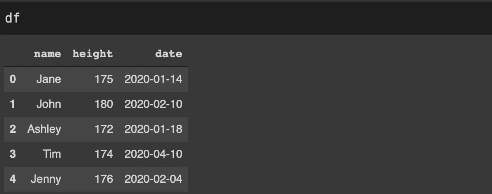
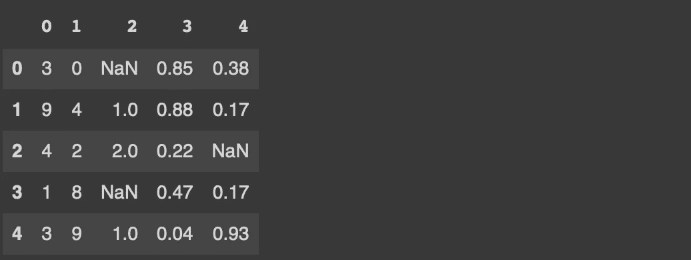
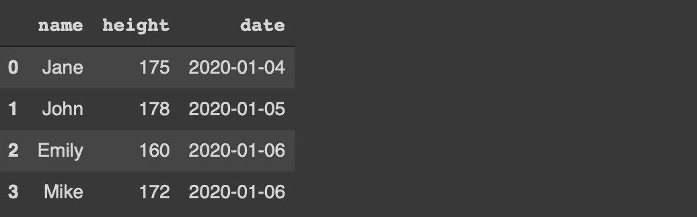
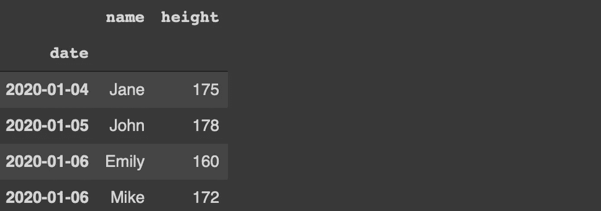

# 你可能没有充分利用熊猫的“read_csv”功能

> 原文：<https://towardsdatascience.com/you-are-probably-not-making-the-most-of-pandas-read-csv-function-51bcf069e646?source=collection_archive---------9----------------------->

## 它不仅仅是读取文件


在 [Unsplash](https://unsplash.com/s/photos/perfect?utm_source=unsplash&utm_medium=referral&utm_content=creditCopyText) 上 [Aljoscha Laschgari](https://unsplash.com/@alaschgari?utm_source=unsplash&utm_medium=referral&utm_content=creditCopyText) 拍摄的照片

Pandas 可以说是最流行的数据分析和操作库。我认为熊猫被广泛使用的原因是它具有大量强大而多样的功能。

Pandas 函数通常在默认设置下运行良好。但是，如果您有效地使用这些参数，它们可以提供更多的功能。在本文中，我们将详细介绍 read_csv 函数，以充分利用它。

read_csv 是最常用的 Pandas 函数之一。它通过从 csv 文件中读取数据来创建数据帧。然而，它几乎总是以默认设置执行。

如果您通读过文档，您会注意到 read_csv 函数有许多参数。这些参数增加了功能的功能性和灵活性。

例如，如果 csv 文件包含一列日期，它将存储在数据类型为 object 的 dataframe 中。但是，为了在 dt 访问器下使用 Pandas datetime 函数，我们需要 datetime 数据类型的日期。我们总是可以在读取数据后转换数据类型。更实际的方法是在读取数据的同时处理这项任务。

parse_dates 参数完成了这项任务。我们来做一个例子。我有一个包含 3 列的示例 csv 文件。

```
import numpy as np
import pandas as pddf = pd.read_csv("/content/sample1.csv")df.dtypes
name      object 
height     int64 
date      object
```

如您所见，日期列的数据类型是 object。

```
df = pd.read_csv("/content/sample1.csv", parse_dates=['date'])df.dtypes
name              object 
height             int64 
date      datetime64[ns]
```



(图片由作者提供)

数据类型在熊猫中很重要。大量函数是特定于特定数据类型的。因此，每一列都有合适的数据类型是高效和准确的数据分析和操作的一个要求。

我们可以使用 read_csv 函数的 dtype 参数将数据类型分配给任何列。尽管 Pandas 能够推断出合适的数据类型，但在某些情况下我们可能需要调整它们。

例如，字符串与对象数据类型一起存储。对于某些操作，最好使用字符串数据类型，而不是对象。

```
df = pd.read_csv(
    "/content/sample1.csv", 
    parse_dates=['date'],
    dtype={'name':'string'}
)df.dtypes
name              string 
height             int64 
date      datetime64[ns]
```

现实生活中的数据是杂乱的，通常需要大量的数据清理。丢失的值可能不会以标准格式表示，如 None 或 NaN。例如，“9999”或“？”可用于表示缺失值。

如果我们知道用作缺失值表示的值，我们可以在读取 csv 文件时处理它们。这些值被传递给 na_values 参数。

我们来做一个例子来演示这个案例。

```
df = pd.read_csv(
    "/content/sample2.csv"
)df
```


(图片由作者提供)

```
df = pd.read_csv(
    "/content/sample2.csv",
    na_value = [9999, "?"]
)df
```



(图片由作者提供)

我们通常在数据分析中使用布尔值。它们指示条件或值是否为真。布尔值有真和假，但原始值可能以不同的方式表示。

例如，是和否、正确和不正确、1 和 0、成功或失败是用来代替真和假的一些值。true_values 和 false_values 参数在读取 csv 文件时将它们转换为实际的 true 和 false 布尔值。

这里有一个简单的例子。


(图片由作者提供)

```
df = pd.read_csv(
  "/content/sample1.csv",
  true_values = ['Yes'],
  false_values= ['No']
)df
```


(图片由作者提供)

考虑这样一种情况，我们有一个非常大的 csv 文件，只需要其中的一部分进行分析。Pandas 提供了一些选项来处理这样的任务。

我们有以下 10000 行的 csv 文件。

```
df = pd.read_csv(
  "/content/sample1.csv",
)print(df.shape)
(10000,3)
```

第一个选项是使用 nrows 参数从头开始读取一定数量的行。

```
df = pd.read_csv(
  "/content/sample1.csv",
  nrows=500
)print(df.shape)
(500,3)
```

数据帧包含 csv 文件的前 500 行。

第二个选项是使用 skiprows 参数从开头跳过一定数量的行。

```
df = pd.read_csv(
  "/content/sample1.csv",
  skiprows=9500
)print(df.shape)
(500,3)
```

现在数据帧包含了 csv 文件的最后 500 行，因为我们跳过了前 9500 行。

skiprows 参数也接受 lambda 表达式。例如，下面的代码将从 csv 文件中每隔一行读取一次。

```
df = pd.read_csv(
  "/content/sample1.csv",
  skiprows = lambda x: x % 2 == 1
)print(df.shape)
(5000,3)
```

read_csv 函数还允许读取一些列。所需的列被传递给 usecols 参数。我们可以使用要读取的列的标签或索引。

```
df = pd.read_csv(
  "/content/sample1.csv"
)print(df.shape)
(100,50)
```

我们有一个 50 列的 csv 文件。假设我们想阅读前 10 个专栏。

```
df = pd.read_csv(
  "/content/sample1.csv",
  usecols = np.arange(10))print(df.shape)
(100,10)
```

Pandas 默认为数据帧分配整数索引，但是我们可以改变它。index_col 参数用于指定要用作索引的列。

考虑下面的数据帧。



(图片由作者提供)

如果我们想使用日期作为索引，我们可以如下读取 csv 文件。

```
df = pd.read_csv(
  "/content/sample1.csv",
  index_col = 'date'
)
```



(图片由作者提供)

## 结论

为了最大限度地使用一个函数，我们需要全面了解它的参数。对于 read_csv 函数，默认设置在大多数情况下都很好。然而，为了充分利用它，我们可能必须将一些参数付诸行动。

我们使用 read_csv 函数的参数实现的功能也可以在读取整个 csv 文件后完成。但是，这不是最佳选择。此外，我们可以通过在读取 csv 文件时处理这些操作来节省内存。

感谢您的阅读。如果您有任何反馈，请告诉我。