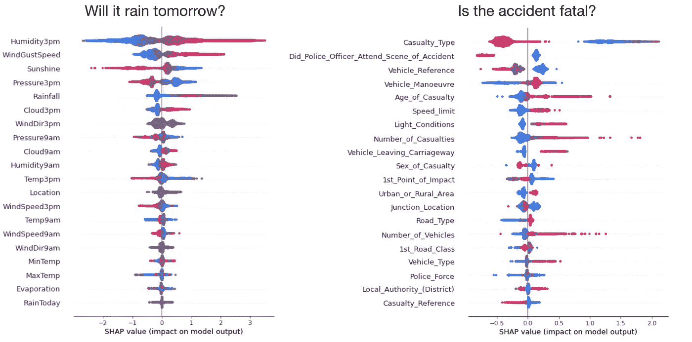
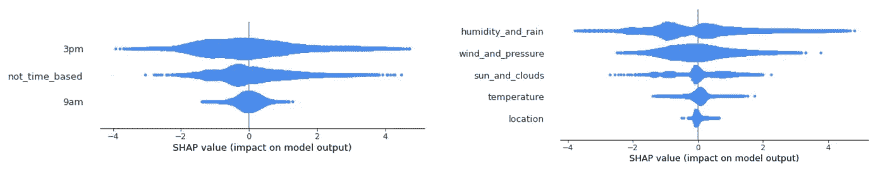
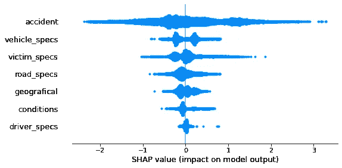
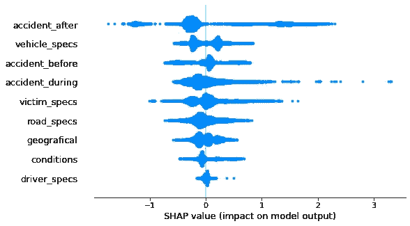
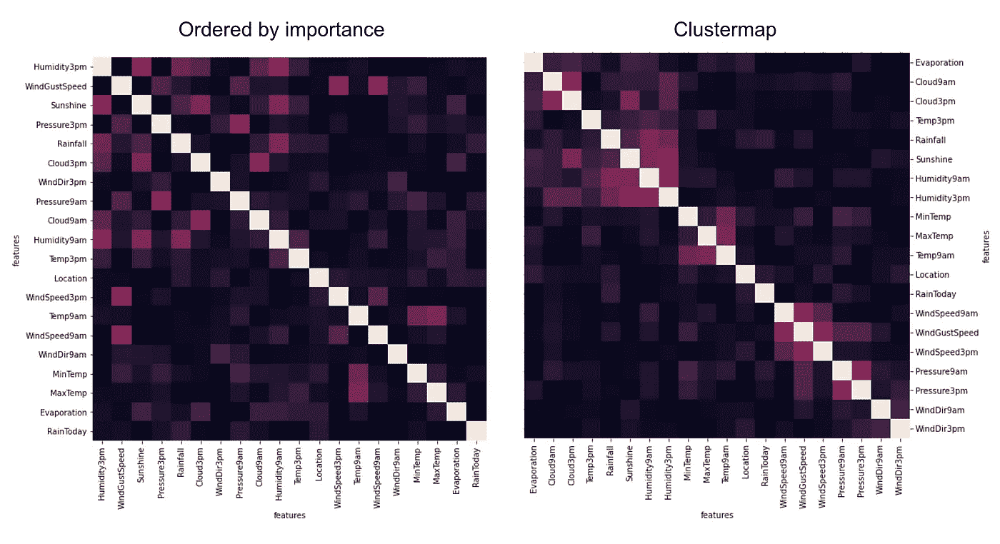
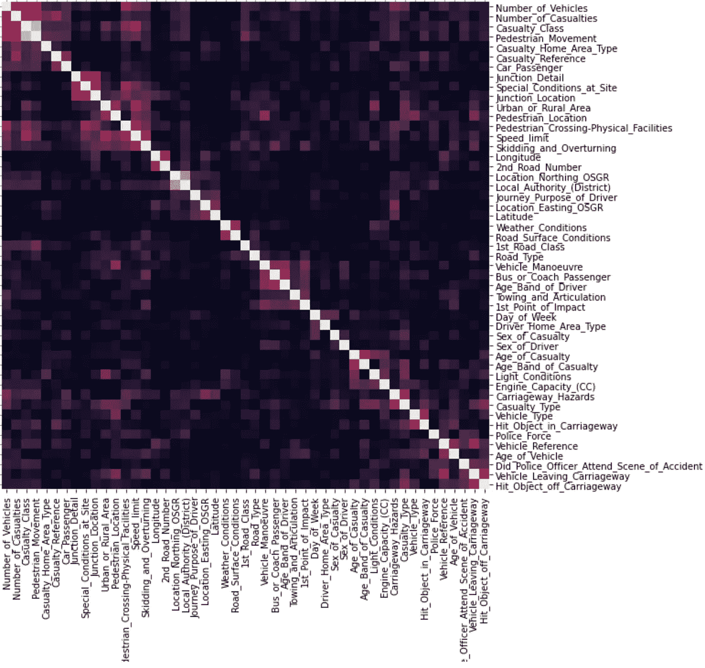
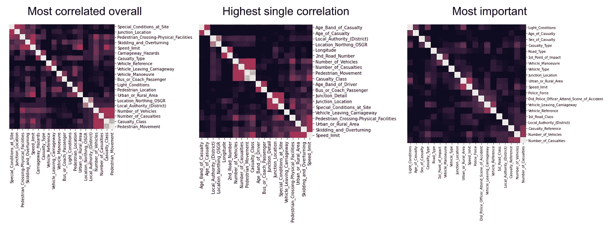

# 你没有充分利用 SHAP 值——特征组和相关性

> 原文：<https://towardsdatascience.com/you-are-underutilizing-shap-values-feature-groups-and-correlations-8df1b136e2c2?source=collection_archive---------6----------------------->

## 你的模型是你数据的一个镜头，塑造了它的望远镜

我和 SHAP 价值观合作已经有一段时间了，有机会测试了很多我从未在网上见过的应用程序，但它们运行得非常好，所以我想和更多的人分享。

因为这篇文章是更高级的东西，所以我不会对什么是 SHAP 价值观做任何更深入的介绍，除了重申它们给出了 l *ocal* 的解释，与*的具体数据点相关。*这就是他们力量的来源。它们也是对非结构化特征重要性的最正式的严格方法。

在本案例中，我将通过对要素进行分组和查看其 shap 值的相关性来展示两种有用的技术，以更好地理解您的数据。这里所有的代码都是。也看看[这篇文章](/you-are-underutilizing-shap-values-understanding-populations-and-events-7f4a45202d5)的更高级的分析。

# 数据集

我使用了两个不同的 Kaggle 数据集进行分析，试图揭示这些技术的潜力，但这只是一个玩具描述。只有当你想到在行业中实践机器学习时获得的数百个变量的庞大数据集时，你才能理解它们对你的帮助有多大。

[**澳大利亚会下雨吗**](https://www.kaggle.com/jsphyg/weather-dataset-rattle-package) **？** 关于前一天的 21 个变量
风、湿度、温度等。

[**车祸致命吗？**](https://www.kaggle.com/silicon99/dft-accident-data)59 关于撞车的变量
车辆、位置和事故信息

我选择了两个我以前从未处理过的数据集，我想看看这种基于模型的分析是否有什么有趣的见解。无论如何，我会和你分享我在剧情中所看到的。

*注意:为了获得合理的 shap 值，模型不应该过度拟合，否则 shap 值可能对测试集目标统计没有意义。*

# 功能组的形状

我们通常有自然的方法来分组我们的特征。例如，我们有不同的数据源，或者不同类型的信息。对于时间窗数据，我们可以使用不同窗口大小的要素，等等。在我们的案例中，可以单独查看每个特征，但是现在当你在表格模型上工作时，在早期建模阶段有数百个甚至数千个变量是很常见的。

有时，人们只是使用现成的汇总图将变量作为一个整体来看，然后对组内变量的原始值进行求和，甚至对整个数据集的绝对值求和，得出一个“该组要素的平均重要性”的数字。首先，*对原始值求和是很重要的，*因为你可以让相关变量相互对抗，让整组变量产生零影响，即使每个变量似乎都有一些影响。

然后，您可以使用与要素本身相同的逐个样本细节来查看要素组的形状(您会丢失作为颜色的变量值，因为您当然没有单个值，但是如果您感兴趣的话，您总是可以输入一些变量来显示大小)。

这些小组从不同的角度研究这些数据。很明显，下午 3 点比上午 9 点更重要(这有道理吧？它是后来的，所以它更接近我们想要预测的那一天)。同样，显而易见，与雨或湿度直接相关的变量比与风、压力，尤其是温度相关的变量更重要。

当我们处理更多的变量时，事情变得更加有趣。在英国事故数据集中，似乎真的有比我们一眼就能看到的汇总图更多的东西，我们可以通过对要素进行分组来开始质疑我们的数据。

与事故本身相关的特征对我们的问题(“事故是致命的吗”)最有影响，这很有意义。但是看起来事故组有很多不同的东西，如果能有一个更详细的视图就好了。我将事故变量分为三组:前的**、**期间的**、**后的**。例如*车辆操纵*在**之前**，*第一撞击点*在**期间**，而*Did _ 警察 _ 官员 _ 出席 _ 事故现场*在**之后。****

很有意义的是，**事故 _after** 变量有如此多的信息，因为如果事故真的很严重，警察可能只会去现场。但在事故发生之前，有一些信息是可用的，例如驾驶员的哪种操纵或者车辆是否正在离开车道，这是潜在的预测材料，可以帮助防止未来的事故(“不要在这里操纵”，“离开车道时减速”)。这必须谨慎进行，因为它不是一个因果模型，但我不想进入数据本身太深，因为我的目的只是给不同的 shap 分析一些想法。你可以这样做是为了获得具体的见解，或者像我在这里所做的那样，只是作为对数据集的基于模型的探索。

# 形状相关性

如果您正在研究高级 shap 分析，您可能已经了解了很多关于相关性的知识，并且知道当特征具有完全不同的分布时分析相关性是多么的不领情，或者更糟糕的是比较分类和数值特征。shap 相关分析具有不受这种差异干扰的非常有用的特性。无论特征是分类的、有序的还是连续的，它的形状值都是连续的。您可以从 shap 相关图中获得关于要素本身分布的一些见解，但您也可以了解它们的影响在模型中是如何相关的。您可以使用这种检查来驱动进一步的分析，例如具有意外依赖关系的特定变量对之间的依赖关系图。这里我画的是斯皮尔曼相关的绝对值。您可能对查看相关性本身感兴趣，但有时您只想知道变量是相关的，然后绝对相关性会提供更好的整体可视化。

这种分析还可以帮助您选择特性，因为您可以更好地理解变量之间的关系，这些关系可以是协同的或冗余的。如果变量是多余的，它们可能会分割它们之间的重要性，删除其中一个会增加另一个的重要性。但是我稍后会专门发一个关于特性选择的帖子，所以让我们举最后一个例子来激发你的大脑潜能和可能性。

车祸的变数太多，很难在这里集中注意力。反正可以看一些明显的关联，比如*路口细节*、*特殊条件*和*路口位置。*我还不确定在这种情况下，对于大型特征集，最好的可视化方式是什么，但是我已经准备了另外三种有趣的可视化方式，仅仅是为了给我们的数据提供不同的视角。

有些比较明显，比如*年龄带*和*年龄，*有些有道理，比如*打滑翻车*和*限速(左)。*但是*车辆 _ 驶离 _ 车道*和*警察 _ 警官 _ 出勤*的关系呢(右)？与*公共汽车或蔻驰乘客*相关的两个相关性很有趣，其中*驾驶员的年龄范围*(中间)*、*以及*车辆操纵*(左)。想一想为什么这种相关性会存在！公共汽车没有太多的机动动作，其司机也没有总司机那么多样化。如果我们感兴趣的话，我们可以深入了解我们的模型到底发生了什么。

某些选定变量的绝对相关聚类图(标题中的选择)。

# 结束语

所有的代码都在[这本卡格尔笔记本](https://www.kaggle.com/estevaouyra/shap-advanced-uses-grouping-and-correlation)里，在那里我得到了数据集并非常直接地应用了分析。在这篇文章之后，我还写了另一篇更高级的分析，如果你喜欢这篇文章，也可以看看那里的。

我希望我能够提供一些见解，也许可以帮助你进行一些你不知道如何做的日常分析，或者这些想法可以帮助你探索和理解你的模型或数据集-记住 shap 可以同时帮助我们。