# 你没有充分利用 SHAP 价值观:理解人口和事件

> 原文：<https://towardsdatascience.com/you-are-underutilizing-shap-values-understanding-populations-and-events-7f4a45202d5?source=collection_archive---------13----------------------->

## [实践教程](https://towardsdatascience.com/tagged/hands-on-tutorials)

## 你的模型是你数据的透镜，SHAP 是它的望远镜

我和 SHAP 价值观合作已经有一段时间了，有机会测试了很多我从未在网上见过的应用程序，但它们运行得非常好，所以我想和更多的人分享。这篇文章是[关于特性组和相关性的另一篇文章的延续](/you-are-underutilizing-shap-values-feature-groups-and-correlations-8df1b136e2c2)。

我选择了一个更简单的帖子，只是为了看看人们是否觉得它有用，因为我在那里有很好的回应，所以我想分享一个更有趣的分析，我认为这需要我付出更多的努力，他们在这里！我确信如果你有很多变量的表格数据，它们会很有用。

再说一遍，既然这篇文章是为了更高级的东西，我就不深入介绍什么是 SHAP 价值观了，除了重申它们给出了 l *ocal* 的解释，与*的具体数据点相关。这就是他们力量的来源。它们也是对非结构化特征重要性的最正式的严格方法。*

所有代码都在[这个 kaggle 笔记本](https://www.kaggle.com/estevaouyra/shap-advanced-uses-subpopulations)里。

## 数据集

我使用了两个不同的 kaggle 数据集进行这些分析，试图揭示这些技术的潜力，但这只是一个玩具描述。只有当你想到在行业中实践机器学习时获得的数百个变量的庞大数据集时，你才能理解它们对你的帮助有多大。我在[的另一篇文章](/you-are-underutilizing-shap-values-feature-groups-and-correlations-8df1b136e2c2)中给出了更多关于它们的信息，所以在这里我只是重申一下基本情况。

[**澳大利亚会下雨吗**](https://www.kaggle.com/jsphyg/weather-dataset-rattle-package) **？** 关于前一天的 21 个变量
风、湿度、温度等。

[**车祸致命吗？**](https://www.kaggle.com/silicon99/dft-accident-data)59 关于撞车的变量
车辆、位置和事故信息

# 子群体形状

这是最让我困惑的一个应用程序，它的使用率很低。它提供了在许多应用中非常有用的信息，但人们通常不会直接计算它们，而是查看全局汇总图并推测不同组中的重要性会有什么不同。

通常根据模型的预测来划分人群，以便为每个人群建立特定的策略，例如在将患者送去做更多检查或送回家的医疗应用中，或者在需要收入证明的信用评分应用中。

在我们的玩具示例中，我们可以通过模型对第二天下雨的预测来划分我们的日子。在这种情况下，变量的重要性顺序不会改变很多，但是根据应用，每个预测波段的轮廓可能非常不同。

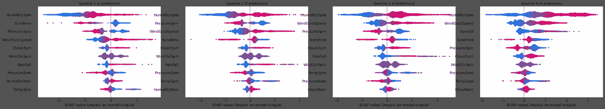

澳大利亚降雨的预测四分位数

它在英国事故数据集中也没有太大变化。除了总的来说最重要的变量始终是受害者的类型(行人、骑自行车者等)，我们可以看到年龄在高风险路段(4 和 5)更明显，而第一撞击点仅在低风险路段(1 和 2)明显。看到这一点，我的直觉是，如果人更“脆弱”，例如行人、老人，撞击点并不重要，在这种情况下，事故更有可能是致命的。但这只是我的第一个想法，如果这种洞察力很重要，我们可以进一步分析数据本身。

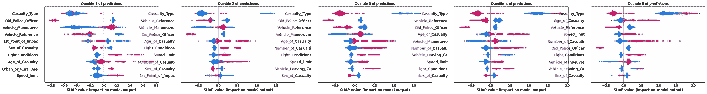

事故死亡率预测五分位数

我们可以把不同的年份分开，看看这个模型是否在一段时间内总体稳定。我们可以看到，在 2013 年，阳光的重要性已经超过了风速。如果变量的分布在其他年份有所不同，这将在这张图表中显而易见。

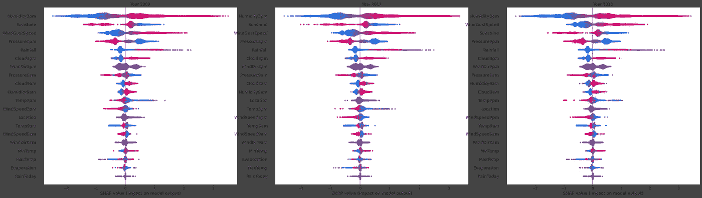

我们也可以问问自己，热天与冷天在影响降雨概率的变量分布方面有多大差异。只需查询数据集并获得相应的行，我们就可以比较每个拆分。虽然寒冷的日子更受风和降雨本身的影响，但炎热的日子日照是第二个最重要的变量。

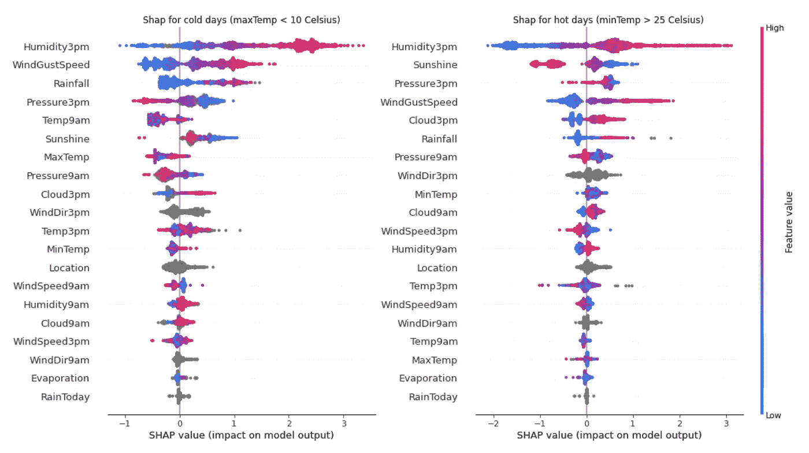

例如，在事故数据集中，我们可以查看不同类型的伤亡事故，试图了解每种事故的特征影响有何不同。例如，我们可以看到，第一撞击点对于公共汽车乘客来说是不同的重要，而速度限制对于摩托车事故来说是不同的重要。

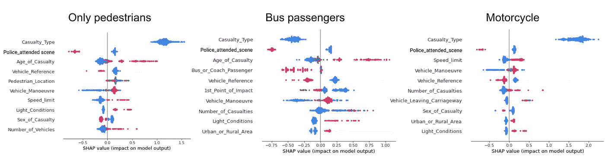

根据我们想知道的内容，可以对上面简单显示的概要图进行许多改进。假设我们想知道的恰恰是“在摩托车与行人的碰撞中，哪些特征具有不同的碰撞轮廓？”。我们可以精确地问我们的 shap 值。

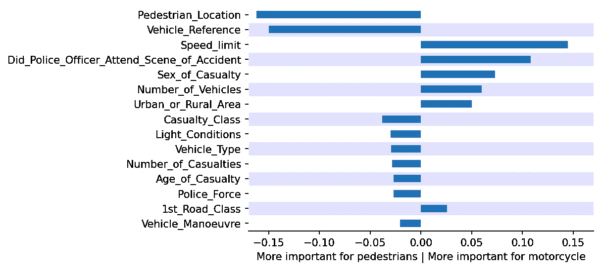

为了说明我的意思，我在这里展示了每组的平均 shap 值之间的差异。有趣的是，最大的差异不一定在最重要的特性上。此外，根据应用的不同，可能有其他更好的差异指标(例如，仅使用中位数或其他分位数而不是均值，或者 KL 散度)，但我不想深入研究某个特定的应用，只是为了直观地了解您如何思考自己对模型影响数据的分析。

# 选择子群体的形状

现在回到基础。我们刚刚看到了如何对不同的子群体应用 shap 分析来分别理解它们或对它们进行比较，现在我们将注意到如何使用 shap 本身来选择子群体。

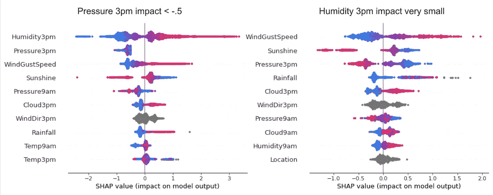

在我这里的所有数据中，没有什么太有趣的东西，但我希望你能明白。因为数据集中的每一行都有一个关联的 shap 值，所以我们可以根据特定的标准使用这些值进行过滤。上面，我选择了湿度不是影响变量的所有例子，我们可以看到其他特征的形状。相反，我们可以查看特定特性的值，我们可以查看该人群的其他指标或我们感兴趣的任何内容。

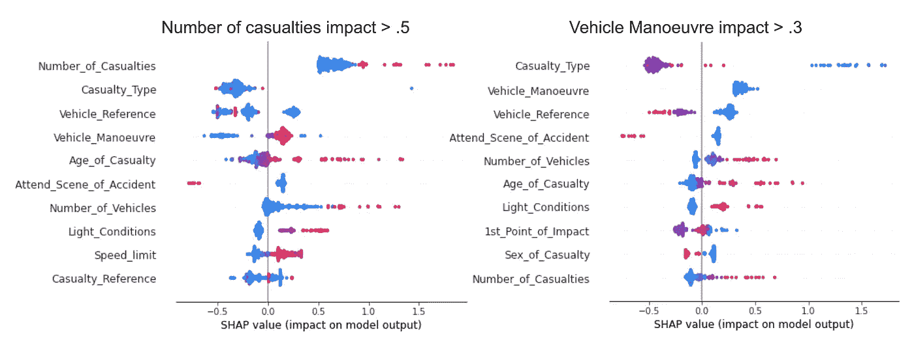

例如，假设你在一家社交媒体公司工作，你正在测试一个包含信用信息或教育信息或类似信息的新数据源，你将使用这些信息来改进平台内部的一些算法。很可能，来自新数据源的特性会对您的客户产生非常不同的影响，您可能想知道为什么。我们可以假设，这些信息将对互联网使用率低的客户非常有影响，因为你自己的内部社交媒体数据对于高使用率的客户来说已经非常有用了，这就为低使用率的客户留下了盲点，而这些低使用率的客户可能会受到这些非互联网数据的启发。

嗯，很容易看出是否是这样的情况:只需为你的新功能选择具有较大 shap 值的客户，并查看他们的互联网使用概况。您可以通过多种不同的方式对其进行分析，以尝试并了解受您的新功能高度影响的人群。例如，如果您想决定是否为这个数据源的更新付费，这可能是必不可少的。只是一个细节:如果你有很多新特性，你可能想把你的 shap 值分组，就像我在[这篇文章](https://medium.com/r?url=https%3A%2F%2Ftowardsdatascience.com%2Fyou-are-underutilizing-shap-values-feature-groups-and-correlations-8df1b136e2c2)中解释的那样。

所有这些都是为了说明你可以直接查询你的 shap 值，而且这种查询可以让一些查询变得容易很多。

# 我的数据上发生了什么—了解事件

你应该清楚的一点是，有了好的问题，你可以从 shap values 中获得很好的洞察力。我所说的理解事件是比较人群的更一般的版本，根据你所做的选择(你的“测试和控制组”，如果你可以的话)，你可以得到有价值的洞察力。

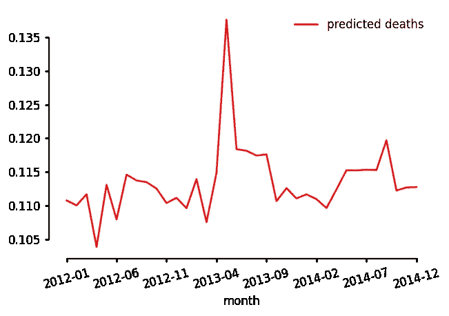

我不确定在这两个 kaggle 数据集中是否会有什么有趣的东西可以分析，但是当我画出每个月的预计死亡人数时，我很清楚我们有一个很好的事件可以研究。为了更好地理解这一事件，我将模型的预测与实际死亡进行了比较。似乎在 2013-05 年死亡率确实增加了，但预测和真实之间的比率达到了最大值，这意味着该模型预测过度(相对于其典型行为)。

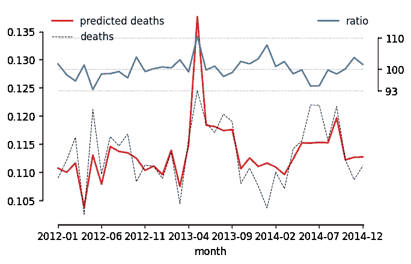

我看了一眼 shap 值，将 2013 年至 2005 年与 2013 年至 2004 年进行了比较，就像我之前比较人口一样。就好像事件是我的“试验组”，前一个月是我的“对照组”。我可以使用完整的数据集作为“控制”，或者使用完整的数据集减去事件。请注意，根据不同的选择，您将回答不同的问题。

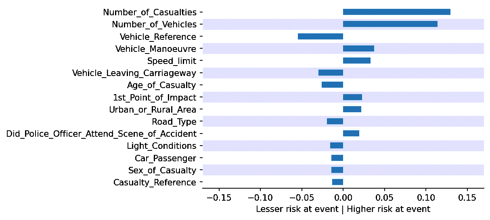

与上个月的功能影响比较。因为我只对增加风险的变量感兴趣(为什么峰值这么大),我可以只看正 diff 变量。

两个最大的影响差异在*伤亡人数*和*车辆数量*。我会描述“这些变量在事件期间有不同的影响”，或者更好地说“与上个月相比，这些变量不同地增加了风险”。

因为伤亡人数(和车辆数量)如此之大，我决定查看有大量伤亡的数据。我在同一事故的数据集中找到了 4600 行！其中 12%报告死亡。

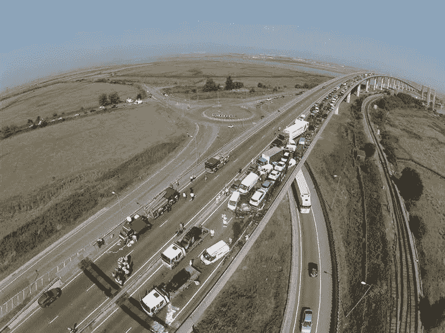

2013 年在 Sheppey 十字路口发生的重大事故。[来源](https://www.kentonline.co.uk/sheerness/news/britains-biggest-crash---one-22962/)。

只是出于好奇，我做了一点研究，发现了关于这个巨大事故的[很多新闻，经经纬度证实。甚至还有 youtube 视频。但是我注意到自动`to_datetime`没有正确捕捉日期，因为它是 9 月 5 日，而不是我想的 5 月 9 日。此外，4600 行的绝对数量与 150 辆汽车的消息不一致，至少乍一看是这样，因为我没有对数据生成和数据集的创建进行更多的研究。无论如何，这里的目标与其说是从这个特定的数据集获得洞察力，不如说是说明技术，所以我不会担心这一点。](https://www.bbc.com/news/uk-england-kent-23970047)

假设我们想确保我们理解为什么我们的预测增加了那么多:然后我们可以测试伤亡人数和车辆数量是否真的使我们的预测相差那么多。

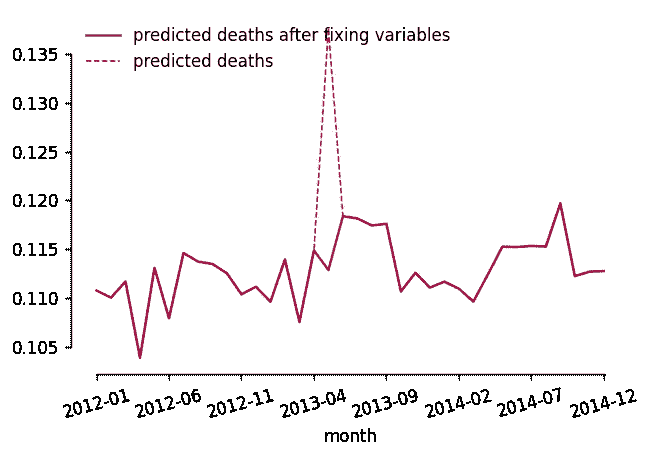

因此，我将这些变量固定为上个月的平均值(大约 2)，并重新运行该月的预测。我们可以看到预测下降了很多，完全打破了那里原来的峰值。

我在这里做的分析都很简单，在某些情况下，你可能需要做得更好——比如以一种更微妙的方式输入变量，而不是一些平均值——但我相信这些简单的分析或类似的东西可能会在很多时候提供足够的信息。

## 应用程序

想象一下，你正在预测一家电子商务公司下个月的收入，突然你的预测比上个月下降了 20%!这可能是因为业务或经济中的实际问题，也可能是因为您的模型中的某些变量由于某种任意原因而中断。你可以使用我称之为的*形状事件分析来解开正在发生的事情。*

或者想象一下，你的预测一周接一周地不断减少，你想知道这些变化是系统性的，依赖于许多变量，还是由一两个变量引起的。这类问题可能需要我们考虑更好的分析，比如根据形状随时间变化的斜率对特征进行排序，等等。

无论如何，有趣的是引起变化的主要特征可能不是模型中最重要的特征。我们讨论的是相对形状，其平均形状从 0.05 变化到+0.05 的特征在事件发生前和发生时的汇总图中都是不可见的，但可能是预测变化的最重要驱动因素。

# 结论

我很高兴至少有一个有趣的数据点可以更好地理解，因为我不确定这些 kaggle 数据集是否足以说明这些技术。我希望已经给了你一些基础和直觉，关于更好的 shap 分析，可以用来理解一般的东西，甚至监视正在发生的事情。

希望你觉得它有用，如果你有疑问，请通过在 LinkedIn 上发布答案或[给我发消息来告诉我。](https://www.linkedin.com/in/estevao-uyra-pv/)

在[这个 Kaggle 笔记本](https://www.kaggle.com/estevaouyra/shap-advanced-uses-subpopulations)中找到所有的分析代码。