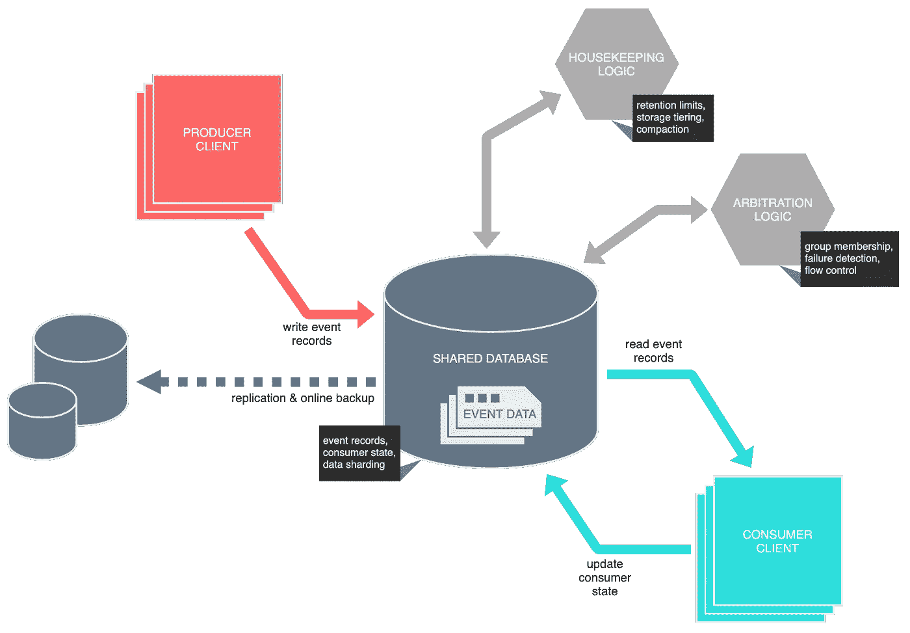

# 你可以用数据库代替卡夫卡

> 原文：<https://towardsdatascience.com/you-can-replace-kafka-with-a-database-39e13b610b63?source=collection_archive---------6----------------------->

[图片来自 Unsplash]

## 但是看在上帝的份上，不要

工程师们一直在寻找少花钱多办事的方法。这篇文章温和地提醒人们，与陈词滥调相反，少并不总是多。

我愉快地想起了一集旧的 Top Gear，主角们每人得到 1 万英镑，购买一辆二手中置引擎意大利超跑，从布里斯托尔开到斯劳的一家绅士俱乐部。以经典的 Top Gear 方式，大屠杀接踵而至:哈蒙德买了一辆锈桶法拉利 308 GT4，克拉克森买了一辆“不可阻挡的”玛莎拉蒂 Merak(刹车曾有过辉煌的日子)，梅带来了一辆从一开始就坏了的兰博基尼 Urraco(由于电路不稳定，开在卡车后面)。从娱乐的角度来看，这一集真的很棒。汽车本身真的很糟糕；没有人能坚持到拍摄结束。

你可能会想，他偏离了自己的轨道。这一切跟数据库和卡夫卡有什么关系？首先，这一集在 2011 年播出，同年 LinkedIn 发布了 Kafka。但我向你保证，不是那样的。

是什么促使了这一切？网络上充满了奇特的比较和古怪的伪逻辑含义。例如，因为 Apache Kafka 是一个持久的中间件，一些互联网“专家”热衷于指出它实际上是一个数据库！它让你存储记录并检索它们，当然这是一个数据库。不，不是，但这有点跑题了。最近，我的兴趣被一个更罕见、甚至更不寻常的论断激起了——如果你愿意的话，是前者的反义词。也就是说，由于他们所谓的相似性，你实际上并不需要卡夫卡——你需要的只是一个普通的旧数据库。消息传递:已解决！表面上。

花点时间澄清一下，我已经被关于仿效卡夫卡《没有经纪人》的关键部分的建议淹没了。当您可以通过快速访问零件箱来构建自己的平台时，为什么要采用世界上最受欢迎的开源事件流平台呢？你所需要的只是一个数据库和一点编程工作？

我最近在 Quora 上做了一篇[短片，简洁地解释了为什么这是一个如此糟糕的想法。在这里，我有机会阐述一下。](https://www.quora.com/Why-do-we-need-Kafka-We-can-always-write-events-to-a-database-instead-of-a-topic-and-consume-those-events-by-querying-the-database-every-second/answer/Emil-Koutanov)

公平地说，Quora 问题的关键并不是用一个类似的数据库支持的解决方案来取代 Kafka，以及所有的华而不实的东西，而是更可能是一种快速而廉价地实现基本的持久消息传递功能的方法，而不需要致力于一个成熟的消息传递平台——另一组齿轮，它们有自己的部署和维护开销、基础设施要求、技术学习曲线等等。从表面上看，这是一个很有说服力的论点——为什么要有意识地引入复杂性，而用少得多的资源就可以获得相似的结果呢？所以，我们再深入挖掘一下。

我们都遇到过这种情况:一个组织要求在激进的时间框架内实现雄心勃勃的目标，而这个组织似乎很少关心构建可持续的软件密集型系统，以增加长期价值。也许你在一家初创企业中辛勤工作，或者为一家大型商业银行工作……更重要的是，你的团队领导或友好的开发经理让你承担一项需要做出重大工程妥协才能实现目标的任务。团队没有使用正确的工具来完成工作，而是决定用手头的东西来凑合。毕竟，时间是至关重要的。那些管理奖金不会自己赚到。(实际上，你会感到惊讶。)

首要前提很简单。以共享数据库服务器为例——关系模型或文档存储。将事件作为记录从生产者进程写入表(或*桶*、*集合*、*索引*等)。(确切的术语取决于所讨论的数据库；因此，我们在最广泛的意义上使用术语“表”。)数据库可以使用一个表来保存所有事件记录，用一个索引属性来表示事件类型——模拟“主题”的概念。此外，主题可以通过“分区”进一步分解，使用另一个索引属性捕获记录键或它们的散列。方便的是，使用分片的 No/NewSQL 数据库可以提高可伸缩性，因为主题和分区可以分布在数据库节点的主动-主动集群中。

从消费者实例定期轮询数据库，在处理记录时更新消费者的状态。在数据库支持的情况下，在消费者端使用连续查询来最小化资源开销和周期性查询的延迟。(连续查询在 NewSQL 产品中变得越来越常见；虽然在主流 SQL 数据库中还是有些少见。理想情况下，模型应该允许多个生产者和消费者同时操作；否则，系统的可伸缩性将受到损害。无法支持并发消费者，系统至少应该支持主动-被动故障转移；否则，可用性将会受到影响。

下图展示了我们的临时事件总线的概念模型。

艺术家对数据库支持事件总线的印象[图片由作者提供]

跟踪消费者状态和处理不相交的消费者组的精确机制是不确定的。您可能会考虑借鉴 Kafka 的著作，使用偏移量来跟踪消费者的位置，同时将记录持久化到逻辑消费之外——从而支持单个持久化数据集中的多组消费者。或者，可以通过在插入点复制记录，在消费后删除记录来实现不相交的消费者组。

图中还有几项值得注意。第一个是“仲裁逻辑”。我们需要一种机制来仲裁记录数据的消费，这样就不会有记录被两个相关的消费者同时消费，并且记录以正确的顺序被处理——这是我们系统的安全属性。此外，我们需要确保消费者偶尔的失败不会阻碍进展——活性属性。这两个属性在分布式系统的设计中至关重要。

图表中的另一个重要项目是“内务逻辑”。这涉及到清除陈旧数据的需要，确保我们不会失去控制而耗尽存储。或者，我们可以将较旧的数据移动到更便宜的存储层，而不是不可挽回地将其清除。内务处理还可能包括诸如记录压缩之类的活动——丢弃已被更新事件取代的事件，避免下游的额外处理。

架构部分就绪后，让我们看看游戏如何进行。

从功能的角度来看，在数据库之上设计一个消息传递系统是完全可能的。但是，您很快就会意识到，数据库只能满足您最基本的持久性需求——记录的存储和检索、备份和复制(如上所示),以及(在某些产品中)高可用性和/或水平 I/O 扩展。您甚至可以获得原子事务。

像 Kafka 这样的平台关注的是以记录为中心的流数据，这主要涉及到*分布*——而不仅仅是记录的持久性。这就是棘手的地方。在构建分发层的过程中，当涉及到仿真 Kafka 提供的开箱即用的基本功能的子集时，您几乎总是要重新发明轮子。

例如，Kafka 有内置的机制，用于扇出数据，并通过持久偏移支持多个不相交的消费者，这是通过一个称为消费者组的结构自动管理的。Kafka 还允许您轻松地对数据进行分区，以并行处理记录，同时保留因果相关记录的顺序。一个使用者组可以用来在一个组内的使用者群体中平均分配分区，这是一种负载平衡器。它处理消费者的扩展以及消费者组内的故障——在组中幸存的成员之间重新分配负载。在上图中，这被笼统地称为“仲裁逻辑”。模仿这种功能需要您从头开始构建一个组成员服务，以及一个故障检测器。如果使用 Java，你可以遵从一个库——比如 [JGroups](http://www.jgroups.org/) 。或者，如果你需要与其他语言交互，群组成员可以在[领事](https://www.consul.io/)或[阿帕奇动物园管理员](https://zookeeper.apache.org/)之上实现。或者，如果你真的想要简朴，你可以依靠数据库来帮助仲裁组成员——通常通过一些应用级的租用协议。仲裁逻辑驻留在哪里是一个单独的问题；仲裁逻辑可以打包成独立的进程，也可以嵌入到消费者的进程空间中。采用后者会使您拥有更少的“活动部件”，但如果消费者生态系统是用多种编程语言实现的，则会导致更复杂的消费者实现和可重用性的损失。无论如何，你正在积累复杂性——这正是你想要避免的。

下一个:家政。存储很便宜，但不是免费的。I/O 也不是，尤其是在处理非常大的 B 树索引时，这种索引随着时间的推移变得臃肿和支离破碎。实现基本的基于时间的清除本身并不困难，但是它需要在某个地方托管清道夫逻辑——通常在一个专用的进程中(比如 CRON 作业)。或者，您可以在生产者或消费者流程中托管清道夫，这可能需要一些协调逻辑，并且在多语言生态系统中再次丧失可重用性。存储分层将复杂性提升了一个档次。最后，您可能需要在某个时候实现压缩——删除被最近事件取代的事件记录，从而减少消费者端的处理。现在，您正在执行复杂且消耗资源的查询，平衡功能性、可维护性和性能。

事件流平台的另一个经常被忽视的特性是访问控制。Kafka 提供了对系统中所有参与者(消费者、生产者、管理者)的细粒度控制，以及对操作类型(读、写、创建、删除、修改等)的细粒度控制。)它们被允许调用和可能被操作的资源(主题、消费者组、配置)。换句话说，我们可以准确地控制谁可以访问什么。在两个进程通过共享介质进行通信的小型系统中，安全性可能会被忽略。然而，随着我们系统的增长，信息安全变得势在必行。大多数数据库提供访问控制；但是，它的粒度仅限于表级别。在一个表中包含逻辑上独立的记录集的情况下，这可能是不够的，这迫使您将记录拆分到多个表中，并相应地分配权限。你希望避开经纪人吗？抱歉，老伙计。

在数据库的基础上构建这些功能(以及我没有提到的许多其他功能)——虽然可能，但也是一项艰巨的任务。从基本原则出发实现这一点既耗时又容易出错，并且需要“一套特殊的技能”。

从非功能的角度来看，Kafka 在生产者端(单位时间内发布大量记录)和消费者端(尽可能并行处理大量记录)都针对高吞吐量进行了优化。数据库不能碰这个。

通用数据库——包括关系数据库和 No/NewSQL 数据库——通常面向广泛的存储和检索模式。性能自然是一种妥协。Kafka 可以轻松处理在商品和云硬件上每秒移动数百万条记录，延迟在数十到数百毫秒之间。我已经在稍微受欢迎的[为什么卡夫卡如此之快](https://medium.com/swlh/why-kafka-is-so-fast-bde0d987cd03)一文中解释了它是如何做到这一点的。为了方便读者，我在这里总结一下。

Kafka 没有详细说明“快速”的定义，而是通过某些深思熟虑的设计决策实现了其标志性的性能特征，如使用仅附加日志(避免随机 I/O)、批处理读写、批处理压缩、非刷新缓冲写入(避免`fsync`)、零拷贝(不涉及 CPU 并最大限度地减少模式切换的 I/O)、绕过垃圾收集，以及其他几项。相反，Kafka 没有提供基于内容定位和检索记录的有效方法——这是数据库相当有效的方法。(这就是卡夫卡不能被视为数据库的原因；如果不扭曲基本定义，就不可能。)但是作为一个分布式的、只附加的日志，Kafka 是无可匹敌的。

在数据库中实现类似的吞吐量和延迟数字可能需要专业硬件和高度集中的性能调优的组合，这本身就是一项利基技能。根据所选择的数据库，这实际上可能无法实现。在对性能敏感的环境中设计和构建数据密集型分布式系统还需要具备跨多个学科的卓越工程能力。

举一个例子——偏移提交管理。卡夫卡的速度来源于效率。不同于在消费点删除消息的传统消息代理(招致随机 I/O 的惩罚)，Kafka 不会在消息被消费后清除它们——相反，它通过在内部主题上发布特殊的“偏移”记录来独立跟踪每个消费者组的偏移。(实际上，递归地应用它自己。)Kafka 的消费者很“便宜”，因为他们不会修改日志文件。这意味着大量的消费者可以同时阅读相同的主题，而不会使集群不堪重负。添加一个消费者仍有一些成本，但主要是顺序读取，顺序写入率较低。因此，在多样化的消费者生态系统中分享一个卡夫卡主题是相当正常的。

在数据库上模拟消费者组当然是可能的，但是这并不简单，也不具有高性能——更新消费者的偏移量需要数据库 I/O，这并不便宜。或者，您可以通过物理或逻辑复制每组消费者的记录来模仿消费者群体——很像 RabbitMQ 和类似产品采用的扇出策略——然后在消费后立即删除记录。同样，数据库 I/O 是不可避免的；更糟糕的是，你现在正在放大写。你甚至可以走上优化之路:使用不同的数据库来跟踪偏移量，甚至使用磁盘支持的内存缓存——比如 Redis、Hazelcast 或 Apache Ignite。以复杂性为代价，I/O 变得更便宜。

综上所述，也许您有一个小型系统，您的消息传递需求非常基本，您的性能和可用性需求适中。在这种情况下，以上几点都不太可能说服你；数据库支持的解决方案可能看起来更有吸引力，概念上也更简单。一想到摆脱经纪人可能就很有诱惑力。您过去可能已经构建过类似的数据库支持的解决方案，并且可以理解的是，您有信心可以用最少的努力来修改现有的代码。

这很公平。然而，我劝你在考虑现在的同时，也要考虑未来的需求。您需要确定，无论您今天部署的是什么解决方案，您和您的同事都可以在未来几年轻松维护(重点是后者)。该系统需要应对未来的负荷，或者至少提供一条增长的途径。我倾向于认为，在某个平行宇宙中，我们都是分布式和容错系统方面的知名专家，超快、无限可伸缩的数据库无处不在。现实更加令人清醒。使用 Kafka 这样现成的事件流媒体平台的优势在于，你可以利用其建设过程中所付出的巨大工程努力——该平台已经存在了大约十年，最初由 LinkedIn 孵化，2011 年开源。这转化为无数的基本特性、稳定性、性能，以及一个庞大而积极的工程社区的支持，从而确保产品的连续性。

你可能会问，这一切与《Top Gear》这一集有什么关系？主角的任务是在资源不足的情况下实现一个不切实际的目标。以娱乐的名义完成，非常精彩——为了你最终的观看乐趣，以他们的代价获得一个难忘的笑声。同样，试图在共享数据库上模拟一个功能和性能适中的事件流平台是徒劳的，也有点讽刺意味。如果有的话，这将是值得纪念的。

在处理以事件为中心的数据时，是否没有数据库支持的解决方案的空间？当然有。在事件驱动的架构中，数据库可以与事件流平台和谐共存。这是另一篇短文的基础——事件存储库的设计。在这里，我认为事件存储的大多数预期功能——实体状态快照、二级索引、实体突变历史、窗口和聚集、流连接等等——只能使用数据库来实现。我还认为没有放之四海而皆准的事件商店；任何重要的事件存储几乎肯定是定制的实现，由一个或多个现成的数据库支持。总的来说，数据库在组织数据以便有效检索方面非常有用，只要你不把它们用作(近)实时发布平台。

这篇文章对你有用吗？我很想听听你的反馈，所以不要退缩。如果你对卡夫卡，Kubernetes，微服务，或者事件流感兴趣，或者只是有什么疑问， [*在 Twitter 上关注我*](https://twitter.com/i/user/562466177) *。我也是*[*Kafdrop*](https://github.com/obsidiandynamics/kafdrop)*的维护者和* [*有效卡夫卡*](https://www.apachekafkabook.com/) *的作者。*