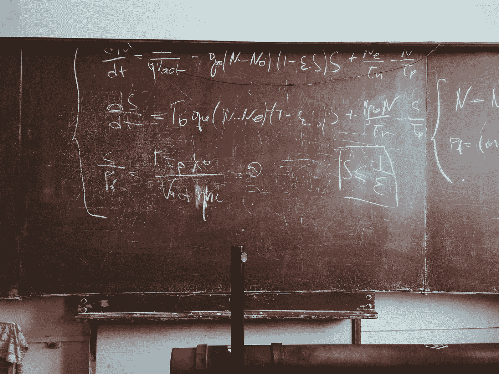

# 机器学习确实需要数学

> 原文：<https://towardsdatascience.com/you-do-need-math-for-machine-learning-cf934a607960?source=collection_archive---------7----------------------->

## 不要跳过 ML 中最不受重视的技能。写代码，学理论。

照片来自 U[n flash](https://unsplash.com/photos/5mZ_M06Fc9g?utm_source=unsplash&utm_medium=referral&utm_content=creditShareLink)——署名属于[罗马法师](https://unsplash.com/@roman_lazygeek)

# 介绍

显然，让有抱负的机器学习工程师相信学习理论在实践中被高估已经变得非常流行。各自文章的作者喜欢声称他们能够在没有深刻理解数学概念的情况下做好工作。

由于迄今为止，我在大多数行业项目中的经历都完全相反，所以我想分享一个基本上与众不同的观点。因此，我认为这篇文章会受到我个人对这个话题的偏见的影响。然而，我对这些论点深信不疑，所以希望你能容忍我。

首先，让我们从一个思维实验开始:

# 潜在的生存偏差

想象一下，一个没有任何数学知识的未来 ML 工程师正在学习基础知识，准备涉足这个领域。他或她在网上阅读的许多文章认为，对该理论的良好理解或多或少是强制性的。除了辞职，我们的潜在客户现在面临两种选择:

*   遵循建议，建立坚实的数学知识基础。与此同时，最好学习编码和个人项目工作
*   忽略这些建议，只关注后两个

假设他们选择了选项 2)并找到了一份工作。一切都很顺利，他们设法在行业中茁壮成长。四年后，他们发现根本不需要那些配方。事实上，他们能够证明那些来自学术界的势利小人是错误的，那些人告诉他们，如果没有基础知识，他们就会失败。

现在可能是在 Medium 上写一篇文章的好时机，告诉大家数学和统计在现实世界的机器学习中是如何被高估的。

相反，考虑一个平行宇宙，在那里我们的曼梯·里学徒有着完全相反的经历。工作几个月后失败了，因为不知道一些理论，事情就不那么容易了。现在，他们可能会也可能不会决定是时候弥补他们的知识差距了。

然而，他们写一篇关于这种经历的文章的动机可能会比第一种情况低得多。谁喜欢在公共场合谈论他们个人的失败，尤其是由一点点粗心引起的失败？

这个虚构的场景绝对不是为了贬低任何有过这样经历的人！相反，我想鼓励你在没有理论的情况下，对机器学习成功的个人故事持保留态度。

仅仅因为它对互联网上的一些人有效，并不意味着同样的方法对你或一般人也有效。

我甚至会说，从长远来看，将机器学习理论视为一门被高估的学科很容易让你陷入困境。为了支持这种说法，我现在将继续举一些其他的例子，并把它们放在一个更广阔的视角中。

这些场景在某种程度上是基于我自己的轶事经验和偏见。因此，我建议你也不要盲目相信我自己的推理。

# 每个问题看起来都像钉子

让我们假设您——相信预打包的库就是您所需要的——正在开发一个需求预测模型，该模型是根据过去销售的商品进行训练的。网上有很多使用 RNNs 和 LSTMs 进行时间序列预测的例子和教程。

因此，您只需选择您最喜欢的模型，并根据您的数据进行调整。

一切都很好，MSE 每天都在变得更好，并且你格外小心不要在你的测试中引入任何[前瞻偏差](https://www.linkedin.com/pulse/avoiding-forward-bias-time-series-machine-learning-rohit-walimbe-1/)。最后，您将模型提交给管理层，现在第一个问题出现了:

管理层希望在他们的预测中看到置信区间。

您进行了研究，了解到您还可以使用神经网络来拟合基于网络输入的 T2 正态分布。这个例子显然需要根据您的递归模型进行定制。

鉴于您现在已经有了开箱即用运行 ML 包的经验，这当然不再是一个问题。模型得到更新，你做下一个演示，甚至管理层都很高兴，你的模型最终被推向生产。现在，每个人都很高兴接下来的两周。

在短暂的平静之后，你的采购和销售部门开始抱怨。出于某种原因，你的模型在某些情况下预测了负需求。这再次导致越来越不愿意相信一个除了你和你的团队之外没有人理解的模型。

如果这些置信区间不是一个要求，你可以简单地通过正确的激活函数挤压你的预测。一个 ReLu 可能就足够好了。

这在这里是不可能的，所以你再次回到实验室，发现你可以[截断正实数的正态分布](https://en.wikipedia.org/wiki/Truncated_normal_distribution)。由于你的问题现在相当具体，你在网上再也找不到合适的例子，因此需要自己摸索。

最后，你成功了，模型实现了，你期待着最终离开这个项目。不知何故，随着时间的推移，事情变得有点令人伤脑筋。

然后，在你开始做你的第一个模型几个星期后，有人提醒你卖出的商品数量不一定等于实际需求。出于显而易见的原因，你不能比你的公司销售的更多。

因此，如果有足够的数量，你在数据中看到的可能远远低于人们实际购买的数量。

这就把你带到了审查数据的概念。你现在必须完全自己推导的损失函数，给了你一些不舒服的感觉，你开始想接下来会发生什么。

这个例子是构造出来的吗？在某种程度上，是的，但我实际上在实践中处理过一个非常类似的问题，说得好听点，知道一点理论是相当有帮助的。这里有两件事需要考虑:

**1)在上面的例子中，如果你首先意识到你的问题的统计特性，你能节省多少时间？**

当然，每个项目迟早都会结束，希望是一个成功的项目。然而，在这个过程中，如果你能够以一种全面的方式定义你的问题，你就有可能跳过很多的尝试和错误。

如果我们在早期就意识到我们正在处理一个连续的、积极的、被审查的目标，我们可能会更快地找到一个合适的模型。

现在让我们实话实说:你总是会遇到超出你现有知识范围的问题。尽管如此，坚实的基础至少可以帮助你把解决问题的过程引向正确的方向。

**2)你能只用标准库就做到吗？**

尽管有上面的例子，你仍然可以通过预打包的模型获得合理的性能。但是，请想一想:如果您知道您的数据具有高度二次关系，则具有二次变换要素的简单线性模型可能会优于任何复杂的替代模型。

一个复杂的神经网络可能需要数百个示例才能在这项任务中获得合理的性能。另一方面，我们提出的线性模型只需要一部分数据就可以快速收敛到生成函数。

现在让剩余项近似遵循广义 Beta 分布，定制模型的性能会突然比 sklearn 的任何模型都好。

另一个更实际的最近的例子是新冠肺炎模型。如果你想让你的生活变得简单，你可以把每天的病例输入 LSTM 来预测未来的感染。然而，这种方法会完全忽略像 T2 先生及其后代这样的烈性传染病模型。

这种方法已经存在了几十年，单独使用任何一种 ML 算法都很难胜过它们。一个奇特而有创意的解决方案可能会把 ML 放在这些已建立的模型之上。

如果你决定，在任何时候，将你的 ML 方法建立在 SIR 的基础上，你最好准备好钻研一些公式。突然间，微分方程不再那么没用了…

总结这一部分:不要误解我！预包装的型号通常开箱后性能很好。然而，你应该记住，有时你需要为你的特定问题量身定制解决方案，以获得实际优势。

当您的数据太小时，ML 实际上无法自己找到任何有意义的结构，这种情况尤其如此:

# 在机器学习中，数据集的大小很重要

考虑另一个虚构的场景:

你正在参加一个工作面试，并与你未来的老板讨论你的机器学习模型可能会为他们解决什么问题。假设我们正在与一家工业材料生产商打交道，他们的目标是通过计算机视觉检测传送带上的受损货物。

碰巧的是，你在过去的 6 个月里一直在图像分类项目上努力工作，而你的 Kaggle 分数在这段时间里直线上升。这给了你极大的自信，你告诉你的潜在雇主，他们最好当场雇用你。

快进—你得到了这份工作，现在你第一次看到了他们目前收集的数据。当你把鼠标移到数据文件夹，发现总共只有 100 张图片时，你突然感到不寒而栗。

对于训练一个可靠的神经网络来说，这些例子显然太少了。如果你幸运的话，你甚至可以在考虑一个`import tensorflow as tf`之前，就要求他们将这个数额增加 100 倍。

万一你运气不好，你的老板会告诉你，创建新的训练数据代价太大。

质量保证团队需要进行成本高昂的测试，以确定某个物品是否受损。在这一点上，除了尝试构建一个定制模型并尽可能多地将领域知识融入其中，可能没有其他选择了。

当预先打包的解决方案不再存在时，坚实的数学基础现在允许你在你的算法中表达复杂的概念。

在更高的层面上:如果你的特定问题的性质偏离标准太多，标准库算法可能根本不起作用。在这一点上，基本上没有其他选择，除了写你自己的算法，你应该知道一些理论。

# 速度的问题

如果您经常使用 Python 和 R，您可能已经达到了尽可能避免 for 循环的程度。尤其是当您的模型在每个训练时期运行多个循环时，性能会迅速下降。

这对于现代模型来说尤其不方便，因为在现代模型中，GPU 和 CPU 已经频繁地被推到极限。

幸运的是，许多这些方法依赖于线性代数。由于后者，我们可能能够用更快的矩阵乘法来取代缓慢的 for 循环，甚至从将整个块移动到 GPU 中受益——参见[本文](https://medium.com/@aishahsofea/for-loops-vs-matrix-multiplication-ee67868f937)中的介绍性示例。

在一般情况下，我们可以依靠大量关于如何提高计算线性代数效率的文献。《T2 矩阵计算》一书可以说是关于这个话题的一个非常受欢迎的来源。

特别是对于高斯过程回归，最近已经开发了大量的性能改进。现代计算线性代数使许多这些解决方案成为可能。

这里[这里](https://arxiv.org/abs/1903.08114)[这里](https://arxiv.org/abs/1503.01057)可以找到一些参考资料。

除了性能之外，另一个支持计算的例子是浮点精度。由于内存是有限的，一些数学运算会导致有效的计算产生无用的数据。我最喜欢的统计学例子是[最大似然估计](https://en.wikipedia.org/wiki/Maximum_likelihood_estimation)。

我不会在这里详细说明，但是天真地运行最大似然法很快在计算机上变得不可行。除非—我们在这个过程中利用了对数的单调性和积和性质。

你可以在这里找到关于这个主题[更广泛的解释，在这里](https://math.stackexchange.com/questions/892832/why-we-consider-log-likelihood-instead-of-likelihood-in-gaussian-distribution)找到一个相关的问题[。](http://gregorygundersen.com/blog/2019/01/18/log-likelihood/)

当然，你很可能不想在学术界发表你的模型和解决方案，那么为什么还要费心呢？嗯，一个聪明的数学“技巧”可以决定在一个 10 实例 GPU 集群和一台笔记本电脑上运行您的模型。

能够以这种方式为公司和客户节省大量资金，肯定会提升你作为机器学习工程师的市场价值。

# 大海捞针

让我们考虑赞成学习某种理论的最后一个论点。如果你曾经不得不调试一个复杂的计算机程序，你可能会体验到这个过程是多么的令人厌倦。

有时候你需要花几个小时去发现代码中的一个问题，然后才意识到这个错误实际上是多么的愚蠢。

现在想象一下，你要用一种你从未见过的外国编程语言调试一个程序。如果你幸运的话，有人已经在 Stackoverflow 上解决了完全相同的问题，你可以简单地复制他们的解决方案。

然而，当程序太复杂时，你可能需要自己解决用外语工作的障碍。在某些时候，你可能会找到正确的解决方案，然后继续前进。

然而，这个过程可能会比你一开始就知道这门语言要困难得多。更有经验的人可能只需要几分钟就能解决一个你花了几个小时甚至几天才发现的问题。

当你在没有任何理论知识的情况下实现复杂的深度学习模型时，这也可能发生在你身上。现代神经架构看起来越来越像真正的计算机程序。

如果你不相信我，我推荐你看一看[神经图灵机](https://arxiv.org/abs/1410.5401)或者[可微分神经计算机](https://deepmind.com/blog/article/differentiable-neural-computers)。

现在，即使你在 Github repo 中找到了你最喜欢的模型，你可以复制和粘贴，一旦你输入你的特定数据集，你可能仍然会得到奇怪的结果。

渐变爆炸？也许你应该首先标准化你的数据。你的可变自动编码器产生垃圾？考虑将您的方差输出神经元转换为严格正的。正态分布不适用于负方差。

虽然尝试、错误和有益的在线社区可能最终会引导你找到解决方案，但这个过程可能会相当令人生畏和漫长。如果你不能依靠对正在发生的事情的整体理解，你遇到的任何错误都可能让你受到机会和其他人的帮助的支配。

在您的机器学习之旅的早期，这肯定会定期发生在您身上，并且是意料之中的。然而，在某些时候，你可能不想再用 Stackoverflow 上的五个未回答的问题来为错过的截止日期辩护了。

# 关键要点

缺乏数学和统计知识应该阻止你成为一名机器学习工程师吗？肯定不是！在生活中，平衡的方法可能是最可持续的选择。

我绝对不认为博士学位是在这个领域取得成功的必要条件。不过，让我总结一下我的主要观点，以建立一个坚实的理论基础:

*   找到提高预测和计算性能的方法的机会增加了
*   您有更广泛的工具箱来解决非标准问题
*   开发变得更快更有效，因为您确切地知道您的模型内部发生了什么
*   您可以在早期发现违反理论的情况，并避免它们导致任何后续问题

一开始就学习肯定会让你慢下来。尽管如此，长期的好处将远远超过最初的麻烦。

希望这篇小文章已经说服你开始深入研究机器学习的理论方面，如果你还没有这样做的话。当然，你不应该忽视这门手艺的其他方面，比如编程、计算机科学和早期的应用项目。

如果你刚刚开始，我希望你在这个迷人的旅程中有很多乐趣。

最后，如果你不同意我的评估，我期待着一次愉快的讨论——无论是在评论中还是通过其他沟通渠道。

*原载于 2021 年 7 月 2 日*[*【https://sarem-seitz.com】*](https://sarem-seitz.com/blog/you-do-need-math-for-machine-learning/)*。*