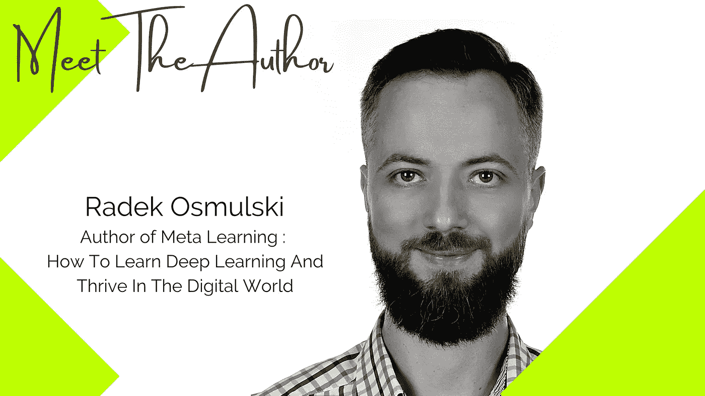
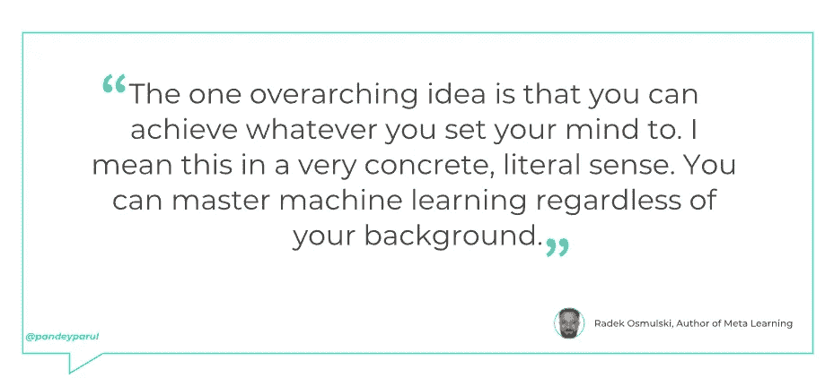
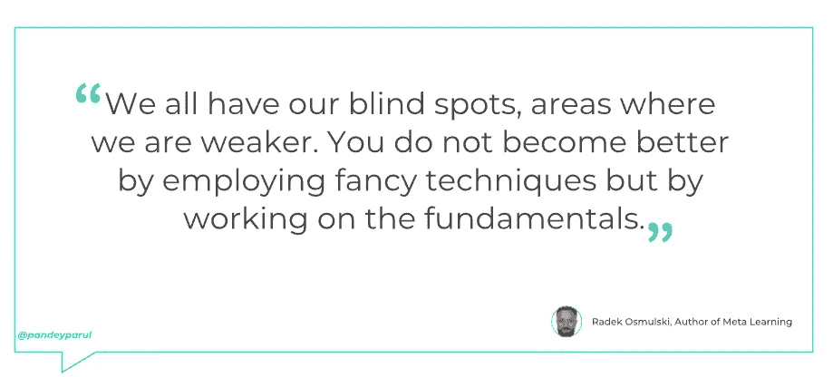
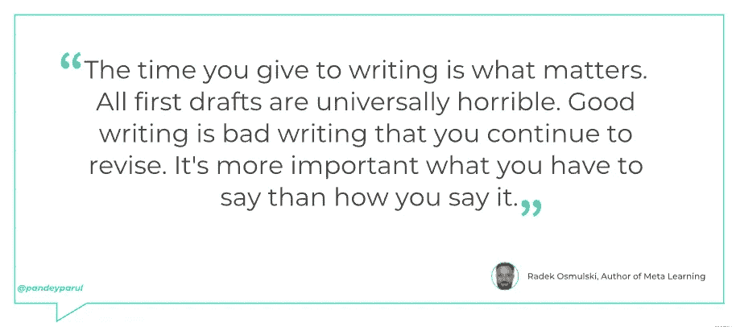

# 你不会因为使用花哨的技术而变得更好，而是通过在基础上努力

> 原文：<https://towardsdatascience.com/you-do-not-become-better-by-employing-fancy-techniques-but-by-working-on-the-fundamentals-17d5c471c69c?source=collection_archive---------9----------------------->

## 《元学习:**如何学习深度学习并在数字世界茁壮成长**一书的作者 Radek Osmulski 访谈

*一系列采访强调了作家在数据科学领域的出色工作以及他们的写作之路。*

照片由 Radek Osmulski 提供

> “只要你写你想写的，这才是最重要的；没人知道这是长久的还是仅仅几个小时的问题。”
> ― **弗吉尼亚·伍尔夫，*一间属于自己的房间***

为了将机器学习领域的显著工作推向前沿，我去年开始了一系列采访。在第一季中，我 [***展示了来自知名数据科学家和 Kaggle 大师***](https://github.com/parulnith/What-I-learnt-by-interviewing-numerous-Kaggle-Grandmasters) 的故事，他们分享了他们的旅程、灵感和成就。第二季，我在采访书籍作者。作为一名作家，我非常尊重写书的人。一篇写得很好的文章需要大量的时间、精力和耐心，而为一本书复制同样的内容绝非易事。本期访谈将揭示数据科学领域一些知名作者的故事。

# 见见作者:Radek Osmulski

Fastai 社区众所周知，不仅为世界提供了进入机器学习的手段，还不时提供了伟大的研究人员。Radek Osmulski 就是这样一位快速学习的人工智能研究工程师。他为来自硅谷、澳大利亚和迪拜的几家初创公司工作。2018 年，他赢得了谷歌赞助的 Kaggle 比赛。令人惊讶的是，Radek 没有正式的数学或计算机科学背景。关于学习机器学习和成为可雇佣的人，有许多事情他必须弄清楚。他在他的书→ [**元学习:如何学习深度学习并在数字世界中茁壮成长**](https://radekosmulski.gumroad.com/l/learn_deep_learning) 中记录了他的所有学习，在这次采访中，我们将了解更多关于他在这本书背后的想法、动机以及对数据科学爱好者和作家的建议。让我们开始吧。

问:这本书的想法是如何产生的？

***Radek:*** 学习机器学习有这么多让人惊讶的事情。

最初，你可能会觉得你在学习 ML 上投入了很多努力，但进展甚微。你可能会经历一系列讲座或完成一门 MOOC 课程。但是当面对现实生活中的 ML 问题时，你可能很难找到正确的方向。

你回顾过去的六个月，虽然你可能会发现你在学术上学到了很多，但你影响周围世界的能力可能只有轻微的变化。

这正是我的经历。我在这种学习的边缘状态中度过了几年，对我周围的世界没有任何影响。没有雇主敲我的门。我尝试了一下 Kaggle，但发现它非常令人困惑。

有几次，我想放弃，想中途退出。所以我连续五个月没碰过 ML。

但后来我决定再试一次。这次我不会用我的方式。我会不遗余力地研究什么对其他人有效，其他人如何学习并与社区互动，以及他们如何取得惊人的成果。

这让一切都不同了。结果是惊人的。

很快我赢得了一场纸牌游戏比赛。从那以后，我担任了几个非常体面的深度学习角色，与我见过的一些最有趣的人一起工作。

我从没想过我的生活会变成这样。我写了元学习来分享导致这个令人惊讶的结果的想法和技术。

在更个人的层面上，我写这本书的动机是为了与 fastai 社区保持联系。曾经有一段时间，我会在 fast.ai 论坛上发很多帖子，我当然很怀念那段时间。我也在寻找一种结束我投入了八年生命的冒险的感觉。

问:你能为读者总结一下这本书的要点吗？

***拉德克:*** 确定！我努力使这本书尽可能简洁。在大约 90 页的篇幅里，我讨论了学习中理论和实践的相互作用、成为一名优秀的开发人员意味着什么、我们使用的工具的重要性、机器学习的核心是什么等等。

作者图片

但最重要的一点是，你可以实现你下定决心要做的任何事情。我指的是非常具体的字面意思。不管你的背景如何，你都可以掌握机器学习。

但是你不能仅仅靠意志力和努力来做到。这样不行。

你不必设定夸张的目标，不必非常自信，也不必非常有才华。无论如何，很多事情都是旁观者的看法。

但重要的是你采用什么方法，你继续学习。

问:你认为这本书的目标读者是谁？

***Radek:*** 任何认为自己是机器学习学生的人。

这是一个非常宽泛的范畴。一方面，**元学习**的目的是让一个绝对的初学者，并向他们展示他们需要专注于什么以取得快速进步。

这对已经学习机器学习一段时间或刚刚开始学习的人来说特别有帮助。

作者图片

但你也可能是一个经验丰富的专业人士，仍然会从阅读这本书中受益匪浅。

我们都有自己的盲点，我们的弱点。你不会因为使用花哨的技术而变得更好，而是通过在基础上努力。

另外，不管你的背景如何，让自己了解互联网上的事情是如何进行的，这是一个非常有价值的提议。

**问:读者怎样才能充分利用这本书？**

***Radek:*** 念出来。记下你遇到的想法。和你的朋友讨论它们。洗澡的时候想想他们——在推特上说说他们。把它们变成你自己的。

诚实地尝试这些技术。什么对你特别有效？把这种或那种技术付诸实践，你感觉如何？

正是通过这些活动，我们可以反思自己的经历，并用自己的话来表达我们所学的东西，这样我们才能学得最好。

问:对于一个刚刚起步的新作家，你有什么建议？

***Radek:*** 写作就像机器学习一样。

从事机器学习项目有一个自然的流程。你首先想出一种方法来验证你的结果。然后构建一个简单的模型。当您迭代管道的所有组件时，您可以提高模型的性能，同时确保您的模型可以很好地概括看不见的数据。

模型架构并不那么重要。同样，使用什么编程语言来实现您的解决方案也无关紧要。或者你懂多少数学。方法本身在很大程度上决定了你是否会得到一个好的结果。

作者图片

同样，写作有一种自然的流程，当你从外向内看时，你可能没有意识到。我发现通过阅读作家的写作书籍(斯蒂芬·金的《写作论》，史蒂文·普莱斯菲尔德的《艺术之战》)和听蒂姆·费里斯的《作家采访播客》对了解作家的思维非常有帮助。

如果要我总结主要观点，就在这里。

你花在写作上的时间才是最重要的。所有的初稿都普遍令人讨厌。好的写作是你不断修改的坏的写作。你要说什么比你怎么说更重要。随身携带一个小笔记本，记下想到的点子。最后但并非最不重要的一点是，没有一种沟通是完美的，但套用史蒂夫·乔布斯的话来说，是什么造就了一名优秀的作家？他们的船！

问:你花了多长时间写完这本书？更重要的是，你是如何在工作之余写了一本书的？

***拉德克:*** 写这本书花了我八年时间。每天我都会研究一个问题，这个问题会让我在学习机器学习的过程中慢下来。或者我会尝试一种我以前没用过的技术。

我会在网上通过帖子和推特谈论这些。

感觉就像我体内有这本书，它真的在一页上跳了出来。我在 3 周内写了这本书的前 60%,其中大部分是在寒假期间写的。

这本书的其余部分也没有花太长时间来写，但随着时间的推移，它变得更加舒展。

**问:你有最喜欢的书和作者吗(在技术或非技术领域)？**

Alexey: 外面有那么多我喜欢的书！

但是我想让大家读的一本书是埃里克·d·拜因霍克的《财富的起源》。它讨论了如何使用算法来得出关于周围世界的非常有意义的结论。更重要的是，它解构了作为一门科学的经济学，并指出它错在哪里。

正如尤瓦尔·诺亚·哈拉里所说，我们人类生活在一个由抽象观念构建的世界里。没有人见过一个公司或知识产权走在街上，但这些和其他概念一样塑造了我们生活的世界。这些想法没有什么固有的固定不变，随着时间的推移，它们已经发生了显著的变化。推而广之，如果我们可以用更好的想法取代一些想法，我们周围的世界将会开始变得不同。

对于当今世界根深蒂固的不平等和对环境的破坏，没有什么比我们对人性(行为经济学)和一般经济学的看法更有贡献了。

我很乐观，因为历史表明我们有能力取代我们用来组织自己的思想，但不幸的是，我们在这方面效率很低。这个过程漫长而充满曲折，不会有任何结果，就像进化一样。

👉**你期待与 Radek 建立联系吗？关注他** [**推特**](https://twitter.com/radekosmulski) **。**

👉**阅读本系列的其他访谈:**

</dont-just-take-notes-turn-them-into-articles-and-share-them-with-others-72aa43b83e29> 