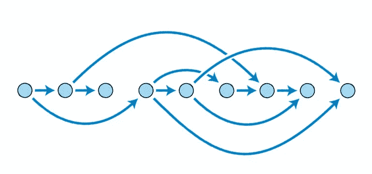
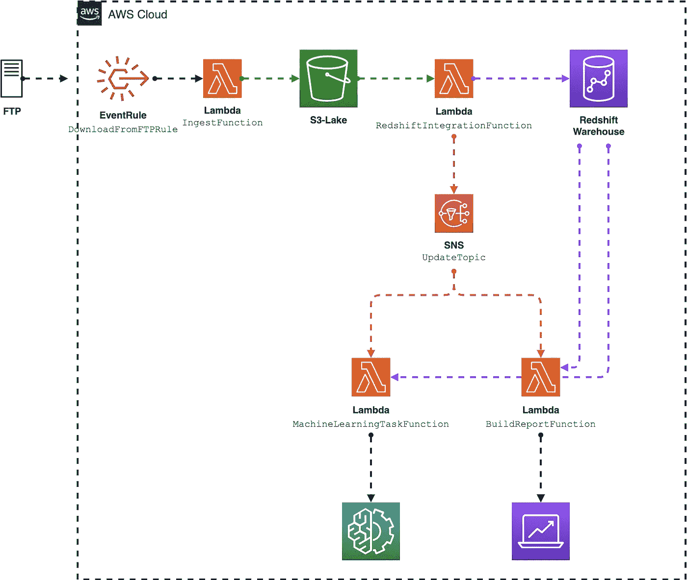

# 你不需要管弦乐队

> 原文：<https://towardsdatascience.com/you-dont-need-an-orchestrator-6517b243dece?source=collection_archive---------7----------------------->

演职员表:[https://unsplash.com/photos/NsgsQjHA1mM](https://unsplash.com/photos/NsgsQjHA1mM)

这是编排数据管道的好时机。

[气流](https://airflow.apache.org/)、[路易吉](https://github.com/spotify/luigi)、[达格斯特](https://dagster.io/)、[尼菲](https://nifi.apache.org/)、[提督](https://www.prefect.io/)、[凯德罗](https://github.com/quantumblacklabs/kedro)等等……围绕数据编排工具的技术领域充满了伟大的软件，大多是开源的。

我们正慢慢地从经典的调度(又名 cron)转向真正的编排。

基本的调度包括 crontab 和其他类似的程序。你只需要写下你想运行一个任务的时刻，程序就会一直等到该运行的时候。

时间安排就是列出事件发生的时间。编排更进一步，在任务之间创建触发器。它更有机。

这些工具包源于[有向无环图(DAG)](https://en.wikipedia.org/wiki/Directed_acyclic_graph) 的概念

TL；DR；

DAG 是一种图结构，只有节点之间的直接链接，没有任何循环。这种模式的最大优势是能够创建简单的单向流。

难怪所有这些编排器都是数据科学领域的趋势:它们完全符合数据转换的线性流程。

DAG 模式。对了，写一个不一定要懂图论(图片由作者提供)。

# 工程成本

这些工具的缺点是设置时间长。

入门笔记非常容易理解，你可以在几分钟内得到工作代码。

但是要真正利用这样的框架，你需要时间、实验和有经验的工匠。

您必须深入考虑数据的输入和输出，才能进行出色的编排。你的数据从哪里来？企业如何消费数据？您正在处理流或批处理工作流吗？你的用例是如何随着时间发展的？…

如果您不能得到直接的答案，编排解决方案应该是处理复杂业务需求、遗留、新数据源、团队规模等的关键…

它们有助于建立您可以利用的长期目标渠道。这是有成本的。工程费用。

首先，你的工程师必须知道或学习一个特定的工具包。大多数管弦乐队在这里只有十年左右的时间。有几个非常有经验的家伙对这些，或者如果有的话，他们非常昂贵。

这些工具的学习曲线没有那么深。尽管如此，你不可能像使用 Jupyter 笔记本那样在一天内学会一种气流。

今天学习一种新工具，明天就会有回报。但是时间也是金钱。

# 扳机，扳机，扳机…

orchestrator 框架还有另一种替代方案:云提供商无服务器特性。

无论是在亚马逊网络服务，谷歌云平台，还是微软 Azure，都有服务来大规模地以非常低的价格编排任务。

**功能服务**:这是最有趣的服务之一。您可以在不提供任何服务器的情况下部署和启动您的代码。无论是收集还是转换数据，functions services 的设置都非常简单快捷，运营成本非常低。

**容器即服务**:类似地，你可以发布自己的容器来构建任务或 web 服务，而不需要任何服务器设置。

存储:作为云革命的一部分，如今你可以非常便宜地存储万亿字节的数据。您甚至可以设置可访问性级别来优化成本。

**排队**:跨服务异步通信。消息队列可用于分离重量级处理、缓冲或批处理工作，以及平滑尖峰工作负载。

**事件触发**:根据规则触发事件。链接任务。

下面是一个具有 AWS 特性的高级模式示例。它显示了从 FTP 到数据湖的数据摄取，这些数据到数据仓库的转换，然后自动报告的创建或机器学习任务的触发。

高层管道示例(图片由作者提供)。

**利用这些特性协调任务有一些优势。**

**快速开发**。在一个独特的云提供商内部，这些服务遵循相同的设计。当你学会使用一个，就很容易和其他人一起使用。它非常适合您在云环境中使用的其他工具。每个服务并没有聚集在一个完整的框架中。它们是可以即插即用的小软件。

**没有增加基础设施成本**。大多数时候，不需要设置服务器或任何复杂的架构。有服务。你用什么付什么。

**它执行任务隔离**。设计小范围的任务是设计事物的好方法。尤其是在投入和产出方面。这样，您可以在需要时定期添加或更新一些部件。

经典的 orchestrator 工具提供了以非常复杂的方式创建任务的设计自由度。虽然这种自由也适用于云提供商服务，但您仍然处于一个受限的环境中。您不能创建自己的服务。

这接近于所谓的“供应商锁定”。然而，限制通常会让您从过于复杂的设计决策中解放出来。

你只是协调你的任务。直男。

事实上，在经典的 orchestrator 领域中确实如此。但是你需要更多的时间和经验来正确地设计任务的输入和输出，以使事情变得更小。更多的自由，更多的可能性，因此，更多的思考，更多的争论。

有时候你想把事情做完。

**然而，也有一些不利的方面。**

您创建的工作流和触发器越多，跟踪整个事情就越复杂。在短期内，相对于开发的容易性，大的画面是丢失的。

人们可以考虑使用一些自制工具或第三方解决方案[来收集所有管道元数据信息。它在开始时可以工作，但是当你必须扩展时，事情就会变得糟糕。](https://www.cloudockit.com/)

供应商锁定也是一个问题。您已经选择与云提供商合作，所以这是更大选择的一部分。尽管如此，你不能定制，你不能添加新的功能。任何供应商的新更新都更容易让您的遗留系统崩溃。

当你根据云提供商的规则设计你所有的工作流程时，你不可能很快摆脱它。

在更全球化的自制开源软件和第三方服务中，这些是经典的争论。在构建工作流程时，这仍然是一个需要牢记的要点。

# 什么时候？谁啊。在哪里？

和往常一样，每个概念都有自己的优点和缺点。

我们描述了从数据角度编排任务的两种方式。

当选择一个或另一个仍然取决于一些因素:

如果你的团队很小，开始一个新项目，一个新的基础设施(如果它是云提供商绑定的奖励)，你的选择可能是云提供商特性。

你不需要设置任何服务器，不要太担心大的设计问题，你可以快速迭代商业解决方案(因此可以快速交付),而且仍然非常便宜。

如果您有工程师、不断增长的项目、许多困难的数据输入和输出，那么 orchestrator 工具可能是个好主意。

您的优势是将所有的编排分离到适当的文件中，并且可以在用户界面中可视化大型管道工程。

大多数时候你可以自定义它。添加新功能。完全免费，如果开源，但有工程费用。

反正**整体景观成熟**。对于不同的问题，获得许多解决的机会总是好的。关键是要试验和学习几种资产，以更好地了解什么对当前项目有好处。

如果你想进一步讨论这些问题，请在评论中告诉我。我很乐意让你关注这些不断发展的技术。

我是一名数据科学家和工程师，曾在新闻、零售和职业体育等多个行业工作过。通过这项工作，我了解到分享我们自己的经历是帮助他人和发展自己的一种强有力的方式。如果你也有这种想法，并且正在寻找大量的数据资源，[请订阅我的时事通讯，从工程师的角度来看](https://fromanengineersight.substack.com/)。