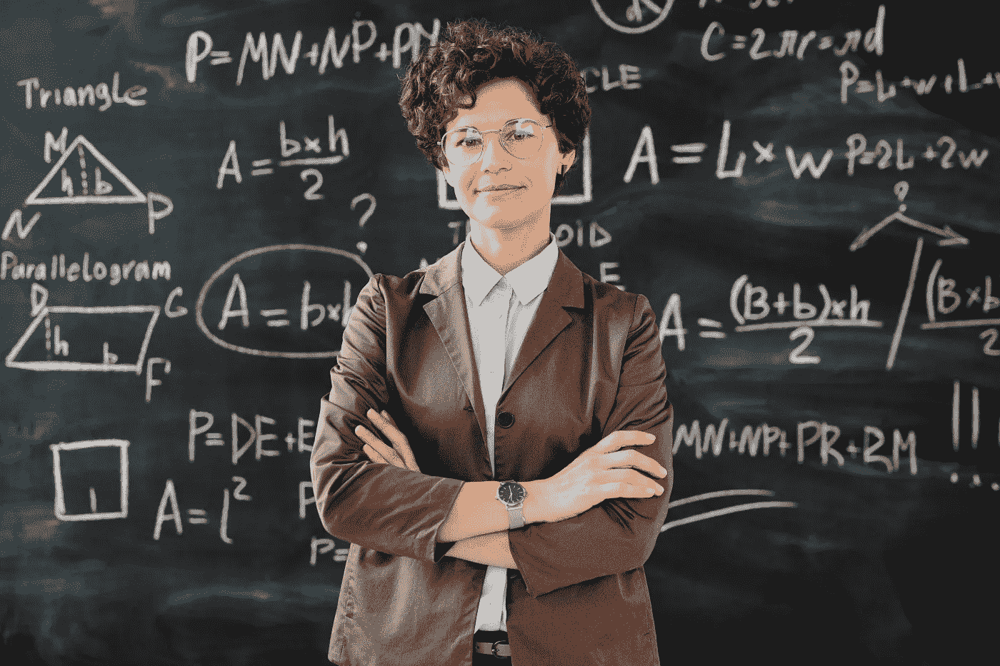

# 机器学习不需要数学

> 原文：<https://towardsdatascience.com/you-dont-need-math-for-machine-learning-e168b7d973d4?source=collection_archive---------3----------------------->

## 意见

## 跳过 ML 中最被高估的技能。改为编写代码。

照片由 [**Max Fischer**](https://www.pexels.com/@max-fischer?utm_content=attributionCopyText&utm_medium=referral&utm_source=pexels) 发自 [**Pexels**](https://www.pexels.com/photo/photo-of-woman-standing-in-front-of-blackboard-5212320/?utm_content=attributionCopyText&utm_medium=referral&utm_source=pexels)

数学很恐怖。

你想做机器学习，但你读过它需要概率论、统计学、微积分和线性代数。

我猜你要回到学校呆 4 年…

谢天谢地，这不是真的。就拿一个自学 ML，然后花了 3 年时间为一家初创公司运行机器学习的软件开发人员来说吧。

我会解释为什么你不需要数学。

# 学习数学会让你慢下来

想象一下，在驾驶汽车之前需要了解发动机是如何工作的？这可能有助于你在比赛中调整赛车。但是你肯定不需要这些知识来开车。

类似地，许多 ML 作者建议在实现机器学习之前涵盖几个数学主题。虽然这是好意，但这不是你现在需要的建议。

为什么 ML 建议这么学术？其中大部分来自那些在学术界呆过的人。在人工智能研究中，数学是必不可少的。需要解剖模型，发明新算法，写论文。

但你不是在写论文。你学到的东西已经足够危险了。解决问题，创造价值。甚至可能围绕你所创造的东西开一家公司。这将是 90%的实践和 10%的理论。

您可以通过反复试验、遵循最佳实践和发展经验法则来学习 ML。注册 [Kaggle](https://www.kaggle.com/competitions) ，解决问题，回顾其他成功的提交，迭代。6 个月后，你会对自己的能力感到惊讶。

# **ML 工程师和数据科学家不怎么做数学**

真正的挑战是数据，而不是数学。

检索、探索、清理、整形和可视化数据是这项工作的主要部分。这需要技巧、经验和直觉的结合。

有了顶级的数据辩论技巧，你就有 90%的机会来训练强大的模型。SQL、Pandas 和可重用函数是您的好朋友。远不止微分方程。

作为一名数据科学家，我承认使用过几次数学。我已经编写了计算置信区间的函数，并用图书馆不支持的语言重写了距离度量。但即使是这些，我也是按需学习的。

一些数据科学家从头开始重写复杂的算法，但这是例外而不是规则，对于刚刚进入该领域的人来说是不需要的。

选择、培训、评估和部署模型——这些都不直接需要数学。我们从现有的库中选择合适的工具，并在需要的地方应用它们。

通过将现有工具与专有数据相结合，有足够的价值可以提取。如果需要开发新模型的能力，大多数 ML 从业者将会失业。

# **图书馆为你挑起重担**

现成的工具是你最好的朋友。

Python 有数量惊人的(并且还在增长的)库，这些库实现了几乎所有的 ML 算法。你每天的工作就是选择合适的工作，然后创造性地运用它。

甚至[吴恩达](https://en.wikipedia.org/wiki/Andrew_Ng)著名的[深度学习课程](https://www.coursera.org/specializations/deep-learning)在让你从零开始建立一个神经网络之后，也依赖于使用现有的库。使用成千上万其他科学家已经在使用的久经沙场的库是有意义的。这确保了它们经过良好的测试并不断改进。

凭借对输入、输出和配置的一些直觉，您可以放心地将大多数模型视为一个黑盒。

## 这些 Python 库让我受益匪浅:

*   熊猫。加载和整形数据。
*   NLTK。标记和处理文本。
*   sci kit-学习。你所有的经典 ML 算法。
*   喀拉斯。Tensorflow 的高级 API。
*   根西姆。无监督学习。
*   Numpy。使用数组。
*   斯帕西。各种 NLP 工具。

你不需要理解数学，因为库的作者已经为你做了。我们可以放心地在晚上睡觉，相信他们已经正确地实现了算法。

在行业和实践中，好处在于创新模型的应用方式，而不是创造新的模型。

# **在编码和数学之间，学会编码**

在解决一个 ML 问题的竞赛中，软件开发者每次都赢了数学家。

懂 SQL，Python，有点[黑客](http://www.paulgraham.com/gba.html)的感觉会让你走的又远又快。了解微积分和微分方程可能会让你走得更远，但这将是一个缓慢的旅程。

因此，如果时间有限，可以选择学习数学或编程，那就学习编程吧。

如果你能阅读文档并实现它，你就成功了一半。

如果你决定不把机器学习作为职业，编程技能可以让你找到其他几份工作。如果你没有证书，我就不能对数学说同样的话。

# **您可以通过全部试用来选择最佳型号**

数学会给你关于模型如何工作及其权衡的直觉。但是还有一个选择。尝试所有型号。

云平台允许通过点击一个按钮并行运行无限的代码。

当我在 ML 职业生涯早期面临新问题时，我运行了每一个流行的 Scikit-learn 模型，并选择了一个效果最好的模型。一个名为 [FloydHub](https://www.floydhub.com/) 的云服务让我在编写了几个简单的脚本后就可以做到这一点。

也就是说，**详细记录你进行的每个实验**。这将有助于您找到模型解决特定问题的模式。如果你注意到一个模型持续优于其他模型，慢慢挖掘它是如何工作的，并开始从概念上理解它。

随着时间的推移，这将建立你的直觉，你将不再需要尝试所有的事情——这个模型将不再是一个黑箱。

# **如果你一定要学数学**

也许你被算法的具体细节所吸引。太好了！了解它们是如何工作的。但要明智地去做。

不要从统计学教科书开始。从挑选一个你用过的模型开始。

研究模型并将其分解成小部分。然后尝试从头开始编码。一旦你这样做了，你就可以反直觉地再次抛弃数学。你现在受益于它给你的直觉。

不同的数学将帮助你学习 ML 的不同部分。梯度下降的微积分，神经网络的线性代数，解释结果的统计学，以及框架问题的概率。也就是说，你只需要其中的一部分。

还是那句话，从问题入手，而不是从课本入手。毕竟，我们记得我们应用了什么。

# **最终想法**

如果你已经读到这里，我希望我已经说服你直接投入进去，不用担心数学。虽然如果你有数学知识会有所帮助，但是不要让数学知识的缺乏阻止你。

我想让你学 ML，造东西。机器学习在自动化重复性任务、为公司提供动力以及为社会创造繁荣方面有着巨大的前景。最快的方法是尝试、错误和迭代。

善于编写代码，依靠现有的库，调查别人是如何解决问题的，并获得反馈。

到目前为止，在你的 ML 旅程中，最重要的不同是什么？