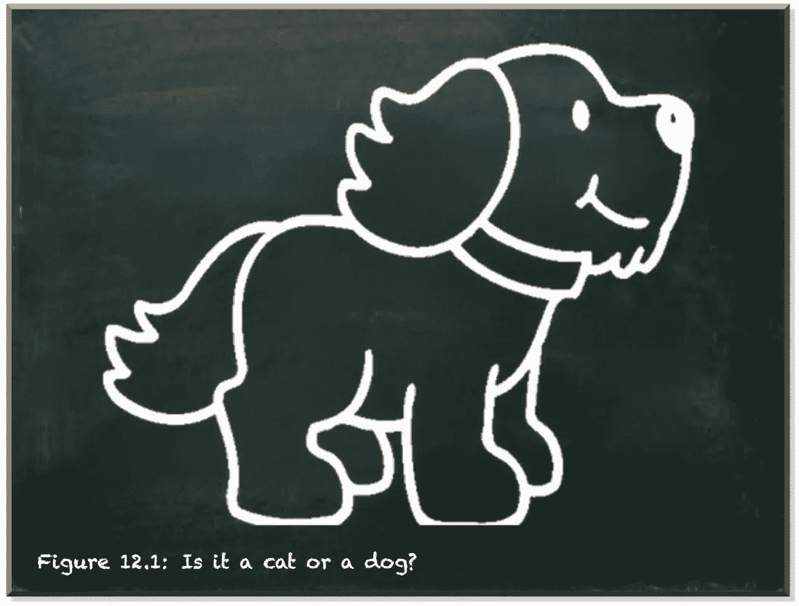
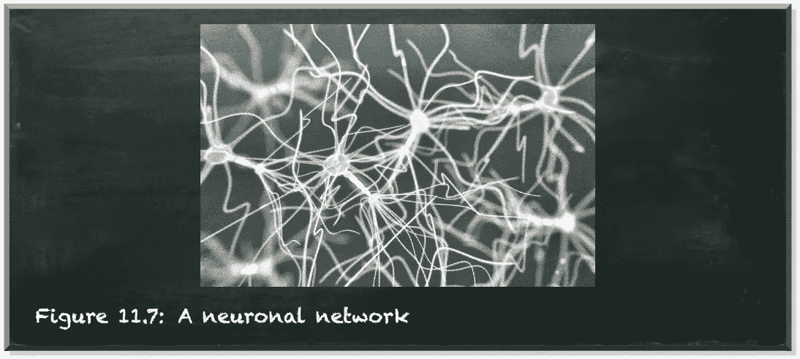
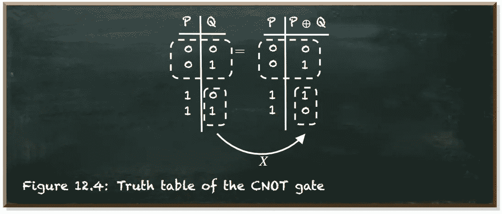
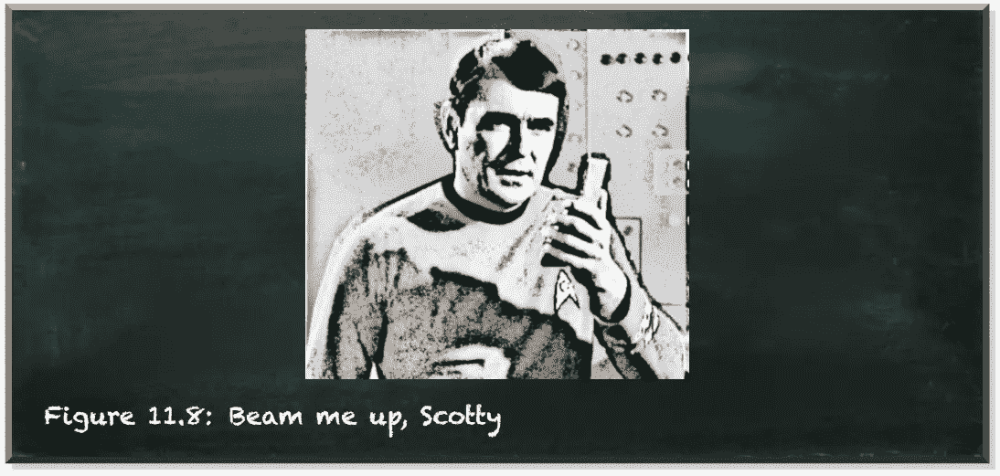
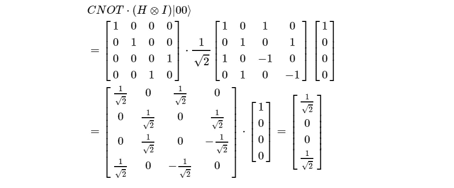
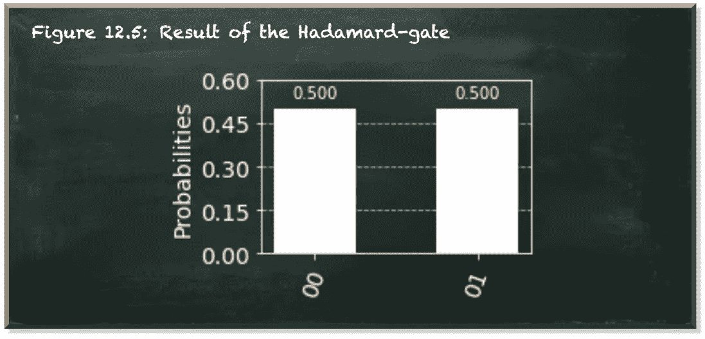
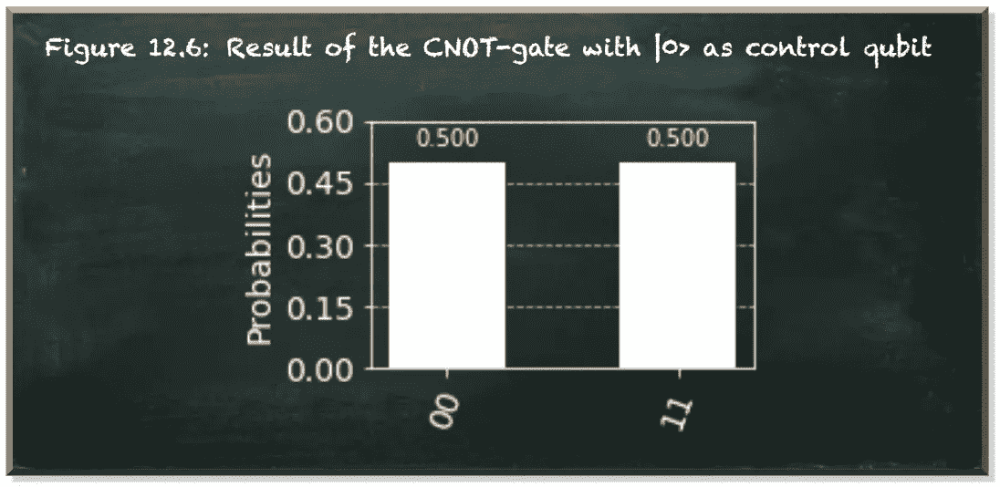

# 你不需要成为物理学家来理解量子机器学习

> 原文：<https://towardsdatascience.com/you-dont-need-to-be-a-physicist-to-understand-quantum-machine-learning-e0c91db4dfc3?source=collection_archive---------49----------------------->

## 作为一名机器学习工程师，你会做得很好

本帖是本书的一部分: [**用 Python 动手做量子机器学习**](https://www.pyqml.com/page?ref=medium_physicist&dest=/) **。**

机器学习的目的是给尚未标记的事物贴上标签。例如，我们试图预测一幅图像显示的是一只猫还是一只狗。

作者弗兰克·齐克特的图片

对人类来说，区分猫和狗是一件容易的事。为了让一台机器接管这项任务，你需要给它编程。您需要准确地指定如何执行每一个步骤。问题是，虽然我们可以做到，但我们不知道如何做到的确切规则。

大自然给了我们能力，却没有让我们知道这些能力是如何工作的。显然，这种能力本身就是一种进化优势，而对它的了解却不是。

由于无法告诉机器如何区分猫和狗，我们产生了用教另一个人的方式来教机器的想法。

如果你想教你的孩子猫和狗的区别，你给她看动物并给它们命名。

每当她正确地认出一只猫或一只狗，你就以同意来奖励她。万一她错了，你纠正她。你给孩子的反馈，哪怕是最微小的差异，都会让她有所提高，因为她为了一个奖励，下意识地优化了自己的行为。

我们没有指定如何完成任务的细节，而是向机器呈现正确标记的示例，并说:“*自己想办法*”。

教一个孩子和教一台机器之间的一个主要区别是表现形式。我们人类把知识保存在大脑中。它由无数相互连接的神经元组成，形成一个网络。我们的感官将电脉冲输入这个网络。输出转化为我们的思想和对我们肌肉的命令。作为老师，我们无法控制学生的大脑是如何工作的。

作为机器学习工程师，我们的主要任务之一是提出一种足够复杂的表示，以保持我们希望它学习的知识，但又足够简单，可以在合理的时间内训练。这种表示也称为模型。

这个模型有一个结构。它可以是任何东西，从简单的数学公式到人工神经元网络。这个模型有参数——可训练的参数。这两件事决定了我们模型的复杂性。一般来说，我们的模型参数越多，它越能执行任务，但越难训练它。

一旦我们确定了模型的结构，我们就开始训练它。我们的目标是找到一组参数值，让模型正确预测事物的标签。我们通过向我们的模型呈现示例来做到这一点，获取它的预测，并通过将模型的输出与实际标签进行比较来计算误差。

最终，我们寻找使误差最小的参数值组合。我们试图解决一个最优化问题。

量子机器学习(QML)是利用量子计算来解决机器学习任务，比如优化参数值。

我们在 QML 用来表示手头任务的特定模型可能不同于我们在经典机器学习中使用的所有模型。然而，它的目的仍然是一样的。它保存了我们想要学习的知识。

我们在 QML 使用的特定算法可能不同于我们从经典机器学习中知道的所有算法。但是它的目的仍然没有改变。我们的目标是找到最好的——或者至少足够好的——参数值。

在机器学习参数的同时，需要拿出合适的模型和合适的优化算法的，是你这个机器学习工程师。

这在 QML 没有什么不同。那么，为什么你需要成为一个物理学家来应用 QML 呢？

**因为你需要理解所有这些量子力学的东西*，你说呢？*

*在 QML，我们使用量子叠加、纠缠和干涉来解决问题。这些是惊人的，也许是违反直觉的现象。但是不管它们看起来有多怪异，量子力学系统都遵循一定的物理定律。这些定律使得系统以特定的方式运行。*

*如果我们想应用 QML，了解系统在特定情况下的行为比了解支配它们行为的确切物理定律更重要。*

*我们来看看经典的机器学习。让我们看看人工神经元网络。这些灵感来自我们大脑中的自然同类。然而，你不必成为生物学家也能理解它们是如何工作的。*

**

*作者弗兰克·齐克特的图片*

*这同样适用于量子机器学习。让我们以纠缠为例。*

*它从量子叠加开始。与经典比特不同，量子比特不是 0 或 1。它是 0 和 1 的复杂线性组合。只有当你测量它的时候，你观察到它要么是 0 要么是 1，就像一个经典的比特。*

*CNOT 门接收两个输入量子位，给出两个输出量子位。第一个输入称为控制量子位。第二个输入称为受控量子位。*

*如果控制量子位处于|0⟩状态，那么什么都不会发生。输出等于输入。如果控制量子位是|1⟩，那么 CNOT-gate 在控制量子位上应用 X-gate(非门)。它翻转了受控量子位的状态。*

*下图描述了 CNOT 门的真值表。*

**

*作者弗兰克·齐克特的图片*

*如果你有两个纠缠的量子比特，它们共享一个叠加态。一旦你测量了一个量子位，它的纠缠同伴会立即跳到不同的叠加态。即使在光年之外。它似乎知道测量已经发生，并且呈现出确认测量值的状态。*

*量子纠缠听起来很像斯科特用来把柯克和斯波克传送到企业号的传送器。*

**

*作者弗兰克·齐克特的图片*

*让我们放下科幻小说。让我们看看数学告诉我们什么。*

*我们可以用 CNOT 门纠缠两个量子位，它有两个量子位单位矩阵，最后两个元素的顺序互换，就像这样:*

**

*如果控制量子位处于叠加态，我们可以看到振幅为 1/sqrt(2)的两个状态。这些国家是|00⟩和|11⟩.其他两个状态(|01⟩和|10⟩)的振幅为 0。因此，每当我们测量两个量子位元中的一个，我们也可以扣除另一个量子位元的值。等式如下:*

**

*最后，我们来看看纠缠在实际中是如何影响量子比特的。我们从一个简单的电路开始。我们对量子位 q0 应用哈达玛门。它将量子比特置于叠加态。*

**

*作者弗兰克·齐克特的图片*

*结果显示量子位 q0(从右到左或从上到下读取)要么是`0`要么是`1`，每个概率为 0.5。量子位 q1 不受影响。我们总是测量它为`0`(因为 Qiskit 在|0⟩).状态下初始化量子位*

*让我们看看，如果我们通过应用 CNOT 门来纠缠两个量子位，会发生什么。*

**

*作者弗兰克·齐克特的图片*

*虽然控制量子位 q0 的测量概率保持不变，但是如果量子位 q0 处于|1⟩.状态，我们看到控制量子位 q1 将其状态从|0⟩切换到|1⟩*

# *结论*

*这是对纠缠的三种解释，轶事的，数学的，和实际的。这些解释都对纠缠有所启发。虽然数学解释是最精确的，但也是最难把握的。然而，你不需要成为一个物理学家来理解纠缠意味着什么，以及如何在量子电路中使用它。*

*你不需要知道支配两个粒子纠缠的物理定律。理解一个量子位是一个受限于规则的概率系统就足够了。这些规则——比如纠缠——可能并不直观。他们甚至可能是反直觉的。但是如果你接受它们，你就可以学习如何使用它们，并且不需要知道潜在的物理定律。*

*量子计算是一种非常有前途的机器学习工具。它建立在量子力学的理论和公式之上。这些都是高级物理概念。然而，你不需要成为物理学家，也能理解如何使用量子计算来解决机器学习任务。*

*本帖是本书的一部分: [**用 Python 动手做量子机器学习**](https://www.pyqml.com/page?ref=medium_physicist&dest=/) **。***

**

*在这里免费获得前三章。*