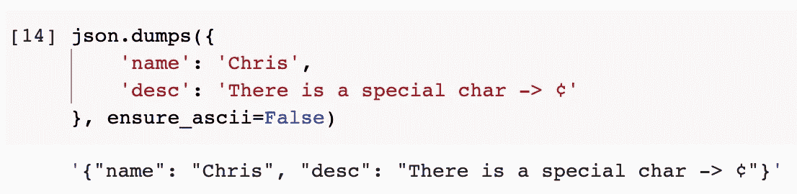

# 你一定知道 Python JSON 转储，但可能不是所有方面

> 原文：<https://towardsdatascience.com/you-must-know-python-json-dumps-but-maybe-not-all-aspects-fa8d98a76aa0?source=collection_archive---------7----------------------->


图片来自 [Pixabay](https://pixabay.com/?utm_source=link-attribution&utm_medium=referral&utm_campaign=image&utm_content=1213008) 的 [Lubos Houska](https://pixabay.com/users/luboshouska-198496/?utm_source=link-attribution&utm_medium=referral&utm_campaign=image&utm_content=1213008)

## 关于 Python JSON 模块的 dump(s)方法的一些技巧

Python 通过其“json”模块内置了对 JSON 文档的支持。我敢打赌，我们大多数人都用过，有些人用得很多。我们知道可以使用`json.dumps()`方法轻松地将 Python dictionary 对象转换成 JSON 字符串。然而，这种方法并不像大多数开发人员想象的那么简单。

在本文中，我将通过例子介绍这个`json.dumps()`方法。用法的复杂和稀有是由浅入深的。

现在我们应该开始了。不需要下载任何东西，你的 Python 3.x 必须自带 JSON 模块。

```
import json
```

## 目录

[1。漂亮输出的自动缩进](#61c8)
[2。自定义分隔符](#7e31)
[3。排序键](#e117)
[4。跳过非基本键类型](#94e3)
[5。非 ASCII 字符](#aede)
[6。循环检查](#e0a0)
[7。允楠](#2b4e)
[8(不是一个数)。定制的 JSON 编码器](#4a4d)

# 0.“转储”和“转储”的区别

万一有些新手在读这篇文章，大概有必要提一下，JSON 模块中有两个类似的方法——`dump()`和`dumps()`。

这两种方法有几乎相同的签名，但是`dump()`将转换后的 JSON 字符串写入一个流(通常是一个文件)，而`dumps()`只将字典转换成 JSON 字符串。

假设我们有一个简单的字典如下。

```
my_dict = {
    'name': 'Chris',
    'age': 33
}
```

如果我们想将其转换成格式化的 JSON 字符串并写入文件，可以使用`dumps()`。

```
with open('my.json', 'w') as f:
    json.dump(my_dict, f)
```


然后，如果我们检查工作目录，文件`my.json`应该在那里，包含转换后的 JSON 字符串。


如果我们使用`dumps()`，它只是将字典转储到一个字符串中。

```
json.dumps(my_dict)
```


由于这两个方法具有相同的签名，本文将只关注`dumps()`，因为所有这些技巧都适用于另一个方法。

# 1.漂亮输出的自动缩进

看到由`dumps()`方法输出字符串了吗？它不适合阅读。如果我们有一个非常大的 JSON 文档，所有内容都将在一行中输出。

为了以漂亮的格式输出 JSON 字符串，我们可以很容易地添加一个参数“indent”。它接受一个整数作为参数。

```
json.dumps(my_dict, indent=2)
# OR
json.dumps(my_dict, indent=4)
```


# 2.定制的分离器

JSON 遵循一种非常严格的格式，例如，同一级别的项目必须用逗号分隔，并且在键和值之间必须使用分号。因此，默认情况下，项目分隔符和键分隔符将是`,` 和`:` 。

然而，如果我们想输出一个紧凑的 JSON 字符串，我们可以通过参数`separators`改变这些分隔符。我们必须同时传递元组中的两个分隔符。

```
json.dumps(my_dict, separators=(',', ':'))
```


如果我们不必将 JSON 字符串用作 JSON，我们也可以将分隔符修改为我们想要的任何值。例如，我们可以让它变成 PHP 样式，如下所示。

```
json.dumps(
  my_dict, 
  separators=('', ' => '), 
  indent=2
)
```


# 3.排序关键字

JSON 通常不关心项目的顺序。因此，当我们将 Python 字典转储到 JSON 字符串时，条目的顺序将保持不变。

```
json.dumps({
    'c': 1,
    'b': 2,
    'a': 3
})
```


但是，如果我们确实想通过项目键对转换后的 JSON 字符串进行排序，我们可以很容易地将`sort_keys`参数设置为`True`。

```
json.dumps({
    'c': 1,
    'b': 2,
    'a': 3
}, sort_keys=True)
```


该键将按字母顺序排序。

# 4.跳过非基本键类型

JSON 只支持几种类型的对象作为项目键，分别是`str`、`int`、`float`、`bool`和`None`。这些类型被称为基本类型。如果我们试图用非基本类型的键转换字典，就会抛出一个`TypeError`。

```
json.dumps({
    'name': 'Chris',
    (1,2): 'I am a tuple'
})
```


这是有意义的，因为 JSON 不支持集合类型作为键。然而，如果我们想跳过这些毫无意义的类型，我们可以将`skip_keys`设置为 true 来隐藏这些项目。

```
json.dumps({
    'name': 'Chris',
    (1,2): 'I am a list'
}, skipkeys=True)
```


# 5.非 ASCII 字符

非 ASCII 字符不能保证在所有平台上都能很好地显示，而且还可能在传输 JSON 字符串时造成麻烦。因此，在将它们转换成 JSON 字符串时，Python 会对其进行如下编码。

```
json.dumps({
    'name': 'Chris',
    'desc': 'There is a special char -> ¢'
})
```


但是，如果我们不想对这些特殊字符进行编码，我们可以将`ensure_ascii`设置为 **false** 。

```
json.dumps({
    'name': 'Chris',
    'desc': 'There is a special char -> ¢'
}, ensure_ascii=False)
```



# 6.循环检查

在 Python 中，可以用循环引用定义一个字典。举个例子，我们用一个名为“dictionary”的键定义一个字典，值暂时为`None`。

```
my_dict = {
    'dictionary': None
}
```

然后，我们把字典本身赋值为键“dictionary”的值。

```
my_dict['dictionary'] = my_dict
```

现在，如果我们试图输出这个字典，Python 将显示`...`，因为有一个循环引用。


如果我们试图从这样的字典中转储 JSON 字符串，循环引用将被检测到并抛出一个错误。


但是，如果我们不想检测循环引用，就让它过去，我们可以将参数`check_circular`设置为 false。

```
json.dumps(my_dict, check_circular=False)
```


唯一的区别是，后者将真正尝试逐层转储循环引用的字典，直到它溢出。这样做也许没有什么好处。即使你想用这个特性来达到别的目的(我找不到例子……)，也一定有比这更好的方法。

# 7.允许 NaN(非数字)

默认情况下，当转换带有无效数字(如`nan`、`inf`和`-inf`)的字典时，它会保持原样。

```
import numpy as npjson.dumps({
    'my_number': np.nan
})
```


如果我们试图将“JSON 字符串”用于其他目的，这会导致一些问题，因为它不再是有效的 JSON 字符串。`NaN`不是有效的 JSON 值类型。

如果我们想避免这种情况，或者至少让问题早点暴露出来，我们可以将参数`allow_nan`设置为 **false** 。当有一个 NaN 时，将会抛出一个错误。

```
json.dumps({
    'my_number': np.nan
}, allow_nan=False)
```


# 8.定制的 JSON 编码器

最后但同样重要的是，让我们看看如何定制 JSON 编码器。我们可以轻松地调整 JSON `dumps()`方法的行为，而不是让一切都默认。

例如，我们有如下这样的词典。它有一个 datetime 对象作为项目中的值。

```
from datetime import datetimemy_dict = {
    'alarm_name': 'get up',
    'alarm_time': datetime(2021, 12, 3, 7)
}
```

在这种情况下，如果我们试图将字典转储到 JSON 中，将会抛出一个类型错误。


如果我们想在转储字典时解析 datetime 对象怎么办？我们可以创建一个继承类`json.JSONEncoder`的子类，然后实现`default`方法。

```
class DateTimeEncoder(json.JSONEncoder):
    def default(self, obj):
        if isinstance(obj, datetime):
            return obj.strftime('%Y-%m-%d %H:%M:%S')
        return json.JSONEncoder.default(self, obj)
```

在上面的代码中，我们检查对象是否是日期时间对象。如果是这样，我们将日期时间转换成一个字符串，然后返回它。否则，就使用`JSONEncoder.default()`方法。

一旦我们得到了这个定制的编码器类，我们可以将它传递给`dumps`方法中的`cls`参数。它的行为将会改变。

```
json.dumps(my_dict, cls=DateTimeEncoder, indent=2)
```


# 摘要


图片由[亚历山大·巴甫洛夫·波德瓦尔尼](https://pixabay.com/users/visionpics-4638469/?utm_source=link-attribution&utm_medium=referral&utm_campaign=image&utm_content=6795381)从[皮克斯拜](https://pixabay.com/?utm_source=link-attribution&utm_medium=referral&utm_campaign=image&utm_content=6795381)拍摄

在本文中，我只介绍了 Python 中的一种方法— `json.dumps()`。对于像这样的内置方法，我们通常会大量使用它们，但是我们可能不知道它的每一个方面。强烈建议调查我们熟悉的方法，而不是继续寻找那些很少使用的方法，因为前者可能会让我们花的时间更有价值。

<https://medium.com/@qiuyujx/membership>  

如果你觉得我的文章有帮助，请考虑加入 Medium 会员来支持我和其他成千上万的作者！(点击上面的链接)