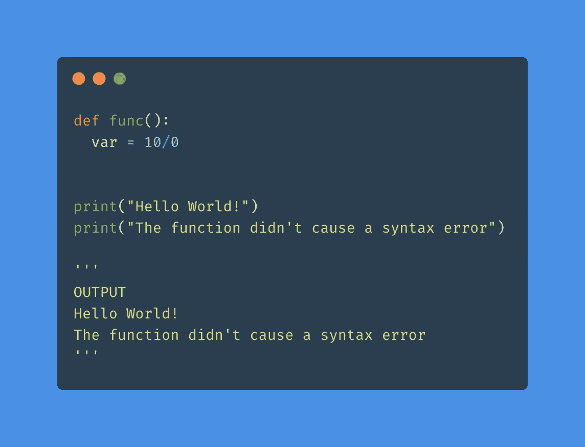
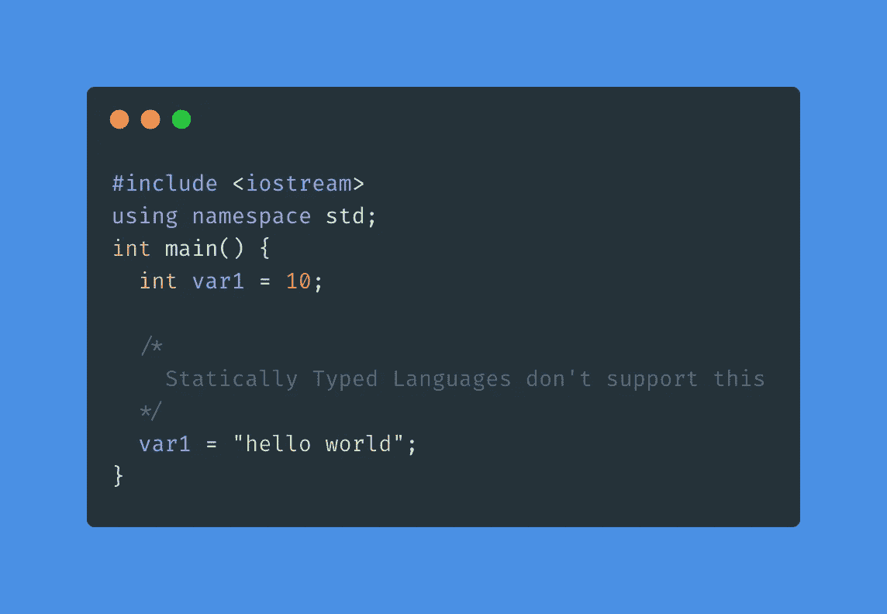

# 您需要了解编译/解释、静态/动态和强/弱类型

> 原文：<https://towardsdatascience.com/you-need-to-know-compiled-interpreted-static-dynamic-and-strong-weak-typing-2e7f76c9dc3d?source=collection_archive---------23----------------------->

## 在这篇文章中，我将试图揭开编译/解释、静态/动态类型、强/弱类型等术语的神秘面纱，并定义一些术语，如运行时、编译等

Amy Hirschi 在 [Unsplash](https://unsplash.com/s/photos/keyboard?utm_source=unsplash&utm_medium=referral&utm_content=creditCopyText) 上的照片

如果你上过一些编程课程，你可能会遇到下面的陈述，并有所理解

*   Python 是强动态类型的
*   JavaScript 是弱动态类型的

看完这篇文章，你就能清楚地理解上面的说法了。我们将会看到 Python、JavaScript 和 C++中的代码片段。如果你不知道语法或任何语言，没关系，你仍然能够理解底层的概念。

# 目录

*   一些定义和需要记住的要点
*   编译语言与解释语言
*   静态类型与动态类型
*   弱类型与强类型
*   编程语言分类
*   结论

# 一些定义和需要记住的要点

*   静态类型化/动态类型化中的“类型化”是指**数据类型**。它不是指按键的行为。我对此感到困惑，我确信可能还有其他人也有同样的遭遇
*   编程语言根据两种不同的属性分为静态/动态类型和强/弱类型，即静态/动态类型与强/弱类型无关

## 定义

*   **源代码**——这是用 Python、JavaScript、C++等写的代码。又称**人类可读代码**
*   **机器代码**——这是用机器语言(通常是二进制)编写的代码，可以被机器理解。
*   **编译器-** 可以把源代码转换成机器码的计算机程序
*   **编译**——将代码从 Python、JavaScript、C++转化为低级机器码。基本上将人类可读的代码转换成机器代码

假设编译成功，即源代码没有语法错误，我们继续运行。

*   **运行时**——编译后，程序运行，代码执行。这段时间被称为运行时间。
*   **执行**——实际运行/执行代码。这发生在源代码被转换成机器代码之后和运行期间
*   **句法错误——**语言的句法(语法)错误。例如:在 C++中缺少分号，在 Python 中不正确的缩进，等等
*   **运行时错误**—**运行时错误**是在程序执行期间发生的错误，例如:被 0 除，试图访问未定义的变量，对不兼容的数据类型使用运算符
*   **类型转换**——将一个值从一种数据类型转换成另一种数据类型，例如:char 可以根据它的 ASCII 值转换成 int。类似地，数字 10 可以转换成字符串“10”。类型转换可以是**隐式**(由语言自动完成)或**显式**(您可以手动更改类型)

# 编译语言与解释语言

基于源代码如何被转换成机器代码，一种语言被分类为编译/解释的。

我将借用 [FreeCodeCamp](https://www.freecodecamp.org/news/compiled-versus-interpreted-languages/#:~:text=Interpreted%20vs%20Compiled%20Programming%20Languages:%20What's%20the%20Difference?,-Every%20program%20is&text=In%20a%20compiled%20language,%20the,reads%20and%20executes%20the%20code) 的这个类比。

基本上认为你有一个用德语写的食谱，需要你的朋友帮助你把食谱翻译成英语并照着做。有几种方法可以解决这个问题

*   你可以一个接一个地翻译每一步，也就是说，首先你的朋友翻译第一步，你跟着翻译。然后你进入第二步，你的朋友翻译它，你跟着做。诸如此类…..
*   你立刻翻译整个食谱，然后照着做，也就是说，你的朋友把整个食谱翻译成英语。现在，你一步一步跟着它走。

第一种方法类似于“解释”,而第二种方法类似于“编译”

## **解释语言**

程序的源代码被转换成机器代码并逐行执行。如果您定义了一个函数但从未调用它，则该函数不会被执行，因此，该函数中的任何运行时错误都不会导致错误。

让我们考虑一个 Python 中的例子

代码片段

尽管我们的函数被 0 除(运行时错误)，但程序运行/执行成功。由于我们从不调用函数 **func，**该函数从不执行，因此运行时错误从不出现

让我们考虑一个类似的 JavaScript 例子

代码片段

像 Python 一样，JavaScript 也不会引发任何错误。由于我们从不调用函数，所以程序执行成功。

> 注意:如果您在上述代码片段中调用了该函数，将会导致错误

让我们考虑 Python 中的另一个例子

代码片段

这一次，我们在函数外用 0 除。这导致 Python 引发一个错误。但是，请注意，print 语句仍然被执行，它们的输出显示在终端中。这是因为每一行都是逐个执行的。因此，当我们执行第三个 print 语句时，Python 甚至还没有执行除以 0 的操作，因此，在此之前不会出现任何错误

## **编译语言**

整个源代码被转换成机器码。转换后，程序被执行。因此，无论函数是否被调用，函数中的任何运行时错误都会被引发。

让我们考虑一个 C++代码片段

代码片段

在函数 func 中，我们给变量 **var** 赋值 10，而没有定义变量(运行时错误)。尽管我们不调用该函数，但错误仍然会出现。“Hello World”不在终端中显示。

让我们考虑另一个片段

代码片段

与 Python 或 JavaScript 不同,“cout”语句不会被执行。首先，整个源代码被转换成机器码，并引发运行时错误。因此，“Hello World”不会显示在终端中。因为我们没有定义变量 **var** ，所以出现了错误

# 静态类型和动态类型

## 静态打字

> 在静态类型语言中，变量在其生命周期中具有固定的数据类型。

类型检查是在编译时完成的

考虑下面的 C++代码片段

代码片段

最初，我们将变量 **var1** 声明为一个 int，并给它赋一个整数值。但是后来，我们把它重新赋值为一个字符串。C++是一种静态类型语言，不支持这种行为。

> **例如:C，C++，Java，Rust，Go，Scala**

## 动态打字

> 在动态类型语言中，变量的数据类型可以在它的生命周期中改变

类型检查是在运行时完成的

让我们试着做和上面一样的事情，但是使用像 Python 这样的动态类型语言。

代码片段

初始变量 **var1 是一个整数变量。然而**，后来我们赋了一个字符串值，变量的数据类型改变了。像 Python 这样的动态类型语言允许我们改变变量的数据类型。

让我们在另一种动态类型语言 JavaScript 中做一些类似的事情。

代码片段

注意:如果你使用 **const** 关键字，你不能改变变量的数据类型。常量值不能被重新赋值，因此在某种程度上它们的数据类型是静态的。然而，Java 脚本是一种动态类型语言，因为变量的数据类型在其生命周期中会发生变化

> 例如:Perl，Ruby，Python，PHP，JavaScript

# 弱类型和强类型

## 弱类型化

> 弱类型语言支持不同数据类型之间的操作。这些语言支持隐式类型转换，一种数据类型转换成另一种数据类型。

让我们考虑一个 C++代码片段

代码片段

**a** 的 ascii 值为 **97** 。当我们尝试做 **10+a** 时，C++隐式地将 a 类型转换为它的 **ascii 值(97)** 。因此输出是 107。

让我们用 JavaScript 做一些类似的事情。

代码片段

JavaScript 将数字 **10** 转换为字符串 **"10"** 并将其连接为 **a**

> **例如:C/C++，JavaScript，PHP，Perl**

## 强力打字

> 强类型语言不支持不同数据类型之间的操作。他们可能支持也可能不支持类型转换。但是，它们不隐式地对数据进行类型转换。

让我们考虑 Python 中的一段代码。我们将尝试做和上面一样的事情。

代码片段

当我们试图将一个整数和一个字符串相加时，我们得到一个类型错误。这使得 Python 具有强类型。但是，请注意，可以将整数显式类型转换为字符串并执行操作。

> **例如:Python，C#，Java，Scala，Ruby**

# 编程语言分类

[https://medium . com/Android-news/magic-lies-here-static-typed-vs-dynamic-typed-languages-d 151 C7 f 95 e2b](https://medium.com/android-news/magic-lies-here-statically-typed-vs-dynamically-typed-languages-d151c7f95e2b)

# 结论

我希望我能够解释这些术语，以及一门语言是如何被确定为编译/解释、静态/动态、弱/强的。了解一门语言的这些特性将让你知道在开始学习这门语言时会遇到什么。如果您发现任何错误或知道任何好的类比来解释差异，请告诉我:)

> 在 [LinkedIn](https://www.linkedin.com/in/rahulbanerjee2699/) 、 [Twitter](https://twitter.com/rahulbanerjee99) 上与我联系