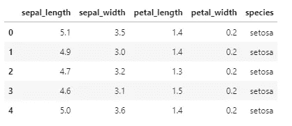
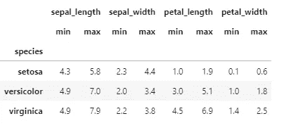

# 您可能不需要 for 循环

> 原文：<https://towardsdatascience.com/you-probably-do-not-need-that-for-loop-6de79dffbaf?source=collection_archive---------7----------------------->

## 声明性思维如何帮助您编写更好的数据科学代码

每当我在一段数据科学 Python 代码中看到 for 循环，我的第一反应是“那可能不需要”。然而，for 循环只是更传统的软件工程命令式方法和本质上更具声明性的数据科学方法之间更深刻的哲学差异的一个例子。本质上，在命令式编程中，重点是告诉计算机*如何*执行任务，而在声明式编程中，我们只是简单地陈述*我们想要什么*，计算机应该负责任务如何执行。这通常会产生更短更快的代码。

本文的目标是让您意识到这种编码风格的差异。特别是对于从 C#或 C++等更主流编程过渡到数据科学的人来说，进入声明性思维模式非常重要。


伊利亚·巴甫洛夫在 [Unsplash](https://unsplash.com/s/photos/coding?utm_source=unsplash&utm_medium=referral&utm_content=creditCopyText) 上拍摄的照片

# 善意的虹膜

我们第一个例子的目标是计算数据帧中一列的平均值。在考虑这两种方法之前，请先尝试自己解决问题。

作为基础，我们使用 iris 数据集，并希望计算`sepal_length`列的平均值:



我们首先从命令式方法开始:我们迭代`sepal_length`列中的数字，将它们全部相加，跟踪长度，最后通过将总和除以列的长度来计算平均值:

```
5.843333333333335
```

或者，这是声明式方法:

```
5.843333333333335
```

因此，在命令式解决方案中，我们花费了大量代码来告诉计算机做什么。在声明式方法中，我们简单地声明我们想要得到特定列的平均值。这很好地说明了代码比命令式方法要短得多，并且在更高的抽象层次上运行。

# 每个物种的最小-最大值

下一个例子有点复杂。我们希望计算每种独特虹膜类型的每个测量变量的最小值和最大值。因此，`sepal_length`的最小值适用于三种类型的虹膜，同样适用于`sepal_width`等。在看我的答案之前，你可以自己尝试一下。

我们首先从纯粹的命令式方法开始。请注意，我故意省略了 smarter Python 和 Pandas 的任何语法，只是为了清楚地说明您需要多少代码来完成这项工作:

```
{'sepal_length': {'setosa': 5.0, 'versicolor': 5.7, 'virginica': 5.9},
 'sepal_width': {'setosa': 3.3, 'versicolor': 2.8, 'virginica': 3.0},
 'petal_length': {'setosa': 1.4, 'versicolor': 4.1, 'virginica': 5.1},
 'petal_width': {'setosa': 0.2, 'versicolor': 1.3, 'virginica': 1.8}}{'sepal_length': {'setosa': 5.0, 'versicolor': 5.7, 'virginica': 5.9},
 'sepal_width': {'setosa': 3.3, 'versicolor': 2.8, 'virginica': 3.0},
 'petal_length': {'setosa': 1.4, 'versicolor': 4.1, 'virginica': 5.1},
 'petal_width': {'setosa': 0.2, 'versicolor': 1.3, 'virginica': 1.8}}
```

声明式方法的美妙之处在于它几乎直接来自问题陈述:



这个代码是:

*   短得多:3 行对 34 行。
*   比命令式代码更加通用。比如除了`min`和`max`再加`median`就简单很多了。
*   对于更大的数据集，速度要快得多。

# 最终声明

真正进入陈述性思维需要一些时间。特别是对于那些已经精通其他命令式语言的人来说，这可能很难做到。一个很好的练习是强迫自己使用内置的熊猫解决方案来解决问题。如果你觉得自己要去显式循环，回到绘图板。因为循环并不总是错误的答案，但是在开始的时候，我宁愿谨慎。

这篇文章也可以在 github 上阅读[，包括所有代码。](https://github.com/PaulHiemstra/declarative_programming_article/blob/main/declarative_programming_article.ipynb)

# 我是谁？

我叫 Paul Hiemstra，是荷兰的一名教师和数据科学家。我是科学家和软件工程师的混合体，对与数据科学相关的一切都有广泛的兴趣。你可以在 medium 上关注我，或者在 LinkedIn 上关注我。

如果你喜欢这篇文章，你可能也会喜欢我的其他一些文章:

*   [掌握数据科学并不是学习一系列技巧](/mastering-data-science-is-not-learning-a-series-of-tricks-df66d8529c29)
*   [学习 AI 机器人玩井字游戏系列文章](https://towardsdatascience.com/tagged/rl-series-paul)
*   [牛郎星图解构:可视化气象数据的关联结构](/altair-plot-deconstruction-visualizing-the-correlation-structure-of-weather-data-38fb5668c5b1)
*   [面向数据科学的高级函数式编程:使用函数运算符构建代码架构](/advanced-functional-programming-for-data-science-building-code-architectures-with-function-dd989cc3b0da)
*   [通过规范化扩展您的回归曲目](/expanding-your-regression-repertoire-with-regularisation-903d2c9f7b28)