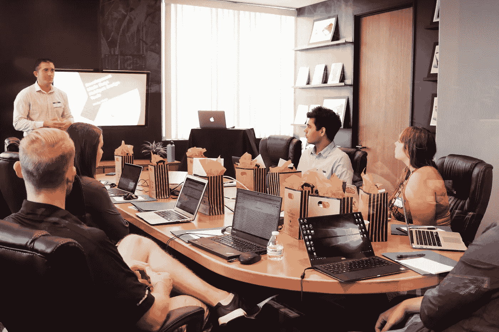

# 您应该为这些数据科学障碍做好准备

> 原文：<https://towardsdatascience.com/you-should-be-prepared-for-these-data-science-obstacles-b8fd73873d01?source=collection_archive---------27----------------------->

## 意见

## 这里有 4 个你可能会遇到的障碍…


[劳尔·纳杰拉](https://unsplash.com/@reinf?utm_source=unsplash&utm_medium=referral&utm_content=creditCopyText)在[Unsplash](https://unsplash.com/s/photos/obstacle?utm_source=unsplash&utm_medium=referral&utm_content=creditCopyText)【1】上的照片。

# 目录

1.  介绍
2.  缺失数据
3.  利益相关者问题陈述
4.  沟通有效性
5.  工程生产
6.  摘要
7.  参考

# 介绍

数据科学角色伴随着各种挑战，也就是说，我将讨论我经历最多的挑战，同时强调它们的重要性、影响和可能的解决方案。其中一些障碍也适用于其他角色，如数据工程、机器学习工程、软件开发和数据分析。习惯数据科学中的某个过程可能很容易，因为你可能会遇到一个路障，这肯定会让你迷失方向。这就是为什么我将讨论我的四大数据科学障碍，从数据质量、商业敏锐度到生产就绪代码，所以希望你能了解这些可能出现的问题，并在它们发生之前做好准备。

# 缺失数据


照片由[泰勒·卡拉汉](https://unsplash.com/@tylercallahan?utm_source=unsplash&utm_medium=referral&utm_content=creditCopyText)在[Unsplash](https://unsplash.com/s/photos/empty?utm_source=unsplash&utm_medium=referral&utm_content=creditCopyText)【2】上拍摄。

数据科学家可能遇到的最常见的障碍之一包括处理丢失的数据。通常，当你在学习数据科学时——就像在大学或在线课程中一样(*有时是*)，并且更加关注各种各样的机器学习算法时，你可以跳过处理数据集中缺失数据的部分，以便首先在高层次上研究算法。如果您刚刚开始学习数据科学，您可以练习使用缺失数据的方法之一是创建一个模拟数据集，在不同的列中包含不同的缺失数据，可以是自变量，也可以是因变量。然后，您可以测试各种解决方案以及对您的模型产生最佳影响的解决方案组合。

有几种方法可以解决丢失数据的问题，无论是简单地删除数据集中的 NA(*null-missing*)值，还是以某种方式输入它们的值。这最终取决于你的数据集，丢失了多少，以及你试图解决什么问题。如果您看到太多缺失数据，这可能意味着您可以找到一个更好的数据源，或者收集更多只包含一小部分缺失数据的要素，而不是输入缺失值。

> 以下是处理缺失数据的一些方法:

*   用该特征的最小值填充 NA 连续值
*   用该特征的最大值填充 NA 连续值
*   用该特征的平均值填充 NA 连续值
*   删除丢失数据的行
*   用空格填充 NA 分类变量
*   预测缺失值
*   添加新的重要功能，减少数据丢失

如您所见，处理缺失值的方法数不胜数，因此最好在开始数据科学工作之前练习这些技能，但您现在也可以作为一名数据科学家学习和应用这些技能，方法是更详细地研究各种插补方法。要真正知道使用哪种方法，您必须在试错法中应用这些解决方案，同时还要了解您的更改对您的整体模型和预测的影响。

# 利益相关者问题陈述



由[活动创作者](https://unsplash.com/@campaign_creators?utm_source=unsplash&utm_medium=referral&utm_content=creditCopyText)在[Unsplash](https://unsplash.com/s/photos/business?utm_source=unsplash&utm_medium=referral&utm_content=creditCopyText)【3】上拍摄的照片。

作为一名数据科学家，你将不得不与其他利益相关者合作，有时是技术性的，有时不是。得出一个简单的问题陈述并最终由数据科学模型解决可能会很复杂。你必须清楚，如果你是首先提出问题陈述的人，而利益相关者是给你分配问题的解决方案，那么你必须确保你们两人在根本问题上意见一致。

> 一个糟糕的问题陈述的例子是:

*   使用机器学习来解决为什么我们不能手动完成这个过程，也许是回归

> 一个好的问题陈述的例子是:

*   手动对产品进行分类既耗时又不准确

那么是什么让第一种说法如此糟糕呢？就是因为它试图先解决问题，没有 ***突出*** 只解决问题。有时候，作为一名数据科学家，您可以创建一些更手工制作的算法，这些算法可以更快地创建手动流程，但向数据科学家建议回归可以让他们在向外思考时首先关注这一点，并且首先关注更高的级别，这是一种更好的方式，这样您就不会立即将自己局限于特定的解决方案，特别是当它可能是不正确的解决方案时。

第二个例子很好，因为它简单明了。它涵盖了目前的行动，这是分类产品，它说，为什么这是目前的一个问题-需要太长时间和不准确的。现在，作为一名数据科学家，你可以很快想到一个分类算法，例如，作为解决这两个问题的直接方法。

# 沟通有效性


照片由[迪伦·吉利斯](https://unsplash.com/@dylandgillis?utm_source=unsplash&utm_medium=referral&utm_content=creditCopyText)在[Unsplash](https://unsplash.com/s/photos/communication?utm_source=unsplash&utm_medium=referral&utm_content=creditCopyText)【4】上拍摄。

与上面的障碍类似，你与其他利益相关者和同事沟通的总体效果也是如此。很有可能你会成为你们公司唯一的数据科学家之一，或者可能是唯一的一个。因此，你必须能够以非技术的方式解释你所做的几乎所有事情，或者只是以其他人可以理解的方式解释，而不仅仅是关于统计、机器学习以及只有数据科学家通常会知道的更具体的细节。

> 您会遇到沟通障碍的时候:

*   与风险承担者沟通问题陈述
*   将你的代码分解给软件工程师、数据工程师，或者机器学习工程师(稍后会有更多关于这个话题的*)*
*   *允许他人解读你的结果*

*以上是你在交流中会遇到的一些障碍。如果你想成为一名真正成功的跨职能数据科学家，你不仅需要成为公司其他数据科学家的沟通大师，还需要成为产品经理和工程师的沟通大师。*

# *工程生产*

**

*克里斯托弗·高尔(Christopher Gower)在[Unsplash](https://unsplash.com/s/photos/code?utm_source=unsplash&utm_medium=referral&utm_content=creditCopyText)【5】上拍摄的照片。*

*这个问题更多的只是与数据科学家和他们一起工作的软件工程师、数据工程师或机器学习工程师之间的关系有关。大多数数据科学家不负责整个端到端解决方案，即使模型是主要部分(*是的，一些小公司的数据科学家——通常，有时是*)。也就是说，你不仅要在本地测试你的模型，还要在生产中测试。帮助您的工程师将与您一起工作，使您的代码更加模块化、可伸缩，并帮助解决生产中可能出现的错误——质量保证——或测试，这就是人们经常提到的情况。有时你可以在本地获得很好的结果，但之后你会发现在生产过程中效果并不好——所以这取决于你和你更亲密的同事一起工作，这样在生产日就不会有惊喜了。*

> *以下是将本地代码和开发代码转换为生产就绪代码时可能出现的一些问题:*

*   *你的代码不是面向对象的编程( *OOP* )格式*
*   *你没有考虑到最终可能发生的错误*
*   *本地库的版本不能在生产环境中执行，否则需要在生产环境中定期更新*
*   *部署过程一次只能获取一定数量的训练数据，而不是全部本地数据*
*   *你正在使用的生产平台可能会引起一些新的问题( *Docker 等)。*)*

*如您所见，在数据科学过程的某些部分，将本地代码转换为生产就绪代码以及在生产就绪环境中可能会出错。*

# *摘要*

*我讨论了我在数据科学职业生涯中遇到的最大障碍。我敢打赌，其他人也有类似的经历，所以希望你能在这些事情发生之前了解到，这样你就能为即将到来的常见问题做好准备。我们已经概述了诸如缺失数据、利益相关者问题陈述、沟通有效性和生产中的工程等障碍。也就是说，如果你从事数据分析或软件工程等其他工作，其中一些也适用于你。*

> *这里再次总结了所有的障碍:*

```
*Missing DataStakeholder Problem StatementCommunication EffectivenessEngineering Production*
```

*我希望你觉得我的文章既有趣又有用。如果你自己经历过这些障碍，请在下面随意评论。你认为现在了解这些对你的数据科学职业有帮助吗？你同意还是不同意我的路障，为什么？*

*请随时查看我的个人资料和其他文章，也可以通过 LinkedIn 联系我。*

> *下面是我写的一篇类似的文章，关于掌握 Python 作为数据科学的先决条件[6]:*

*</you-should-master-python-first-before-becoming-a-data-scientist-8ac1b1b4e10f>  

# 参考

[1]由[劳尔·纳杰拉](https://unsplash.com/@reinf?utm_source=unsplash&utm_medium=referral&utm_content=creditCopyText)在 [Unsplash](https://unsplash.com/s/photos/obstacle?utm_source=unsplash&utm_medium=referral&utm_content=creditCopyText) 上拍摄的照片，(2017)

[2]照片由[泰勒·卡拉汉](https://unsplash.com/@tylercallahan?utm_source=unsplash&utm_medium=referral&utm_content=creditCopyText)在[Unsplash](https://unsplash.com/s/photos/empty?utm_source=unsplash&utm_medium=referral&utm_content=creditCopyText)(2018)上拍摄

[3]2018 年[活动创建者](https://unsplash.com/@campaign_creators?utm_source=unsplash&utm_medium=referral&utm_content=creditCopyText)在 [Unsplash](https://unsplash.com/s/photos/business?utm_source=unsplash&utm_medium=referral&utm_content=creditCopyText) 上拍摄的照片

[4]照片由[迪伦·吉利斯](https://unsplash.com/@dylandgillis?utm_source=unsplash&utm_medium=referral&utm_content=creditCopyText)在[Unsplash](https://unsplash.com/s/photos/communication?utm_source=unsplash&utm_medium=referral&utm_content=creditCopyText)(2018)上拍摄

[5]Christopher Gower[在](https://unsplash.com/@cgower?utm_source=unsplash&utm_medium=referral&utm_content=creditCopyText) [Unsplash](https://unsplash.com/s/photos/code?utm_source=unsplash&utm_medium=referral&utm_content=creditCopyText) 上拍摄的照片，(2017)

[6] M.Przybyla，Y [在成为数据科学家之前，你应该首先掌握 Python](/you-should-master-python-first-before-becoming-a-data-scientist-8ac1b1b4e10f)，(2021)*