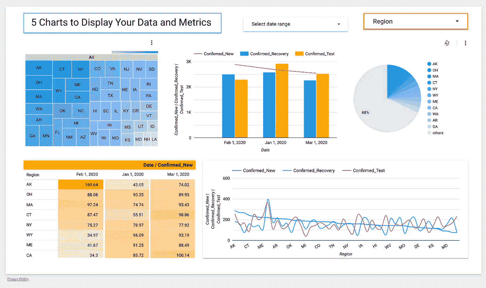
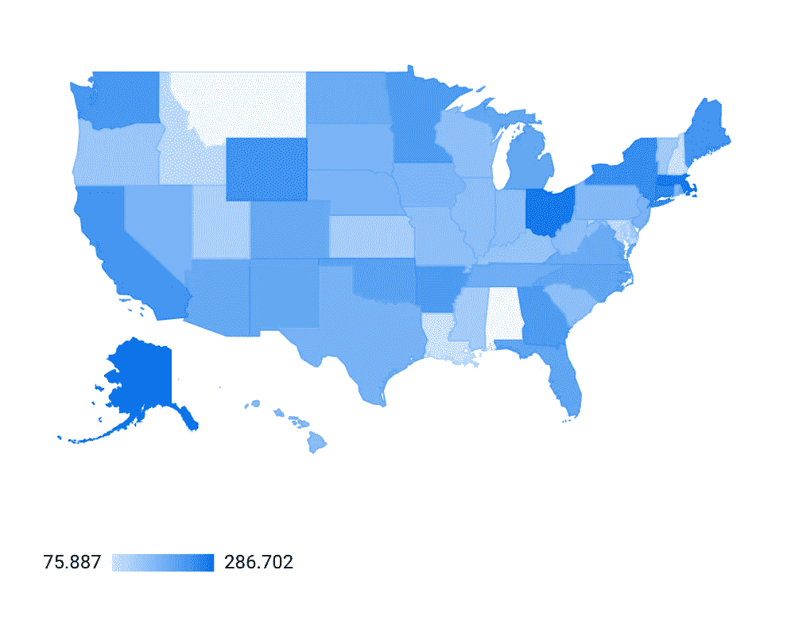
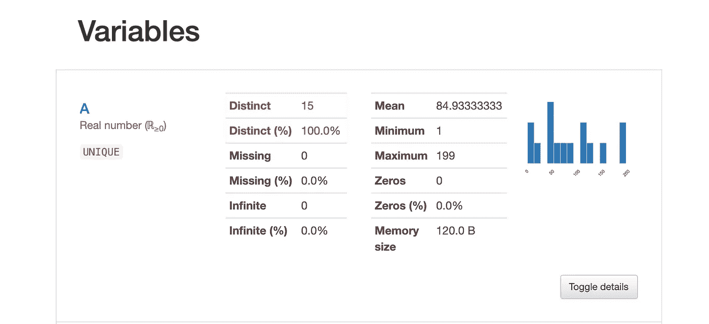

# 你应该知道这三个数据科学可视化工具

> 原文：<https://towardsdatascience.com/you-should-know-these-3-data-science-visualization-tools-e5afd43eabf6?source=collection_archive---------9----------------------->

## 意见

## 原因如下…


Domenico Loia 在[Unsplash](https://unsplash.com/s/photos/computer?utm_source=unsplash&utm_medium=referral&utm_content=creditCopyText)【1】上拍摄的照片。

# 目录

1.  介绍
2.  （舞台上由人扮的）静态画面
3.  谷歌数据工作室
4.  熊猫简介
5.  摘要
6.  参考

# 介绍

可视化的使用是数据科学的一个重要方面。从数据科学开始过程的好处，到结束，可视化的目的是以有效的方式阐明复杂的想法。有些人，比如我，从观察视觉效果中学到了最多的东西——例如，描述数据分布的直方图要比观察实际的视觉效果更难理解。虽然并不总是如此简单，但可视化可以让您的数据科学过程易于向非数据科学家的人解释。说了这么多，让我们看看数据科学可视化的具体工具，以及为什么您应该了解和使用它们。

# （舞台上由人扮的）静态画面


由[劳伦·曼克](https://unsplash.com/@laurenmancke?utm_source=unsplash&utm_medium=referral&utm_content=creditCopyText)在[Unsplash](https://unsplash.com/s/photos/chart?utm_source=unsplash&utm_medium=referral&utm_content=creditCopyText)【2】上拍摄。

这个流行的工具不仅是数据科学家的常用工具，也是产品经理、工程师、业务分析师和数据分析师的常用工具。然而，这种工具的主要缺陷是它很难获得，而且非常昂贵。如果你幸运地拥有这个工具，那么你应该知道为什么它对你这个数据科学家有好处，所以我将在下面描述它。

[Tableau](https://www.tableau.com/)【3】是一个分析平台，允许用户通过可视化来理解数据，同时也易于使用。这一点并不仅仅意味着数据科学，但是为了这篇文章，我们将更深入地探讨 Tableau 对数据科学的好处。遵循数据科学的一般路径，即获取数据并分析它，构建模型，并报告结果，我们可以看到 Tableau 可以适合每个部分。

> 获取和分析数据:

Tableau 为您提供了从静态 CSV 文件中探索数据的能力，但它也允许您通过实时连接直接使用 SQL 查询数据库。这一特性意味着您可以将 Tableau 用于实时仪表板和自动更新的数据。一个具体的特性， ***Prep*** ，允许你塑造、组合、构建数据。一旦您的数据被接收，您就可以专注于使用探索性分析来分析它。您可以用统计重要性来检查趋势，也可以很好地可视化相关性。制作简单的图形或图表对于数据科学来说并不独特，但是能够轻松地制作地图是一大优势。您可以在世界地图、美国地图等等上创建、添加和聚合您的数据，而不是在熊猫数据框架中按州对您的数据进行分组。

> 构建模型:

除了回归、趋势线和预测之外，您还可以利用 ***聚类算法特性*** ，它是基于 ***k-means*** 构建的。没错，你可以在 Tableau 中建立一个模型。Tableau 特别使用 Calinski-Harabasz 标准进行聚类。一些易于理解的用于汇总聚类的诊断方法是**组间平方和**和**组内平方和**，分别用于查看聚类之间的间隔以及各个聚类点的相似性。当然，这种聚类以一种美丽的方式可视化，不仅为数据科学家优化，也为非数据科学专业的其他人优化，使其更容易理解和消化。

> 报告结果:

也许 Tableau 最大的用途是报告结果的特性。因为这个工具主要是为业务和数据分析师开发的，所以这个特性是最重要的。类似于在构建模型之前浏览数据，您可以浏览模型的结果。例如，如果您想正常报告模型的总体 MAE，您可能只报告数字，但使用 Tableau，您可以按您在 Tableau 中指定的类别对 MAE 进行分组，并将其可视化，以查看您需要改进的组，这也可以显示您公司内部需要的某些趋势和修正。一旦您确定了可视化模型结果的最佳方式，您就可以创建一个交互式的实时仪表板，任何有权访问它的人都可以根据您指定的特定标准过滤结果。这样，你公司内部的人可以在他们自己的时间里理解你的模型，并看到它在有和没有特定过滤器的情况下是如何影响的。

> 总体而言，Tableau 具有以下特点:

*   易用性
*   EDA 的常用图表
*   用于报告结果的有用图表
*   连接实时数据的能力
*   可以应用数据过滤器的仪表板
*   易于汇总指标和功能
*   可以执行预测和聚类

如您所见，Tableau 是一个非常强大的可视化工具，每个数据科学家都应该知道。但是，如果你在一个较小的公司，这个工具可能不可行。话虽如此，可以参考下两个工具，都是 ***免费*** 。

# 谷歌数据工作室



谷歌数据工作室概述。作者截图[4]。

从上面的截图可以看出，[Google Data Studio](https://datastudio.google.com/)【5】是一个类似 Tableau 的工具。与 Tableau 相比，一个突出的主要优势是 GDS 是免费的，甚至可能更容易使用。它还允许对图表进行更多的定制，调整图表大小和编辑图表在仪表板上的位置比 Tableau 更容易。

您现在可以使用这个工具，您需要做的就是通过它支持的几种方法之一连接您的数据(*例如，文件上传、BigQuery、MySQL 的云 SQL、MySQL 以及更多*)。然后，您可以对数据进行分组和组织，并将其显示在可过滤的实时仪表板上。



谷歌数据工作室的地图功能。作者截图[6]。

我最喜欢使用的图表之一是地图。虽然简单，但如果用其他工具创建地图，就像在普通的熊猫图书馆一样，会令人沮丧。该地图允许您根据总体人口密度对特定类别和州进行颜色编码。例如，如果一个州有更多的人，该州将会更暗，在仪表板中，您可以将鼠标悬停在该州上以查看确切的人口数量。虽然这个用例很简单，但是您可以在数据科学过程的开始，或者在分析模型结果的最后，将它应用到探索性数据分析中。

> 总的来说，Google Data Studio 具有以下品质:

*   自由的
*   易于使用
*   更加可定制
*   用于报告结果的有用图表
*   连接实时数据的能力
*   仪表板可以应用数据过滤器
*   易于汇总指标和功能

# 熊猫简介


[布鲁斯洪](https://unsplash.com/@hongqi?utm_source=unsplash&utm_medium=referral&utm_content=creditCopyText)在[Unsplash](https://unsplash.com/s/photos/pandas-profiling?utm_source=unsplash&utm_medium=referral&utm_content=creditCopyText)【7】上的照片。

现在我们已经讨论了两个令人惊奇的可视化工具，接下来我们可能还需要什么呢？这就是熊猫简介《T2》的用武之地。它在其他人缺乏的地方茁壮成长。也就是说，我们不需要把我们的 Jupyter 笔记本和 pandas profiling 放在一起，我们可以简单地用 Python 导入它，并在一个单元中获得它的好处。只需几行代码，你就可以输入你的数据框，并迅速看到熊猫概况是如何变魔术的。

```
from pandas_profiling import ProfileReportdf.profile_report(style={‘full_width’:True})
```

该工具的一些主要功能包括数据框架概述、变量分析、变量相关性和缺失值。您可以看到描述性统计数据、直方图、普通值以及极值。也有警告称，该报告将显示某个特性丢失了多少，以及它是否与另一个特性高度相关— *高基数*。



配置文件报告中的可变特征示例。作者截图[9]。

在上面的截图中，您可以看到如何使用普通的`df.describe()`之外的工具来探索您的数据。这个库的唯一缺点是，如果你有一个大的数据集，它会非常慢，所以为了减轻这种痛苦，你可以使用这个技巧:

```
profile = ProfileReport(large_dataset, minimal=True)
```

它将消除像相关性这样耗时的普通计算。如果您仍然想看到这些，您可以限制您的数据集，但获取一个可以外推至主要人群的样本。

> 总的来说，熊猫烧香有以下特点:

*   自由的
*   易于使用
*   有用的 EDA 图表
*   只用一行代码就可以执行
*   可以在你的 Jupyter 笔记本上执行

# 摘要

所有这些讨论的工具都可以在您的数据科学职业生涯中为您提供帮助，最好的部分是它们易于使用、跨功能且功能强大。能够可视化复杂的概念、数据和结果对于大多数分析师，尤其是数据科学家来说非常有用。

> 总而言之，作为数据科学家，您应该知道以下三种可视化工具:

```
* Tableau* Google Data* Pandas Profile Report
```

我希望你觉得我的文章既有趣又有用！如果您已经利用了这些数据科学可视化工具中的任何一个，请随时在下面发表评论，这些工具是什么？ 现在对你的数据科学事业有帮助吗？你同意还是不同意，为什么？

请随时查看我的个人资料和其他文章，也可以通过 LinkedIn 联系我。我与这些提到的公司没有关系。

感谢您的阅读！

# 参考

[1]照片由 [Domenico Loia](https://unsplash.com/@domenicoloia?utm_source=unsplash&utm_medium=referral&utm_content=creditCopyText) 在[Unsplash](https://unsplash.com/s/photos/computer?utm_source=unsplash&utm_medium=referral&utm_content=creditCopyText)(2017)上拍摄

[2]照片由[劳伦·曼克](https://unsplash.com/@laurenmancke?utm_source=unsplash&utm_medium=referral&utm_content=creditCopyText)在[Unsplash](https://unsplash.com/s/photos/chart?utm_source=unsplash&utm_medium=referral&utm_content=creditCopyText)(2016)拍摄

[3] TABLEAU 软件有限责任公司，一家 SALESFORCE 公司。， [Tableau 网站](https://www.tableau.com/)，(2003–2021)

[4] M.Przybyla，使用虚拟数据的谷歌数据工作室概述，(2021 年)

[5]谷歌数据工作室，[谷歌数据工作室主页](https://datastudio.google.com/)，(2021)

[6] M.Przybyla，谷歌数据工作室的地图特征，(2021 年)

[7]图片由 [Bruce Hong](https://unsplash.com/@hongqi?utm_source=unsplash&utm_medium=referral&utm_content=creditCopyText) 在[Unsplash](https://unsplash.com/s/photos/pandas-profiling?utm_source=unsplash&utm_medium=referral&utm_content=creditCopyText)(2018)上拍摄

[8] pandas profiling， [pandas profiling GitHub](https://github.com/pandas-profiling/pandas-profiling) ，(2021)

[9] M.Przybyla，简介报告中可变特征的例子，(2021 年)