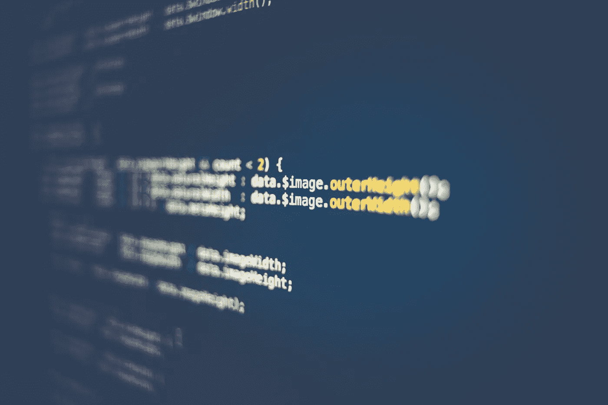

# 在成为数据科学家之前，你应该先掌握 Python

> 原文：<https://towardsdatascience.com/you-should-master-python-first-before-becoming-a-data-scientist-8ac1b1b4e10f?source=collection_archive---------4----------------------->

## 意见

## 以下是为什么…的 4 个原因


[钳工](https://unsplash.com/@benchaccounting?utm_source=unsplash&utm_medium=referral&utm_content=creditCopyText)在[Unsplash](https://unsplash.com/s/photos/people-laptop?utm_source=unsplash&utm_medium=referral&utm_content=creditCopyText)【1】上拍照。

# 目录

1.  介绍
2.  面向对象编程( *OOP* )
3.  熊猫
4.  sci kit-学习
5.  跨职能协作
6.  摘要
7.  参考

# 介绍

数据科学教育、理论和实践通常会关注统计学和机器学习算法。虽然这一重点当然是必要的，因为这些是数据科学的基础和主要方面，但还有另一项技能被忽视，尤其是在学校。我所指的这个技能是知道如何用 Python 编码。当然，现在作为一名数据科学家，你很可能已经知道如何用 Python 编程，但是当你第一次开始时，你可能只关注后者。在学习数据科学之前，首先掌握 Python 是很重要的，因为您将很难实现流行的库，并使用其他工程师也可以使用的可扩展代码。也就是说，我将强调为什么在学习数据科学之前应该先学习 Python 的几个原因。

# 面向对象编程( *OOP* )



由 [Markus Spiske](https://unsplash.com/@markusspiske?utm_source=unsplash&utm_medium=referral&utm_content=creditCopyText) 在[Unsplash](https://unsplash.com/s/photos/programming?utm_source=unsplash&utm_medium=referral&utm_content=creditCopyText)【2】上拍摄的照片。

当你是技术行业的任何类型的工程师时，面向对象编程是至关重要的，或者至少这是我的经验，以及在该行业工作的其他人的经验。有时候，当你学习数据科学时，你可以直接进入机器学习算法的概念和理论，虽然这当然很有用，但你需要知道 ***如何*** 在实践中应用这些概念和理论——这通常是通过编程语言来实现的。一些数据科学家使用 R，一些使用 Python，所以这些原因不仅适用于 Python，也适用于 R。

面向对象编程由类、对象、继承、函数、方法和实例等属性组成。没有面向对象的编程，你仍然可以执行数据科学过程，大多数人在他们的研究中是这样做的，但是一旦你想扩大规模，并且被更多的人看到；代码库最终受益于更高的效率。

> 通过学习 Python 进行面向对象编程实践的好处:

*   模块化的
*   干净的代码结构
*   可量测性
*   代码重用
*   安全
*   解决纷争

牢记面向对象编程带来了几个好处，就像我上面提到的，还有更多。这些好处也可以在其他同事之间分享，我将在下面讨论我的最后一点。既然我们已经讨论了面向对象编程，我们可以深入研究将 OOP 与流行的 Python 库相结合的一些方法。

# 熊猫


帕斯卡·米勒在[Unsplash](https://unsplash.com/s/photos/panda?utm_source=unsplash&utm_medium=referral&utm_content=creditCopyText)【3】上的照片。

学习 Python 意味着可以学习熊猫。你说熊猫是什么？[Pandas](https://pandas.pydata.org/)【4】是一个你可以用来进行数据分析的工具，快速且易于使用。虽然 Pandas 通常只与数据科学联系在一起(*在很大程度上是*)，但它仍然是您可以提前学习的东西，用于数据分析以及不同角色的其他计算。学习熊猫有无数的好处，它对数据科学过程的开始和结束部分特别有用。数据科学中出现的许多预处理步骤都可以通过 Pandas 技术来执行，例如开始时的探索性数据分析，并且对最终模型结果的解释也可以使用 Pandas 来分析。

> 以下是用 Python 学习熊猫的好处:

*   重塑数据
*   子集观测值
*   子集化变量
*   汇总数据
*   处理缺失数据
*   制作新列
*   组合数据集
*   分组数据
*   窗子
*   测绘

如果你点击上面的链接，有一个备忘单进一步总结了所有这些。Pandas dataframe 是 Pandas 的一个强大部分，它允许您从上面执行所有这些数据操作，并且是将您的数据转换为数据科学模型或机器学习算法可以读取的格式的最简单方法之一。与 Pandas 类似，还有另一个流行的库，它易于使用并且功能强大，我将在下面讨论。

# sci kit-学习


照片由 [Tran Mau Tri Tam](https://unsplash.com/@tranmautritam?utm_source=unsplash&utm_medium=referral&utm_content=creditCopyText) 在[Unsplash](https://unsplash.com/s/photos/chart?utm_source=unsplash&utm_medium=referral&utm_content=creditCopyText)【5】上拍摄。

数据科学家经常使用的另一个受欢迎的库或工具是 scikit-learn，这意味着如果您在开始学习算法的具体细节之前先专注于学习 Python，您将会有一个更好的算法基础。由于您将在进入机器学习理论之前学习这个库，所以您可能只想了解可能的算法和不同的高层次类型，以便一旦您开始更具体地学习数据科学，您将对最流行的 Python 库之一(数据科学家的*)中的算法范围有所了解。这种技术可能有点非正统，但我相信对您最终要钻研的内容有一个简单的概述是有益的——比如先了解主要的算法类型以及如何用 Python 对它们进行编程，然后再深入细节，这样 Python 就不会成为前进的限制因素。*

*[Scikit learn](https://scikit-learn.org/stable/) [6]是一个支持预测分析的工具，它构建在 NumPy、SciPy 和 matplotlib 之上。许多数据科学家使用这个库来处理各种算法。*

> *使用 scikit-learn 的一些常用方法是执行以下操作(几个示例，不限于):*

*   *分类-SVM，随机森林*
*   *回归-最近邻*
*   *聚类-k-均值*
*   *模型选择—网格搜索、交叉验证*
*   *预处理—转换*

*当你在 Python 中使用这些公共库时，你会希望能够使用它们，并讨论它们应该如何与其他工程师一起工作，这就引出了我的下一个观点。*

# *跨职能协作*

**

*照片由[马文·迈耶](https://unsplash.com/@marvelous?utm_source=unsplash&utm_medium=referral&utm_content=creditCopyText)在[Unsplash](https://unsplash.com/s/photos/business-team?utm_source=unsplash&utm_medium=referral&utm_content=creditCopyText)【7】上拍摄。*

*成为一名数据科学家意味着你将不得不与几种不同类型的工程师一起工作，比如软件工程师和机器学习工程师。能够与他们交流非常重要。一种方法是通过 Python。通常，数据科学家可以更专注于算法和一些代码；然而，当他们向其他工程师展示协作代码时，代码可能会更混乱或不清楚——更侧重于研究和一次性导向。能够以可伸缩和易读的方式编写 Python 代码将使您更好地在更大的代码库中实现代码。*

> *以下是 Python 的一些优势，这些优势增加了跨职能的协作:*

*   *能够通过 Python 翻译数据科学方法*
*   *一起协作编写 Python 代码*
*   *GitHub/Git 拉取请求*
*   *代码库*

*能够与他人合作当然是一项很好的技能，当你不仅可以将这种合作应用于想法和概念，还可以应用于你用来构建模型的代码时，这就更重要了。*

# *摘要*

*如您所见，掌握 Python 也是学习数据科学的关键一步。要成为一名伟大的数据科学家，你应该事先掌握一些关键概念和技能，比如统计学和数据分析。在本文中，我讨论了在学习数据科学之前想要掌握 Python 的一些关键原因。*

> *这些原因总结如下:*

```
*Object-Oriented Programming (*OOP*)Pandasscikit-learnCross-Functional Collaboration*
```

*我希望你觉得我的文章既有趣又有用。如果你在成为一名数据科学家之前已经以某种方式学习了 Python，请在下面随意评论。这对你现在的数据科学事业有帮助吗？你同意还是不同意，为什么？*

*请随时查看我的个人资料和其他文章，也可以通过 LinkedIn 联系我。*

> *下面是我写的一篇类似的文章，关于数据分析是数据科学的先决条件[8]:*

*[](/you-should-master-data-analytics-first-before-becoming-a-data-scientist-5dbceaea9d3d) [## 在成为数据科学家之前，你应该先掌握数据分析

### 以下是为什么…的 4 个原因

towardsdatascience.com](/you-should-master-data-analytics-first-before-becoming-a-data-scientist-5dbceaea9d3d) 

# 参考

[1]2015 年[钳工](https://unsplash.com/@benchaccounting?utm_source=unsplash&utm_medium=referral&utm_content=creditCopyText)在 [Unsplash](https://unsplash.com/s/photos/people-laptop?utm_source=unsplash&utm_medium=referral&utm_content=creditCopyText) 上的照片

[2]照片由 [Markus Spiske](https://unsplash.com/@markusspiske?utm_source=unsplash&utm_medium=referral&utm_content=creditCopyText) 在 [Unsplash](https://unsplash.com/s/photos/programming?utm_source=unsplash&utm_medium=referral&utm_content=creditCopyText) 上拍摄，(2017)

[3]Pascal müller 在 [Unsplash](https://unsplash.com/s/photos/panda?utm_source=unsplash&utm_medium=referral&utm_content=creditCopyText) 上拍摄的照片，(2018)

[4]熊猫— [NumFOCUS](https://numfocus.org/) ，[熊猫主页](https://pandas.pydata.org/)，(2021)

[5]照片由[陈茂三潭](https://unsplash.com/@tranmautritam?utm_source=unsplash&utm_medium=referral&utm_content=creditCopyText)在[Unsplash](https://unsplash.com/s/photos/chart?utm_source=unsplash&utm_medium=referral&utm_content=creditCopyText)(2021)上拍摄

[6] scikit-learn， [sci-kit learn 主页](https://scikit-learn.org/stable/)，(2021)

[7]由 [Marvin Meyer](https://unsplash.com/@marvelous?utm_source=unsplash&utm_medium=referral&utm_content=creditCopyText) 在 [Unsplash](https://unsplash.com/s/photos/business-team?utm_source=unsplash&utm_medium=referral&utm_content=creditCopyText) 上拍摄的照片，(2018)

[8] M.Przybyla，[在成为数据科学家之前，你应该首先掌握数据分析](/you-should-master-data-analytics-first-before-becoming-a-data-scientist-5dbceaea9d3d)，(2021)*