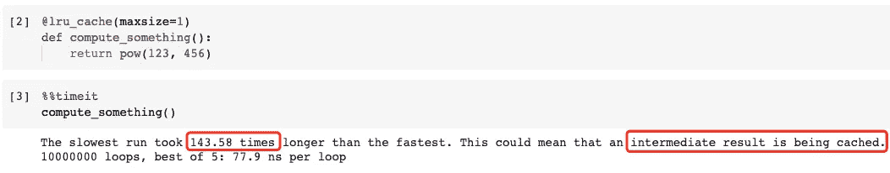
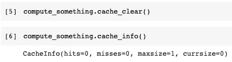

# 你不应该在 Python 中重复计算

> 原文：<https://towardsdatascience.com/you-should-never-repeat-computing-in-python-b097d57cf661?source=collection_archive---------11----------------------->


图片来自 [NastasyaDay](https://pixabay.com/users/nastasyaday-11197808/) 来自 [Pixabay](https://pixabay.com/?utm_source=link-attribution&utm_medium=referral&utm_campaign=image&utm_content=6514669)

## Python 中的内置函数工具帮助我们缓存

如果你做编程的很多，你一定知道一个编程原则就是“不重复自己”。那是在编码层面。能概括的就不要重复了。

但是，我要讨论的话题是“不要重复计算”。也就是说，如果我们已经计算了某个东西，我们就不应该在另一个时间计算它。您可能会想到一个可以缓存结果的解决方案。是的，我们可以用任何编程语言实现缓存机制。然而，在 Python 中，这是现成的！

在本文中，我将介绍一个名为`lru_cache`的 Python 内置装饰器，它可以启用开箱即用的缓存机制。在动态编程、Web 开发等很多场景下都会超级有效。

# 什么是 LRU 缓存？


图片来自 [Pixabay](https://pixabay.com/?utm_source=link-attribution&utm_medium=referral&utm_campaign=image&utm_content=4203677) 的 [Valdas Miskinis](https://pixabay.com/users/valdasmiskinis-12049839/?utm_source=link-attribution&utm_medium=referral&utm_campaign=image&utm_content=4203677)

## ***TL；*博士**

*如果您没有完全理解本节中的概念，请不要害怕。从下一节中的例子开始并不是一个坏主意。然后，回到这里你就没事了:)*

在我们开始之前，需要澄清一些概念。我们今天要讨论的`lru_cache`是一个 Python 装饰器。如果你仍然不知道什么是室内设计师，请看看这篇文章。

[](/the-simplest-tutorial-for-python-decorator-dadbf8f20b0f) [## Python 装饰者的最简单教程

### 添加任何函数/类的“Pythonic 式”包装，而不修改它们

towardsdatascience.com](/the-simplest-tutorial-for-python-decorator-dadbf8f20b0f) 

然后，它涉及到 LRU 的概念。它代表“最近最少使用的”。当最近的调用是即将到来的调用的最佳预测时，LRU 缓存工作得最好。例如，虽然我已经写了近 100 篇关于数据科学的文章，但前 10 篇文章贡献了近 80%的总阅读量。如果我要写一个网站来托管这些文章，缓存这 10 篇文章是个好主意，这样大多数读者就可以以最佳性能加载它们。

## 缓存大小限制

如果我们不知道哪些文章是最受欢迎的呢？这意味着我们不能指定缓存哪一个。我们应该缓存所有内容吗？当然不是，因为缓存一切就意味着什么都不缓存。

在 Python 中，我们可以为 LRU 缓存指定一个缓存大小限制，这样它就不会无限制地增长。这对于长时间运行的进程(如 Web 服务器)非常重要。

`lru_cache()`采用一个名为`maxsize`的参数。我们可以使用这个参数来限制缓存大小。如果`maxsize`设置为无，缓存可以无限制增长。当`maxsize`是 2 的幂时，LRU 特性表现最佳。

## 什么时候我们不应该使用 LRU 缓存？

基本上，除非我们懒得加或者计算过程预计不会重复，否则我们总是可以用的。

但是，在这种情况下，我们不应该使用 LRU 缓存。缓存有副作用的函数、需要在每次调用时创建不同的可变对象的函数或者不纯的函数(如 time()或 random())是没有意义的。

# 一个基本例子


图片来自 [Pixabay](https://pixabay.com/?utm_source=link-attribution&utm_medium=referral&utm_campaign=image&utm_content=2714998)

太多干的东西。让我们用一个例子来演示在 Python 中使用 LRU 缓存是多么容易。

LRU 缓存内置于 Python 中。所以，我们不需要下载任何包，但是我们需要在使用之前导入函数。

```
from functools import lru_cache
```

然后，让我们用`lru_cache`作为装饰器来定义一个函数。

```
[@lru_cache](http://twitter.com/lru_cache)(maxsize=1)
def compute_something():
    return pow(123, 456)
```

我们定义的函数只是为了演示的目的而“计算一些东西”。这里我们计算 123 的 456 次方。这将是一个很大的数字，但无论如何，这并不重要。

重要的是我们增加了`lru_cache`作为函数的装饰器。同样，我们已经定义了`maxsize=1`。因此，缓存将只保留 1 个计算结果。这是有意义的，因为这个函数只有一个计算结果。

现在，让我们用计时统计运行这个函数。

```
%%timeit
compute_something()
```



结果显示，最慢的运行(第一次运行)比最快的运行慢 144 倍。此外，检测到某些内容可能被缓存。是的，没错。我们知道结果被 LRU 缓存器缓存了。因此，除了第一次运行之外，其余所有运行都将只是从缓存中获得结果，而不是再次计算它。

## 缓存信息

我们如何证实这一点？是的，我们可以。使用`cache_info()`可以检查所有 LRU 缓存启用的功能。

```
compute_something.cache_info()
```


缓存信息包含四个统计信息:

*   `hits`缓存被使用的次数。

因此，我们可以使用这个值来衡量缓存机制节省了多少次重新计算相同内容的时间。

*   `misses`缓存未被使用的次数。

在这种情况下，我们只有一次运行没有使用来自 LRU 缓存的结果。那是第一轮。

*   `maxsize`我们定义的缓存限制的大小。
*   `currsize`当前缓存的结果数。

## 清除缓存

如果有必要，我们还可以清除 LRU 的缓存。

```
compute_something.cache_clear()
```

清除后，所有缓存的结果都将被删除，缓存信息也将被重置。



# 递归和动态编程


图片来自 [Pixabay](https://pixabay.com/?utm_source=link-attribution&utm_medium=referral&utm_campaign=image&utm_content=1959267) 的 [Hans Braxmeier](https://pixabay.com/users/hans-2/?utm_source=link-attribution&utm_medium=referral&utm_campaign=image&utm_content=1959267)

现在，让我们编造一些实际的例子。受益于 LRU 缓存的一个典型场景是递归函数。动态编程被认为比简单的递归函数更高级，但是我们必须手动实现缓存机制。有了 LRU 缓存，所有这些都不是问题。

让我们用一个基本且流行的递归问题——斐波那契递归。这是它的递归树。


图片提供:[http://theory of programming . com/2015/03/02/dynamic-programming-introduction-and-Fibonacci-numbers/](http://theoryofprogramming.com/2015/03/02/dynamic-programming-introduction-and-fibonacci-numbers/)

你看到`fib(6)`功能的问题了吗？许多子功能被计算了不止一次。比如`fib(2)`被计算了 5 次。如果我们正在计算一个更大的斐波那契数，重复的时间将会成倍增加。

嗯，这是在一个单独的斐波那契数计算的范围内。如果我们正在计算更多呢？比如我们要计算从 1 到 10 的斐波那契数，重复计算的次数会更大。将会有大量的 CPU 和执行时间的浪费。

让我们做一个简单的实验。

```
computing_times = 0def fib(n):
    global computing_times
    computing_times += 1
    if n < 2:
        return n
    return fib(n-1) + fib(n-2)
```

在上面的代码中，我们定义了斐波那契递归函数。除此之外，我们还定义了一个全局变量`computing_times`来计算函数被调用的次数。

现在，让我们写一个 for 循环来计算从 1 到 10 的所有斐波那契数列。

```
for n in range(10):
    fib(n)
```


显示该函数被调用了 276 次！

现在，让我们将 LRU 缓存添加到函数中。我懒得计算我们需要多大的尺寸，所以我只想设置`maxsize=None`。这没问题，因为我们知道在这个演示中缓存大小不会疯狂增长:)

```
computing_times = 0[@lru_cache](http://twitter.com/lru_cache)(maxsize=None)
def fib(n):
    global computing_times
    computing_times += 1
    if n < 2:
        return n
    return fib(n-1) + fib(n-2)for n in range(10):
    _ = fib(n)
```


哇，就 10 次！这很有意义，我们实际上只需要计算从 1 到 10 的斐波纳契数。所以，这是 10 倍。所有剩余的计算都可以跳过，因为它们被缓存了。

我们所做的就是向函数添加装饰器。就是这样！

```
[@lru_cache](http://twitter.com/lru_cache)(maxsize=None)
```

当然，我们可以检查缓存信息。它还记录了统计数据。


# Web 请求处理


图片来自 [Pixabay](https://pixabay.com/?utm_source=link-attribution&utm_medium=referral&utm_campaign=image&utm_content=1572617) 的 [Martinelle](https://pixabay.com/users/martinelle-495565/?utm_source=link-attribution&utm_medium=referral&utm_campaign=image&utm_content=1572617)

另一个更实际的例子是 Web 开发。假设我们正在为一个 Web 服务开发一个后端服务器。因此，我们需要接收所有用户的请求，并根据请求做出响应。如果我们的大多数用户请求少量的资源，这将是一个完美的缓存场景。

让我们在这个演示中使用 Python PEP (Python 增强提案)。假设我们正在开发一个基于数字检索 PEP 文档的函数。

启用 LRU 缓存后，完整实现的功能如下。

```
import urllib.request
import urllib.error[@lru_cache](http://twitter.com/lru_cache)(maxsize=32)
def get_pep(num):
    'Retrieve text of a Python Enhancement Proposal'
    resource = f'[http://www.python.org/dev/peps/pep-{num:04d}/'](http://www.python.org/dev/peps/pep-{num:04d}/')
    try:
        with urllib.request.urlopen(resource) as s:
            return s.read()
    except urllib.error.HTTPError:
        return 'Not Found'
```

该函数以 PEP 编号为参数，从 PEP 官网检索。LRU 缓存启用了`maxsize=32`,因为这一次我们不希望缓存变得太大。我们假设大多数用户对一些重要的 PEP 文档感兴趣。

现在，让我们用 for 循环来模拟请求。

```
for n in 8, 290, 308, 320, 8, 218, 320, 279, 289, 320, 9991:
    pep = get_pep(n)
    print(f'PEP-{n}, Length: {len(pep)}')
```

因为我们只是在测试 LRU 缓存，所以我只想计算 HTML 页面上的字符数。


如截图所示。红色的是第一次计算的，而绿色的则利用了缓存的结果。

因此，在这 11 个请求中，有 3 个来自缓存。这意味着我们不需要向 URL 发送 GET 请求，获取 HTML 内容并计算字符数。结果只是从缓存中获得。


在这种情况下，LRU 缓存不仅节省了计算时间，还节省了网络流量的时间。这可以为我们节省大量资源，并以更快的方式为用户服务。

# 摘要


图片由[克里斯托·阿涅斯特夫](https://pixabay.com/users/anestiev-2736923/?utm_source=link-attribution&utm_medium=referral&utm_campaign=image&utm_content=6096180)从[皮克斯拜](https://pixabay.com/?utm_source=link-attribution&utm_medium=referral&utm_campaign=image&utm_content=6096180)拍摄

在本文中，我介绍了 LRU 缓存，它是 Python 内置的`functools`模块中的一个工具。它可以缓存函数的结果以防止重复计算。

这两个实例表明，LRU 缓存在递归函数、动态编程以及 Web 服务等需要重复的场景中有很大的价值。正确使用 LRU 缓存将节省我们大量的硬件资源和执行时间。

[](https://medium.com/@qiuyujx/membership) [## 通过我的推荐链接加入 Medium 克里斯托弗·陶

### 作为一个媒体会员，你的会员费的一部分会给你阅读的作家，你可以完全接触到每一个故事…

medium.com](https://medium.com/@qiuyujx/membership) 

如果你觉得我的文章有帮助，请考虑加入 Medium 会员来支持我和其他成千上万的作者！(点击上面的链接)