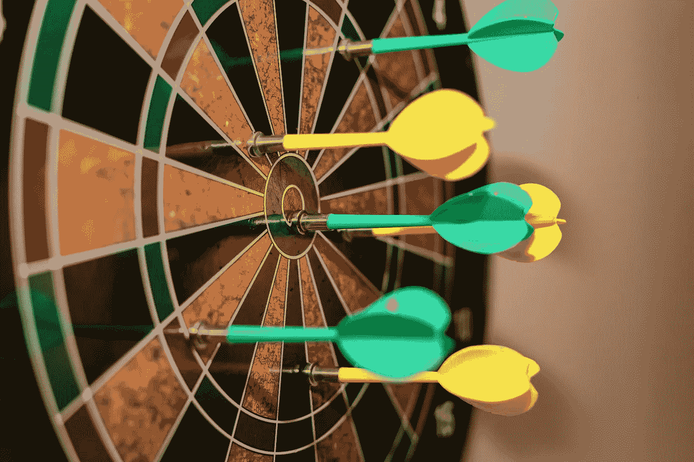

# 你的人工智能模型是“错误的”,但它可以改变你的业务

> 原文：<https://towardsdatascience.com/your-ai-model-is-wrong-yet-it-can-transform-your-business-90dd48cd467e?source=collection_archive---------23----------------------->

欧文·坎普在 [Unsplash](https://unsplash.com/?utm_source=unsplash&utm_medium=referral&utm_content=creditCopyText) 上的照片

## 为什么模型准确性被高估，如何说服你的经理

二十多年来，网飞一直痴迷于机器学习模型。

2006 年，该公司宣布向任何能够将其推荐算法的准确率提高 10%的人颁发[百万美元奖金](https://en.wikipedia.org/wiki/Netflix_Prize)。超过 40，000 支队伍参加了全球挑战赛。

这项比赛持续了三年，只有两个团队成功超越了准确度门槛。网飞奖励了一名准确度提高了 10.06%的获胜者。

但是，他们[抛弃了](https://www.wired.com/2012/04/netflix-prize-costs)获胜的算法。

尽管精确度极高，但这种算法的工程成本和复杂性非常高，对于精确度的提高来说太高了。相反，网飞使用了一种排名较低但更简单、成本更低的算法，其准确率仅提高了 8.43%。

值得注意的是，这场历时 3 年的算法准确性马拉松结束时，网飞的商业模式已经发生了转变。焦点已经从 DVD 租赁转移到流媒体，因此[减少了这些算法的效用](https://netflixtechblog.com/netflix-recommendations-beyond-the-5-stars-part-1-55838468f429)。

今天，许多追求机器学习(ML)的组织都是准确性谬误的受害者。他们狭隘地专注于模型准确性，同时在过度优化中浪费宝贵的资源。商业领袖已经搁置了不能提供很高准确性的好的解决方案。

这对企业来说是巨大的机会损失。你的人工智能/人工智能模型可能不准确，但它仍然可以让你的业务变得更好。*在这篇文章中，你将学习四种方法来确定你的模式是否能为你的企业带来变革*。

Marc A 在 [Unsplash](https://unsplash.com/s/photos/dartboard?utm_source=unsplash&utm_medium=referral&utm_content=creditCopyText) 上拍摄的照片

# 什么影响机器学习模型的准确性？

许多因素影响模型的准确性，但其中四个是关键的，[安斯泰拉制药](https://www.astellas.com/us/)营销科学副总监[瑞安·摩尔](https://www.linkedin.com/in/ryan-moore-536961a4/)说。这四个因素是:

a)我们是否包括了所有可能影响结果的相关输入？

b)我们收集的历史数据质量如何？

c)我们的模型是否捕捉到了输入和输出之间的真实关系？

d)未来场景与用于训练模型的场景有多大不同？

您可以看到，模型准确性是一系列不太完美的连接中的最后一环。理解模型最多只能产生结果的近似值对于充分利用它们至关重要。

在给定的情况下，您的[数据科学团队](https://www.forbes.com/sites/ganeskesari/2020/11/24/the-5-roles-that-every-data-science-team-must-hire/)必须通过优化这些因素来努力提高准确性。一旦你有了一个机器学习解决方案，你必须评估它的商业影响。

由 [Unsplash](https://unsplash.com/s/photos/impact?utm_source=unsplash&utm_medium=referral&utm_content=creditCopyText) 上的 [Nadir sYzYgY](https://unsplash.com/@nadir_syzygy?utm_source=unsplash&utm_medium=referral&utm_content=creditCopyText) 拍摄

# 1.根据人的表现来衡量模型的准确性

《可预测的非理性》一书的作者丹·艾瑞里说:“大多数人不知道他们想要什么，除非他们在上下文中看到它。”。我们人类无法孤立地理解一个数字。

这是模型准确性的挑战。当用百分比表示时，人们希望它尽可能高，就好像这些是学校成绩一样。沃顿商学院的 Berkeley Dietvorst 说,[我们最终在一个机器犯错的世界和一个从不犯错的世界之间做了一个错误的比较。](https://www.npr.org/2015/02/03/383454933/why-we-judge-algorithmic-mistakes-more-harsley-than-human-mistakes)

*要了解模型的准确性，请将其与您组织内相同任务的人为错误率进行比较。*假设你工作的人类准确率是 81%。一个 78%准确的模型距离基准只差 3%；不会差 22%的。

# 2.通过用人类智能增强模型来改善结果

组织经常让人工智能与人类对抗，就好像这是一场竞赛。当然，为了了解人工智能的状态，将人工智能模型的性能与人类的准确性进行对比是有用的。但是所有的比较都应该到此为止。与其让他们互相竞争，为什么不把这两个玩家带到同一个团队呢？

[增强智能](https://www.forbes.com/sites/ganeskesari/2020/10/19/go-beyond-artificial-intelligence-why-your-business-needs-augmented-intelligence)是一种以人为中心的合作伙伴关系，将人和人工智能结合在一起，以增强认知性能。在疫情期间，我们已经看到了增强智能的伟大例子。

在患者与医疗服务提供者的联系成为一个关键问题的时候，机器人辅助手术拯救了生命。《自然》[报道了](https://www.nature.com/articles/s42256-020-00238-2)外科医生如何使用磁导航系统(MNS)支持的系统进行远程血管内手术。该系统不仅提供了合理的控制和灵活性，而且增加了程序的安全性。

*为了改善结果，在设计机器学习系统时，你必须让人类参与进来。*在由于缺乏足够的数据或高度的情境变化而导致模型准确性受损的情况下，人类可以介入提供支持。

当人和模型结合在一起时，所达到的净精度远远大于单独使用任何一个所能达到的精度。

照片由 [Michael Dziedzic](https://unsplash.com/@lazycreekimages?utm_source=unsplash&utm_medium=referral&utm_content=creditCopyText) 在 [Unsplash](https://unsplash.com/s/photos/ai?utm_source=unsplash&utm_medium=referral&utm_content=creditCopyText)

# 3.检查模型是否有持续改进的空间

算法是了不起的学习者。当他们看到更多的数据时，他们会改进。当你给他们具体的反馈，告诉他们哪里做错了，他们就会进步。它们随着人工智能研究的进展而改进。

当我们做出金融投资决策时，我们计算的是钱的未来价值。但是，我们不会用算法精度来做这件事。相反，我们以表面价值评估它们。

在过去的 50 年里，蛋白质结构的预测一直是科学界最艰难的挑战之一。2018 年，CASP 竞赛(结构预测的关键评估)见证了 AI 的有效应用。由 DeepMind 构建的人工智能系统 AlphaFold 取得了惊人的成绩，分数比上一版提高了 10 多分。2020 年，AlphaFold [通过在短短两年内将分数大幅提高至 92.4，解决了](https://deepmind.com/blog/article/alphafold-a-solution-to-a-50-year-old-grand-challenge-in-biology)这一重大挑战。

*为了了解你的模型的真正潜力，考虑你通过更多数据、更好的反馈或人工智能的研究进展可能获得的好处。*

# 4.计算模型结果的商业价值

前面的三个步骤解释了如何将您的准确性联系起来，通过增强来提高它，并预测未来的价值。现在，最后也是最关键的一步是量化和衡量你的[业务成果](https://enterprisersproject.com/article/2020/11/decision-intelligence-key-better-business-decisions)。

不，你的 ML 模型不一定要完美到能带来商业价值。国际分析研究所副总裁德鲁·史密斯说，通常基线很低，即使 1%的改善也能产生巨大的商业收益。

在家具巨头宜家任职期间，史密斯报告称，排长队是顾客去别处购物的第三大原因。流量分析模型有助于预测商店中会形成的队列。

虽然算法并不完美，但史密斯说，预测比经理的直觉好得多。这使得商店团队能够建立队列破坏实践，从而减少了 30%的队列投诉。这被证明是卓越客户服务的无价工具。

*问问自己，你的机器学习模型的真正目的是什么。*

它应该帮助你增加收入还是降低成本？将净准确性改进转化为模型将交付的业务影响。量化影响，这将帮助您将对话从准确性转移到业务成果。

# 通过渐进式模型改进实现业务转型

照片由 [Jungwoo Hong](https://unsplash.com/@hjwinunsplsh?utm_source=unsplash&utm_medium=referral&utm_content=creditCopyText) 在 [Unsplash](https://unsplash.com/s/photos/progress?utm_source=unsplash&utm_medium=referral&utm_content=creditCopyText) 上拍摄

为了解决与商业领袖在人工智能模型准确性上的脱节，你必须同情、教育他们，并与他们接触。

Smith 建议“这是一个发现更多关于利益相关者、他们的挑战以及他们想要抓住的机会的绝佳机会。我很好奇他们为什么要追求如此高的精度。”

教育他们机器学习模型的目的是什么。解释影响准确性的因素，以及如何实际管理这些因素来推动结果。

最后，与他们接触。“透明、客观地评估与利益相关者的权衡，以达成一致。摩尔说:“追求商业价值最大化的道路。”。

史密斯补充说，专注于快速、持续改善许多业务领域的团队，将会击败旨在完美解决一个大问题的团队。

网飞是一个依靠渐进式创新繁荣发展的组织的优秀范例。由于过去 20 年人工智能模型的持续微小改进，人们在网飞观看的 80%以上的视频是通过他们的[推荐系统](https://dl.acm.org/doi/pdf/10.1145/2843948)发现的。

*这篇文章最早发表于《福布斯》上的*<https://www.forbes.com/sites/ganeskesari/2021/01/21/accuracy-isnt-everything-how-even-a-wrong-ai-model-can-transform-your-business/>**。增加了插图。**