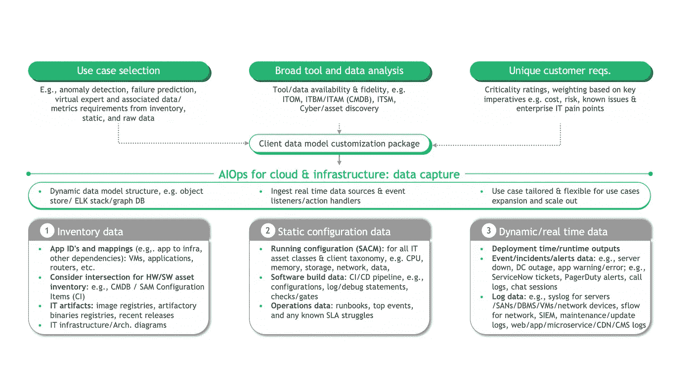
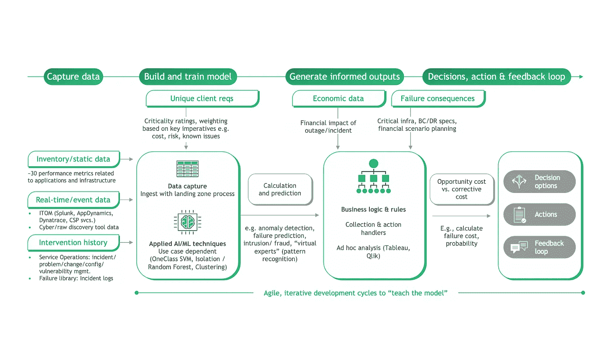
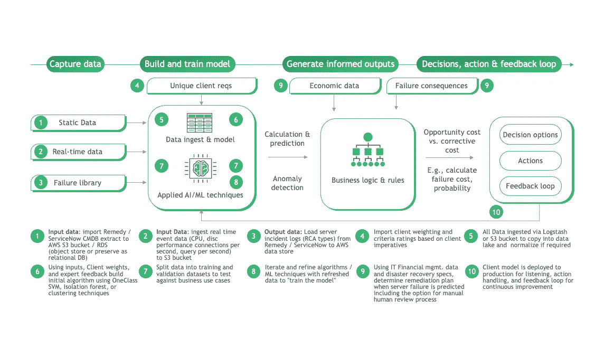
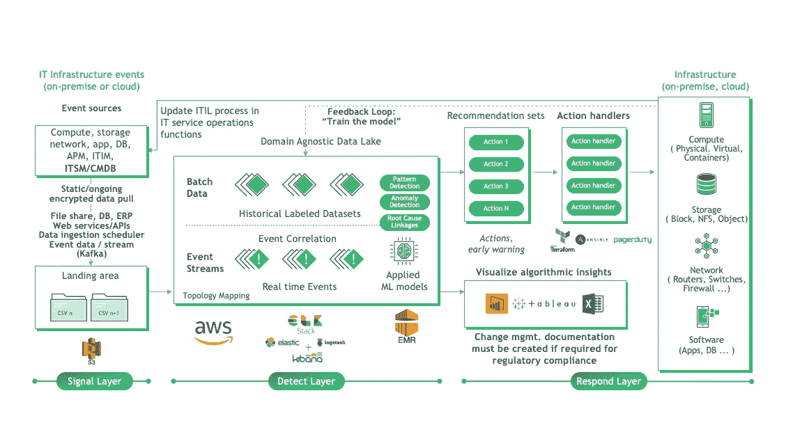

# 你的云并没有想象中的那么智能

> 原文：<https://towardsdatascience.com/your-cloud-isnt-as-smart-as-it-could-be-9f700ae1ace9?source=collection_archive---------37----------------------->

## 面向云和 IT 基础架构的 AIOps 可以实现企业和任务关键型功能的智能运营

面向云和 IT 基础设施的 AIOps 可以实现企业和任务关键型功能的智能运营(图片由 [Unsplash](https://unsplash.com/s/photos/bb8?utm_source=unsplash&utm_medium=referral&utm_content=creditCopyText) 上的 [Markus Winkler](https://unsplash.com/@mariushaak?utm_source=unsplash&utm_medium=referral&utm_content=creditCopyText) 拍摄)

在更广泛的云市场中，超大规模数据中心、云服务提供商(CSP)以及商业和公共部门中公共云上的总体工作负载采用率持续增长。云的采用在过去几年中稳步增长，据估计，虽然 75%的工作负载保留在传统 it 和私有云环境中，但现在 25%的企业工作负载通过传统现代化和迁移以及云原生数字产品开发和工程驻留在公共云中(1)。公共云的采用仍在继续增长，**但我们仍有很长的路要走，以继续采用、开发和发展云运营**。

然而，随着遗留应用程序的现代化和数据迁移，**遗留的工作方式和操作结构也能够并且已经在云中复制它们自己**。许多经典的 IT 运营流程、治理结构&财务管理方法已经从数据中心复制到私有云和公共云中。随着传统 IT 基础架构和云原生环境中异构 IT 环境的复杂性增加，IT 运营的负担也在增加。IT 部门必须管理的大量企业、运营和以任务为中心的数据，首席信息官不断要求用更少的资源做更多的事情，以及从传统安全模式向新一代安全模式的转变，这些都导致了运营效率低下(2)。

**这严重限制了您的云& IT 基础设施环境**的潜力。真正的云原生产品开发和运营的基础可以而且应该通过智能运营(也称为 AIOps)来增强。在技术堆栈的每一层和 IT 运营生命周期的每一个阶段整合 AIOps，可以增强您的云和 IT 基础架构环境的可预测性和智能性，甚至可以实现环境的“零接触”(例如自动修复和自我修复)。

# 什么是 AIOps？

AIOps(也称为 MLOps，取决于供应商和使用案例)中有一套快速增长的工具和方法来解决这些问题，这是一种利用大数据、高级分析和机器学习来增强和自动化 IT 运营和监控的方法，可实现 IT 环境的智能运营。虽然还处于早期，但 it 领导者已经开始在自己的职能部门中采用机器学习(ML)技术，以提高企业技术的运营效率并降低成本。在过去的几年中，许多供应商已经开始设计和开发强大的分析工具，以解决 IT 人员在管理、更新和运行整个企业的 IT 硬件和软件时面临的特殊挑战(3)。

核心 AIOps 通常涵盖软件开发生命周期(SDLC)关键领域的人工智能和机器学习(AI/ML)用例，包括:应用性能监控、IT 基础设施监控、IT 事件关联和分析以及网络性能监控和诊断。

# 云服务提供商(CSP)和独立软件供应商(ISV)带来了哪些功能？

在这一领域，工具和供应商驱动的促成因素混合在一起，再加上高度定制的方法，用于聚合运营数据并推动对每个 AIOps 用例的差异化洞察。一些亮点包括:

**云服务提供商(CSP)。**

更一般地说，AWS、GCP 和 Azure 高度支持将 AIOps 功能引入公共云生态系统的关键 ISV，并与之良好集成。

虽然许多本机工具通常是集成的，而不是本机的，但公共云服务的本机配置(例如 CI/CD 管道、数据服务)可以让您在这个领域走得更远。查看 [GCP MLOps](https://cloud.google.com/solutions/machine-learning/mlops-continuous-delivery-and-automation-pipelines-in-machine-learning) 、 [Azure MLOps](https://azure.microsoft.com/en-us/services/machine-learning/mlops/) 和 [AWS MLOps](https://aws.amazon.com/solutions/implementations/aws-mlops-framework/) (以及 [AWS Sagemaker](https://docs.aws.amazon.com/sagemaker/index.html) )，在引入集成工具和服务之前，了解本地 CSP 服务及其嵌入式机器学习技术的可能性。

**ISV 和商用现货(COTS)供应商。**

[Splunk](https://www.splunk.com/) “无所不包的数据平台”，以日志管理而闻名，已经扩展了它的平台，因为它是 AIOps 用例的逻辑事件和数据源。Splunk [机器学习工具包](https://www.splunk.com/en_us/software/splunk-enterprise/machine-learning.html)和[用于 it 运营的人工智能](https://www.splunk.com/en_us/data-insider/ai-for-it-operations-aiops.html)都提供了启动套件和工具，以便在 Splunk 中本地运行。

[Moogsoft](https://www.moogsoft.com/) 更像是一个专门为 [AIOps 支持](https://www.moogsoft.com/aiops-platform/)而设计的原生平台，集成了许多众所周知的工具和数据源，并支持下面详述的许多用例。Moogsoft 提供了一个企业级的云原生平台，使客户能够按照自己的速度以低得多的成本推动采用，根据他们的网站。

**开放标准&开源遗产。**

[Elastic](https://www.elastic.co/),[ELK Stack](https://www.elastic.co/elastic-stack?ultron=B-Stack-Trials-AMER-US-E-Exact&gambit=Elasticsearch-ELK&blade=adwords-s&hulk=cpc&Device=c&thor=elk%20stack)的创建者，是已经扩展到 AIOps 功能的“开源遗产”解决方案的众多例子之一。Elastic 支持许多机器学习用例，包括来自事件源数据的[异常检测](https://www.elastic.co/guide/en/kibana/current/xpack-ml-anomalies.html)。

**信息技术服务管理(ITSM)平台。**

总的来说，ITSM 平台和服务运营对于释放 AIOps 用例及功能的过程和数据是绝对重要的。两家主要的 ITSM 领先厂商正在提供现成的功能，分别是 [ServiceNow AIOps](https://www.servicenow.com/solutions/security-aiops.html) 和 [BMC AIOps](https://www.bmc.com/it-solutions/aiops.html) 。

# 我如何在我的云和 IT 基础架构环境中实现 AIOps 并增加智能运营？

**打好运营基础。**

*IT 服务管理(ITSM)和运营*。也许这是另一天的专门文章，但是现代 ITSM 实践和操作对于 AIOps 是至关重要的和基础的，缺乏用于端到端 IT 过程的集成的、自动化的 ITIL 功能通常是将 AIOps 附加和集成到您的生态系统中以改善环境的根本原因。AIOps 应支持持续的服务改进和持续的反馈循环，以提高您的 ITSM 平台和 ITIL 流程的运营效率。

**提高您环境的可见性和透明度。**

*确定你最初的 AIOps 战略*。首先，确定您的目标是否是离散的使用案例和机会领域(例如，异常检测、降噪、事件预测、自动化问题补救)，或者这是否将是更广泛的实验和发现工作，以确定更集中的深入探索和使用案例开发的机会领域。如果是前者，这种努力可以很快针对你需要获取的数据的性质和你试图解决的问题。如果是后者，该计划应该更多地以试点的方式进行试验，并通过广泛撒网来确定在您的环境中哪里有价值证据。

*进行有针对性的初始数据采集*。现在，您已经了解了您要解决的问题(或者想要确定它可能是什么)，您可以将重点放在您需要作为数据捕获目标的工具、数据和基础架构堆栈层上。下图为您的独特输入以及它们将如何影响库存、静态配置和动态数据元素提供了一个很好的框架，这些数据元素在任何给定的用例中都非常适合捕获:

*图 1:数据采集应该高度定制，以适应用例需求，以及客户数据可用性、保真度和唯一标准*

*迭代建立和训练数据模型*。这种数据捕获为识别价值证据建立了一个起点。你创造了“干草堆”……现在你要找到“针”！

*图 2:数据流和流程模型阐明了如何构建和运行端到端 AIOps 生命周期；方法是不可知的，而技术是特定于用例的*

现在，通过获取这些摄取的原始数据资产并将其转换为应用的机器学习技术的输入变量，包括错误和事故计数、IT 运营数据中的阈值和趋势等，可以实现特征工程。

这些输入变量将为某些用例提供机会。例如，标准化的错误和事件数据可能会围绕异常检测用例提出价值证明，用于检测偏离正常操作基础架构和应用程序行为的早期迹象。然后，您可以选择某些分类和机器学习方法(例如隔离森林、聚类方法)来进一步细化数据，生成异常分数或其他可衡量的洞察单位，并生成一个有意的反馈循环来进一步细化和训练模型，以识别真正的故障事件并减少误报和操作。可能需要多次迭代、敏捷的改进周期，以将数据、模型和洞察力锐化为真正有价值的东西，从而推动决策制定，并最终自动处理您的云和 IT 基础架构环境中已识别的异常。

这是一个更加详细的视图，一步一步地描绘了一个在您的环境中完全启用的用例对您的影响:

*图 3:一个更加详细的、由外向内的存储峰值异常检测用例示例，展示了 AI/ML 如何成为现实*

**降低噪音。**

*将可见性转化为发现，从而加深对问题的理解。*这种强化数据和调查结果的迭代过程将产生“降噪”效果，通过消除假阳性和/或假阴性，揭示您环境中真正可操作的内容，或为某些行动提供信息，从而识别真正重要的内容。这些见解涵盖了广泛的核心用例，包括:

**降噪**:降噪行为本身是分析数据和警报模式的基础，并随后过滤掉误报，以便实现下面更进步的用例

**分类和警报关联**:集群和关联将您的云 IT 基础架构环境的各个部分转变为单个离散事件，以加快分类过程并提供透明度

**服务影响分析**:绘制跨已识别事件集群的依赖关系映射，以分析 IT 故障、中断和其他中断事件在技术和业务方面的下游或级联影响

**根本原因分析**:识别并推断应用程序和云/ IT 基础架构层中已实现中断事件的根本原因

**预测**:预测未来基础设施能力的应用需求&需求分配

**事件预测**:转换整个 IT 环境中检测到的异常，以预测和预防未来的故障

…“扩展”用例可能涉及将这些核心示例集成到 DevOps / DevSecOps 管道、业务成果、IT 服务管理(ITIL 模块和流程)以及核心网络和安全运营(NOC/SOC)中。

**制定明智的决策和自动化的行动。**

*利用对问题的深刻理解提出建议，为决策提供信息，甚至立即采取自动补救措施*。好的，我对我的企业环境有了更多的了解，所有这些都很棒…我实际上可以做些什么来将数据转化为可执行的东西。我是否可以更进一步，将数据分解为任务，在一个无需干预的自主环境中实现自动化。潜力肯定是有的！一些关键的行动用例包括:

**补救建议**(手动加速):使用机器学习技术开发“专家”建议系统，使 IT 运营部门能够更轻松地对事件响应进行故障排除

**自动化问题补救**(自动化&流程编排):在发生事故时自动触发解决流程，也称为“自我修复”

# 当我将所有的技术和流程组件放置到位时，这会是什么样子？

下面是一个指示性的参考架构，说明您的环境可能包括事件和数据源、用于识别和细化 AIOps 使用情形的自定义聚合器和数据湖、下游可见性和操作处理方法，以及用于不断改进您的云和 IT 基础架构环境和服务运营功能的反馈循环:

*图 4:IT 基础设施 AIOps 的示例性环境架构*

…这可以构建在任何内部环境、公共 CSP 环境中，甚至可以分布在混合和云计算生态系统中，具体取决于您的环境状况和目标使用情形。

这应该提供了一个高层次的概述，介绍了 AIOps 的可能性，以及如何利用异构、复杂的环境，将来自环境传感器的信号分解为一个真实、自主、持续的反馈循环，以改善企业云和 IT 基础架构的运营。虽然还处于初期阶段，但工具、功能、数据和方法都已具备，可以将您的云从初始运营能力转变为“智能云”。

如果您认为这篇文章信息丰富，也请查看 BCG 对 AIOps 市场和使用案例的更广泛的观点，以及我对美国联邦政府内的 [AIOps 机会的观点](https://gcn.com/articles/2020/10/14/aiops-efficiencies.aspx)，从行业特定的角度来实现 AIOps。

***

Matthew Leybold 是波士顿咨询集团(Boston Consulting Group)驻纽约的副总监，负责 BCG Platinion 北美分公司的云计算和 IT 基础设施主题以及公共部门。

# 引用的参考文献:

1.Gartner 预测 2019 年。[https://www . Gartner . com/en/documents/3895580/predicts-2019-increasing-reliance-on-cloud-computing-tra](https://www.gartner.com/en/documents/3895580/predicts-2019-increasing-reliance-on-cloud-computing-tra)

2.证明联邦政府 AIOps 的效率。GCN。[https://gcn.com/articles/2020/10/14/aiops-efficiencies.aspx](https://gcn.com/articles/2020/10/14/aiops-efficiencies.aspx)

3.不管准备好了没有，人工智能正在走向 IT 运营。卡介苗。[https://www . BCG . com/en-us/publications/2019/artificial-intelligence-coming-information-technology-operations](https://www.bcg.com/en-us/publications/2019/artificial-intelligence-coming-information-technology-operations)