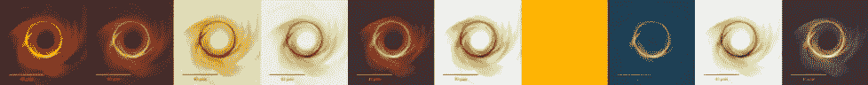

# 你的彩色地图是坏的，这里是如何修复它

> 原文：<https://towardsdatascience.com/your-colour-map-is-bad-heres-how-to-fix-it-lessons-learnt-from-the-event-horizon-telescope-b82523f09469?source=collection_archive---------28----------------------->

## 从视界望远镜中吸取的教训



不同的科学彩色地图应用于 GRHD 模拟的结果(见[https://arxiv.org/ftp/arxiv/papers/1906/1906.11241.pdf](https://arxiv.org/ftp/arxiv/papers/1906/1906.11241.pdf))

你还记得那些模糊的 excel 表格和不可读的颜色的文件吗？没有吗？这很正常，没有人会。即使内容是王道，演示文稿也能激励读者阅读你讲述的故事。

一个重要的因素是信息的颜色编码有多好。数据的准确表示是至关重要的。许多常见的彩色地图通过不均匀的颜色梯度扭曲数据，对于色觉缺陷的人来说通常是不可读的。一个臭名昭著的例子是喷射彩色地图。这些彩色地图没有呈现你想要说明的所有信息，甚至更糟的是通过人工制品呈现虚假信息。不管你是不是科学家，你的目标是以最准确、最吸引人的方式传达视觉信息。此外，不要忽视色觉缺陷，这代表了 8%的(高加索)男性人口。


你会为你的演示选择什么颜色的地图？丑陋的喷射还是更平滑的热喷射？参见 https://github.com/ThomasBury/scicomap 中的

# 🗺色彩空间

色彩空间是色彩的特定组织，确保色彩的再现。主要原则如下。

感知一致性是指颜色空间中颜色之间的欧几里德距离应该与人类颜色感知距离判断相匹配。例如，相距 d 的蓝色和红色看起来应该与相距 d 的绿色和紫色一样可区分。

CAM02-UCS 色彩空间(统一色彩空间)是精确信息表示的良好基础。它的三个坐标通常用 J’、a’和 b’来表示。它的柱面坐标是 J’、c’和 h’。感知色彩空间戳类似于 Lab。然而，Jab 使用了一种更新的颜色外观模型，在理论上为辨别力测量提供了更高的精度。

*   **:明度:**也称为数值或色调，是颜色亮度的表示
*   **色度:**物体的颜色和灰色之间的内在差异
*   **色调:**一个刺激与被描述为红色、绿色、蓝色和黄色的刺激相似或不同的程度

CAM02-UCS 是 Matplotlib 的绿色、等离子、岩浆彩色地图所使用的空间，你可能已经知道了。

# 信息的🥽视觉编码

我们可以用这些自由度来编码信息。最佳实践是:

*   “明度 J”:对于标量值，强度。它必须随物理量线性变化
*   色调 h '可以编码一个附加的物理量，色调的变化应该与该量成线性比例。色调 h’在使图像更有吸引力而不干扰像素值的表示方面也是理想的。
*   色度较难识别，不应用于编码物理信息

# 🤔是什么让彩色地图成为好的彩色地图？

根据参考文献和理论，一个好的彩色地图是一个不会引入伪像的彩色地图，并且在人眼看来是均匀一致的。通过以下方式执行*均匀化*

*   使彩色地图在 J '中呈线性
*   提升彩色地图(使其更亮，即增加 J’的最小值)
*   对称化色度以避免进一步的伪像
*   避免色度曲线中的扭结和边缘
*   双音对称与否

# 🛠如何修复一个坏的彩色地图？

使用 [scicomap 包](https://github.com/ThomasBury/scicomap)(科学彩色地图)，很容易修复各种各样的彩色地图(顺序、发散、会聚、多顺序、圆形、定性)。您可以选择内置的彩色地图，也可以使用之前的 Matplotlib 彩色地图。

让我们举一个常见的颜色地图的例子，这是一个糟糕的选择:

```
import scicomap as sc# Import the colour map
sc_map = sc.ScicoSequential(cmap="hot")# Fix the colour map
sc_map.unif_sym_cmap(lift=40, bitonic=False, diffuse=True)# Visualize the rendering of information
fig_examples=sc_map.draw_example(cblind=False, figsize=(22, 4))
fig_cmap=sc_map.assess_cmap(figsize=(22,10))
```


左图:原始彩色地图。太暗，明度不是线性的且有边缘，色度不对称且不平滑。右图:相同的彩色贴图，但是固定:更亮、线性、平滑和对称。可视化建立在 [EHTplot 库](https://github.com/liamedeiros/ehtplot)的基础上


顶行显示原始的热 cmap，底行显示固定的彩色 map。原始的彩色地图引入了许多假象，金字塔的逐步渲染(除了边缘的平滑功能)。修复后，伪影几乎消失，可读性更好。

# 如何与 Matplotlib 一起使用

```
import matplotlib.pyplot as plt
import matplotlib as mpl
import scicomap as sc
from scicomap.utils import _fn_with_roots# load the color map (built-in or any mpl compatible cmap)
div_map = sc.ScicoDiverging(cmap='watermelon')
# mpl_cmap_obj = plt.get_cmap("PRGn")
# div_map = sc.ScicoDiverging(cmap=mpl_cmap_obj)# correct the colormap
div_map.unif_sym_cmap(lift=15, 
                      bitonic=False, 
                      diffuse=True)# get the fixed color map
fixed_cmap = div_map.get_mpl_color_map()
print(type(fixed_cmap))# use it as you like
im = _fn_with_roots()
norm = mpl.colors.CenteredNorm()
divnorm = mpl.colors.TwoSlopeNorm(vmin=-1, vcenter=0, vmax=1.25)
fig = plt.figure(figsize=(3,3), facecolor="white")
ax = fig.add_subplot(1, 1, 1, facecolor="white")
pos = ax.imshow(im, cmap=fixed_cmap, aspect="auto", norm=divnorm)
fig.colorbar(pos, ax=ax);
```


用修正的 cmap 绘图

# 🌈不要忽视色彩不足的渲染

高达 8%的男性(白种人)是色盲用户，在制作图表时不要忽视这一点。使用 [Scicomap 库](https://github.com/ThomasBury/scicomap)，你可以很容易地把自己放在一个不能清楚区分颜色的人的位置上。

在使用 scicomap 绘制的示例中，您可以直观地看到缺乏色彩的人会看到什么，以及色彩映射表是否合适。尤其是红绿色图并不是最好的选择，即使对于没有色觉缺陷的用户来说，红绿色图被校正得看起来是一致的

```
div_map = sc.ScicoDiverging(cmap='watermelon')
div_map.unif_sym_cmap(lift=10, 
                      bitonic=False, 
                      diffuse=True)
f = div_map.draw_example()
```


红绿颜色地图如何呈现给不同类型的缺乏颜色的用户

你甚至可以快速比较不同的彩色地图

```
c_l =  ["cividis", "inferno"]
f = sc.plot_colorblind_vision(ctype='sequential', cmap_list=c_l, figsize=(30, 4), n_colors=11, facecolor="black")
```


# 🧰更多功能

scicomap 包提供了更多的功能(发散、发散、多序列、圆形和定性彩色地图),我将让你探索。没有借口使用喷射彩色地图了，✌

# 📚参考

*   [科学交流中颜色的误用](https://www.nature.com/articles/s41467-020-19160-7.pdf)
*   [为什么我们使用糟糕的彩色地图，你能做些什么](https://www.kennethmoreland.com/color-advice/BadColorMaps.pdf)
*   彩虹已死…彩虹万岁！—系列大纲
*   [科学彩色地图](https://www.fabiocrameri.ch/colourmaps/)
*   [为科学图形选择色标](https://betterfigures.org/2015/06/23/picking-a-colour-scale-for-scientific-graphics/)
*   [颜色](https://colorcet.com/)
*   [好的彩色地图:如何设计](https://arxiv.org/abs/1509.03700)
*   [包括高动态范围和宽色域的图像信号的感知均匀色彩空间](https://www.osapublishing.org/oe/fulltext.cfm?uri=oe-25-13-15131&id=368272)
*   [EHTplot 库](https://github.com/liamedeiros/ehtplot)