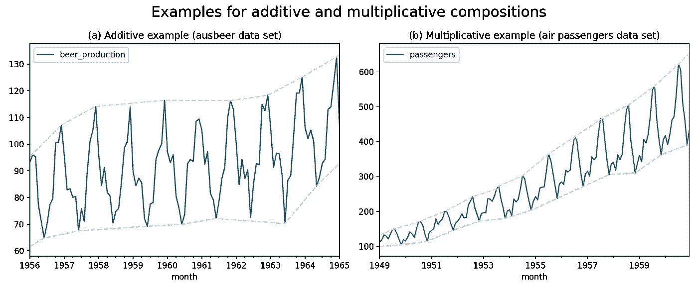
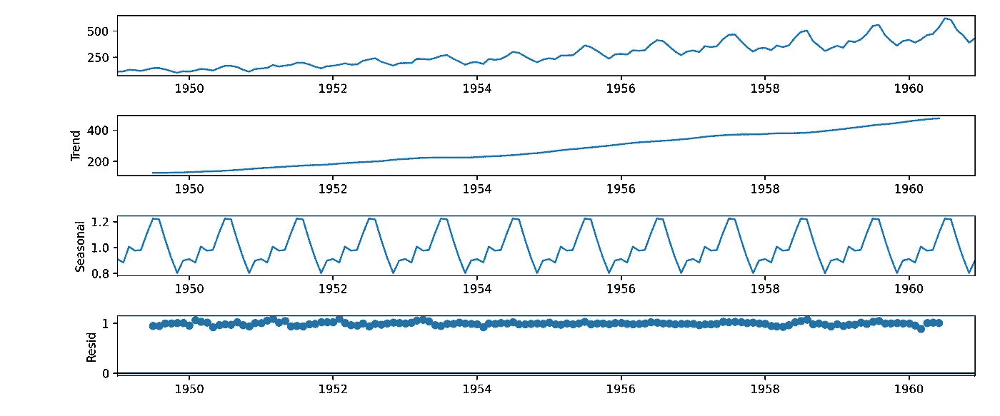
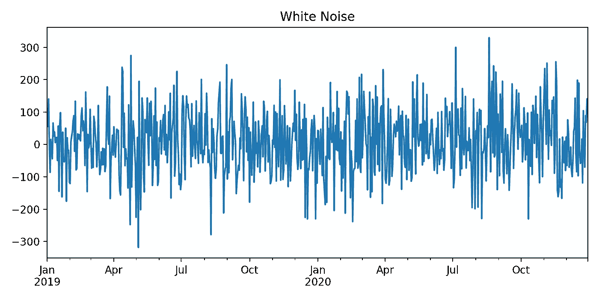
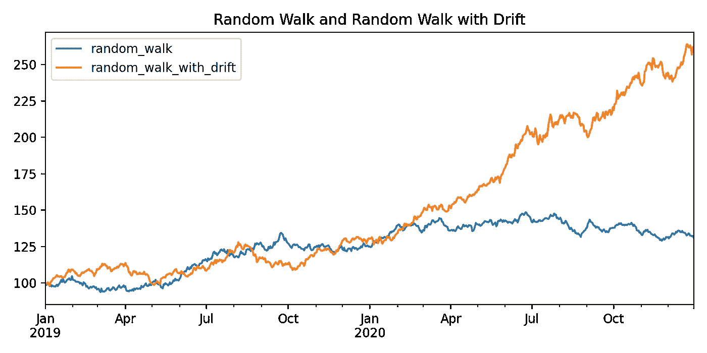
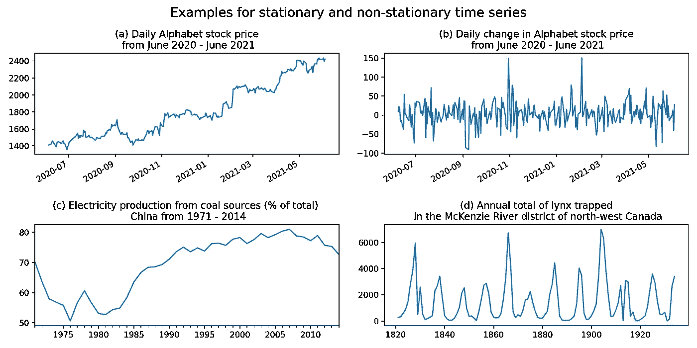
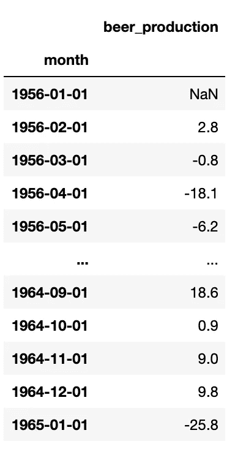
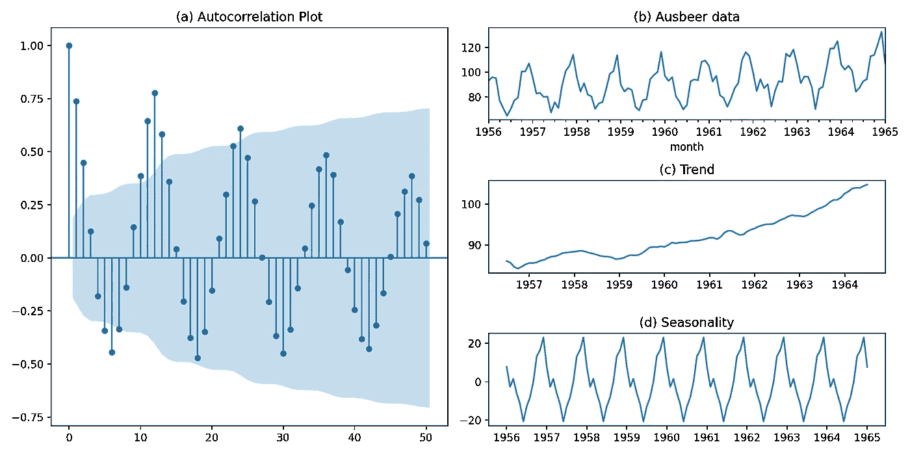

# 时间序列建模基础的综合指南

> 原文：<https://towardsdatascience.com/your-comprehensive-guide-to-the-basics-of-time-series-modeling-f673398b5df3?source=collection_archive---------1----------------------->

## 简单解释了时间序列建模的理论基础

照片由[作者](https://medium.com/@konstantin-rink)拍摄

W 当我开始学习时间序列预测时，我首先阅读了许多博客帖子和文章。不幸的是，对于初学者来说，其中只有很少一部分是相当全面的。其他的缺乏完整性(即不包括残差分析)或者更糟，错误地应用了方法。幸运的是，我找到了一些非常好的书(见参考资料)，并有很好的陪练。

我想出写这篇文章的想法有两个原因。首先，你不必像我一样经历眼泪和困惑的低谷。第二，像 AR(I)MA 这样的经典时间序列模型带有许多假设。因此，理解时间序列建模背后的思想及其基础是至关重要的。

根据需求和我的时间，我想写一个关于时间序列预测的系列。从最基础的到先进的时间序列模型，这些模型也用于像著名的 [Makridakis 竞赛](https://mofc.unic.ac.cy/history-of-competitions/)这样的竞赛中。但首先从本文开始，介绍时间序列建模的基本理论概念和工具。

在开始之前，我想感谢我的同事 Justina Ivanauskaite 的精彩对话和对本文的贡献。

本文有助于您理解以下主题:

*   理解**术语**
*   时间序列**组件**和**如何分解**它们
*   **白噪声**和**随机游走**车型
*   **平稳性的概念**
*   **自相关**和**偏自相关**函数

小心那些💡如果你赶时间，要点是什么？

# 术语

我们必须区分**随机过程**(也称为**时间序列** **过程或模型**)和**时间序列**。

## **随机过程**

被描述为一组**随机变量** {Y𝑡,𝑡∈𝑇，它们在时间上**排序，并在一组**时间点** 𝑇上定义，可以是**连续**或**离散**。𝑇指示**处于**的哪个过程，**将**或**可以被** **观察到**。
一个例子可以是给定地区连续几天的新新冠肺炎感染人数。**

> 在这篇文章中，我们集中在离散时间(DT)随机过程和时间序列。这意味着 t 可以取 0，1，2，…等中的整数值。。因此，当我们在本文的后续课程中谈论时间序列过程、模型或时间序列时，我们总是假设𝑡是离散的。

## 时间序列

一个【观察】**时间序列**是一个**时间序列过程**的**实现**。它可以用小写字母 y=(y₁，y₂,…,yₜ).来表示

根据上面新冠肺炎的例子，时间序列可以是从 2021 年 1 月到 2021 年 3 月底德克萨斯每天观察到的新新冠肺炎感染人数。

## 落后

当您处理时间序列时，您会经常听到术语**滞后**。一个**滞后**可以看作是两点之间的**时间差。在每日数据的情况下，yₜ是时间序列的当前值，而 yₜ₋₁(或滞后 1)是昨天的值，yₜ₋₂(或滞后 2)是前天的观察值，以此类推。**

## 💡关键要点

*   一个**时间序列过程**或时间序列模型是**有序**、**随机**(也叫随机)**过程**的**数学描述。**
*   一个**时间序列**就是这样一个描述过程的**实现**。
*   **滞后**是两个观测值或点之间的**时间差** **。**

# 时间序列组件

时间序列充满了模式。因此，将我们的时间序列分成**个不同的部分**对于更深入地分析其底层结构是非常有用的:

*   **趋势周期 Tₜ** :是数据中的**长期增加**或**减少**，不一定总是线性的。在过去的 60 年里，世界范围内不断增长的电力消耗可以作为一个趋势的例子。
*   **季节性 Sₜ** :代表具有固定且已知周期(即一年中的时间等因素)的**变化** **。一个例子是圣诞节期间零售额的增加和假期后的减少。**
*   **余数 Rₜ** :是一个时间序列中**包含噪声**(即测量误差引起的)或**随机运动**的**不规则部分**。它有时也被称为**残差**。虽然**我们无法直接观察到**，**它在某种程度上总是存在于**时间序列中。

> 根据不同的文献，您通常会发现**三个**或**四个**组件。一些作者将**周期**描述为一个独立的成分，其他作者也引入了成分**水平**，它描述了系列的平均值。在这篇文章中，我决定坚持使用 Makridakis (1998)提到的三个不同的组件。

## 分解

既然我们已经熟悉了时间序列的组成部分，我们可以考虑**如何将**分割或**分解**一个时间序列为其组成部分。基本上，有两种方法可以组成一个时间序列。

## **添加剂分解**

Yₜ = Sₜ + Tₜ + Rₜ

**加法分解**是最基本的一种。如果季节性波动的**幅度**(尖峰)**，或**围绕趋势周期**、**的变化**不随时间序列的水平(均值)变化，则适用。因此，当**季节变化随时间**相对恒定时，这是有用的。**

## 乘法分解

Yₜ = Sₜ × Tₜ × Rₜ

如果有**增加趋势**和**季节性活动幅度增加**，那么**乘法分解**是有用的。换句话说，如果季节性的**幅度**取决于水平的**，则使用**乘**分解**。

因为像这样的定义总是很枯燥，所以是时候举一些例子了。为了更清楚地理解加法和乘法分解，以及何时使用哪一种分解，我们将仔细看看下面的图(图 1)。

图一。加法和乘法合成的例子。

左手边的图(a)显示了 *ausbeer* 数据集的摘录。数据的**季节性变化**随着时间的推移保持**相对恒定。换句话说:峰的高度相对恒定。这意味着**加法分解**对于这个时间序列是正确的。**

在右侧(b ),我们可以看到绘制的*航空乘客*数据集。与左边的图相比，我们可以看到**季节变化** **并不随时间**相对恒定。峰值不会保持不变，而是会改变高度(即 1959 年的峰值与 1953 年的峰值相比)。

> 如果你想测试你关于检测加性和倍增季节性的知识，我可以强烈推荐[交互工具](https://kourentzes.com/forecasting/2014/11/09/additive-and-multiplicative-seasonality/)“加性和倍增季节性——你能正确识别它们吗？”尼古拉·考伦茨。

现在我们已经有了所有需要的理论知识，我们可以用 python 运行一个时间序列分解。 [statmodels 包](https://www.statsmodels.org/stable/index.html)提供了一个名为[季节性分解](https://www.statsmodels.org/stable/generated/statsmodels.tsa.seasonal.seasonal_decompose.html)的函数。对于下面的例子，我们将分解航空乘客数据集。

该函数的两个最重要的参数是:

*   **x** :要分解的时间序列
*   **型号**:分解的类型。

*加法*是模型参数的默认值。因此，如果您的时间序列需要乘法分解，您必须将参数值设置为“乘法”。

图二。使用 statsmodels 季节性分解函数的乘法分解示例。

绘制的输出(图 2)按时间顺序显示了分解的时间序列、趋势、季节和剩余(Resid)部分。像这样的图有助于我们更详细地直观分析时间序列的组成部分。

## 💡关键要点

*   一个时间序列由**三个组成部分**:趋势周期、季节性**和余数**(也叫**残差**)。****
*   ****这些组件可以以**加法**或**乘法**的顺序粘在一起。****
*   ****数据的**视觉分析**可以告诉我们这些成分是处于**加法**还是**乘法** **合成**。****
*   ****如果趋势周期 **周围的**变化随着平均值**变化，或者我们看到季节性活动**的**振幅增加，我们可以考虑**乘法分解**。******
*   **stats models*seasonal _ decompose*函数帮助我们将时间序列分解成它的组成部分。**

# **白噪声和随机游走模型**

**既然我们已经熟悉了时间序列的术语、组成部分和分解，那么是时候讨论一些基本但也很重要的时间序列模型了。**

## **白噪声**

**我们先来说说白噪声(图 3)模型。白噪声模型可以定义如下:Yₜ = εₜ**

**其中εₜ是白噪声，**无法根据该系列的过去历史预测的部分**。**

****

**图 3。白噪声例子。**

**白噪声具有以下特征:**

*   **它有一个为 0 的**均值【T21(μ)】**和一个**恒定方差**(也写作 WN(0，σ))。******
*   **它**不遵循任何模式**，因此它**完全随机**(这就是它被称为“噪音”的原因)。**
*   **它由**独立同分布**(也称 i.i.d.) **观测值**组成。**
*   **每个观察值与系列中的其他观察值有一个零相关性。**

**如果观测值遵循一个**正态分布**，我们说它是**高斯白噪声**。**理想情况下**，我们的**预测误差是**(高斯)**白噪声**。这意味着我们用时间序列模型“捕捉”或模拟了所有重要的影响，剩下的只是不可预测的白噪声(见剩余的 Rₜ分量)。**

## **随机漫步(有漂移)**

**除了白噪声，还有另一个非常基本但重要的模型，叫做随机游走(图 4)。
随机漫步模型可以定义为:Yₜ = Yₜ₋₁ + εₜ**

**其中，Yₜ代表当前值，Yₜ₋₁代表一个滞后之前的 y 值(例如，昨天的值)，εₜ代表随机误差(也称为噪声)。**

****

**图 4。随机漫步和随机漫步与漂移的例子。**

**这意味着**当前观测**与**前一个**相距**随机步长**，所有步长**独立**和**相同** **大小分布**(“I . I . d .”)。
因此，随机游走**无法合理预测**。对 Yₜ的**最佳预测是前值 Yₜ₋₁** ，也称为**天真预测**。随机漫步序列的一个典型现实例子是连续几天的股价。**

**如果随机游走序列**遵循上升或下降趋势**，则它包含“漂移”。这就是为什么我们称之为**随波逐流**。可以定义为:
Yₜ= α + Yₜ₋₁ + εₜ其中α代表常数或漂移。**

**正如已经提到的，我们希望我们的残差在后面的建模步骤中是白噪声。这就给我们带来了一个问题，我们如何检验我们的时间序列是否是白噪声？你猜怎么着，有一个统计测试！**

## **白噪声测试:永盒测试**

**这被称为“容格测试”。Ljung-Box 检验提出了一个无效假设和另一个假设:**

*   **H₀:这些数据都是**独立**分发的**
*   **Hₐ:的数据是**非独立**分发的**

**在 python 中，包 [statsmodels](https://www.statsmodels.org/stable/index.html) 提供了一个名为 [acorr_ljungbox](https://www.statsmodels.org/stable/generated/statsmodels.stats.diagnostic.acorr_ljungbox.html) 的函数。除了数据之外，我们还必须提供一些滞后时间，这就引出了一个问题“什么是合适的滞后时间？”**

**在他的博客文章中，Hyndman 建议:**

*   **对于非季节性时间序列，使用ℎ=𝑚𝑖𝑛(10,𝑇/5)**
*   **对于季节性时间序列，使用ℎ=𝑚𝑖𝑛(2𝑚,𝑇/5)
    其中 t 是滞后次数，𝑚是季节性周期。**

**对于下面的例子，我们将使用 720 次观察的白噪声数据。关于 Hyndman 的建议，这意味着我们将滞后的长度设置为 10。**

**第一个数组元素([0])包含 p 值，而第二个数组元素([1])包含 Ljung-Box 检验统计量。如果 p 值**低于 0.05 阈值**，**我们可以拒绝零假设**，这意味着数据**不是白噪声**。**

**在我们的例子中，所有的 p 值都在 0.05 的阈值(T1)之上(T0)，这意味着我们不能拒绝零假设，并且(T2)我们的数据是白噪声(T3)。**

## **💡关键要点**

*   **一个**白噪声时间序列**的**均值** (μ) **为 0** ，一个**恒定方差**，并且**由于**完全随机**所以**无法预测。**
*   **我们拟合的模型**的**残差**应该是白噪声**。**
*   **随机游走的**最佳预测****是来自**上一步** Yₜ₋₁ **加上误差项** εₜ.的值****
*   ****具有趋势的**随机游走称为具有漂移**的**随机游走。******
*   ****为了**测试一个时间序列**的白噪声，我们可以使用**永盒测试**。****

# ****平稳的概念****

****平稳性是时间序列的一个**基本特征**，因为 ARMA 等(经典)时间序列模型假设它，如果基础数据不是平稳的，可能会导致不正确的结果。****

****为了全面起见，我们必须区分**严格平稳性**和**弱平稳性**。****

## ****严格平稳性****

*   ****我们说一个时间序列过程是**严格平稳的**，如果它的属性不受时间起点变化的影响**。******
*   ****yₜ，yₜ₊₁，…，yₜ₊ₙ的观测值的联合分布与 yₜ+h，yₜ₊ₕ₊₁，…，yₜ₊ₕ₊ₙ.的观测值的联合概率分布完全相同****
*   ****因此，它不受时间向前或向后移动的影响。****

******然而**，很多现实生活中的过程**并不是严格静止的**。但是，即使一个过程是严格平稳的，我们通常**没有潜在时间序列过程的明确知识**。由于严格平稳性被定义为过程联合分布的一个属性，因此**不可能从观察到的时间序列**中得到证明。****

## ******弱平稳性******

****我们将时间序列过程定义为**弱平稳**如果****

*   ****期望 E(yₜ)随时间是恒定的****
*   ****方差 Var(yₜ)随时间是常数****
*   ****协方差 Cov(Yₜ,Yₜ₊ₕ)只取决于滞后 h，Cov(Yₜ₁,Yₜ₂) = Cov(Yₜ₁₊ₕ,Yₜ₂₊ₕ)****

****广义地说，如果均值**(即趋势)没有系统变化**，方差**没有系统变化**，并且严格周期性变化**(即季节性)**被移除**，则称时间序列为弱平稳。******

****这些定义或类型的平稳性在实践中是如何使用的？****

> ****实际上，人们通常用平稳性这个术语来表示弱平稳性，因为严格平稳性只是一个理论概念。为了在这里保持一致，当我们指弱平稳性时，我们将从现在起使用平稳性。****

****好了，现在我们知道了平稳性的概念意味着什么，让我们通过观察图 5 中的下图来测试我们的知识，并检查它们是否是平稳的。****

********

****图 5。平稳和非平稳时间序列的例子。****

****图(a)显示数据中有一个**清晰的趋势**(没有随时间变化的恒定平均值)，因此该序列不可能是稳定的。****

****对面**上的图(b)没有显示数据中的趋势或任何季节性**。这表明曲线(b)是稳定的。****

****曲线(c)与曲线(a)一样，在数据中有一个**清晰的趋势**，因此也是非平稳的。****

****最后，Hyndman 和 Athanasopoulos (2018)提出了一个令人困惑的案例。曲线(d)由于其强循环而显得不稳定。然而，这些周期是非周期性的。当猞猁的数量变得太大而无法提供足够的食物时，它们就会停止繁殖，数量就会下降。然后它们食物来源的再生允许种群再次增长等等。这意味着从长远来看，这些非周期性循环的时间是不可预测的。由于这种既没有趋势也没有季节性的周期性行为，该序列是平稳的。****

****我敢打赌，你一定很惊讶图(d)竟然是稳定的。有时很难直观地判断时间序列是否是平稳的。因此，我们需要一种更健壮的方法来检查平稳性。****

****幸运的是，有几个统计检验**(也称为单位根检验)**来检查一个数列是否平稳**。******

## ****增强的迪基富勒( **ADF** )试验****

****一个最广泛使用的是扩展的迪基富勒测试。****

> ****还有很多单位根检验，比如科维亚特科夫斯基-菲利普斯-施密特-申( **KPSS** )检验或者埃利奥特-罗森伯格-斯托克( **ADF-GLS** )检验。****

****ADF 提出了一个无效假设和另一个假设。****

*   ****H₀:系列有一个单位根，所以它是**非固定**。****
*   ****Hₐ:系列没有单位根，所以它是**静止的**。****

> *****广义地说，一个* ***单位根*** *是一个随机游走的具有漂移的时间序列。它包含一个随机趋势，显示一个* ***不可预测的模式*** *。如果你对更深入的解释感兴趣，请参见* Makridakis (1998)。****

****为此，Statsmodels 为我们提供了 [adfuller 函数](https://www.statsmodels.org/dev/generated/statsmodels.tsa.stattools.adfuller.html)。****

****对于这个例子，我使用了上面的 *airpassengers* 数据集，它不是固定的。由于数据集清楚地显示了趋势，我将函数的*回归*参数设置为 *ct* (常数和趋势)。****

****该函数返回几个值。**第二个**代表计算的 p 值。由于 0.55 高于 0.05 的阈值，我们不能拒绝 H₀，所以数据不是平稳的。****

****既然我们知道我们的数据不是静态的，我们如何使它们稳定呢？****

## ****如何使数据稳定****

****如前所述，许多(经典)模型**假设时间序列是平稳的**。那么如果我们知道我们的数据不是静态的呢？使数据稳定的两种非常常见的方法是:****

*   ******转换**数据(如对数和/或使用平方根转换)****
*   ******差异******

******转换**数据是一种非常基本的方法，也用于回归等其他统计领域。一种方法是对数据应用**对数**或**平方根**变换，使其稳定。****

****另一种非常常见的方法是**差分**。它可以作为变换方法的替代或补充来应用。我们通常先取**数列的**差值。也就是所谓的**一阶差分**。我们正在创造一个新的时间序列的连续差异 Yₜ -Yₜ₋₁.例如，原始时间序列是 Y₁，Y₂，Y₃，…，Yₙ，然后我们应用一阶差分，这导致一个新的时间序列 Y₂-Y₁，Y₃-Y₂，Y₄-Y₃，…，Yₙ - Y。****

******如果这不起作用**并且我们仍然有非平稳数据，那么我们也可以考虑**二阶差分**，通过**取所产生的差分**(不要与取二阶差分 Yₜ -Yₜ₋₂).混淆****

****如果您的时间序列是数据帧格式，您可以使用 pandas 功能*。diff()* 。该函数将您想要进行差异计算的周期数作为参数。****

****如果我们想应用一阶差分，我们只需添加函数*。diff()* 到我们的数据帧。在我们的例子中，我们应用了。对 *ausbeer* 数据集的 diff()方法(表 1)。****

********

****表 1。差分 ausbeer 数据集。****

****因为我们取系列(Y₂-Y₁)的一阶差分，我们将丢失一个(第一个)数据点。这意味着如果我们应用二阶差分，我们会丢失前两个数据点。****

## ****💡关键要点****

*   ******(弱)** **平稳**是许多(经典)时间序列模型假定的一个性质。****
*   ****如果一个时间序列的**属性**(均值，方差)**在时间上** **恒定**并且**协方差仅依赖于滞后 h** ，则该时间序列是弱平稳的。****
*   ****为了测试我们的时间序列的平稳性，我们可以使用**扩展的 Dickey-Fuller 测试**。****
*   ******为了使** **时间序列平稳**，我们可以使用**差分**或**变换技术**如对数变换。****

# ******自相关**和**偏自相关******

****了解了平稳性的含义以及如何使时间序列平稳后，我们现在将重点关注两个重要工具，以便在预测前进行更深入的时间序列分析。**自相关函数**和**偏自相关函数【PACF】**。
两者都可以用来识别时间序列滞后值之间的解释关系。****

## ******自相关函数******

*   ****计算自相关，即**测量**yₜ(变量的**当前值)和 yₜ₋ₙ**变量**的**关系。例如，对于滞后-1 自相关，ACF 计算 Yₜ和 Yₜ₋ₙ.之间的相关性********
*   **还捕获*间接*影响(例如，yₜ与 yₜ₋₂相关只是因为两者都与 yₜ₋₁相关，而不是因为 yₜ₋₂包含的任何有助于预测 yₜ).的新信息**

**可以使用 statsmodels [plot_acf](https://www.statsmodels.org/dev/generated/statsmodels.graphics.tsaplots.plot_acf.html) 函数绘制自相关图:**

**滞后的数量没有固定的规则。然而，Montgomery (2015)建议，“*一个好的一般经验法则是，至少需要 50 次观察才能给出 ACF 的可靠估计，并且单个样本自相关应计算到滞后 K，其中 K 约为 T/4* ”。**

**让我们检查一下 ausbeer 数据集，以便更好地理解如何解释自相关值(图 6)。**

****

**图 6。带有趋势和季节性附加信息的 ausbeer 数据集的 ACF 图。**

**左侧显示了 *ausbeer* 数据集(a)的自相关图。在右边，你会发现绘制的*澳洲啤酒*时间序列(b)，它的趋势(c)，和季节性成分(d)。**

**自相关图(a)向我们展示了观测值与其滞后值之间自相关的**值。它还告诉我们，滞后 n 处的值是否具有统计显著性。如果自相关值**位于蓝色区域**内，则该值**不重要**。如果**位于**之外的** **，则**有效**。****

**当一个时间序列有一个趋势时，小滞后的自相关往往是大而正的。你可以在滞后 1 和滞后 2 的图(a)中找到这一点。**

> **滞后 0 处的值将始终为 1 且非常重要，因为它是时间序列与其自身 corr(Yₜ,Yₜ).的自相关可以看做一个参照点。**

**当我们的时间序列是季节性的时，季节性滞后的自相关值会比其他滞后大。这可以在滞后 6、12、18 等处看到..**

## ****偏自相关函数(PACF)****

**如前所述，ACF **也捕捉到了间接影响**。一种只关注 Yₜ与其滞后版本 Yₜ₋ₙ之间直接关系的方法是**偏自相关函数(PACF)** 。一般来说，两个变量之间的“部分”相关性是它们之间的相关性**数量**，这不能用它们与一组特定的其他变量的相互相关性来解释。**

**这里 statsmodels 还提供了一个[函数](https://www.statsmodels.org/stable/generated/statsmodels.tsa.stattools.pacf.html)来计算和绘制部分自相关值:**

****

**图 7。白噪声和随机游走数据的 PACF 图。**

**图 7 显示了用 *plot_pacf* 函数创建的两个图。第一种(a)将 pacf 应用于白噪声数据。由于白噪声的值之间没有相关性，我们在这里也看不到任何相关性(所有值都在蓝色区域，因此不重要)。**

**第二个图(b)将 pacf 应用于随机行走数据。如前所述，随机游走的最佳预测是一个滞后之前的值。**

> **根据您的目的，在使用 ACF 和 PCF 图对时间序列进行分析之前，可能需要首先使时间序列平稳(即，如果您想要为 ARMA 模型选择 p 和 q 参数值)。**

**ACF 和 PACF 在时间序列建模的后期不仅在**选择正确的参数值**中发挥重要作用，而且在**分析我们预测模型的残差**中也发挥重要作用。白噪声**的 ACF 和 PCAF 不包含** **任何** **显著** **自相关**或**部分自相关**。因此，我们可以稍后使用 ACF 和 PACF 来**检查我们的残差**是否有希望显示没有**显著自相关和部分自相关**。**

## **💡关键要点**

*   **利用自相关函数(ACF)图，我们能够**直观地分析****自相关**及其**显著性**。**
*   **与 ACF 不同的是，**部分自相关函数** (PACF)仅测量 Yₜ与其滞后版本 Yₜ₋ₙ.之间的**直接关系****
*   **两者都是为 ARMA 或 ARIMA 等模型选择正确参数的重要工具。**

**一篇解释某个领域理论基础的文章总是伴随着过于枯燥的风险。我希望本文中的大部分时间都是这样，而不是这样，现在您已经有了一个更好的时间序列建模的基础。如果您对更多信息和优秀文献感兴趣，请查看下面的参考资料。
如开头所说，最初的想法是把它做成一个系列。如果有需求，我有时间，我保证下面的文章会更有动手能力！**

# **参考**

**Box，G. E. P .、Jenkins，G. M .、Reinsel，G. C .和 Ljung，G. M. 2015。 ***时间序列分析:预测与控制*** 。**

**Chatfield，c .和邢海鹏。2019. ***《时间序列的分析——与 R*** 一起介绍》，CRC 出版社。**

**德特林，马塞尔。(未注明)。 [***应用时间序列分析—课程 2020***](https://stat.ethz.ch/education/semesters/ss2014/atsa/Scriptum_v140523.pdf) 。**

**Hyndman，R. J .和 Athanasopoulos，G. 2018。 [***预测:原理与实践***](https://otexts.com/fpp3/) 。**

**Makridakis，S. G. 1998 年。 ***预测:方法与应用*，(第三版。)**，纽约:威利。**

**2015 年蒙哥马利特区。***【时间序列分析与预测导论】(第二版。)****《概率与统计》中的威利级数，新泽西州霍博肯:威利。***