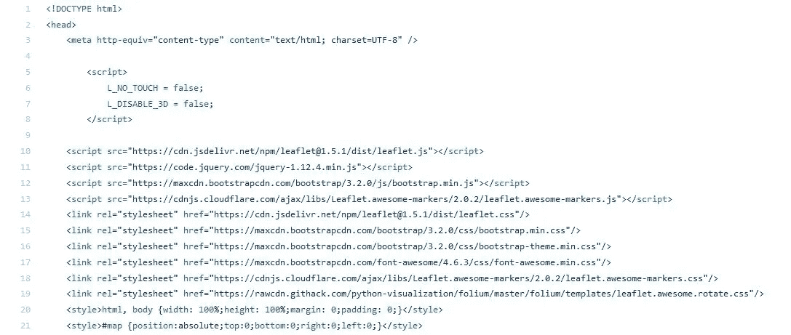
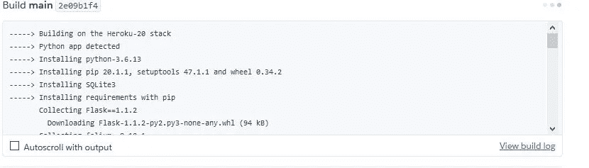

# 你在网上的酷叶地图

> 原文：<https://towardsdatascience.com/your-cool-folium-maps-on-the-web-313f9d1a6bcd?source=collection_archive---------13----------------------->

## 利用 flask 和 heroku 与世界分享您的交互式地图


美国宇航局在 [Unsplash](https://unsplash.com?utm_source=medium&utm_medium=referral) 拍摄的照片

这是[系列](/making-simple-maps-with-folium-and-geopy-4b9e8ab98c00)的第二部分，旨在分享将您的交互式地图托管在 web 上或部署为 web 应用程序的步骤。如果你只是为了代码而来，那么[开始](https://github.com/Alyeko/Making-Cool-Maps-In-Python)。本文分为六个部分:

∘ [简介](#716c)∘[需要的文件和文件结构](#83e1)t13】∘[部署使用 github](#1399)t16】∘[部署使用 heroku CLI](#be6b)t19】∘[最终想法](#5f7b)t22】∘[引用](#18e5)

## 介绍

你不能把你的交互式地图放在你的电脑上。为了让其他人使用它并从中受益，它必须在网络上。让我们来看看如何让这成为可能。

## 所需文件和文件结构

Heroku 需要特定的文件来使部署过程顺利进行。它们是:

Procfile:它告诉 heroku 如何运行我们的 flask 应用程序。Procfile 没有文件扩展名。

Procfile

[Gunicorn](https://gunicorn.org/) 是一个 Python WSGI HTTP 服务器，它帮助我们的云应用平台 heroku 通过 WSGI 协议与 Flask 进行通信。

> WSGI 代表“Web 服务器网关接口”。它用于将来自 web 服务器(如 Apache 或 NGINX)的请求转发到后端 Python web 应用程序或框架。从那里，响应被传递回 web 服务器以回复请求者。

**需求文件:**这是一个文本文件，包含运行 python 文件所需的库，即 *Flask* 和 *gunicorn* ，以及所使用的具体版本。Heroku 需要这个来创造你用来产生精确结果的精确环境。

requirements.txt

**Templates 文件夹:**创建好你的叶子地图并保存为 html 文件后，你需要把 *the_map.html* 放到这个 *templates* 文件夹中。 *flask* 将在这里搜索它，并将其呈现给 web 应用程序。



先睹为快' the_map.html '

**Python 文件:**Python 文件被命名为 *app.py*

在文件中:

*   *Flask* 类和 *render_template* 函数被导入。
*   创建了 app 对象，它是 Flask 类的实例，与 gunicorn 一起将帮助 heroku 将我们的地图部署为 web 应用。
*   创建了路由装饰器，并为其定义了一个函数。装饰器告诉应用程序哪个 URL 应该调用函数(*render _ th*e _*m*AP())。该函数从 templates 文件夹中返回呈现的模板。呈现模板意味着将它转换成 HTML 页面。
*   由于该文件将通过终端运行(请参见下面的段落)，' if _ _ name _ _ = = _ _ main _ _ '的计算结果为 true，app .将运行。

app.py

你首先要确保网络应用程序在你的电脑上运行。如果是的话，它会在赫罗库星球上运行。要检查这一点:

*   打开终端
*   导航到您正在工作的目录
*   茹*n*

如果地图出现在终端显示的地址，你可以前往 heroku。

**文件结构**

```
Making-Cool-Maps-In-Python/
       |---> app.py
       |---> requirements.txt
       |---> Procfile
       |---> templates/ 
             |---> the_map.html
```

## 使用 Github 部署

通过以下步骤，您可以使用 github 部署地图:

*   前往*heroku.com*并登录或注册
*   点击*创建新应用*按钮，输入 a 名称，点击*创建应用按钮*
*   选择一种部署方法—连接到 github 并登录
*   选择要连接的存储库并连接
*   您可以选择*自动部署*选项，这可以确保您对主分支所做的每个更改都会影响 web 应用程序
*   点击*部署分支*，等待 heroku 安装并检测分支中的文件



Heroku 将地图发布到网络上

## 使用 Heroku CLI 部署

从这里下载 CLI。使用以下命令:

*   `heroku login`并输入您的详细信息
*   `heroku create ‘app-name’`其中“应用程序名称”是您自己的应用程序名称
*   `git push heroku master`
*   `heroku config:set DEPLOY=heroku`。
*   `heroku open`或者通过您的 heroku 个人资料打开您的文件

## 最后的想法

我希望这有所帮助。那就去吧，试试看，以后再谢我吧！[点击此处查看已部署的树叶地图](https://interactive-folium-map.herokuapp.com/)。感谢阅读！😃👋

> 我听见了，我忘记了。我看见了，我记得。我知道，我也理解。—孔子

## 参考

[什么是 wsgi？](https://www.liquidweb.com/kb/what-is-wsgi/)

[烧瓶文件](https://flask.palletsprojects.com/en/1.1.x/api/#application-object)

[栈溢出叶问题](https://stackoverflow.com/questions/37379374/insert-the-folium-maps-into-the-jinja-template/60031784#60031784)