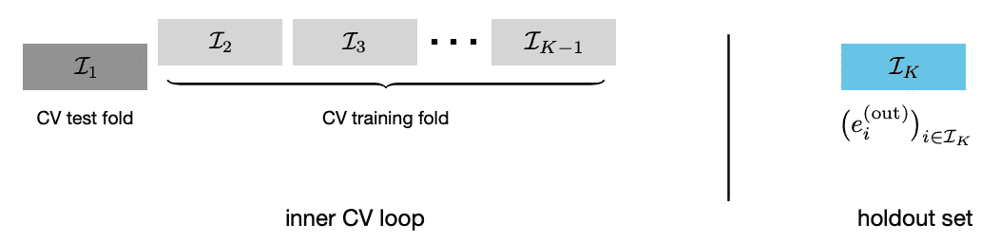
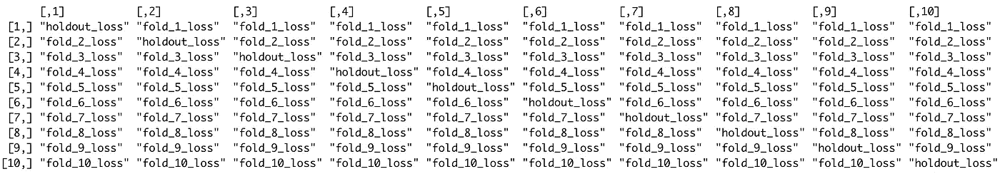
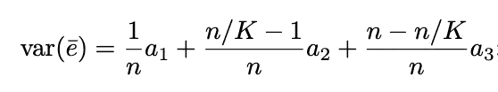
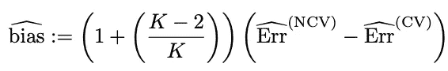
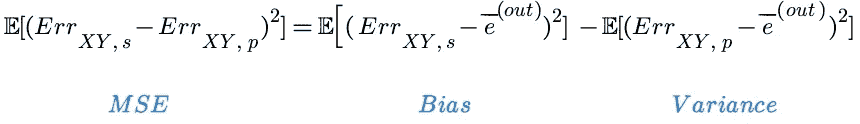

# 你的交叉验证误差置信区间是错误的——以下是如何修正它们的方法

> 原文：<https://towardsdatascience.com/your-cross-validation-error-confidence-intervals-are-wrong-heres-how-to-fix-them-abbfe28d390?source=collection_archive---------20----------------------->

## [思想和理论](https://towardsdatascience.com/tagged/thoughts-and-theory)

## 一种利用嵌套交叉验证来消除交叉验证过程中偏差的新算法。

[Stanford (2021)](https://arxiv.org/abs/2104.00673) 的研究人员开发了一种方法，该方法使用嵌套交叉验证(NCV)来说明数据分割之间的相关性，从而允许我们计算误差周围的准确置信区间。尽管 NCV 有潜力，但它需要比计算量大的常规交叉验证更多的拟合迭代。但是，如果您能够访问多个计算节点/内核，这些迭代可以轻松实现并行化。



NCV 概述:内部 CV 循环是常规交叉验证。维持集是一个测试集，用于估计我们的模型的偏差— [来源](http://statweb.stanford.edu/~tibs/ftp/NCV.pdf)(图 8)

# 1.技术 TLDR

论文中概述的方法首先创建了一个可以估计偏倚的有偏倚的嵌套交叉验证算法。然后，我们使用 NCV 中的偏差和误差项来调整我们的常规 CV 模型。最终产品是有效的 MSE 和置信区间，它控制数据折叠的相关性。

## 算法步骤的高级概述

**1.1)使用嵌套交叉验证(NCV)创建一个过度偏倚的模型。**我们首先对 *K-1* 折叠执行交叉验证，保持第 *K* 个维持组不变。一旦我们有了每个 *K-1* 折叠的损失向量，我们就在维持组上运行训练/测试分割，其中训练和测试集分别是第 *K-1* 和第 *K* 折叠。对每个折叠重复这一过程，创建下面的矩阵，其中每一列代表一次迭代:



NCV 算法的损失矩阵。每个单元格对应一个损失向量，而不是一个数字。

请注意，我们的“维持损失”是无偏的，因为测试数据(维持集)从未被训练数据(所有 *K-1* 其他折叠)看到。还要注意的是，我们的每个“fold_ *n* _loss”向量都是有偏差的，因为我们根据之前看到的数据重新调整了模型。

计算矩阵中每一列的 MSE。请注意，给定列的 MSE 定义为我们的“fold_ *n* _loss”向量的平均值减去“holdout_loss”向量的平均值。有关计算步骤，请参见下面的 python 代码。

```
MSE = []
for i in range(K): # iterate through folds
  folds_idxs = [j for j in range(K) if i != j] avg_fold_n_loss = mean(K_minus_1_folds_losses[folds_idxs, i])
  avg_holdout_loss = mean(holdout_loss[i, i]) error_sq = (avg_fold_n_loss - avg_holdout_loss)**2
  MSE.append(error_sq - var(holdout_loss))
```

**1.3)使用常规 K 折 CV 训练另一个模型。由于我们只对误差项感兴趣，我们只存储每个折叠的样本外损失。**

```
cv_errors = mean(K_fold_CV_loss)
```

**1.4)计算偏差。**

```
weight = (1 + ((n_folds — 2) / (n_folds))^(1.5))
bias = (MSE — cv_errors) * weight
```

**1.5)计算这个去偏误差周围的置信区间。**最终置信区间的形式为…


考虑数据折叠之间相关性的调整置信区间公式— [来源](http://statweb.stanford.edu/~tibs/ftp/NCV.pdf)(等式 17)

*   *Err (NCV)* 是嵌套交叉验证模型误差，
*   *Bias_hat* 以上估算，
*   *q 1-α/2* 是我们置信度的 z 值，
*   *K* 是折叠的次数，并且
*   *MSE_hat* 是步骤 2 中估计的 MSE。

# **2。但是，到底是怎么回事呢？**

让我们回溯并充分理解为什么我们数据中折叠之间的相关性会导致不正确的小置信区间。

在拟合预测模型时，我们的目标是可推广性，即我们希望我们的模型在新数据上表现良好。通过在我们的训练/测试分割中回收数据，我们实际上从未给我们的模型*新的*数据。那么，如何才能知道模型会泛化呢？

考虑一次 50%的训练/测试分割。这种分割是有效的，因为模型没有根据我们的测试数据进行训练，因此这些数据是全新的。然而，一旦我们采用 2 重 CV，用测试数据重新改装，一大块数据就被回收了。而且，因为模型之前看过数据，所以它认为我们的样本很能代表总体。

随着我们的模型的“信心”的增加，它减少了我们的置信区间的大小。

## 2.1 数学视角

既然我们希望对为什么我们的误差置信区间可能有偏差有一些直觉，让我们从数学的角度来看一下。

方差代表数据中的自然变化，是任何置信区间的关键组成部分。当估计总体方差时，即不考虑样本中具体数据的真实方差时，我们经常使用样本方差。然而，由于我们的数据折叠中存在相互依赖性，我们必须在每个数据折叠内部和之间纳入协方差。


我们数据折叠的协方差矩阵。— [来源](http://statweb.stanford.edu/~tibs/ftp/NCV.pdf)(图 7)

使用上面的图，我们可以看到交叉验证数据集的方差有 3 个组成部分。

1.  红色方块是褶皱内的**协方差**，
2.  蓝色方块是褶皱之间的**协方差**，以及
3.  黑色方块是我们误差的方差。

我们将这一概念转化为上述 3 个部分的数学函数:



交叉验证模型的误差方差— [来源](http://statweb.stanford.edu/~tibs/ftp/NCV.pdf)(等式 13)

*   *n* 是样本量，
*   *K* 是数据折叠的次数，
*   *a1* 是我们误差的**方差**， *var(e)* ，
*   *a2* 为同一次、 *cov(ei，ej)* 误差的**协方差，且**
*   *a3* 为**不同道次**的误差协方差，( *cov(ei，ej)* )。

注意 *i* 和 *j* 是上图中一个正方形对应的指数。

关键在于，大多数交叉验证方法假设 *a2* 和 *a3* 为 0，即我们的折叠内或折叠间的误差不存在相互依赖性。然而， *a2* 和 *a3* 通常是> 0，因为我们重用数据。

那么，你能看到当我们不假设独立性时，误差的方差是如何变大的吗？

# 3.解决方案

嵌套交叉验证(NVC)已经存在很多年了，但是在计算模型误差的置信区间时，独立性经常被错误地假设。那么如何计算我们褶皱的相互依存性并去除它呢？

有 3 个“简单”的步骤…

## 3.1 计算偏差

让我们来看看下面这个定义偏差的等式。



估计偏差的公式— [来源](http://statweb.stanford.edu/~tibs/ftp/NCV.pdf)(等式 16)

*   *K* 是折叠的次数，
*   *Err(NCV)* 是我们过度偏向的 NCV 模型中的估计误差，以及
*   *Err (CV)* 是我们常规 CV 模型中的估计误差。

换句话说，偏差是我们的额外偏差模型*Err(NCV)*和常规偏差模型 *Err (CV)* 之间的加权差。

现在我们已经对我们的偏差有了一个估计，我们打算如何解释它呢？

## 3.2 计算 MSE

我们调整两个量。第一个是我们的均方误差(MSE ),第二个是误差的置信区间。

在下面的等式中，我们定义了偏差调整的 MSE 的估计值…



MSE 的概念定义—改编自[来源](http://statweb.stanford.edu/~tibs/ftp/NCV.pdf)(引理 4)

在不深入统计数据的情况下，让我们定义我们的术语…

*   *Err XY，s* (可以估计)是给定训练集 X 和 Y 的观测**样本误差**，
*   *Err XY，p* (无法估计)是我们模型的**理论误差**其中 X 和 Y 不能自由变化，而
*   *ebar (out)* (可以估计)是通过我们的维持集计算的无偏误差的**平均值。**

这种偏差/方差分解的美妙之处在于，它允许我们绕过让我们的 *Err XY，p* 项的要求。相反，我们可以简单地计算误差的方差来代替最右边的项。

如果你想知道为什么要包含 *Err XY，p* 项，这是证明有效的必要条件。它不是一个可以计算的“真实”术语——它是一个统计概念，代表了我们当前模型的概括程度。

现在我们已经有了 MSE，让我们进入最后一步。

## 3.3 计算模型误差的置信区间

为了进行这种计算，让我们重温一下技术 TLDR 第 1.5 节中的公式。


考虑数据折叠之间相关性的调整置信区间公式— [来源](http://statweb.stanford.edu/~tibs/ftp/NCV.pdf)(等式 17)

我们可以通过查找带帽子的所有内容(^)来确定需要估计的项，这里，帽子表示在前面的步骤中估计的值。第一个是 *Err(NCV)* ，我们的嵌套交叉验证错误。我们还需要计算这个。第二个是我们的*偏差*估计，在第 3.1 节中计算。最后，第三个是我们的 *MSE* ，在 3.2 节中计算。

不幸的是， *Err(NCV)* 由于 NCV 算法的复杂性，很难用数学方法来表示。然而，从概念的角度来看，这是我们的交叉验证错误的无效部分，即由我们的数据折叠中的相关性产生的部分。

在运行 NCV 算法得到 *Err(NCV)* 之后，我们可以插入我们的值并观察我们改进的置信区间。这些 CI 应展示更好的覆盖面，并具有强大的统计基础，能够说明我们数据的依赖性。

## 3.4 伪代码解决方案

由于我们没有使用数学符号完全涵盖 NCV 算法，这里有一些从作者写的 [R 包](https://github.com/stephenbates19/nestedcv/blob/master/R/core.R)改编的 pythonic 伪代码。注意，在某些情况下，为了计算效率，代码偏离了理论。还要注意，这段代码还没有运行——如果您看到错误，请留下评论，我会进行调整。

# 4.实施说明

*   NCV 在计算上非常昂贵，但是迭代很容易并行化。作者推荐 50 次迭代作为默认值，这将导致 10 倍 CV 的交叉验证拟合超过 500 次。
*   这里我们关注 MSE 作为我们的损失函数，然而 NCV 框架理论上可以推广到任何损失函数。也就是说，还不清楚该算法如何处理非平方损失，即负数。
*   虽然这篇文章的重点是交叉验证部分，但原始论文也讨论了样本之间的相关性概念如何影响 Mallow 的 *Cp* 和 bootstrap 采样*等方法。*
*   最后，这篇论文于 2021 年 3 月发表。可能会有未来的发展，改进的文档，和一个 python 包。如果你知道资源，请在评论中留下它们或者[给我](https://michaeldberk.com/contact)发消息，我会添加它们。

查看我的评论，获得论文链接、R 包和一些潜在的后续步骤。