# 在非 Linux 操作系统上使用 Docker 的第一步

> 原文：<https://towardsdatascience.com/your-first-step-to-use-docker-on-a-non-linux-os-c01d60057401?source=collection_archive---------23----------------------->

## 动手操作:在 Windows 10 上设置 Docker 开发环境


图片由理查德·萨格雷多提供。[https://unsplash.com/photos/ZC2PWF4jTHc](https://unsplash.com/photos/ZC2PWF4jTHc)

当你读到这篇文章时，你可能已经听说过 Docker，并决定尝试一下。你可能也去了 [docker 网站](https://docs.docker.com/get-docker/)，准备为你的开发机器选择一个 docker 引擎。

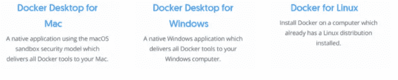

如果你是 Linux 用户，恭喜你，你可以点击“Docker for Linux”在你的 Linux 机器上安装 Docker。

如果你像我一样使用非 Linux 操作系统，你可能会想“让我们试试 Docker 桌面。为什么不呢？”

等等，先不要点 Docker 桌面按钮。Docker 桌面可能不是你的最佳选择。我会告诉你为什么。

在这篇文章中，我将告诉你在非 Linux 操作系统上使用 Docker 的不同方法。我将试着解释 Docker 是如何工作的。更重要的是，我将向您展示如何建立一个环境，以便您在即将到来的 Docker 开发之旅中不必处理兼容性和配置问题。

# 这篇文章是写给谁的？

如果您是 Docker(或容器化、虚拟化)或 Linux 开发的新手，那么本文适合您。

这都是关于新手友好的解释和实践教程。

下面是这篇文章的提纲:

*   容器是如何工作的？
*   (Windows/Linux 上的 Docker 与 Windows/Linux 上的 Docker)
*   Docker 引擎、Docker 机器、Docker-cli 等。所有那些模糊的词
*   非 Linux 主机上 Docker 的三个选项
*   使用 Virtualbox 在 Win10 上动手设置 Docker 环境

附:如果你想直接使用 Docker，你可以跳到这篇博客末尾的教程。我提供了一个循序渐进、经得起未来考验的解决方案。

# 容器是如何工作的？

## 容器架构

> 容器是运行在单个操作系统(OS)内核之上的虚拟运行时环境，它模拟操作系统而不是底层硬件。

让我们考虑下面的图表:

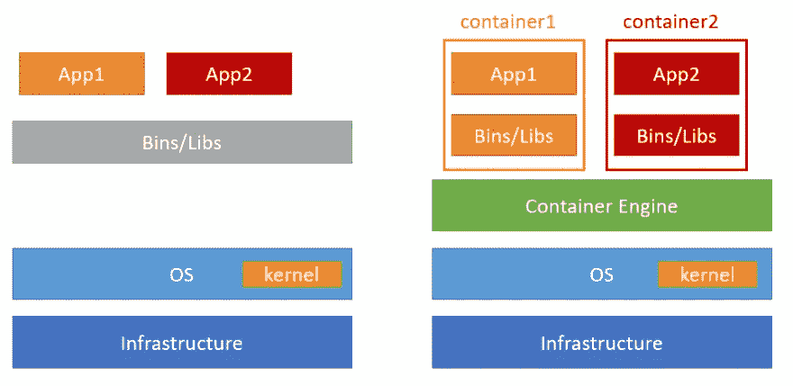

左图:普通系统与带容器的右系统(图片由作者提供)

左边是没有容器的本机操作系统，其中所有应用程序共享相同的依赖项(bin 和 libs)。在右边，应用程序由容器隔离，在每个容器中，应用程序都有自己的依赖项。

这种隔离的引入可以带来许多关于安全性和 DevOps 的好处。例如，一个容器的崩溃不会级联到其他容器。隔离还解决了依赖性冲突问题(即，app1 所需的依赖性与 app2 的依赖性冲突)，因为应用将在它们自己的容器内运行，具有它们自己的依赖性。

## Linux 容器与 Windows 容器

像 Docker Engine 这样的容器引擎通过利用内核的资源来工作。事实是，不同的操作系统如 Windows 和 Linux 有不同的内核。因此，容器很可能需要不同的依赖项才能在 Windows 操作系统或 Linux 操作系统中工作。

因为我们希望保持容器的轻量级，而不是让单个容器同时适用于 Linux 和非 Linux 系统，所以更明智的做法是让不同版本的容器分别适用于 Win OS 或 Linux OS。通俗地说，我们把在 Windows OS 上工作的容器称为“Windows 容器”，它利用了 Win OS 内核。它的对应物是 Linux 容器。

那么为什么这和今天的话题有关系呢？最终，您需要创建容器(更具体地说，构建映像来运行容器)，这些容器可以部署在 Windows 或 Linux 主机上用于生产。像 Docker 这样的容器化技术可以很好地将你的容器从一个 Linux 内核环境转移到另一个 Linux 操作系统，因为所有的 Linux 发行版都共享同一个内核。但是使用 Windows 内核的容器化应用程序(即本地 Windows 容器)不能被运送到 Linux 主机。

Docker 是为开发和管理 Linux 容器而创建的，所以如果您是 Linux 用户，在您的开发机器上使用 Docker 没有任何问题。

但是像你我这样的非 Linux 用户呢？这就是虚拟机管理程序的由来。

# 虚拟机管理程序:一个虚拟机引擎

管理程序(或虚拟机监视器、VMM、虚拟化器)是创建和运行虚拟机的计算机软件、固件或硬件。虚拟机是计算机系统的虚拟化/仿真。例如，如果您在 PC 上使用 Win10，管理程序可以创建一个 Linux 虚拟机，让您感觉像在使用 Linux 系统。

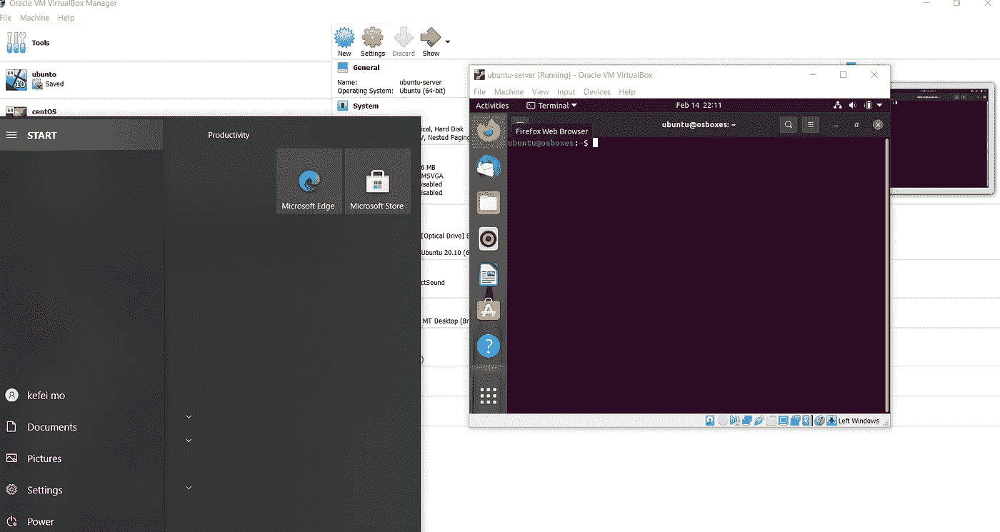

Ubuntu 在 Windows“内部”运行(图片由作者提供)

注意:有两种类型的虚拟机管理程序:

类型 1 (Hyper-V):虚拟机管理程序位于硬件之上。

类型 2 (Oracle VirtualBox):虚拟机管理程序位于主机操作系统之上。

# Windows 上的 Docker 引擎

## Windows 平台上的 Docker 桌面与 Linux 虚拟机上的 Docker 以及 Docker 工具箱

我假设您想在 Windows PC 上创建一个 Linux 容器开发环境。有三种不同的解决方案可以实现这一点:

*   解决方案 1:Docker Windows 桌面
*   解决方案 Linux 虚拟机上的 Docker
*   解决方案 3: Docker 工具箱(已弃用)

由于解决方案#3 已被弃用，因此解决方案#3 的核心概念与解决方案#2 相同，让我们关注前两个解决方案。以下是解决方案体系结构的比较:

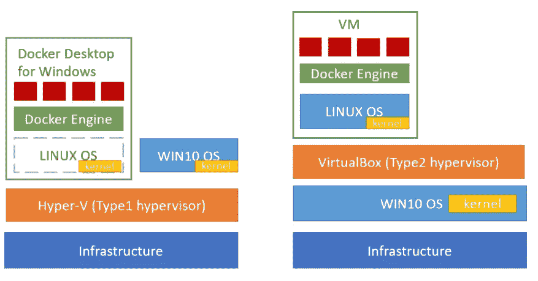

左:Docker 桌面架构与 Linux 虚拟机上的右 Docker(图片由作者提供)

## 我应该使用哪种解决方案？

让我们来看看这两种解决方案的优缺点。

**Mac 版 Docker/Windows 版 Docker(Docker 桌面版)**

> **优点**
> 
> 开箱即用，安装 Docker Desktop 后，您就可以按照配置说明进行操作了
> 
> 作为默认的解决方案，Docker 正在大力开发和完善这个解决方案。
> 
> **缺点**
> 
> 在某些 macOS 硬件组合上，音量性能可能会有点慢。
> 
> 不能使用 WSL2 运行持久的后台进程。
> 
> 如果不熟悉 Windows 或 MAC 命令行工具，并不会感觉更“原生”。实际上，这感觉很糟糕，因为您基本上是在非 Linux 终端上编写类似 Linux 的 Docker 命令。
> 
> 关于如何使用 Docker 桌面或配置 Hyper-V 的教程不多

**Mac 版 Docker/Windows 版 Docker(Docker 桌面版)**

> **优点**
> 
> 它提供了一个比 Docker 桌面更自然的环境。此外，在原生 Linux 环境下创建的 Docker 教程比 Docker 桌面环境下创建的要多，这对新手来说是一个很大的吸引力。
> 
> 即使 Docker 目前正与微软紧密合作，WSL(Windows Subsystem for Linux)[仍需要一些时间来成熟](https://fossbytes.com/what-is-windows-subsystem-for-linux-wsl/)。另一方面，VirtualBox 是一个更成熟的解决方案。这意味着更少的兼容性问题。
> 
> 它是面向未来的，因为开源软件是 Docker 的容器运行时环境 RunC 和 ContainerD 守护程序的基础，后者基于开放容器倡议(OCI)行业标准，并将在开源许可证下作为开源提供商进一步开发。
> 
> **缺点**
> 
> 管理虚拟机需要更多的开销。
> 
> 虚拟机应用程序可能会导致计算机像糖蜜一样迅速陷入困境。

## 建议:在你自己的虚拟机上使用 Docker

正如你所看到的，我站在安装你自己的虚拟机的一边。关于这个解决方案的缺点:

因为这是可控性和开销之间的权衡，并且对于开发环境来说，可控性得到了很好的回报，所以这并不是一个很大的缺点。

这是真的，VirtualBox 可以降低你的电脑。然而，当你开始学习 Docker 时，你不太可能处理一个真正的高效服务器的复杂程度。当您认为您已经准备好了，您可以轻松地在高性能服务器或云中部署应用程序。

# 使用 VirtualBox 在 Win10 上安装 Docker

最后，我们来看这篇文章的本质部分。让我们来设置 Docker 开发环境。

要在 Win10 上安装 Docker，需要下载 [VirtualBox](https://www.virtualbox.org/) 和一个 Linux OS 镜像(推荐 [Ubuntu](https://www.osboxes.org/ubuntu/) )。在本教程中，我使用的是 VirtualBox 6.1.18，Ubuntu 20.10 Groovy Gorilla。您可以选择使用其他最新版本。

## 使用 Ubuntu 映像创建一个虚拟机(。vdi 文件)

在 Win10 上安装 VirtualBox 非常简单。下面的步骤将从从映像创建 Linux VM 开始。

*   选择“机器”，然后点击“新建”

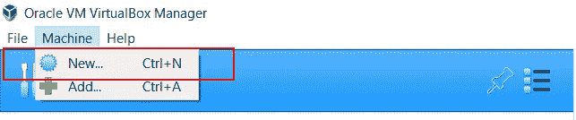

(图片由作者提供)

*   选择“机器文件夹”路径和“名称”(虚拟机将位于$ <machine folder="">\$ <name>目录下</name></machine>
*   选择“类型”作为 Linux。选择“版本”为“Ubuntu(64 位)”。注意:如果你把你的文件夹命名为 Ubuntu 或者类似的东西，VirtualBox 会很聪明的为你选择“类型”为“Linux”和“Ubuntu(64 位)”。
*   点击“下一步”

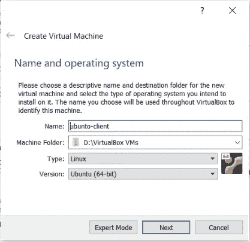

(图片由作者提供)

选择虚拟机的内存大小。(因为您可以稍后根据虚拟机调整内存大小，所以您可以在此选择默认设置)

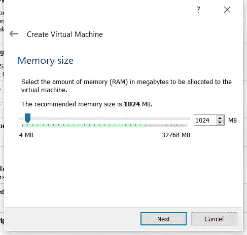

(图片由作者提供)

在“创建虚拟机”中

*   选择“使用现有的虚拟硬盘文件”
*   如果图像(。vdi 文件)未在下拉列表中列出，请单击文件夹导航按钮
*   选择图像，然后点击“创建”

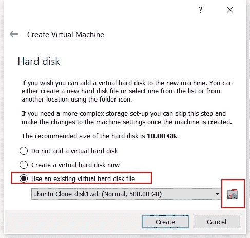

(图片由作者提供)

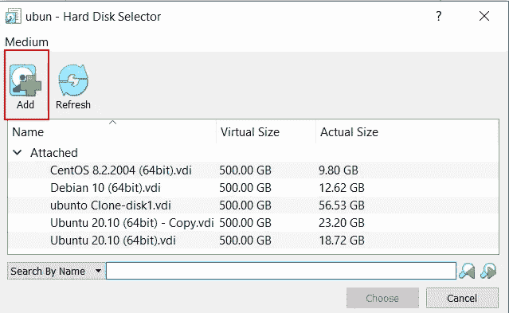

(图片由作者提供)

现在，您将看到刚刚创建的虚拟机。双击以启动虚拟机。

(如果你使用的是由[osboxes.org](http://osboxes.org)创建的图像。首次登录时使用密码“[osboxes.org](http://osboxes.org)”。)


(图片由作者提供)

**故障排除:**在我写这篇文章的这一刻(2021 年初)，Window Hyper-V 和 VirtualBox hypervisor 之间发生了冲突。这种冲突会导致“古鲁冥想的严重错误”，如下所示: (

(小心绿海龟。如果出现，说明有问题)

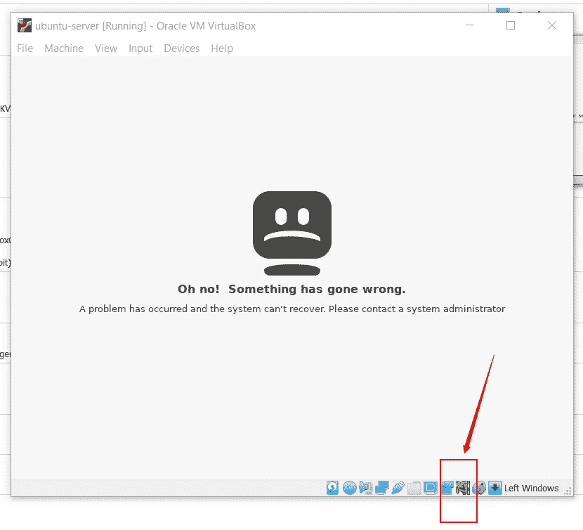

(图片由作者提供)

要解决这个问题，请转到“打开和关闭 Windows 功能”并确保取消选择以下选项

*   超 V
*   虚拟机平台
*   用于 Linux 的 Windows 子系统(WSL)

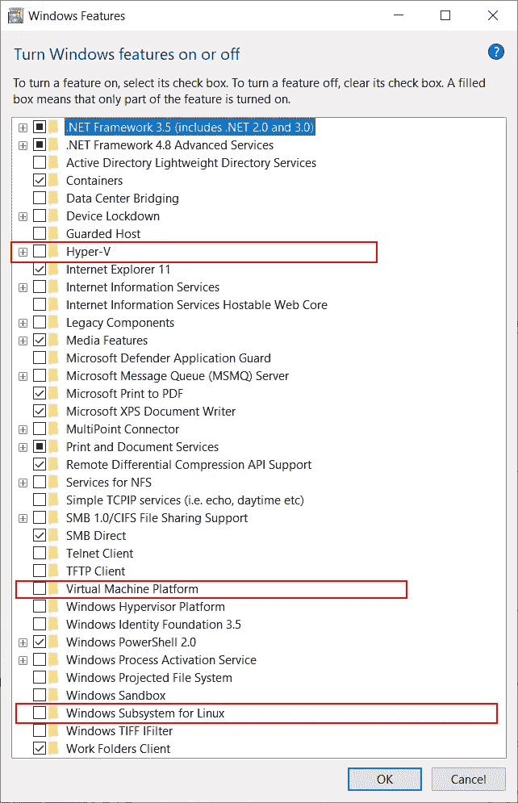

(图片由作者提供)

## 虚拟机配置

在我们真正在虚拟机上安装 Docker 引擎之前，还有一个步骤——配置虚拟机网络，以便 Docker 引擎可以从公共注册表中获取和推送映像。它还支持虚拟机运行非本地访问的容器化服务(例如 web 服务)。

*   (当虚拟机“关闭”时)，右键单击感兴趣的虚拟机实例，然后单击“设置”
*   在弹出窗口中，选择“网络”
*   在“连接到:”下拉菜单中，选择“桥接适配器”。(你可以在这个[链接](https://www.virtualbox.org/manual/ch06.html)中找到更多关于 VirtualBox 适配器的信息。)

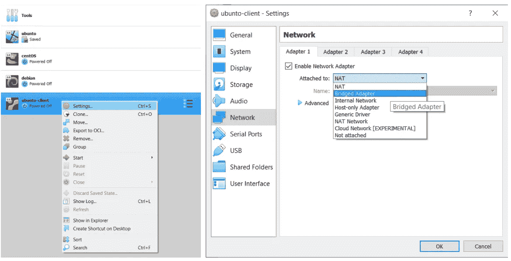

(图片由作者提供)

现在，如果您再次启动虚拟机，打开一个终端(打开终端快捷键 Ctrl+Alt+T)您可以使用“ifconfig”(或“ip addr”)查询 IP 信息

这里，我的虚拟机的 IP 地址是 192.168.1.19。如果一切正常，您应该能够从您的 VM 主机(即您的 win 10)ping 这个地址。

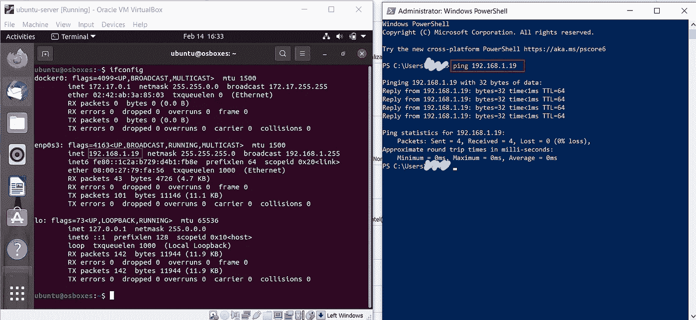

(图片由作者提供)

**提示:在你的虚拟机和主机操作系统之间共享剪贴板，使复制粘贴命令变得容易**

*   在“设备”菜单→“共享剪贴板”下，选择“双向”。
*   在终端复制/粘贴是 Ctrl+Shift+C/V

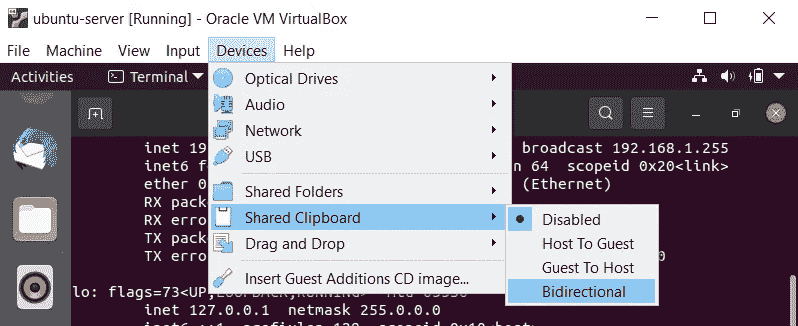

(图片由作者提供)

## 在虚拟机上安装 Docker 引擎

下面是在你的 Ubuntu 虚拟机上安装 Docker 引擎的主要步骤。(如果在 Ubuntu 中安装 [Docker 引擎有任何更新，请参考 Docker 文档。)](https://docs.docker.com/engine/install/ubuntu/)

*   卸载旧版本

```
$ sudo apt-get remove docker docker-engine docker.io containerd runc
```

*   设置存储库

```
$ sudo apt-get update$ sudo apt-get install \\
    apt-transport-https \\
    ca-certificates \\
    curl \\
    gnupg-agent \\
    software-properties-common
```

*   添加 Docker 的官方 GPG 密钥
*   然后验证您是否拥有指纹为 9dc 8 5822 9fc 7 DD 38 854 a e2d 8 8d 81 803 c 0 ebf CD88 的钥匙

```
$ curl -fsSL <https://download.docker.com/linux/ubuntu/gpg> | sudo apt-key add -
$ sudo apt-key fingerprint 0EBFCD88pub   rsa4096 2017-02-22 [SCEA]
      9DC8 5822 9FC7 DD38 854A  E2D8 8D81 803C 0EBF CD88
uid           [ unknown] Docker Release (CE deb) <docker@docker.com>
sub   rsa4096 2017-02-22 [S]
```

*   使用以下命令来设置稳定的存储库。

```
$ sudo add-apt-repository \\
   "deb [arch=amd64] <https://download.docker.com/linux/ubuntu> \\
   $(lsb_release -cs) \\
   stable"
```

*   安装 docker 引擎(这个包叫做“docker-ce”，代表 Docker 社区版)

```
$ sudo apt-get update
 $ sudo apt-get install docker-ce docker-ce-cli containerd.io
```

*   通过运行 hello-world 映像，验证 Docker 引擎是否安装正确。

```
$ sudo docker run hello-world
```

现在，您将看到如下内容。

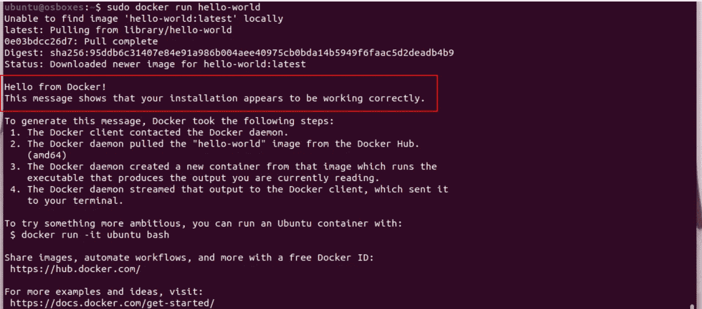

(图片由作者提供)

**故障排除:**典型的网络配置问题可能会导致如下所示的错误。检查您的虚拟机网络配置，并确保适配器设置为“桥接适配器”。

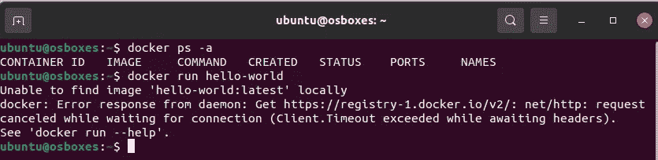

(图片由作者提供)

**临时设置**

现在，如果您直接运行 Docker 命令，它将抛出一个错误。(Docker:尝试…时被拒绝许可。)

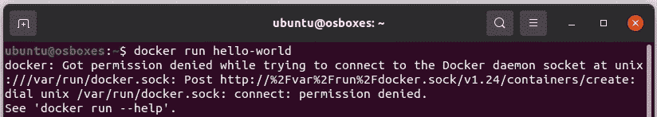

(图片由作者提供)

如果您想以非根用户的身份使用 docker，现在应该考虑将您的用户添加到“Docker”组中。这样你就不用每次都用 sudo docker 了。这里是你能做的。(记住注销并重新登录以使其生效！)

```
$ sudo usermod -aG docker <your-user>
$ sudo -s
[sudo] password for ubuntu: 
root@osboxes:/home/ubuntu# exit
exit
```

## 额外教程:使用 Docker 映像部署微服务

这个子教程将模拟供应和管理一个名为 [NextCloud](https://nextcloud.com/) 的企业文件共享站点的过程。

Nextcloud 是一个开源软件套件，可以使用存储容量来保存、编辑和使用各种文档类型，包括音频/视频呼叫托管等服务。

我选择 NextCloud 作为一个例子，向您展示在测试/生产环境中部署应用程序(在这里是一个 web 服务)的容易程度。所以，我们开始吧。

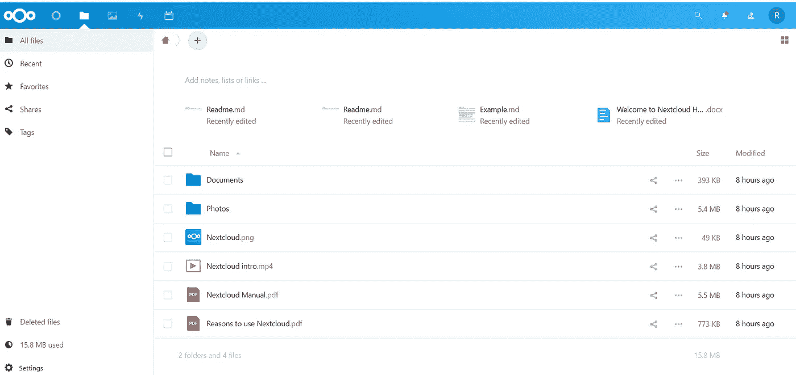

NextCloud 文件共享服务(图片由作者提供)

*   首先，从 Docker Hub 注册表中提取 NextCloud 映像(这可能需要一段时间)

```
$ docker pull nextcloud
```

*   使用 apache 映像，它包含一个 web 服务器并公开端口 80。

```
$ docker run -d -p 8080:80 nextcloud
```

现在，如果您在虚拟机的 web 服务器(例如 Firefox)上输入“localhost:8080”或者更好的输入，请尝试在您的主机 PC 上使用“IpAddress:8080”(在我的例子中是 192.168.1.19:8080)访问 NextCloud。

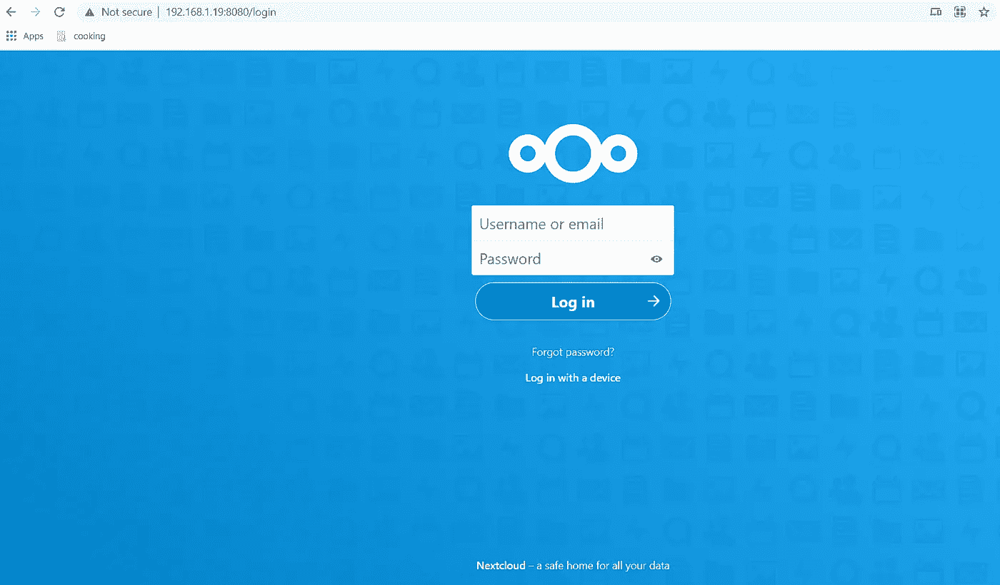

NextCloud 欢迎页面(图片由作者提供)

哇哦，你有一个专业的文件共享系统。你可以创建一个帐户，玩一玩，看看 NextCloud 能为你提供什么。

> 注意:NextCloud 演示旨在让您体验 Docker，而不是用于生产。这里有一篇[博客](https://blog.ssdnodes.com/blog/installing-nextcloud-docker/)给你详细指导如何使用 Docker 部署生产级 NextCloud 服务。

这只是使用 Docker 容器创建服务的一个例子。拓展这个思路；您可以创建几个虚拟机，在每个虚拟机上部署各种应用程序，并让它们相互协作，就像微服务架构一样。

# 摘要

我希望现在你有足够的信心和兴奋开始玩 Docker。回顾一下，让我们看看这篇文章的一些要点。在这篇文章中:

*   您了解 Windows 容器和 Linux 容器之间的区别
*   您了解了使用虚拟机管理程序作为接口在本机 Windows 操作系统环境中开发 Linux 容器的不同解决方案
*   您将学习如何使用 VirtualBox 创建一个 Linux VM 作为 Linux 容器开发的环境。此外，您还将学习在 Linux 虚拟机上安装 Docker 引擎，并在虚拟机上运行容器。

我希望你喜欢这个博客。下次见。；)