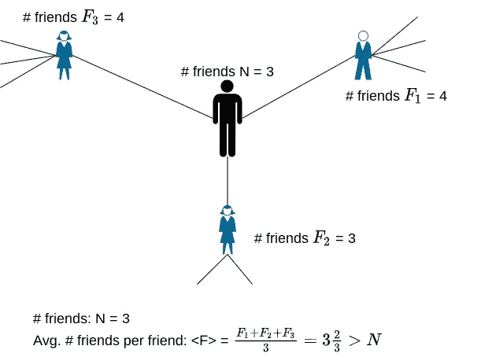
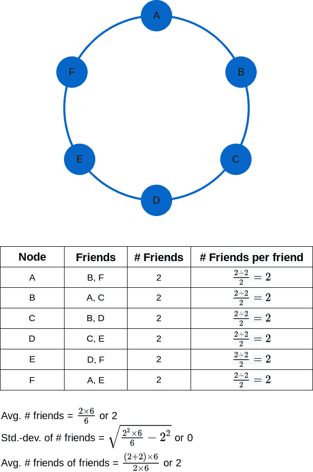
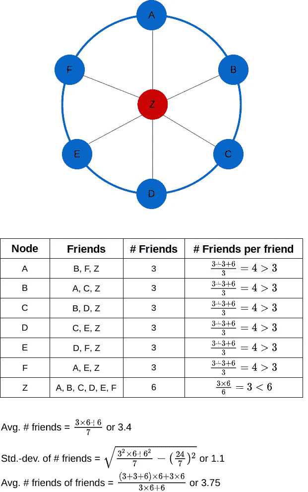
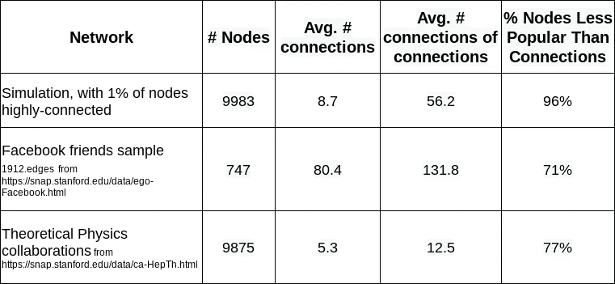
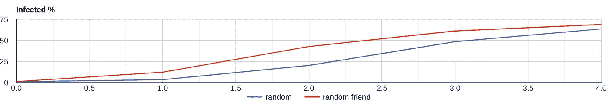
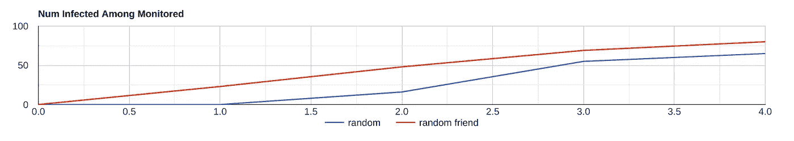
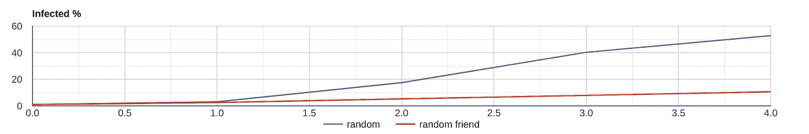

# 你朋友的朋友比你多

> 原文：<https://towardsdatascience.com/your-friends-have-more-friends-than-you-e005796841bb?source=collection_archive---------32----------------------->

## [入门](https://towardsdatascience.com/tagged/getting-started)

## 友谊悖论的友好介绍

# 不友好的事实

*你的朋友很可能比你有更多的朋友。*你可能会觉得这令人谦卑、伤人、不可思议、不可能，或者只是古怪。但这是事实。

你的朋友比你朋友多到底意味着什么？假设你有 *N* 个朋友。你的第一个朋友有 F₁的朋友，你的第二个朋友有 F₂的朋友，等等。那么，你们每个朋友的平均好友数就是<f>=(f₁+f₂+……)/n，对于你们大多数人来说，你们每个朋友的平均好友数(即< F >)大于你们的好友数(即 n)。

作者图片

自我挫伤不止于此。对于你所在的任何一个网络来说，相对于你的人脉来说，你的低连接性都是真实的。比如在 Twitter 或者 Medium 上，你的关注者比你的关注者多。或者说，在 LinkedIn 上，你的人脉比你多。或者，如果你是一名研究人员，你发表论文的合作者比你有更多的合作者。

甚至非感知实体的网络也遭受这种现象。大多数网页不如它们链接的网页突出。大多数研究论文被引用的次数比它们自己引用的论文少。

怎么会这样呢？这只是理论上的好奇，还是有更实际的意义？

# 为什么你没有你的朋友受欢迎？

将网络建模为图形。例如，在友谊网络中，每个个体都是图中的一个节点(或顶点)。如果两个人是朋友，那么有一条边(或链接)连接这两个人的节点。

这里有一个图表示例，表示一个由 6 个人组成的网络(简单地命名为 A、B、C、D、E、F ),其中每个人都是另外两个人的朋友:

作者图片

在这个例子中，6 个人中的每一个都有 2 个朋友。一个人的两个朋友中的每一个都有两个朋友。所以，每个人的朋友数量和他们每个朋友的朋友数量是一样的。那是相当多的。而且甚至没有体现出大多数人朋友比朋友少的属性。怎么回事？不像这个例子，真实的网络不是同质的。换句话说，在真实网络中，每个节点的连接数并不相同。此外，有少量离群点节点比其余节点连接得更多。让我们在示例图中添加一个这样的异常值 Z:

作者图片

现在，A 到 F 每个人都有 3 个朋友。Z 有 6 个朋友。对于 A 到 F 中的每一个，2 个朋友有 3 个朋友，1 个朋友有 6 个朋友，平均每个朋友有(3 + 3 + 6) / 3 或 4 个朋友。所以 A 到 F 每个人都不如他们的朋友受欢迎。只有 Z 比他们的朋友更受欢迎。Z 的 6 个好友，每个都有 3 个好友。所以 Z 的朋友平均有 3 个朋友，而 Z 有 6 个朋友。离群值 Z 扭曲了其他人的结果，他们变得不如他们的朋友受欢迎。

一般来说，如果网络中有一小部分 *f* 的节点比其余节点的连接度高得多，那么网络中接近 *1-f* 的节点的连接度将比它们的连接度低。大多数现实世界的网络，尤其是社交网络，有一小部分节点是高度连接的离群点。

我们可以用一个精确的数学结果来收紧手势。如果μ是网络中每个节点的平均连接数，σ是每个节点的连接数的标准偏差，那么朋友的朋友的平均数量正好是μ + σ /μ，只要节点间的连接数有一些变化，它就大于μ。所以，任何异质的网络都有比朋友更多的朋友。

下表显示了这种现象的三个例子。第一个示例是一个随机模拟的网络，其中 99%的节点是典型连接的，1%的节点是高度连接的。第二个例子使用的数据来自脸书友谊网络的一个小的子集。第三个例子使用理论物理预印本档案中所有研究合作的全部数据。在所有三种情况下，连接的平均连接数都大于平均连接数。并且很大比例的节点比它们的连接更少连接。

作者模拟计算

# 给朋友打电话

既然你已经接受了你的朋友比你更受欢迎的事实，你可以耸耸肩，继续前进。或者，你可以继续阅读，看看如何利用这些知识。

假设您想要影响在网络中连接的节点之间本地传播的东西的传播。例如，通过面对面交谈在社区中传播的信息，或者通过身体接触在人群中传播的传染病。如果你知道网络中哪些节点的连接度最高，你当然可以利用这一点来影响传播。例如，为了尽可能快地传播信息，将信息播种到连接程度最高的节点。但是，实际上，您通常不了解如此详细的网络拓扑知识。在这种情况下，一个简单的替代方法是随机选取一些节点，然后期待最好的结果。但是，有了本文中的知识，您可以使用“给朋友打电话”策略做得更好:我不播种随机采样的节点，而是播种该节点的随机连接。为什么这有意义？因为我们现在知道一个节点的连接比节点本身更有可能有更多的连接。这真的有用吗？绝对的。我用三个例子来演示。

## 快速八卦

假设你想在一个社区的少数人中传播一条信息，并依靠社区成员之间的流言蜚语来传播这条信息。如何挑选种子人群，让信息快速传播？使用给朋友打电话的策略。随机选择一组人，但不要给他们灌输信息。相反，让随机组中的每个人提名他们的一个朋友。然后用信息播种被提名的朋友。

作者图片

上图显示了模拟的结果。这些线条显示了随着流言的传播，被“感染”(即收到信息)的人的累计百分比。蓝线是随机播种 1%节点的基本情况。红线显示了从随机 1%的节点中播种每个节点的随机朋友后的传播。显然，红线显示的是每轮八卦后信息传播的速度更快。在第一轮之后，信息传播到 12%(与 3%的基线相比)。在第二轮之后，它扩散到 43%(与 20%的基线相比)。诸如此类。

如果你感兴趣，这里有更多关于模拟的细节(否则可以跳过这一步)。我构建了一个包含 10，000 个节点的随机图，其中 99%的节点与其他节点的连接关系比较密切(~2%)，1%的节点与其他节点的连接关系非常密切(~71%)。这产生了一个图，其中一个节点的平均连接数约为 9，连接的平均连接数约为 56，并且 96%的节点的连接数少于它们的连接数。信息的传播是通过以下方式模拟的:在一轮八卦中，每个拥有信息的人都将其传播给随机的四分之一的关系人，然后对此感到厌倦，这样他们就不会在下一轮八卦中传播它。

## 早期发现

如何通过监测社区中的一小部分人来快速检测传染病在社区中的传播？以随机抽样的方式监视每个人的一个随机朋友。由于一个人的朋友通常比这个人有更多的朋友，这种疾病应该在电话给朋友策略下被监控的人群中更快出现。

作者图片

上图显示了模拟的结果。这些线条显示了随着疾病在社区中传播，受监测的感染人数。蓝线是监测随机 1%的人的基础情况。红线是从随机选择的 1%的人中监控每个人的随机朋友的情况。显然，红线表明，通过监测随机抽样的朋友，可以比通过监测随机抽样更早地发现传播。第一轮后，受监控的朋友中有 23 人被感染(基线时为 0)。在第二轮测试后，在 48 个随机的朋友中发现了这种疾病(相比之下，基线是 16 个)。诸如此类。

## 选择性免疫

这里有一个与全球疫情时代非常相关的场景，需要优先为谁接种疫苗。如果疫苗只够一小部分人使用，一个有效的策略是给每个随机选择的人的随机朋友接种疫苗。

作者图片

上图显示了模拟的结果。这些线条显示了感染人群的累计百分比，从随机的 1%的感染者开始。蓝线是随机接种 10%人群的基本情况。红线是从随机选择的 10%人群中给每个人的随机朋友接种疫苗。红线显示电话给朋友策略显著降低了传播。到第二轮，这种疾病只传播到 5%的人(基线时为 17%)。到了第三轮，这一比例扩大到了 8%(相比之下，基线时为 40%)。

# 摘要

1.  在节点间的连接数存在一定差异σ的网络中，每个节点的平均连接数μ比连接的平均连接数少σ / μ。
2.  如果一个网络有少量高度连接的节点，那么大多数其他节点的连接数都少于它们的平均连接数。所以，举例来说，在一个友谊网络中，一个典型的人的朋友数量会比他的朋友的平均数量少。
3.  与节点本身相比，节点的连接的更高的平均连通性可以被用来影响使用朋友电话策略的网络中的信息/感染的本地传播。随机抽样网络中的一小组节点(基线样本)。用节点的随机连接替换采样集中的每个节点(朋友样本)。朋友样本将比基线样本具有更高的连接度。如果你在朋友样本中植入一些适合八卦的信息，它会比植入基线样本传播得更快。如果你监测朋友样本的传染病传播，你会比监测基线样本更早地发现它。如果你对朋友样本进行传染病免疫，你将比对基线样本进行免疫显著地减缓疾病的传播。

# 参考

1.  斯科特·费尔德 1991 年的原始论文:[https://www.journals.uchicago.edu/doi/10.1086/229693](https://www.journals.uchicago.edu/doi/10.1086/229693)
2.  给你的邻居接种疫苗:【https://physics.aps.org/story/v12/st23 
3.  用友谊悖论来取样一个社交网络:【https://physicstoday.scitation.org/doi/10.1063/1.3518199 
4.  斯坦福大型网络数据集集合:[https://snap.stanford.edu/data/](https://snap.stanford.edu/data/)