# 你的基本 SQL 指南，同时学习以太坊

> 原文：<https://towardsdatascience.com/your-guide-to-basic-sql-while-learning-ethereum-at-the-same-time-9eac17a05929?source=collection_archive---------4----------------------->


照片由 [Gia Oris](https://unsplash.com/@giabyte?utm_source=unsplash&utm_medium=referral&utm_content=creditCopyText) 在 [Unsplash](https://unsplash.com/s/photos/start?utm_source=unsplash&utm_medium=referral&utm_content=creditCopyText) 上拍摄

## [实践教程](https://towardsdatascience.com/tagged/hands-on-tutorials)

## 事实证明，以太坊是一个非常棒的关系数据库，可以用来学习和练习 SQL 查询！

*如果你正在寻找更多的 web3 数据内容，请查看我的* [*30 天免费课程(带视频)*](https://ournetwork.mirror.xyz/gP16wLY-9BA1E_ZuOSv1EUAgYGfK9mELNza8cfgMWPQ) *！请务必* [*订阅我的简讯*](https://web3datadegens.substack.com/) *了解更多课程和教育技巧。*

## **> >** [**我在这里写了一个更最新更好的指南**](https://web3datadegens.substack.com/p/a-basic-wizard-guide-to-dune-sql)**<<**

当你学习如何在智能合约上存储和管理数据时，以太坊更容易理解，当你有不止两三个基本数据表要查询时，SQL 更容易学习。

到本文结束时，您将了解以太坊的基础知识，以及以下 SQL 函数:

*   选择、位置、限制
*   总和、计数、最大值、分组依据、拥有
*   不同，计数不同
*   加入
*   时间转换/解析(日期 TRUNC，时间间隔)
*   联合和联合所有

我还将做一个中级和高级 SQL/以太坊指南，所以如果你有兴趣阅读的话，一定要跟着我。在 [Dune Analytics](https://duneanalytics.com/hagaetc/example-dashboard) 上会有所有这些查询的链接，所以你可以随时编辑和运行它们。

## 什么是关系数据库？

如果您没有关系数据库的一般背景，让我们来分析一下它们是什么。关系数据库包含一组数据表，因此用户可以查询一些表的组合，只获得他们需要的数据(行)的子集。这通常比尝试将所有数据存储在一个文档中，然后在每次执行某个操作(无论是运行模型还是创建数据可视化)时读取整个数据集更有效。

表格可以被认为是 CSV 文件。每个表都有一个列键，每个列都有一个特定的数据类型(string、integer、boolean、JSON 是一些常见的例子)。每个表必须包含一个**主键**，用于确保特定列中的数据是唯一的(因此，如果您存储事务，那么该表中的每一行都有一个唯一的事务 id)。表还可能包含一个**外键**，它是关系数据库表中的一列或一组列，提供两个表中数据之间的链接。常见的外键包括从日期和时间到客户 id 或地理点的任何内容。

下面是一个关系数据库的例子，其中显示的字段是列键。PK 是主键，FK 是外键。

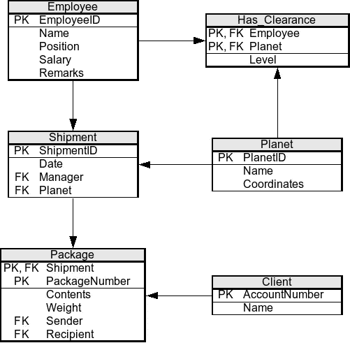

关系数据库的例子( [CC 许可](https://upload.wikimedia.org/wikipedia/commons/c/c0/Planet-express-db.png))

SQL 允许我们查询这些数据库——就这么简单！SQL 有各种版本，但略有不同，对于本文，我们将使用 PostgreSQL。

## 以太坊上的数据表是什么？

现在对于以太坊来说，你需要知道的是，有接近无限数量的钱包可以容纳这个名为 ETH 的令牌，而 ETH 经常充当你在区块链上进行交易时必须支付的汽油。也有智能合约，其行为类似于钱包，但可以同时进行一系列复杂的交易，但在这一点上不要太担心智能合约是什么**只需将它们想象为绑定了 API 函数的数据库表**。一旦你学会了如何浏览存储在合同上的数据，那么理解功能和语言就变得容易多了。

假设您已经创建了一个新的智能合约(即数据库表)，并且想要发行一种名为 USDC 的新货币。这种智能合约将跟踪您发行的 USDC 总量、每个人钱包中的 USDC 余额以及所有使用 USDC 的钱包之间的历史支付(交易作为数据库表行)。

ETH 的价值就像实体经济中的天然气/石油一样，是不稳定的，很大程度上取决于供求关系。您可能想要一个更稳定的令牌(如 Dai)发送给其他方进行支付，但也不想失去 ETH 的任何上升潜力。要做到这一点，可以创建另一个智能合约，允许您存储 ETH 作为抵押，以向 Dai 借款。如果汽油的类比没有意义，那就把它想象成从你房子的价值中借美元(或你的当地货币)。

这种借贷方式是以太坊上最大的产品类型之一，其中 [Aave](https://aave.com/) 、 [Compound](https://compound.finance/) 和 [Maker](https://makerdao.com/en/) 是一些主要的合同提供商。在本文的其余部分，**我们将探索这些抵押债务头寸(CDP，或有时称为保险库)的属性，通过使用 SQL 查询来了解它们是如何工作的。**

> 请记住，以太坊是**数据库**，智能合约是**数据表**，来自钱包的交易是**每个表中的行**。

## 选择、位置和限制

智能合约通常在调用事务时发出函数调用和事件(日志)。作为契约的子集，每个函数和事件都是我们可以查询的表。

我们可以使用 Etherscan 来探索合同的功能，在本例中，是 [Aave lending pool 合同](https://etherscan.io/address/0x398ec7346dcd622edc5ae82352f02be94c62d119#writeProxyContract)。

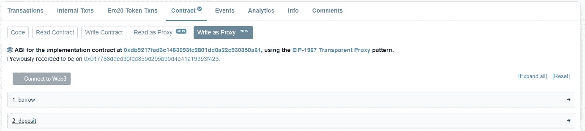

在你借钱之前，你必须先存入抵押品。我们可以运行第一个查询来查看最近的 100 笔存款交易，方法是从 Aave lending pool 存款数据表中选择所有列(`SELECT * FROM`)并用(`LIMIT 100`)限制返回的行

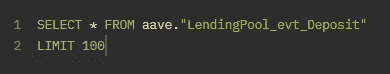

[https://duneanalytics.com/queries/34562](https://duneanalytics.com/queries/34562)

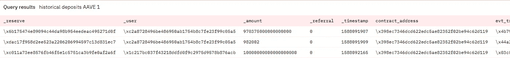

返回的前几行，列被截断

让我们分解查询返回的键列:

`**_user**`:发起存款的钱包地址

`**_reserve**`:作为抵押品存放的代币的地址

`**_amount**`:代币金额

`**_timestamp**`:交易被挖掘到区块链的时间戳

这是介绍地址的好时机。地址要么属于钱包，要么属于智能合约，在以太坊上总是唯一的。

让我们再次运行我们的查询，但是现在使用了一个`WHERE`语句来只过滤 ETH 储备(ETH 是特殊的，因为它没有智能合同，因为它在更深的层被跟踪，所以 Dune 使用`\xeeeeeeeeeeeeeeeeeeeeeeeeeeeeeeeeeeeeeeee`作为地址。


[https://duneanalytics.com/queries/34609](https://duneanalytics.com/queries/34609)

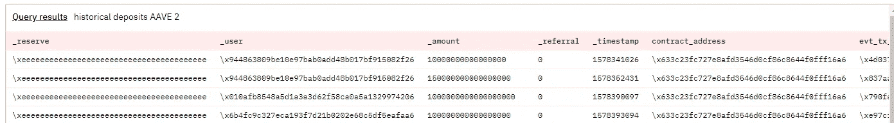

`WHERE`作为一个过滤器，意味着只有满足您设置的条件的行将被保留在返回的数据中。上图中，你可以看到`_reserve`列中的所有地址现在都代表 ETH。

前面我提到有一个智能契约跟踪我们的 USDC，该契约可以在地址[0xa 0b 86991 c 6218 b 36 C1 d 19d 4 a 2e e9 EB 0 ce 3606 EB 48](https://etherscan.io/address/0xa0b86991c6218b36c1d19d4a2e9eb0ce3606eb48)找到。让我们再次运行上面的查询，但是是在 lending pool borrow 数据表上，过滤 USDC。

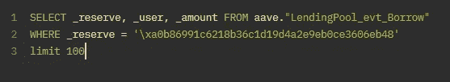

[https://duneanalytics.com/queries/34613](https://duneanalytics.com/queries/34613)

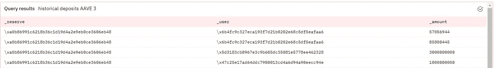

这里，我们对一组指定的列而不是所有的列运行了`SELECT`,正如您所看到的，这些正是返回的列。

## 计数、总和、最大值、分组依据、拥有、排序依据

既然我们已经知道了如何从表中选择列并根据某些条件进行过滤，我们将希望开始使用聚合函数来提供更多信息。

像`COUNT`、`SUM`和`MAX`这样的聚合器会绕过您想要执行算术运算的列。

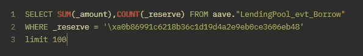

【https://duneanalytics.com/queries/34615】

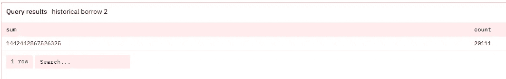

`sum`列给出了 USDC 所有历史借款的总和`_amount`(因为这被 USDC 过滤掉了`_reserve`)。`count`列将给出该列中的行数。

我们返回的表中的这些名称信息不多，所以接下来我们将使用`as`重命名这些列。

如果你以前在 excel 中使用过数据透视表，那么`GROUP BY`就不会太难理解。如果没有，可以把它想象成对作为透视依据的列中的每个唯一 id 运行 select 查询。我们用`_borrowRateMode`，浮动利率贷款用`1`，固定利率贷款用`2`。

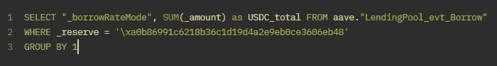

[https://duneanalytics.com/queries/34617](https://duneanalytics.com/queries/34617)

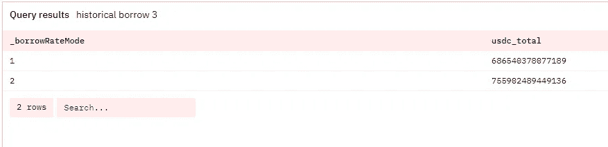

注意，我们将“sum”重命名为“usdc_total ”,这改变了我们返回的表中的列名

从这一点上，我们可以看到，似乎没有压倒性的偏好固定或浮动利率贷款。注意，我使用了`GROUP BY 1`，它将基于我们的`SELECT`查询中的第一个词。如果我放入`GROUP BY 2`,那么它会试图通过求和来透视它，这会返回一个错误，因为你不能通过聚合函数来透视。

我们现在可以引入第二个过滤函数`HAVING`。记住`GROUP BY`在`WHERE`已经运行之后运行，所以如果我们想要过滤透视表，那么我们就不能再使用`WHERE`。让我们透视用户借的 USDC 总额，其中用户必须有大于 1，000，000 的借款。

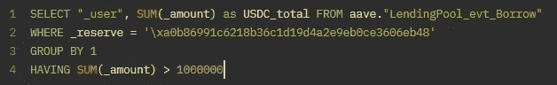

[https://duneanalytics.com/queries/34621](https://duneanalytics.com/queries/34621)

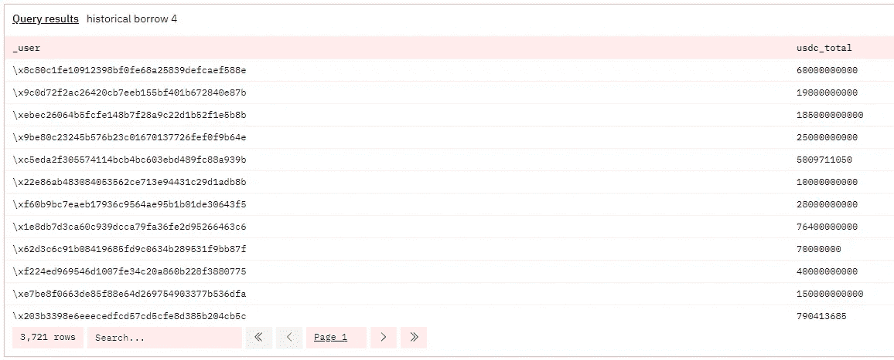

让我们对这个查询做一个小小的调整，我们希望按照 usdc_total 从大到小对表进行排序。为此，我们在查询的末尾添加了`ORDER BY`，并指定了一个列和`DESC`。

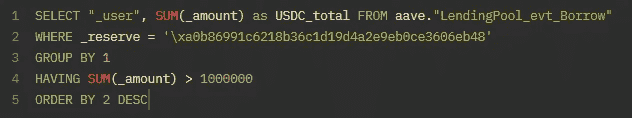

与上面相同的查询链接

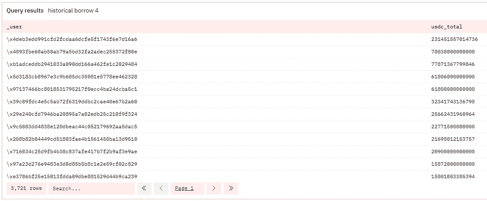

看起来有人借了超过 231 万亿 USDC！注意，这不是一笔未偿还的借款，所以已经偿还了很多次。

## 不同，计数不同

根据上一次查询中的行数(3，721)，我们已经可以看到在 Aave 上为 USDC 调用 borrow 函数的用户的唯一数量，但是我们也可以使用`DISTINCT`函数在不进行旋转的情况下完成这项工作。`COUNT DISTINCT`是一个组合，我们可以用它来计算不同事件的数量。当我们想要计算某一列相对于另一列的唯一值时，这很有用。值得注意的是，如果您正在寻找一些特殊的组合，您可以在`DISTINCT`中放置多个列名。假设我们想要查看每个用户从 Aave 借用了多少种不同类型的令牌:

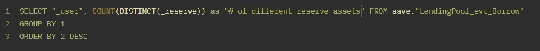

[https://duneanalytics.com/queries/34625](https://duneanalytics.com/queries/34625)

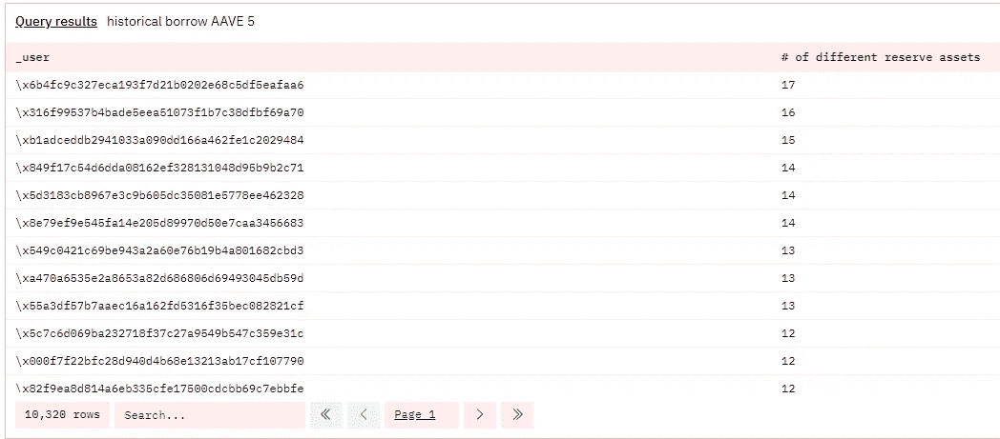

总的来说，Aave 有 10，320 个不同的用户借用了某种令牌，其中一个人最多借用了 17 个不同的令牌(如 USDC)。

## 外部(如左)和内部连接

到目前为止，我们只是一次在一个表上运行查询——连接是 SQL 的一个重要部分，因为它被称为关系数据库是有原因的(还记得开头提到的那些外键吗？).您可以指定七种类型的连接，如下所示:

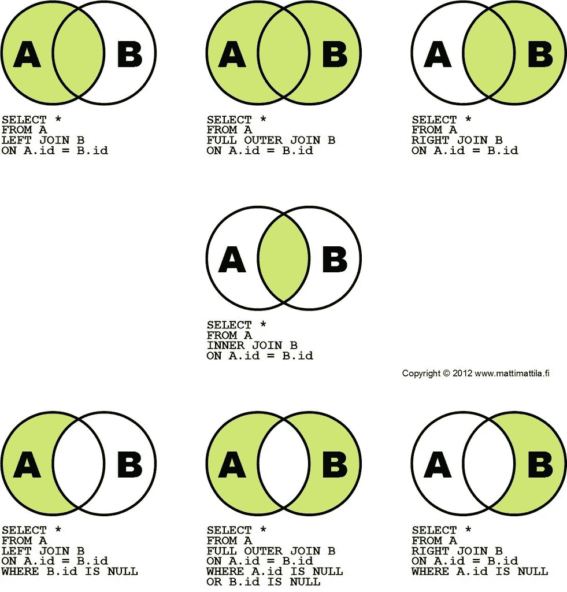

[CC 许可下的图像](https://live.staticflickr.com/8346/8190148857_78d0f88cef_b.jpg)

这是将我们的 lending pool 存款数据表带回到我们的查询中的好时机。让我们使用用户地址的内部连接来连接存款和借款，然后过滤 ETH 存款和 USDC 借款的储备对。

我们不能在原始的 Aave 借和存表上直接这样做，因为我们没有一组外键。取而代之的是，我们将进行子查询，在子查询中，我们将获得独立用户的枢轴以及从 USDC 借入或存入 ETH 的总金额。然后我们可以在 users 列上做一个内部连接。

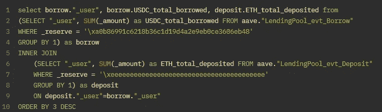

[https://duneanalytics.com/queries/34628](https://duneanalytics.com/queries/34628)


ETH 目前的价格是 2400 美元……所以已经存了很多 ETH 了！同样，这没有考虑还款或提款，所以这不是一个未偿金额。

我们的查询现在已经变得很长了，所以让我们逐个函数地分析一下。

```
(SELECT "_user", SUM(_amount) as USDC_total_borrowed FROM aave."LendingPool_evt_Borrow"
WHERE _reserve = '\xa0b86991c6218b36c1d19d4a2e9eb0ce3606eb48'
GROUP BY 1) as borrow
```

在这里，我们创建了一个子查询，它从前面的[返回相同的表](https://duneanalytics.com/queries/34621)(没有`HAVING`)，然后将该表重命名为“borrow”。我们对“存款”也重复这一点。现在我们有了两个有外键的表(_users)，我们可以做一个`INNER JOIN`来在每个表的外键列`ON deposit.”_user”=borrow.”_user”`中只保留既存了 ETH 又借了 USDC 的用户。最后是选择部分，在这里我们使用点连接符`SELECT borrow.”_user”, borrow.USDC_total_borrowed, deposit.ETH_total_deposited`指定我们想要的表和列的组合。为了让这在将来更具可读性，我们可以使用常见的表表达式( [CTE](https://docs.microsoft.com/en-us/sql/t-sql/queries/with-common-table-expression-transact-sql?view=sql-server-ver15) )，但是我将在下一篇文章中介绍这一点。

## 时间转换

Postgres 有一个可爱的名为`date_trunc`的日期解析函数和时间管理器`interval`，这使得处理时间戳数据变得轻而易举。假设我们想看看在过去的 7 天里 USDC 每天被借走了多少:

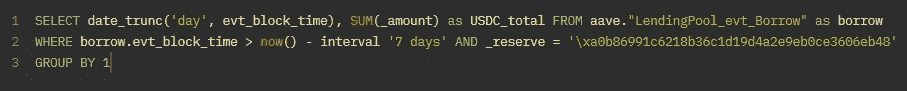

[https://duneanalytics.com/queries/34631](https://duneanalytics.com/queries/34631)


`date_trunc(‘day’, evt_block_time)`获取 evt_block_time 列并解析它，以便给定一天中的所有时间戳都设置为该日期的午夜。我们也可以这样做几分钟、几周、几个月或几年。

我们添加了`borrow.evt_block_time > now() — interval ‘7 days’`作为另一个`WHERE`条件，只保留在查询运行(`now()`)的一周内具有`evt_block_time`的行。

如果您以前没有使用过 DateTime 对象，请相信我的话，这两个函数(`date_trunc`和`interval`)为您节省了大量工作。

## 联合和联合所有

这是最后一部分，希望这是一个容易理解的部分。联接按列工作，而联合是当我们想按行组合两个查询或表时。关键是使用`UNION`删除完全相同的行，而`UNION ALL`没有。

Aave 只是一个 lending pool/CDP 协议，所以让我们也将它与 Compound 进行比较。我们将获取每个协议的唯一用户和他们的总 USDC 借款，并获取联合。

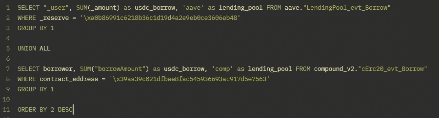

[https://duneanalytics.com/queries/34635](https://duneanalytics.com/queries/34635)

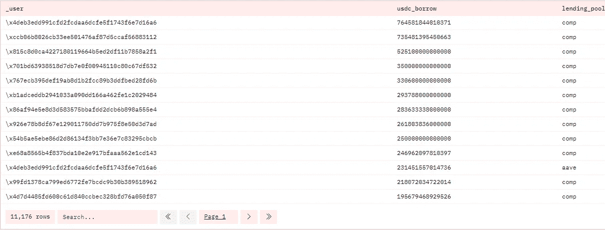

你可以在这里看到，前 13 名 USDC 借款人中只有一人使用 Aave——这可能有很多原因，包括他们的抵押品在哪里和借款利率。

我通过唯一用户和他们的总 USDC 借款进行旋转查询，然后在查询之间使用`UNION ALL`，最后通过`usdc_borrow`对组合表进行排序。另外，请注意，我创建了一个名为`lending_pool`的新列，在每个子查询中使用默认值`aave`和`comp`。

# 你成功了！🎉

如果你做到了这一步，那么恭喜你！您已经掌握了使用 SQL 进行基本数据探索和分析的足够知识。如果你想进一步了解以太坊，请查看我的另一篇文章，这篇文章深入探讨了以太坊的工作原理。

如果您还没有点击任何查询链接，我强烈建议您这样做，因为 Dune Analytics 是一个测试查询和快速创建可视化甚至仪表板的好地方。当我开始学习 SQL 时，我希望有一个这样的工具来练习，而不是依赖 hackerank 或 leetcode 中的表(或者摆弄本地服务器，用网上的基本模拟数据表填充它)。

再次提醒，请关注本系列的下两部分！