# 您的中级 SQL 指南，同时学习以太坊

> 原文：<https://towardsdatascience.com/your-guide-to-intermediate-sql-while-learning-ethereum-at-the-same-time-7b25119ef1e2?source=collection_archive---------8----------------------->


照片由 [Unsplash](https://unsplash.com/s/photos/electric?utm_source=unsplash&utm_medium=referral&utm_content=creditCopyText) 上的 [israel palacio](https://unsplash.com/@othentikisra?utm_source=unsplash&utm_medium=referral&utm_content=creditCopyText) 拍摄

## 实践教程

## 让我们使您的查询更高效、更易读，同时也帮助您理解像以太坊上的 Uniswap 这样的去中心化交换。

*如果你正在寻找更多的 web3 数据内容，请查看我的* [*30 天免费课程(带视频)*](https://ournetwork.mirror.xyz/gP16wLY-9BA1E_ZuOSv1EUAgYGfK9mELNza8cfgMWPQ) *！*

如果你错过了 SQL 和以太坊基础的第一部分，请务必先阅读第一部分。在 SQL 方面，今天我们将讨论这些稍微难一点的主题:

1.  公共表表达式(cte)
2.  自连接
3.  窗口功能，如分割、超前、滞后、整体
4.  在查询中使用索引来提高操作速度。
5.  子查询以及子查询对查询效率的影响

在以太坊方面，上次我们学习了贷款池和抵押债务头寸。这一次，我将向你介绍一种分散式交易所(DEX)——把它想象成一种外汇，你可以把美元换成欧元，但你的汇率取决于你当地银行里每种货币的剩余量。把“货币”换成代币([还记得我上次讲的 USDC 智能合约](https://etherscan.io/token/0xa0b86991c6218b36c1d19d4a2e9eb0ce3606eb48))把“银行”换成 DEX 智能合约就行了。我们将关注的 DEX smart 合约是 Uniswap，它在上周(4/11/21)处理了价值[8，870，691，188 美元的交易](https://duneanalytics.com/hagaetc/dex-metrics)。

像往常一样，在 [Dune Analytics](https://duneanalytics.com/hagaetc/example-dashboard) 上保存了所有这些查询的链接，所以你可以随时编辑和运行它们。如果你没有回头看上一篇文章，那么这是帮助理解*我们正在查询什么*的初级读本:

> *记住，以太坊是* ***数据库*** *，智能合约是* ***数据表*** *，从钱包发送的交易是* ***每个表中的行*** *。钱包和智能合约都有地址，* **在以太坊上永远是唯一的。**

# 公共表表达式(cte)

从技术上来说，Uniswap 不仅仅是一个单一的智能合同，它会遇到某些合同大小限制( [24 KB](https://cointelegraph.com/news/new-standard-to-avoid-ethreum-contract-size-limitation-developed#:~:text=As%20Ethereum%20contracts%20can%20hit,developed%20to%20help%20combat%20it.) )，并且开发起来极其复杂。正因为如此，我们的查询将大量地与子查询交织在一起，以获得我们想要的跨契约的数据。将子查询放在查询中是没有效率或可读性的，尤其是在多次使用同一个子查询的情况下。这就是 cte 发挥作用的地方！

如果你以前用面向对象的语言编写过脚本，比如 Python，那么你应该熟悉在变量中存储数据。cte 就像 SQL 的变量，在这里，您将一个子查询作为一个可重用的表存储在查询的其余部分中。

在我们开始查询之前，先快速回顾一下契约模式。Uniswap 遵循契约工厂模式，这意味着两个令牌之间的交换有一个基本模板( [UniswapV2Pair.sol](https://github.com/Uniswap/uniswap-v2-core/blob/master/contracts/UniswapV2Pair.sol) )，用于[从 Uniswap 工厂契约部署新的令牌对](https://github.com/Uniswap/uniswap-v2-core/blob/master/contracts/UniswapV2Factory.sol#L23)。

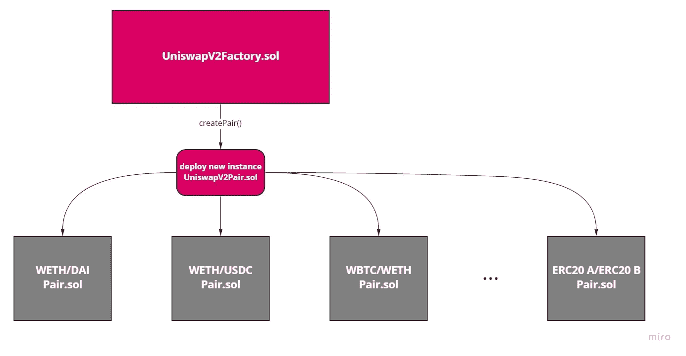

图片作者( [ERC20 参考](https://docs.openzeppelin.com/contracts/2.x/api/token/erc20))

现在，让我们看看是否可以获得上个月创建的所有对以及它们最近的储备余额(即，每个令牌还剩多少)

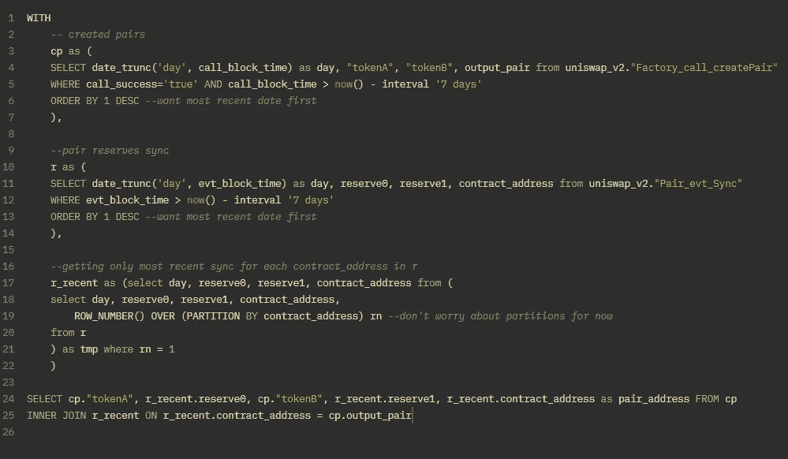

[https://duneanalytics.com/queries/35061](https://duneanalytics.com/queries/35061)

不要被长度吓到！让我们一行一行地完成这个查询。`WITH`标志着 CTE 的开始，随后是我们的第一个 CTE `cp`，它是过去 7 天内创建的所有配对的集合。`r`是所有储备余额在过去 7 天内更新的货币对的集合。`r_recent`仅保留来自`r`的每个唯一配对合同(`contract_address`)的最新更新。现在不要担心`partition`和`row_number()`，稍后我会解释这些概念。最后，我对协定地址对`cp`和`r_recent`做了一个`INNER JOIN`运算，得到了我们的最终表。

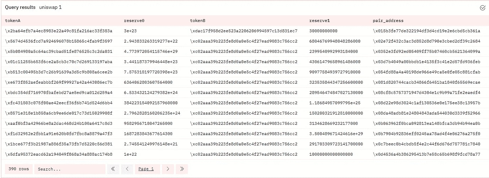

根据行计数，我们可以看到在过去 7 天中创建了 390 个新对。请注意，pair_address 是 UniswapV2Pair.sol 的以太网地址，它是在从 UniswapV2Factory.sol 协定调用 createPair()后为特定的 tokenA/tokenB 对部署的。

您能想象使用子查询完成所有这些吗？不仅其他人很难读懂，调试起来也更加困难和耗时。使用 cte，我可以单独构建和测试每个视图，而不必等待整个查询重新运行。

# 自连接

上面提到的工厂和配对基础契约都是非常低级的，不经常被直接调用。相反，Uniswap 创建了一个 Router02 契约，它以一种用户/开发人员友好的方式抽象出了大部分契约复杂性。一旦创建了新的货币对合约，你现在可以通过 Router02 合约将流动性添加到其流动性池中(这些储备必须以某种方式进入合约中！).流动性池在分散金融中是一个非常重要的概念，所以我会花一些时间来解释它。

当增加一对货币的流动性时，你是在增加来自其他流动性提供者(**LP**)的储备的流动性。uni WAP 要求您根据每个令牌的$值添加 50/50 的令牌，然后您将获得一个 uni WAP 池令牌，代表您在总池中的份额。下面是某人通过 Router02 增加流动性的例子:

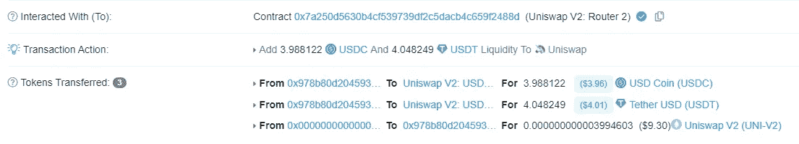

[USDC/USDT 资金池增加流动性并收回统一 V2 令牌交易示例](https://etherscan.io/tx/0x036ee02f7ad27fb5248b5ec1155e0bffdc0a561065b9361d95051d951c0ff8f7)

当有人想用一个代币交换另一个代币时，他们会增加一个代币的储备，并从另一个代币的储备中提取——从而影响两个代币之间的汇率。我们将在下一节更深入地探讨互换和汇率定价曲线。

现在，假设我们想要获得所有向同一个池中添加了流动性的有限合伙人的集合。这就是`SELF JOIN`真正有用的地方，因为我们可以基于第二列在同一列的行之间建立关系。一个很好的例子是，当你有一列姓名和一列地点时，你用`SELF JOIN`来显示[谁(原始姓名列)和谁(重复姓名列)](https://www.w3schools.com/sql/sql_join_self.asp)住在同一个地点。这里，我们有一列按地址排列的有限合伙人，我们希望看到哪些有限合伙人向同一个池中添加了流动性。

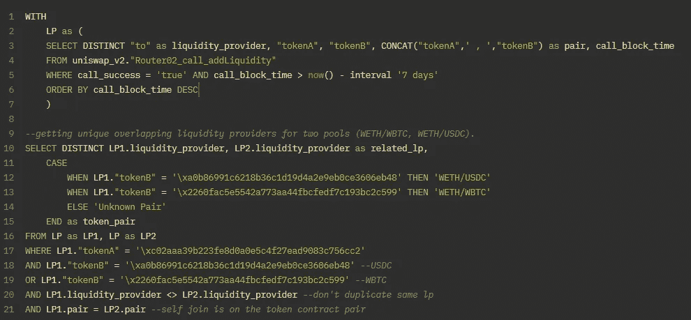

[https://duneanalytics.com/queries/35058](https://duneanalytics.com/queries/35058)

我的查询创建了在`LP`的过去 7 天中为每个令牌对增加流动性的唯一 LP 的 CTE。在最后一个查询中，我使用了`CASE WHEN`使该列比合同地址(存储在`pair`中)更具可读性，这只是一个“if-else”语句。`SELF JOIN`的关键是在最后两行，我选择了所有提供给同一个池的 LP 作为所选择的锚定 LP。然后，这将遍历该表，并列出每个配对契约的相关 LP，因此，如果我有 4 个 LP 提供给同一个配对契约，那么我将得到 12 行(4 个 uniques 充当锚，每个锚有 3 行/related _ LP)。第 20 行中的“不等于”操作符`<>`确保我们跳过锚点，否则它也会显示为一行。最后，第 21 行充当一个典型连接的`ON`操作符，用于连接`LP1`和`LP2`。

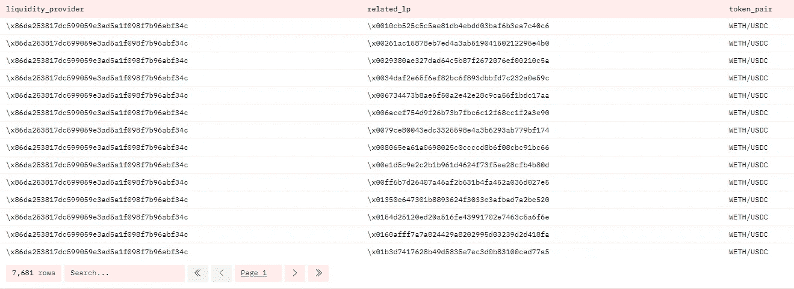

请注意，WETH 与 ETH 相同，只是在一个令牌包装器中实现了标准一致性

如果您的列有许多共享一个目标列的惟一 id，那么这个查询将很快耗尽内存(在本文末尾讨论相关子查询时，我们将回到这个问题)。这就是为什么我限制了日期间隔并预先选择了两个标记对(否则 77，000 个 LP 和 10，000 对可能会有超过一百万行)。我们现在不会对这些数据做任何其他事情，但我们可以使用它来开始对用户进行聚类，或者对成对的流动性池市场进行图形节点分析。

# 窗口功能，如分割、引导、滞后、整体等

到目前为止，我们已经引入了许多新概念，所以你可能会感到不知所措。如果是这样的话，休息一下或者玩一下链接查询，不要强迫自己一次完成所有这些！

在本节中，我们将讨论互换交易，例如，如果我想用我的天气换 USDC。为了理解这一点，我们需要了解 DEX 如何对互换进行定价:

> x*y = k

这是一个非常简单的公式！`x`是 WETH 的合约准备金，`y`是 USDC 的合约准备金，`k`是他们的总流动性。这给了我们一个类似这样的定价曲线:

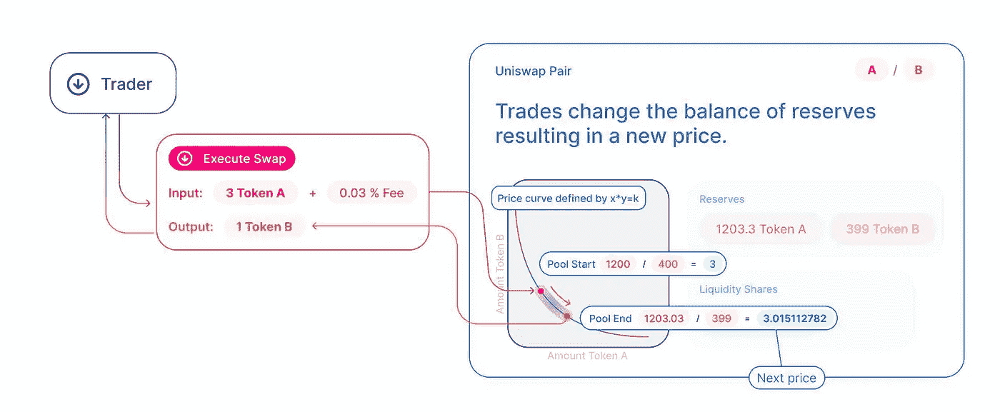

[https://unis WAP . org/docs/v2/protocol-overview/how-unis WAP-works/](https://uniswap.org/docs/v2/protocol-overview/how-uniswap-works/)

这意味着，当我用令牌 A 交换令牌 B 时，令牌 A 的储备增加，而令牌 B 的储备减少，这使得将来用令牌 A 交换令牌 B 的成本略微增加。如果这对你有意义，那么拍拍你自己的背——这篇文章的其余部分不再有新的以太坊概念了！

但是还有很多 SQL 需要学习，从窗口函数开始。可以认为这是允许聚合、偏移和统计函数，而不需要使用`GROUP BY`并保持原始表不变——您只是根据每行中的值添加列。

通常我们有一些特殊的功能，后面是`OVER`，然后是窗口`(PARTITION BY column_name)`。之前，我们的特殊函数是`ROW_NUMBER()`，它从 1 开始为每个唯一分区计算新行`rn`(在这种情况下，每个唯一对在`contract_address`中收缩)。这就是我们如何能够保持每对合同保留同步的最近一行(`rn=1`)。

```
ROW_NUMBER() OVER (PARTITION BY contract_address) rn
```

另一种看待 window/ `PARTITION`的方式是将它视为最初用于`GROUP BY`的列，尽管它也可以是只有一个唯一值的列。让我们试着计算一下过去 7 天里从 WETH 到 USDC 的所有掉期交易的百分位数。我们仍然使用 Router02 契约，但是使用了`swapExactTokensForTokens()`函数而不是`addLiquidity()`。

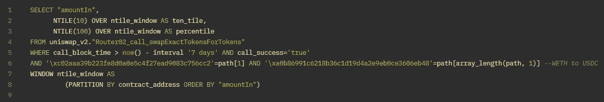

[https://duneanalytics.com/queries/35980](https://duneanalytics.com/queries/35980)

这里我们使用统计函数`NTILE()`代替计数器`ROW_NUMBER()`。`NTILE()`将根据瓷砖总数(四分位数`NTILE(4)`、五分位数`NTILE(5)`、百分位数`NTILE(100)`等)为每行分配瓷砖。因为我们两次使用同一个窗口，所以我们可以创建一个`WINDOW`变量来减少冗长。`contract_address`对于整个列只有一个唯一值，因为它总是被调用 Router02，否则我们将有多个分区，并且`contract_address`中的每个唯一值将得到它自己的 100 个`NTILE`的集合。

下面的图表显示了我们的查询结果:

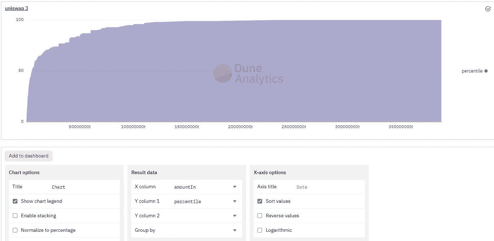

视觉化告诉我们的不仅仅是这里的表格。这个数据严重失真，所以从技术上来说对数会是一个更好的观点。

对于在 windows 中使用聚合，这里有一些基本的例子[你可以遵循，因为我不会在这里展示任何例子。我确实想涵盖像`LEAD`和`LAG`这样的偏移函数，因为它们对于时间序列趋势分析非常有用。](https://mode.com/sql-tutorial/sql-window-functions/)

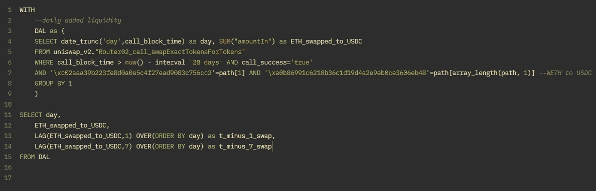

[https://duneanalytics.com/queries/36082](https://duneanalytics.com/queries/36082)

这里我们创建一个名为`DAL`的 CTE 来代表过去 28 天 wet 到 USDC 互换的每日总量`amountIn`。然后，当从`DAL`查询时，我们创建两个`LAG`列，一个滞后 1 行(天),另一个滞后 7 行(天):

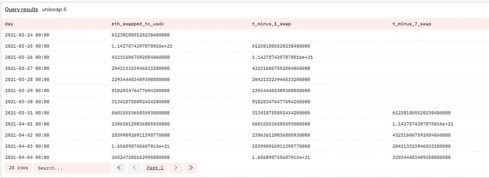

如果我们在每个`LAG`栏前添加一个`ETH_swapped_to_USDC -`，那么我们可以得到掉期交易量的每日和每周差异:

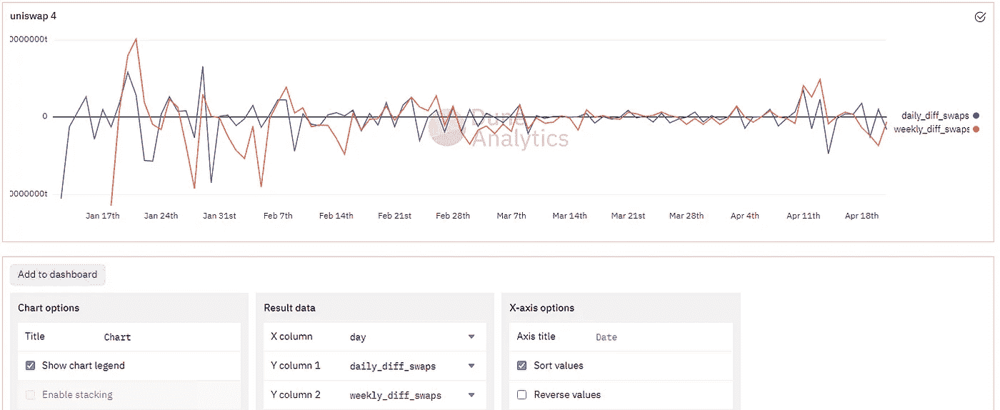

我将查询从 28 天更改为 100 天，以提供更好的图表。

# 在查询中使用索引来提高操作速度。

每当您进行查询时，都会根据脚本中的操作运行一个执行计划。虽然已经为您处理了大量优化工作，但是您希望以最有效的方式组织查询和表。我们将在下一节讨论子查询的排序，首先让我们讨论索引。

如果列是主键，这意味着您可以创建一个链接到它的聚集索引。如果列是外键(非唯一值)，则可以为其附加非聚集索引。在查询数据时，拥有这些索引会导致很大的差异，尤其是在使用`WHERE`和/或`JOIN`时。如果没有索引，您的查询将作为表扫描运行(即线性通过每一行)。对于索引，将改为运行索引扫描/查找。这就是二分搜索法搜索与线性搜索的区别，[导致 O(log n)对 O(n)的搜索时间](https://stackoverflow.com/questions/700241/what-is-the-difference-between-linear-search-and-binary-search#:~:text=A%20linear%20search%20looks%20down,at%20a%20time%2C%20without%20jumping.&text=A%20binary%20search%20is%20when,second%20half%20of%20the%20list.)。最终，创建索引会导致更长的写时间(因为每次添加新数据时，索引都必须重新排序)，但最终会获得更快的读时间。如果你想要一个更长的浏览和索引与非索引查询的比较，我强烈推荐你看一下这个视频。

即使表没有索引，您也可以通过在您正在过滤或连接的列上使用`ORDER BY`来改进线性扫描。这可以使查询更加高效，尤其是对于连接。

# 子查询以及子查询对查询效率的影响

最后，让我们谈谈子查询。有两种类型的子查询:相关子查询和非相关子查询，在相关子查询中，必须为外部查询的每一行重新计算子查询，在非相关子查询中，子查询只计算一次，然后用作外部查询的常数。

下面是一个不相关的子查询，因为在检查外部查询中的每一行`“amountIn”`之前，`SELECT MAX(“amountIn”)/2 FROM swaps`只被评估一次。


[https://duneanalytics.com/queries/36434](https://duneanalytics.com/queries/36434)

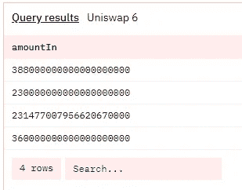

在过去的 7 天里，只有 4 个掉期交易大于最大掉期交易的一半，根据之前的 NTILE(100)图，这是有意义的。

下一个查询是一个相关子查询，它看起来非常类似于一个`SELF JOIN`，但是只将行与其自身进行比较，而不是进行连接。我们只想获得 Uniswap 中每一对的平均互换金额:

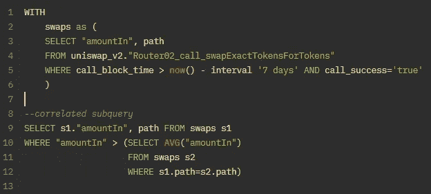

[https://duneanalytics.com/queries/36436](https://duneanalytics.com/queries/36436)注意，我正在检查交换路径是否相同，因为这通常表示一个令牌对。

尽管这仍然是一个聚合函数比较(使用 AVG 而不是最大值)，但这个比较在超过 30 分钟后超时，而非相关查询用时不到 5 秒。您可以通过将相关子查询转换为连接子查询来加快查询速度，这只是需要一些心理准备。我们用这种方法把它缩短到 28 秒:


[https://duneanalytics.com/queries/36436](https://duneanalytics.com/queries/36436)(上次查询的扩展)

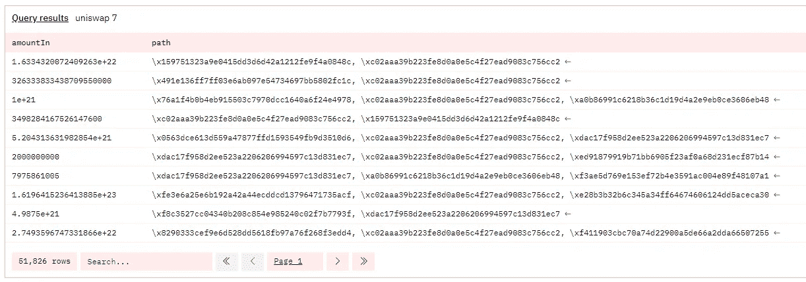

有些路径不止一次交换，我认为这是存在的，如果没有直接对交换，所以它必须通过令牌 A -> WETH ->令牌 B

如果您绝对必须使用相关子查询，那么您应该利用我们在上一节中讨论的索引——否则它会花费很长时间运行，因为它变成了一个`n_rows*n_rows = O(n²)`比较操作。

最后，如果任何父查询中有多个子查询，请确保所有子查询都以最有效的方式排序。尤其是在加入时，确保在加入之前使用`WHERE`和`HAVING`T7 进行过滤，而不是之后。如果您的查询花费的时间太长，请尝试考虑子查询的类型以及您在逻辑和排序方面的其他选项，以使它更快。这是另一个例子，将子查询分解成 cte 可以帮助您以更快、更干净的方式重新组织和部署代码。

# 你(又)成功了！🎉

如果你(再次)走到这一步，那么恭喜你！您现在知道如何使用 SQL 进行更高级、更快速的查询。如果你想更多地了解以太坊，可以看看我的另一篇文章，这篇文章深入探讨了它是如何工作的。

如果您还没有点击任何查询链接，我强烈建议您这样做，因为 Dune Analytics 是一个测试查询和快速创建可视化甚至仪表板的好地方。当我开始学习 SQL 时，我希望有一个这样的工具来练习，而不是依赖 hackerank 或 leetcode 中的表(或者摆弄本地服务器，用网上的基本模拟数据表填充它)。

请关注本系列的最后一部分！