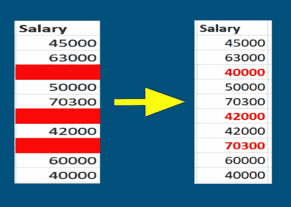

# 你的 MCAR 数据技术指南

> 原文：<https://towardsdatascience.com/your-mcar-data-technique-guide-b13a06914ed6?source=collection_archive---------30----------------------->

## 处理完全随机丢失数据的技巧

凯文·巴加特在 [Unsplash](https://unsplash.com?utm_source=medium&utm_medium=referral) 上的照片

你好。我看过描述处理缺失数据的技术的文章。但是我还没有看到任何按照缺失数据的类型(MCAR、马尔和 MNAR)来组织技术的东西。通过这篇文章和接下来的两篇文章，我将填补这个空白。我们将以下列方式探索完全随机缺失数据的技术:

1.  用一个可视化的例子描述这种技术，包括下面的样本数据集和它适用的数据类型(分类和/或数字)。

作者创建的样本数据集。

2.每种技术的优缺点。

我不会在本文中包含任何代码，因为我想分享这些技术，而不管您的编码语言偏好如何。我将在以后的帖子中创建代码示例，并在这里链接它们。也就是说，让我们先快速定义完全随机数据缺失，然后开始。

照片由[罗曼·卡夫](https://unsplash.com/@romankraft?utm_source=medium&utm_medium=referral)在 [Unsplash](https://unsplash.com?utm_source=medium&utm_medium=referral) 上拍摄

# 什么是完全随机缺失的数据？

完全随机缺失的数据(或简称为 MCAR)是由于与数据集中的其他数据没有关联而缺失的数据。没有模式可以导致丢失数据的原因。幸运的是，确实存在一个测试来确定你的数据是否是 MCAR 与[利特尔的 MCAR 测试](https://wiki.q-researchsoftware.com/wiki/Missing_Data_-_Little%27s_MCAR_Test)。有了这个基础，让我们来看看处理 MCAR 数据的技术。

*注:我在这里分享的所有技术都是从 Soledad Galli* *(非附属链接)的这个* [*特征工程课程中学到的。*](https://www.udemy.com/course/feature-engineering-for-machine-learning/?utm_source=email-sendgrid&utm_term=17562320&utm_medium=1304050&utm_content=educational&utm_campaign=2021-01-12)

# 完成案例分析(或列表删除)

完全案例分析是指只对非空条目的数据进行计算。如果一行缺少一个值，整行数据都将被删除。这适用于分类数据和数值数据，如示例所示。

完整的案例分析示例。图片由作者提供。

这确实过滤了当前数据。但是这是有代价的。过滤掉数据可能会导致您丢失不会包含在您的分析中或在您的机器学习模型中训练的信息。在上面的例子中，我们用这种技术丢失了一半的数据集！这可能导致有偏见的结果或有偏见的机器学习模型。因此，只有当数据集中最多有 5%的数据丢失时，才应该使用完整的案例分析。

# 模式插补(单变量数据)

这种技术涉及用单个列中非空数据的模式来填充该列中缺失的数据值。这种技术可用于分类数据和数值数据，但它更适合分类数据，因为值中的方差可能更小，并且更有可能具有众数。在下面我们修改的*职业*列的例子中，由于*职业*数据的模式是“看门人”，我们将用“看门人”替换所有缺少的值。

模式插补示例。图片由作者提供。

这是一种填写 MCAR 数据的非常快速简单的方法。但是，如果单列数据的模式在原始数据中出现得太频繁，就要小心了。如果该列中最初有太多的空值，这可能会导致该值被过度表示为 false。这还会破坏数据列与数据集中其他数据列的关系(例如，创建错误的关联)。

# 缺失类别插补(单变量数据)

这种形式的插补仅适用于分类数据。这里，缺失的分类数据被替换为一个标签，如下面示例中的“缺失”或“不适用”。

缺失类别插补示例。图片由作者提供。

这实际上是一种灵活的技术，因为无论数据是 MCAR 还是其他类型的缺失数据，您都可以这样做。这是因为只切换相同类别的每个缺失值(在本例中为“缺失”)。这种技术的简单性也使它成为处理数据的另一种快速简单的方法。唯一的缺点是数据列中缺失值的数量很少。如果这些是分类模型的类，您可能会在不平衡的数据集上结束训练。这将导致模型的训练出现问题，然后您必须实现处理不平衡数据集(如 SMOTE)所需的技术。

# 随机抽样插补(单变量数据)

这种技术包括用数据列中存在的值之一随机替换丢失的值。使用我们下面的例子，*薪水*的缺失数据将只替换为值 45000、63000、50000、70300、42000、60000 或 40000，因为这些是该数据列中仅有的当前值。

随机抽样插补示例。图片由作者提供。

这种技术可以用于数值和分类数据，因为您是从可用的值中提取的。但是，其中一个缺点是，如果有很大比例的缺失值，您正在输入的数据列与数据集中其他数据列之间的关系可能会被破坏。还有一个问题是使用更多的内存来训练你的机器学习模型，因为你需要存储这些值来从中提取。随着数据集和/或数据列中缺失值的百分比越来越大，这可能会成为一个越来越严重的问题。

还有第三个缺点，当在这个估算的数据上训练机器学习模型时可能发生，但是可以避免。您训练机器学习模型所基于的随机估算数据可能会导致不同的预测，因为每次运行模型时都可能会估算新值。您可以通过设置插补的种子来避免这种情况。如果设置了种子，数据每次都将被输入相同的随机值。

# 添加缺失指标列(单变量数据)

这种技术更多的是上述插补技术的延伸。它可以应用于任何数据类型。对于每个缺少数据的列，您创建一个列来指示该列中的条目是否缺少。这可以是一个[二叉](https://www.statisticshowto.com/dichotomous-variable/)列，其中 0 =“未缺失”和 1 =“缺失”。在应用插补技术之前，你应该这样做。在我们的示例中，我们将创建列 *Salary_Missing* 和*occupation _ Missing*来显示这些列中数据丢失的位置

修改样本数据集。图片由作者提供。

从原始样本数据集中添加缺失指标示例。图片由作者提供。

这种方法很容易操作，一旦您使用插补方法填充了这些空值，就可以帮助您跟踪最初丢失的数据。这种技术的一个代价是数据集的扩展。您正在为每一列丢失的数据添加一个新的数据列。这可以快速累加，并创建比您预期的更广泛的数据集来训练您的机器学习模型，从而增加训练时间。

# 最后的想法

艾伦·德拉克鲁兹在 [Unsplash](https://unsplash.com?utm_source=medium&utm_medium=referral) 上的照片

当您争论 MCAR 数据时，请记住这些技术的优缺点。插补技术可以帮助您完成数据的拼图，但是如果您不小心的话，也可能在数据中创建虚假的故事和关系。您还可以引入领域知识来帮助您选择技术。

感谢阅读！我希望本指南能为如何处理数据集中完全随机缺失的数据提供清晰的说明。如果您想了解更多关于处理丢失数据的信息，请查看下面的文章:

 [## 你的 MNAR 数据技术指南

### 处理你丢失的非随机数据的技巧

towardsdatascience.com](/your-mnar-data-technique-guide-9b7e85ad67) 

如果你喜欢这篇文章，请随意查看我下面的其他数据科学相关文章:

 [## 不要错过识别缺失数据的缺失号！

### 应该用来可视化缺失数据的库

towardsdatascience.com](/dont-miss-out-on-missingno-for-identifying-missing-data-9a0681433c36)  [## 什么，为什么，以及如何阅读经验 CDF

### 鼓励探索性数据分析(EDA)来获得数据的可消化的一瞥。这包括直方图，用于…

towardsdatascience.com](/what-why-and-how-to-read-empirical-cdf-123e2b922480)  [## 使用混淆矩阵度量避免混淆

### 从混淆矩阵中理解 17 个指标

towardsdatascience.com](/avoiding-confusion-with-confusion-matrix-metrics-a8a3d0ead144)  [## 与 Python 的点双列相关

### 线性回归是确定数据的两个或多个连续特征之间相关性的经典技术…

towardsdatascience.com](/point-biserial-correlation-with-python-f7cd591bd3b1) 

如果你有任何问题，请随时在 Linkedin 和 Twitter 上发表评论或联系我们。对 Twitter 上的 DM 开放。

下次见！

约翰·德杰苏斯