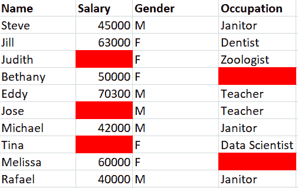
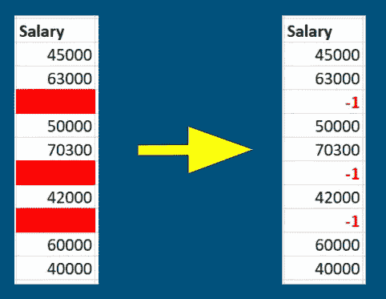

# 你的 MNAR 数据技术指南

> 原文：<https://towardsdatascience.com/your-mnar-data-technique-guide-9b7e85ad67?source=collection_archive---------16----------------------->

## 处理你丢失的非随机数据的技巧

莉迪亚·塔兰特在 [Unsplash](https://unsplash.com?utm_source=medium&utm_medium=referral) 上的照片

大家好！这是处理缺失数据技术的第二篇文章。第一个是处理 MCAR(完全随机缺失)数据的。

</your-mcar-data-technique-guide-b13a06914ed6>  

正如你所猜测的，我们将在本帖中讨论 MNAR(非随机缺失)数据。我们将遵循与 MCAR 文章中相似的格式，我们将:

1.  用一个可视化的例子描述这种技术，包括下面的样本数据集和它适用的数据类型(分类和/或数字)。

作者创建的样本数据集。

2.每种技术的优缺点。

我不会在本文中包含任何代码，因为我想分享这些技术，而不管您的编码语言偏好如何。也就是说，让我们先快速定义缺失的非随机数据，然后开始吧！

本·杜蒙德在 [Unsplash](https://unsplash.com?utm_source=medium&utm_medium=referral) 上的照片

# 不是随意遗漏了什么数据？

MNAR 数据是由于外部因素导致的数据缺失，这些外部因素没有反映在数据或其所在的数据集中。这可能包括提交数据的人、捕获数据时的错误，甚至是由于整个数据收集过程。如果您对数据是如何生成的没有任何背景知识，就很难确定这种类型的丢失数据的原因。现在我们已经定义了 MNAR 数据，让我们来看看处理它的几种方法。

*注:我在这里分享的所有技术都是从 Soledad Galli* *(非附属链接)的这个* [*特征工程课程中学到的。*](https://www.udemy.com/course/feature-engineering-for-machine-learning/?utm_source=email-sendgrid&utm_term=17562320&utm_medium=1304050&utm_content=educational&utm_campaign=2021-01-12)

# 领域知识和他人的洞察力

领域知识是你在某一领域所拥有的背景知识。例如，教育领域的数据科学家将拥有关于学校如何运作的背景知识，并且可以更容易地理解来自该领域的数据集。虽然它不像下面的技术和 MCAR 的技术那样是一个技术动作，但我相信它是你处理这类数据的一个较好的机会。正是这种背景可以帮助您了解数据是如何收集的，并解决获取丢失数据的问题所在。

现在，假设你是一名转行的数据科学家，或者你自己是一名有抱负的数据科学家。从哪里可以获得你需要的领域知识？如果你是一名数据科学家，你可以利用你的同事和你的组织/公司中的人来帮助找到答案。你甚至可以找到负责你正在处理的数据的数据收集过程的人。从那里你也许可以解开你的 MNAR 数据之谜。

如果你是一名有抱负的数据科学家，请记住你有完整的互联网社区可以利用。问这个问题可能会令人生畏，但这并没有什么坏处。如果你在教育领域有什么问题，我很乐意回答你的问题。

在 [Unsplash](https://unsplash.com?utm_source=medium&utm_medium=referral) 上由[海拉戈斯蒂奇](https://unsplash.com/@heylagostechie?utm_source=medium&utm_medium=referral)拍摄的照片

# 任意值插补(单变量数据)

这种插补法类似于缺失类插补法，缺失数据被标上新的标签，如“缺失”。主要区别在于，对于数字数据，您需要选择一个不在数据列中的数值。选择不太可能是您的列或列范围内的值的内容。例如，我们不会使用任何大于或等于零的值来表示*薪水*列中缺失的值。当我不得不这样做时，我更喜欢使用-1 这样的值，因为*薪金*永远不会是负数。

任意插补示例。图片由作者提供。

除了选择一个合适的任意值来使用之外，这是一个简单的技术。然而，使用这种形式的数值插补会改变该列中数据的分布。如果您选择的任意值与平均值、中值或众数过于相似，从而改变了这些值，也会导致问题。另一个缺点是其他数据列对[协方差](https://www.statisticshowto.com/probability-and-statistics/statistics-definitions/covariance/)的破坏。最后，当有很大比例的丢失数据时应用这种技术会增加对上述结果的破坏。

# 添加缺失指标列(单变量数据)

*注意:如果你读了 MCAR 的文章，你可以随意跳过这一部分，因为它重复了同样的技巧。*

这种技术更多的是上述插补技术的延伸。它可以应用于任何数据类型。对于每个缺少数据的列，您创建一个列来指示该列中的条目是否缺少。这可以是一个[二叉](https://www.statisticshowto.com/dichotomous-variable/)列，其中 0 =“未缺失”和 1 =“缺失”。在应用插补技术之前，你应该这样做。在我们的示例中，我们将创建列 *Salary_Missing* 和*occupation _ Missing*来显示这些列中数据丢失的位置

修改样本数据集。图片由作者提供。

从原始样本数据集中添加缺失指标示例。图片由作者提供。

这种方法很容易操作，一旦您使用插补方法填充了这些空值，就可以帮助您跟踪最初丢失的数据。这种技术的一个代价是数据集的扩展。您正在为每一列丢失的数据添加一个新的数据列。这可以快速累加，并创建比您预期的更广泛的数据集来训练您的机器学习模型，从而增加训练时间。

# 最后的想法

照片由 [NeONBRAND](https://unsplash.com/@neonbrand?utm_source=medium&utm_medium=referral) 在 [Unsplash](https://unsplash.com?utm_source=medium&utm_medium=referral) 上拍摄

请记住，MNAR 数据没有明确的缺失原因。花点时间回顾一下我们讨论过的几项技术。除了领域知识之外，其他技术都是可替代的。它们是指示数据缺失的符号，其形式与该数据列中存在的值相同(数值或分类)。领域知识以及可以帮助您确定原因的任何资源将是潜在完成 MNAR 数据难题的最佳策略。

感谢阅读！我希望本指南能为如何处理数据集中的非随机缺失数据提供清晰的说明。如果你喜欢这篇文章，请随意查看我下面的其他数据科学相关文章:

</dont-miss-out-on-missingno-for-identifying-missing-data-9a0681433c36>  </what-why-and-how-to-read-empirical-cdf-123e2b922480>  </point-biserial-correlation-with-python-f7cd591bd3b1>  

如果你有任何问题，请随时在 Linkedin 和 Twitter 上发表评论或联系我们。对 Twitter 上的 DM 开放。

下次见！

约翰·德杰苏斯